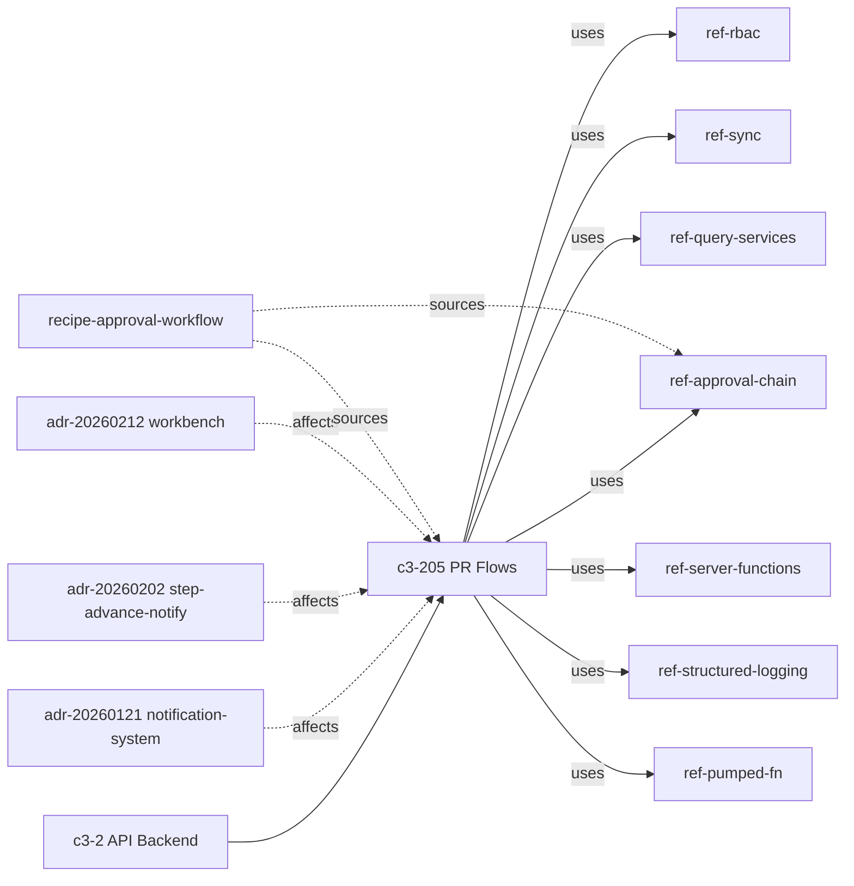

# APPROVAL-1: Where does approval workflow live and what governs changes to approvals?

## Evidence Commands

```bash
c3 search "approval workflow where does it live and what governs changes to approvals"
c3 read recipe-approval-workflow --full
c3 read ref-approval-chain --full
c3 read c3-205 --full
c3 graph c3-205 --depth 1 --format mermaid
c3 read ref-rbac --full
c3 read ref-audit-trail --full
c3 lookup '**/pr*'
c3 lookup '**/approval*'
c3 list --flat
c3 read adr-20260121-notification-system
c3 read adr-20260202-notification-on-step-advance
c3 read adr-20260212-workbench-feature
c3 graph ref-approval-chain --format mermaid
c3 read c3-105 --full
```

## Answer

**Layer:** c3-205 (PR Flows, parent c3-2 API Backend) — primary owner; c3-105 (PaymentRequestsScreen, parent c3-1 Web Frontend) — action surface; ref-approval-chain — the governing pattern.

### Where it lives

The approval workflow is the system's core business domain (recipe-approval-workflow: "The approval workflow is the core business domain"). Ownership is split across three layers, and the chain logic deliberately spans them:

1. **Action owner (frontend):** c3-105 PaymentRequestsScreen owns the user verbs — `requestApprovals` submits for review; approvers `approvePr`, `rejectPr`, bulk `approveAll`; the maker can `recallPr`; approvers can `unapprovePr` (c3-105 body, "Approval workflow" bullet). It runs in two modes: PR mode (CRUD for owners) and Approvals mode (approval queue showing "Only PRs pending current user's approval"). c3-109/c3-212 (Workbench) extend this with bulk export of approved PRs and bulk import of paid PRs (recipe Narrative).
2. **Mutation owner (backend):** c3-205 PR Flows owns 15 operations covering the full lifecycle (`createPr` … `approveAll`, Operations table in c3-205). Each flow delegates to `prService` for core mutations, which calls `approvalQueries` (ref-approval-chain Wiring: `approvePr.flow → prService.approve → getApprovalByPrId / getApproversForStep / newApprovalRecord / updateApprovalCurrentStep → prQueries.markPrAsApproved if final`).
3. **Persistence:** four relational tables anchor the chain — `approval` (1:1 with PR, holds `current_step`), `approval_steps` (ordered, with `mode`), `approval_step_users`, `approval_records` (ref-approval-chain Data Model).

### Causal chain (approve action, end to end)

- **Action:** approver triggers `approvePr` on c3-105 → carried into c3-2 as a flow because all PR operations are `flow()` definitions with namespace + Zod schema (c3-205 Uses table).
- **State mutation:** `prService.approve` inserts an `approval_record`, then decides advancement by **app-level mode logic** — `anyof` (one approver suffices) vs `allof` (every assigned user must have a record). "Modes are app-level logic in `prService.approve`, not DB constraints" (ref-approval-chain, Mode Validation section). If the final step completes, PR status flips `pending → approved` (`prQueries.markPrAsApproved`).
- **Audit:** the mutation is captured by the PostgreSQL `log_change()` DB trigger on the `pr` table — flows must NOT also call `createAuditEntry` for trigger-covered tables or entries duplicate (ref-audit-trail "When to Audit" + Anti-Patterns; recipe Cross-Cutting Contracts). Actor attribution flows through `set_config('app.current_user', …)` inside `executeInDrizzleTransaction` (ref-audit-trail, DB trigger audit).
- **Sync:** "Every mutation emits a sync delta (ref-sync), then the flow acks" (recipe Cross-Cutting Contracts); every mutating operation in c3-205's Operations table lists `sync` as a side effect.
- **Notification:** if the step advanced (`stepAdvanced` returned by `prService.approve`), the flow calls `notificationService.notifyNextApprovers` → c3-211 Notification System (ref-approval-chain Wiring; adr-20260202).
- **Transaction:** all of the above runs in transaction scope via c3-202 execution context — "Concurrent approvals: transaction-scoped via execution context" (ref-approval-chain Edge Cases; recipe Cross-Cutting Contracts).
- **Emergent property:** notification is async and non-blocking — "fire-and-forget (error suppressed, logged)" (recipe; c3-205 Approval Integration) — and notification targets are step-scoped (next-step approvers only), not broadcast.

**Failure boundary:** if the notification leg fails, the approval mutation still commits — errors are suppressed and logged, not thrown (c3-205 Approval Integration). If code bypasses `prService.approve`, nothing enforces `anyof`/`allof` — the DB only stores the mode string; enforcement is application code (ref-approval-chain Mode Validation). If a flow wrongly adds an explicit audit call on the `pr` table, audit entries duplicate (ref-audit-trail Anti-Patterns). Audit and mutation are atomic only inside the transaction; auditing outside a transaction breaks rollback coupling (ref-audit-trail Anti-Patterns).

### What governs changes to approvals

**Runtime changes to an approval (data-level governance):**

- **State machine** (ref-approval-chain): `draft → pending → approved → completed`; recall/reject resets to draft, `current_step` to 0, and clears all approval records; `completed → approved` only via uncomplete.
- **Approval config changes are draft-only**: "Update approval config — only allowed when PR is in draft. Deletes all existing steps, recreates from new config" (ref-approval-chain Edge Cases).
- **Retraction is bounded**: "Unapprove — only works on currentStep - 1. Deletes record. If allof mode or no approvers remain, step reverts" (ref-approval-chain Edge Cases).
- **Who may act**: ref-rbac (cited by c3-205 per its `uses` list in the graph) defines JSON permissions per role, e.g. `"pr": { "create": true, "approve": true }`, with built-in roles `finance` (PR create, approve) and `bod` (final approvals); admin/owner operations gate via `rbacQueries.isOwner` (ref-rbac Permission Model, Built-in Roles, Owner Check).
- **Every change is recorded**: DB trigger audit on `pr` with before/after JSONB snapshots and checksum (ref-audit-trail Data Model), plus sync delta to clients (ref-sync via recipe contract).

**Changes to the approval code/architecture (doc-level governance):**

- **ref-approval-chain is the explicitly cited governance** for c3-205 — its Governance table says "Explicit cited governance beats uncited local prose", and the ref carries the golden examples (approve + step advance; create PR with chain) plus the shared `ApprovalFlow` Zod schema in `@acountee/shared` that derived code must match.
- **c3-205 Change Safety table** requires: on contract drift, compare Goal/Parent Fit/Contract/Derived Materials and run `c3x check` + project tests; on governance drift (cited refs or parent responsibilities change), re-read Governance rows and run `c3x verify` + targeted lookup.
- **Blast radius is declared**: "Approval chain logic spans c3-205 (flows) + prService + approvalQueries. Changing step semantics has blast radius across all three layers plus the notification dispatch path" (recipe Risk section).
- **No `rule-*` entities exist** in this topology (`c3 list --flat`: 66 entities, zero `rule-` rows) — governance is carried entirely by refs, the recipe, and the component's Governance/Change Safety tables.

**ADRs touching c3-205** (all labeled from `status` and checked against current docs):

| ADR | Status label | Note |
| --- | --- | --- |
| adr-20260121-notification-system | implemented — historical | Replaced dead Slack tables with NATS-backed notifications; current mechanism is c3-211 |
| adr-20260202-notification-on-step-advance | implemented — historical | Added `stepAdvanced` signal + notify-on-advance; now reflected in c3-205's Operations table ("if step advances, notifies next approvers") and ref-approval-chain wiring, so it is absorbed into current docs |
| adr-20260212-workbench-feature | implemented — historical | Added workbench bulk export/import of approved/paid PRs (c3-212/c3-109) |

None is the live source of truth — current behavior is in c3-205, ref-approval-chain, and the recipe (skill rule: terminal-state ADRs are frozen/historical).

**Graph** (from `c3 graph c3-205 --depth 1` node output; rendered as mermaid):



**Code Map:** `pr.ts` (flow definitions) → `prService` (approve/revert/complete mutations + mode validation) → `approvalQueries` (the 4 approval tables) — from ref-approval-chain Wiring. These names come from doc bodies, not a codemap hit (see Caveats).

**Key Insights:**
- Approval semantics (`anyof`/`allof`, step advance) are enforced only in `prService.approve` — the DB stores but does not enforce the mode.
- Governance of approval *data* changes = state machine + draft-only config edits + RBAC roles + trigger-based audit + sync delta, all transaction-scoped.
- Governance of approval *code* changes = ref-approval-chain golden patterns + c3-205 Change Safety verification (c3x check/verify + tests) + declared three-layer blast radius.

**Concrete checks for a change to approval behavior:**
1. Touch set: c3-205 flow (`pr.ts`), `prService`, `approvalQueries` — all three layers per recipe Risk; plus c3-211 dispatch path if step-advance semantics change.
2. Confirm the `ApprovalFlow` Zod schema in `@acountee/shared` still matches any step-shape change (ref-approval-chain Shared Types).
3. Confirm RBAC: the role's permissions JSON still carries the needed `pr` verbs (`finance` approve, `bod` final approvals).
4. Assert observables: sync delta emitted then acked for the mutation; `notifyNextApprovers` fired only when `stepAdvanced`; one (not two) audit rows per `pr` mutation.
5. Probe the failure mode: run an approve with the notification transport down — the approval must still commit and the error must appear in logs only.
6. Run `c3 check --only c3-205` after doc updates (Change Safety requirement).

**Related:** recipe-approval-workflow (end-to-end trace), c3-212 Workbench Flows (bulk ops), c3-211 Notification System, c3-215 Slack Bot Integration ("Slack bot for PR approval notifications", from `c3 list`), recipe-audit-and-compliance.

## Grounding

| Claim | Source |
| --- | --- |
| Approval workflow = core domain; lifecycle `draft→pending→approved→completed`; spans c3-205 + prService + approvalQueries; blast radius incl. notification path | `c3 read recipe-approval-workflow --full` (Narrative, Risk) |
| 4-table data model; wiring pr.ts→prService→approvalQueries; anyof/allof app-level in prService.approve, not DB constraints; draft-only config update; unapprove bounded to currentStep-1; recall/reject reset; transaction-scoped concurrency; ApprovalFlow shared Zod schema | `c3 read ref-approval-chain --full` (Data Model, Wiring, Mode Validation, Edge Cases, Shared Types) |
| c3-205 owns 15 ops; Governance table cites ref-approval-chain ("Explicit cited governance beats uncited local prose"); Change Safety verification rows; notifications async with error suppression | `c3 read c3-205 --full` (Operations, Governance, Change Safety, Approval Integration) |
| c3-205 uses ref-approval-chain, ref-rbac, ref-sync, etc.; three ADRs affect c3-205 | `c3 graph c3-205 --depth 1` node output |
| RBAC JSON permissions incl. `pr.approve`; built-in roles finance/bod; isOwner guard; security_events logging | `c3 read ref-rbac --full` (Permission Model, Built-in Roles, Owner Check) |
| DB trigger `log_change()` on `pr`; no duplicate createAuditEntry rule; before/after snapshots; actor via set_config in executeInDrizzleTransaction; atomicity anti-patterns | `c3 read ref-audit-trail --full` (When to Audit, Wiring, Anti-Patterns) |
| Sync delta + ack on every mutation; audit-via-trigger contract for approval mutations | `c3 read recipe-approval-workflow --full` (Cross-Cutting Contracts) |
| c3-105 owns approval UI verbs and Approvals mode queue | `c3 read c3-105 --full` (Approval workflow bullet, modes/views) |
| ADR statuses all `implemented` (dates 2026-01-21 / 02-02 / 02-12); adr-20260202 content (stepAdvanced signal) | `c3 read adr-*` outputs (frontmatter `status:` + bodies) |
| Zero `rule-*` entities; c3-215 Slack bot for PR approval notifications; topology of 66 entities | `c3 list --flat` (grep count = 0 rule rows; entity table) |
| No codemap coverage for pr/approval files | `c3 lookup '**/pr*'` and `'**/approval*'` (empty files/components, "codemap coverage gap" help) |

## Caveats

- **Codemap gap:** `c3 lookup '**/pr*'` and `c3 lookup '**/approval*'` both returned empty `files`/`components` with a "codemap coverage gap" hint. File names (`pr.ts`, `prService`, `approvalQueries`) are taken from ref-approval-chain/recipe doc bodies and could not be verified against a code-to-entity map.
- **No per-flow RBAC gate shown for approvePr:** ref-approval-chain's wiring for `approvePr.flow` lists no `rbacQueries` call, and ref-rbac's flow examples gate only admin/owner operations. c3-205 cites ref-rbac, and the permission JSON defines `pr.approve`, but none of the docs I read shows where (or whether) that permission is enforced on the approve path. Documented gap, not a guess.
- **Audit coverage of the approval tables is not explicit:** ref-audit-trail's trigger list is `invoices, pr, invoice_services` and its explicit-call list is `teams, roles, user_roles, approval_flows`. The four chain tables (`approval`, `approval_steps`, `approval_step_users`, `approval_records`) appear in neither list; the recipe says approval mutations are captured "via DB trigger on `pr` table". Whether step/record-level mutations that don't touch the `pr` row are audited is not stated in the docs I read.
- **No `rule-*` entities found** in the topology (`c3 list --flat`, 0 matches) — so no coding-rule layer governs approvals; governance is refs + component tables + recipe only.
