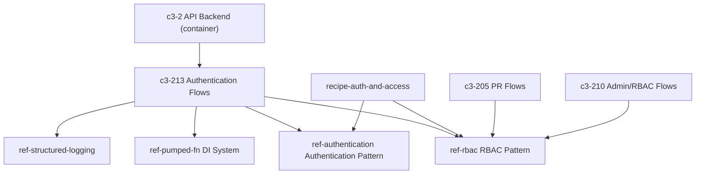

# AUTH-1: How is authentication handled and what governs it?

## Evidence Commands

```bash
c3() { C3X_MODE=agent bash skills/c3/bin/c3x.sh --c3-dir research/eval/skill-eval/fixtures/acountee/.c3 "$@"; }

c3 check                                   # rebuilt local cache (db was absent)
c3 search "how is authentication handled, login, tokens, sessions, permissions"
c3 read recipe-auth-and-access --full
c3 read ref-authentication --full
c3 read ref-rbac --full
c3 read c3-213 --full                      # Authentication Flows
c3 read c3-203 --full                      # Middleware Stack
c3 read c3-202 --full                      # Execution Context
c3 read c3-209 --full                      # NATS Credential Generator
c3 read c3-2                               # API Backend container
c3 read ref-nats-jwt-auth --full
c3 read adr-20260112-nats-auth-callout
c3 read adr-20260113-nats-jwt-resolver
c3 graph c3-213 --format mermaid
c3 lookup '**/middleware*' ; c3 lookup '**/auth*'   # both empty (codemap gap)
```

## Answer

**Layer:** c3-2 (API Backend) — auth ownership is split across c3-213 (Authentication Flows), c3-203 (Middleware Stack), c3-202 (Execution Context), c3-209 (NATS Credential Generator), governed by ref-authentication, ref-rbac, ref-nats-jwt-auth, with recipe-auth-and-access as the documented end-to-end trace.

Authentication spans **three layers** (recipe-auth-and-access, Narrative): HTTP session (cookies), application RBAC, and NATS transport auth. The causal chain:

### 1. Login — action owner: c3-213 (Authentication Flows)

Two entry paths (ref-authentication, Authentication Methods table; c3-213, Flows):

- **Google OAuth** (production): `/login` → OAuth redirect → `/cb?code=...` → `gauthSvc.getToken(code)` → `gauthSvc.getProfile(credentials)` → `authenticateWithGoogle` flow normalizes the email and calls `initUserActor(ctx, email, ...)`.
- **Test token** (E2E only): `/test-login?token=...&user=...` → `authenticateWithTestToken` checks `appConfig.enableTestToken` AND `ctx.input.token === appConfig.testToken` before calling `initUserActor`.

Both paths **require the user to already exist in the database** — "OAuth alone does not grant access" (ref-authentication, Choice + Security Notes #1). A valid Google account that is not in the `users` table gets `{ success: false, reason: 'USER_NOT_FOUND', email }` (c3-213, Results table). Other failure results: `NO_CREDENTIALS` (no email in Google profile), `INVALID_TOKEN` (test token mismatch or disabled).

### 2. Session — cookie, set by route handler

On success the route handler (not the flow) sets a `user` cookie = Base64(email), `HttpOnly`, `Path=/` (ref-authentication, Cookie-Based Session; c3-213, Cookie Management). The session is **stateless**: no server-side session store, no refresh tokens stored (ref-authentication, Why + Security Notes #4). `/logout` clears the cookie (ref-authentication, Routes table).

### 3. Per-request restoration — c3-203 (Middleware Stack) → c3-202 (Execution Context)

Chain: `Request → executionContextMiddleware → getCurrentUserMiddleware → Handler` (c3-203, Middleware Chain).

- `executionContextMiddleware` creates a `@pumped-fn/lite` execution context, sets `executionIdTag`, and closes the context in `finally`.
- `getCurrentUserMiddleware` parses the `user` cookie, looks the user up in the DB (`userQueriesService.getUser`), fetches team capabilities, and sets `currentUserTag` with a `UserActor`: `{ email, team, teamCapabilities, permissions, can(), asserts(), setPermissions() }` (c3-203 code block; c3-202, UserActor interface).

**Failure boundary at this hop** (c3-203, Auth Logic table): no cookie → `currentUserTag` **not set — the handler must check**; cookie present but user not in DB → tag not set; no team → team defaults to `'default'`, `teamCapabilities = []`. The middleware never rejects the request itself — enforcement is deferred to flows.

### 4. Authorization — flows consume the tag, governed by ref-rbac

Flows read the actor via `ctx.data.seekTag(currentUserTag)` and enforce with `currentUser.asserts('some.permission')` which **throws `Permission denied: <p>`** if missing (recipe-auth-and-access, Access Check Pattern; c3-203 `asserts` implementation). Two distinct concepts (c3-203, Permission vs Capability): **permissions** (direct user authorization via `can()`/`asserts()`) vs **team capabilities** (feature gating, e.g. `notifications`, `workbench`).

RBAC mechanics (ref-rbac): JSON permission objects stored per role; roles inherit via `parent_role_id` — effective permissions = parent merged with role. Special `owner` role grants full admin and is checked via `rbacQueries.isOwner()` (SQL EXISTS join of `user_roles` × `roles` on name `'owner'`); admin flows return `{ success: false, reason: 'NOT_OWNER' }` when it fails. Built-in roles: owner, finance, admin, bod. All RBAC mutations are logged to the `security_events` table — an audit trail independent of the general audit system (ref-rbac, Choice + Security Events). Edge cases (ref-rbac + recipe): no roles = no permissions; expired role = treated as unassigned; deleting/removing the last owner should be prevented.

### 5. Separate identity layer — NATS transport auth (c3-209, ref-nats-jwt-auth)

NATS WebSocket sync has **its own auth, separate from HTTP auth** (recipe-auth-and-access, NATS auth paragraph). On authenticated page load, the `_authed.tsx` loader calls `natsCredentialGenerator.generate(currentUser.email, 3600)` (ref-nats-jwt-auth, Credential Flow). c3-209 creates an ephemeral user keypair, signs a user JWT with the account NKey, and returns `{ jwt, seed }` via `loaderData.natsCredentials`. NATS validates the JWT signature itself via a MEMORY resolver with `resolver_preload` — **no auth callout service** (ref-nats-jwt-auth, Choice).

Coupling: HTTP auth feeds NATS auth — the JWT is minted for `currentUser.email`, and subscribe permissions are scoped to `{prefix}.broadcast` and `{prefix}.user.{escaped_email}` (`@`/`.` → `_`), publish allow-list empty, WEBSOCKET connections only (c3-209, Permission Model). Server-side uses full TCP access (ref-nats-jwt-auth, Permissions Model).

**Failure boundary at this hop**: JWT expires after TTL (default 1h) — client must reconnect; account seed is server-side only; user seeds ephemeral, never stored; compromised client credentials cannot publish or reach internal subjects (c3-209 Security; ref-nats-jwt-auth Security Considerations). If credential generation fails or the JWT expires, real-time sync degrades but HTTP auth (cookie) is unaffected — the layers are independent identity systems (recipe, "NATS has its own identity layer").

### Emergent properties

- **Stateless session**: Base64-email cookie, no server store, no refresh tokens — logout = cookie clear; nothing to revoke server-side (ref-authentication).
- **DB membership is the real gate**: both OAuth and test token only authenticate identity; access is granted by existence in `users` (ref-authentication, Why).
- **Enforcement is in-flow, not in-middleware**: middleware only hydrates `currentUserTag`; each flow/handler must check (c3-203 Auth Logic "handler must check"; ref-rbac Usage in Flows).
- **Least-privilege transport**: browser NATS creds are subscribe-only, per-user-subject-scoped, time-boxed (c3-209).

### What governs it

| Governing entity | Governs | Binding |
| --- | --- | --- |
| ref-authentication | OAuth/test-token/cookie pattern | cited by c3-213 (`uses`, Governance table); Cited By: c3-2-api |
| ref-rbac | roles, permissions, owner check, security_events | cited by c3-213, c3-205, c3-210 (graph `c3-213` output) |
| ref-nats-jwt-auth | NATS JWT resolver, credential shape, permissions | cited by c3-209 (Governance table) |
| recipe-auth-and-access | end-to-end trace across all three layers | sources: c3-213, ref-authentication, ref-rbac, ref-nats-jwt-auth, c3-202 |
| c3-2 (API Backend) | container responsibility: "Enforce authentication, authorization, and request-scoped execution context" | parent of c3-202/203/209/213 |

No `rule-*` entities surfaced for auth in the search output — governance is via refs and the recipe, not coding rules.

**ADRs (status-labeled):**
- adr-20260112-nats-auth-callout — **superseded** (body: "Superseded - 2026-01-13, replaced by JWT resolver approach"; frontmatter `status: implemented` but the body supersession note and ref-nats-jwt-auth confirm callout is NOT the live mechanism). Historical only.
- adr-20260113-nats-jwt-resolver — **implemented, current**: its decision (server-minted user JWT + nkey, `jwtAuthenticator`, inline NATS validation) matches the live ref-nats-jwt-auth and c3-209 docs.

**Graph** (from `c3 graph c3-213 --format mermaid` node output, rendered):



**Code map** (paths from doc bodies; `c3 lookup` codemap returned no mappings — see Caveats):
- `server.tsx` — bootstrap, env resolution before middleware (c3-203)
- `tags.ts` — `currentUserTag`, `executionIdTag`, `transactionTag`, `natsConfig` tags (c3-202)
- `_authed.tsx` loader — NATS credential generation per page load (ref-nats-jwt-auth)
- `natsSync.ts` — client `connect({ authenticator: jwtAuthenticator(jwt, nkeySeed) })` (ref-nats-jwt-auth)
- `infra/nats.conf` — operator JWT + MEMORY resolver_preload (ref-nats-jwt-auth)

### Concrete checks (if changing auth)

1. **Cookie contract**: changing cookie name/encoding breaks `getCurrentUserMiddleware`'s `cookies["user"]` parse (c3-203) — verify a logged-in request still sets `currentUserTag` (any flow's `seekTag(currentUserTag)` non-undefined).
2. **Pre-existing-user gate**: confirm `initUserActor` still returns `USER_NOT_FOUND` for emails absent from `users` — this is the access-control gate, not OAuth.
3. **Env/config**: `GOOGLE_CLIENT_ID/SECRET/REDIRECT_URI` (production), `ENABLE_TEST_TOKEN`/`TEST_TOKEN` (must stay disabled by default — ref-authentication Security Notes #3), `NATS_ACCOUNT_SEED` must match the account public key preloaded in `infra/nats.conf` resolver (ref-nats-jwt-auth Troubleshooting).
4. **RBAC mutations**: assert `security_events` rows are written on role assign/revoke (ref-rbac, Security Events).
5. **NATS leg**: after auth changes, verify browser still receives `sync.broadcast` and `{prefix}.user.{escaped_email}` messages and CANNOT publish (c3-209 Permission Model); probe expiry by generating a short-TTL credential and confirming the client reconnect path.
6. **Last-owner protection**: ref-rbac lists "should be prevented" for deleting last owner/self-removal — verify the guard exists before relying on it (doc wording is normative, not evidence of implementation).

## Grounding

| Claim | Source |
| --- | --- |
| Three auth layers: HTTP cookie session, RBAC, NATS transport | `c3 read recipe-auth-and-access --full`, Narrative |
| Google OAuth + test token paths; routes table; OAuth sequence | `c3 read ref-authentication --full`, Authentication Methods / Routes / Google OAuth Flow |
| User must pre-exist in DB; OAuth alone grants nothing | `c3 read ref-authentication --full`, Choice + Security Notes #1 |
| Cookie = Base64(email), HttpOnly, stateless, no refresh tokens | `c3 read ref-authentication --full`, Cookie-Based Session + Security Notes #4 |
| Result taxonomy (NO_CREDENTIALS / INVALID_TOKEN / USER_NOT_FOUND); email normalization; route handler sets cookie | `c3 read c3-213 --full`, Flows / Results / Cookie Management |
| Middleware chain, getCurrentUserMiddleware code, "handler must check" failure table, permission vs capability | `c3 read c3-203 --full`, Middleware Chain / Auth Logic / Permission vs Capability |
| currentUserTag / UserActor shape / tag lifecycle | `c3 read c3-202 --full`, Tags / UserActor / Lifecycle |
| seekTag + asserts() access pattern; RBAC edge cases | `c3 read recipe-auth-and-access --full`, Access Check Pattern / Edge Cases |
| JSON permissions, parent inheritance, isOwner SQL, security_events, built-in roles | `c3 read ref-rbac --full`, Choice / Owner Check / Security Events / Built-in Roles / Edge Cases |
| NATS JWT resolver, MEMORY preload, loader credential flow, 1h expiry, env vars | `c3 read ref-nats-jwt-auth --full`, Choice / Credential Flow / Configuration |
| Per-user subject scoping, email escaping, no publish, WEBSOCKET only, ephemeral seeds | `c3 read c3-209 --full`, How It Works / Permission Model / Security |
| c3-2 responsibility "Enforce authentication, authorization..." and component membership | `c3 read c3-2`, Responsibilities + Components table |
| auth-callout ADR superseded by JWT resolver | `c3 read adr-20260112-nats-auth-callout` (body Status: "Superseded - 2026-01-13") + `c3 read adr-20260113-nats-jwt-resolver` (status: implemented) |
| ref citation edges (c3-213/c3-205/c3-210 → ref-rbac etc.) | `c3 graph c3-213 --format mermaid` node output |
| No rule-* entities for auth | `c3 search` output: candidates were refs, components, recipes, ADRs — zero `rule-*` rows |
| Codemap gap for auth/middleware files | `c3 lookup '**/auth*'` and `'**/middleware*'` returned empty files/components with "codemap coverage gap" help |

## Caveats

- **Codemap is not wired for these files**: `c3 lookup '**/auth*'` and `'**/middleware*'` both returned empty `files:`/`components:` with a "codemap coverage gap" hint, and `c3 check` reported `ONLY_IN_TREE code-map.yaml` / "canonical markdown drift detected". File paths in the Code Map section come from entity doc bodies, not verified codemap mappings.
- **ADR frontmatter vs body mismatch**: adr-20260112-nats-auth-callout has frontmatter `status: implemented` while its body declares "Superseded - 2026-01-13". I labeled it superseded based on the body note plus the live ref-nats-jwt-auth ("no auth callout service needed") and c3-4's row ("no external auth callout") from search output — but the frontmatter is stale.
- **"Should be prevented" guards are aspirational wording**: ref-rbac's edge-case rows for last-owner deletion/self-removal say "should be prevented" — the docs do not show the implementing code, so treat as unverified until checked (concrete check #6).
- **`c3 check` reported context-level warnings** (c3-0 Containers table missing Boundary/Status/Responsibilities/Goal Contribution columns) — doc-shape drift at the context layer, not auth-specific, but it means the topology docs are not fully canvas-compliant.
- **Permissions source in middleware**: the c3-203 code excerpt sets `permissions` on the UserActor but the excerpt does not show where `permissions` is computed (the RBAC query join is implied by ref-rbac's getRolePermissions, not shown in the middleware doc). The exact hydration point of `permissions` is a documented-code gap.
