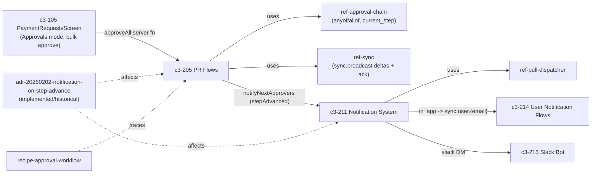

# CROSSCUT-MASS-APPROVAL-1 — How mass-approval gets done and informs other users

## Evidence Commands

All run as `c3() { C3X_MODE=agent bash skills/c3/bin/c3x.sh --c3-dir research/eval/skill-eval/fixtures/acountee/.c3 "$@"; }` from `/var/tmp/c3-judge`:

```bash
c3 search "mass approval bulk approve inform other users notification"
c3 read recipe-approval-workflow --full
c3 read ref-bulk-operations --full
c3 read c3-205 --full          # PR Flows
c3 read c3-211 --full          # Notification System
c3 read c3-105 --full          # PaymentRequestsScreen
c3 read ref-sync --full
c3 read ref-approval-chain --full
c3 read adr-20260202-notification-on-step-advance --full
c3 read ref-audit-trail --full
c3 read c3-214 --full          # User Notification Flows
c3 graph c3-205 --format mermaid
c3 graph c3-211 --depth 1 --format mermaid
c3 lookup 'src/server/functions/pr.ts'
c3 lookup 'paymentRequestHooks.ts'
```

## Answer

**Layer:** c3-105 (PaymentRequestsScreen) → c3-205 (PR Flows) → c3-211 (Notification System), governed by ref-bulk-operations, ref-approval-chain, ref-sync, ref-audit-trail.

Mass-approval ("bulk approve") is the Approvals-mode bulk action on the PaymentRequestsScreen that calls the `approveAll` flow, which iterates PR ids, runs the single-PR approve semantics on each, and informs other users through **three distinct mechanisms**: NATS sync deltas to all connected clients, targeted notifications to next-step approvers via NATS JetStream (in-app / email / Slack per user preference), and a DB-trigger audit trail.

### Causal chain (Step 0a++ items 1–6)

**1. Action owner — c3-105 PaymentRequestsScreen (Approvals mode).**
The screen runs in two modes; **Approvals mode** shows "Only PRs pending current user's approval" with actions "Approve, reject, bulk approve" (c3-105 `## Dual Mode`). Bulk selection follows **ref-bulk-operations**: bulk mode toggles via header button or the `B` key, checkboxes overlay the existing list, non-actionable items render at reduced opacity, a bulk action bar replaces the footer with buttons like "Approve (3)", and ESC exits clearing the selection. Selection state is `bulkMode` / `selectedIds` / `actionableIds` (ref-bulk-operations `## Selection State`), wired through `usePaymentRequestSelection` and `useBulkOperations` hooks (c3-105 `## Key Wiring`). The screen invokes the `approveAll` server function (c3-105 `## Data Flow` lists it among the pr.ts server functions). WHY this hop: ref-bulk-operations `## Applies To` explicitly names "PaymentRequestsScreen (bulk approve in approvals mode)".

**2. State mutation owner — c3-205 PR Flows, `approveAll`.**
c3-205 `## Operations`: `approveAll` = "Bulk approval: iterates pr_ids, approves each, collects approved/failed arrays | sync, conditional notifications per PR". Each iteration runs the single-approve semantics owned by **ref-approval-chain**: an `approval_record` is inserted; the step `mode` is evaluated app-level in `prService.approve` (`anyof` = one assigned approver suffices, `allof` = every assigned user must have a record); if satisfied, `current_step` increments, and if it was the last step the PR is marked `approved` (ref-approval-chain `## Mode Validation` and `## Golden Example: Approve + Step Advance`). So bulk approval is **per-PR, not all-or-nothing**: the flow returns `approved` and `failed` arrays — a partial-success boundary by design. Each operation runs in transaction scope via the execution context (recipe-approval-workflow `## Cross-Cutting Contracts`: "All operations run in transaction scope (c3-202 execution context)"). WHY this hop: c3-105's server functions list routes `approveAll` to `@/server/functions/pr` (c3-205's flow surface), and c3-205 cites ref-approval-chain as governance.

**3. Sync mechanism — ref-sync (NATS WebSocket deltas + acks).**
Every mutation emits a sync delta, then the flow acks (recipe-approval-workflow `## Cross-Cutting Contracts`). Concretely (ref-sync): the service emits `sync.emit({ entity: 'pr', type: 'update', id, data: updatedPr }, executionId)` after each DB write — a **full-record delta** broadcast on subject **`sync.broadcast`** (`{prefix}.broadcast`, default prefix `sync`) via `publisher.publishToAll()`; after all service calls the flow sends `sync.ack(executionId)`. All connected clients' `natsSync` subscriptions apply the delta to the `prs` atom with `applyDelta` (delete → update full-replace → add), so every user's PR list updates in real time; the originating client's `executionTracker` resolves `result.wait()` on whichever of delta/ack arrives first with that `executionId` (2s timeout fallback). RBAC filtering happens client-side ("Broadcast to all, filter on client", ref-sync `## Convention`). WHY this hop: c3-205 `uses` ref-sync and every `approveAll` row lists `sync` as a side effect; c3-105 `## Data Flow` says "Real-time updates via NATS sync".

**4. Notification mechanism — c3-211 Notification System (NATS JetStream), per PR whose step advanced.**
Per adr-20260202-notification-on-step-advance (**status: implemented — historical ADR; the behavior is confirmed in the current c3-205 doc**): `prService.approve` returns an explicit `stepAdvanced: boolean`, and `approveAll` calls `notificationService.notifyNextApprovers(prId)` "for each PR that has `stepAdvanced: true`" — hence c3-205's "conditional notifications per PR". `notifyNextApprovers` looks up next-step approvers from `approval_step_users` and publishes one message per recipient via `notificationPublisher` to the JetStream **`NOTIFICATIONS`** stream on subject pattern **`notifications.{type}.{escaped_email}`** (Workqueue retention, file storage, 7-day max age, 10K max messages). The durable `notificationDispatcher` consumes each message, fetches the user's preferred channels from `notification_preferences` (JSONB, defaults `['in_app']`), writes a `pending` row in `notification_log` per channel, invokes the channel handler, then marks `sent`/`failed` and acks/naks (nak = retry). Channels: **emailChannel** (SMTP + HTML template), **inAppChannel** (NATS real-time publish — the targeted `sync.user.{escaped_email}` subject from ref-sync's `## NATS Subjects`, `@`/`.` escaped to `_` — plus JetStream persistence), **slackChannel** (DM via the c3-215 Slack bot; gracefully skips if Slack unconfigured). Recipients later read/dismiss these via c3-214 User Notification Flows (`getNotificationsFlow` fetches up to 50 non-dismissed in-app notifications from `notification_log` where channel='in_app'). WHY this hop: ref-approval-chain `## Wiring` shows `approvePr.flow → notificationService.notifyNextApprovers (if stepAdvanced)`, and the ADR's `## Step-Advancing Paths Audit` row "approveAll | Yes (calls prService.approve) | Yes".

**Audit leg:** approval mutations on the `pr` table are captured by the `log_change()` **DB trigger** (before/after JSONB snapshots, md5 checksum, actor from `app.current_user` session variable set by `executeInDrizzleTransaction`); flows must NOT also call `createAuditEntry` for trigger-covered tables or entries duplicate (ref-audit-trail `## When to Audit`; recipe-approval-workflow `## Cross-Cutting Contracts`). Other users see this via the Audit tab / AuditLogPanel on c3-105.

**5. Emergent properties.**
- **Async, non-blocking notification:** "Notifications fire async with error suppression (logged, not thrown)" (c3-205 `## Approval Integration`); "Notifications are fire-and-forget (error suppressed, logged)" (recipe). Bulk approval never fails because a notification failed.
- **Targeted vs broadcast split:** state changes go to *everyone* on `sync.broadcast` (filtered client-side); "you're up next" notifications go only to next-step approvers on per-user subjects/channels.
- **Step-advance-only notification:** approvers are notified only when a step actually advances — an `allof` step with one of two signatures notifies no one; a fully-approved PR notifies no one ("No action required - PR is done", ADR rationale table).
- **Partial-success bulk:** `approved`/`failed` arrays mean one bad PR doesn't block the rest; deltas and notifications fire per committed PR, not per batch.
- **Idempotent under race:** concurrent approvals triggering duplicate notifications are deduped — "notificationPublisher.publish is idempotent (JetStream dedupes by message ID)" (ADR `## Rationale`).

**6. Failure boundary.**
- **Notification leg fails:** error is suppressed and logged (c3-205, recipe) — the approval mutation, sync delta, and audit row are preserved; next-step approvers are simply not pinged. Observable: the dispatcher naks for retry and `notification_log` rows show `failed` with error details, powering admin UI retry via `notificationService.retryNotification(execCtx, logId)` (c3-211 `## Notification Log`). A `failed` log row is the observer's signal.
- **Channel-level failure:** per-channel log status isolates it — email can fail while in_app succeeds; slackChannel skips gracefully when unconfigured (c3-211 `## Built-in Channels`).
- **Sync/ack leg fails or is skipped:** the originating client's `result.wait()` falls back to a 2s timeout — "a UX optimization, not correctness-critical" (ref-sync `## Execution ID Contract`); skipping ack causes "sluggish UI" not data loss (ref-sync anti-patterns). Other clients missing a broadcast delta have stale atoms until next load; the docs define no replay for `sync.broadcast` (deltas are plain NATS pub/sub; only the notification path persists in JetStream).
- **Per-PR approve fails inside the batch:** that PR lands in the `failed` array; the rest commit (c3-205). Each PR's transaction scope (c3-202) keeps its mutation + trigger-audit atomic (ref-audit-trail: "If the mutation rolls back, the audit entry should too").
- **What the docs do not say (explicit gap):** how the bulk UI surfaces the `failed` array to the acting user, and whether clients reconcile missed broadcast deltas after a disconnect — neither is documented in c3-105, c3-205, or ref-sync.

### Graph

Derived from `c3 graph c3-205 --format mermaid` and `c3 graph c3-211 --depth 1 --format mermaid` outputs (agent mode emitted node/edge lists; edges below are exactly those returned):



### Concrete checks (verifying or changing this path)

- **Owners to touch:** `approveAll` flow in PR Flows (c3-205; server functions surface named as `@/server/functions/pr` by c3-105), `prService.approve` + `approvalQueries` (ref-approval-chain wiring), `notificationService`/dispatcher/channels (c3-211), bulk-selection hooks `useBulkOperations`/`usePaymentRequestSelection` (c3-105).
- **Runtime values to confirm:** NATS subject prefix `sync` (`NATS_SUBJECT_PREFIX` — frontend hardcodes `sync.broadcast`/`sync.user.{escaped_email}`, must change in lockstep per ref-sync `## Subject Prefix Contract`); JetStream stream `NOTIFICATIONS` with subjects `notifications.{type}.{escaped_email}`; `executionId` stays a string end-to-end.
- **Observables to assert** (ADR `## Verification` adapted to bulk): run `approveAll` over PRs at different steps; assert per-PR `approved`/`failed` arrays; assert next-step approvers (and only step-advanced PRs' approvers) get `notification_log` entries per preferred channel transitioning `pending → sent`; assert all clients receive a `prs` ChangeSet delta on `sync.broadcast`; assert `audit` rows from `log_change()` on `pr` with correct `triggered_by` and no duplicate explicit entries.
- **Probe the failure mode:** kill a channel (e.g. bad SMTP) mid-bulk — approval must still commit, `notification_log` shows `failed`, admin retry republishes via `retryNotification`.

## Grounding

| Material claim | Source |
| --- | --- |
| Bulk approve lives in Approvals mode; B-key/header toggle, selectedIds/actionableIds, action bar "Approve (3)", applies to PaymentRequestsScreen | `c3 read ref-bulk-operations --full` (`## Convention`, `## Selection State`, `## Applies To`); `c3 read c3-105 --full` (`## Dual Mode`, `## Key Wiring`) |
| `approveAll` iterates pr_ids, approves each, collects approved/failed arrays; side effects "sync, conditional notifications per PR" | `c3 read c3-205 --full` (`## Operations` table) |
| anyof/allof mode validation is app-level in `prService.approve`; step advance via `updateApprovalCurrentStep`; final step → `markPrAsApproved` | `c3 read ref-approval-chain --full` (`## Mode Validation`, `## Golden Example: Approve + Step Advance`, `## Wiring`) |
| Every mutation emits sync delta then flow acks; transaction scope c3-202; notifications fire-and-forget | `c3 read recipe-approval-workflow --full` (`## Cross-Cutting Contracts`) |
| `sync.broadcast` / `sync.user.{escaped_email}` subjects, full-record deltas, applyDelta, executionId string contract, 2s wait timeout, broadcast-to-all-filter-on-client | `c3 read ref-sync --full` (`## NATS Subjects`, `## Delta Payload Shape`, `## Execution ID Contract`, `## Convention`, anti-patterns) |
| `stepAdvanced` flag; approveAll notifies per step-advanced PR; no notify on final approval; JetStream message-ID dedupe; ADR status implemented | `c3 read adr-20260202-notification-on-step-advance --full` (`## Decision`, `## Rationale`, `## Step-Advancing Paths Audit`, frontmatter `status: implemented`) — labeled historical; current behavior cross-checked against c3-205 `## Operations`/`## Approval Integration` |
| JetStream `NOTIFICATIONS` stream, `notifications.{type}.{escaped_email}`, dispatcher pending→sent/failed + ack/nak, `notification_preferences` default `['in_app']`, email/in_app/slack channels, `retryNotification`, notification_log powers admin retry | `c3 read c3-211 --full` (`## Architecture`, `## Components`, `## Built-in Channels`, `## User Preferences`, `## Notification Log`) |
| pr table audited by `log_change()` DB trigger; do NOT also call createAuditEntry; actor via `app.current_user`; audit atomic with transaction | `c3 read ref-audit-trail --full` (`## When to Audit`, `## DB trigger audit`, `## Anti-Patterns`); recipe `## Cross-Cutting Contracts` |
| Recipients fetch/read/dismiss notifications (up to 50 in-app, channel='in_app') | `c3 read c3-214 --full` (`## Operations`, `## Fetch Strategy`) |
| Graph edges (c3-205 uses ref-sync/ref-approval-chain; ADR affects c3-205+c3-211; c3-211 uses ref-pull-dispatcher) | `c3 graph c3-205 --format mermaid`, `c3 graph c3-211 --depth 1 --format mermaid` outputs |
| Notifications async with error suppression (logged, not thrown) | `c3 read c3-205 --full` (`## Approval Integration`) |

## Caveats

- **No `rule-*` entities found** governing this path: no `rule-` ids appeared in any search or graph output this session (verified by grepping the `c3 search "rule bulk approve approval notification"` output for `rule-` — zero matches).
- **Codemap gap:** `c3 lookup 'src/server/functions/pr.ts'` and `c3 lookup 'paymentRequestHooks.ts'` returned no matches ("codemap coverage gap" per the CLI help output) — the file paths named in c3-105/c3-205 docs are uncharted in the codemap, so file-level claims here rest on doc prose, not lookup-confirmed ownership.
- **adr-20260202-notification-on-step-advance is historical** (`status: implemented`); its checklists are point-in-time. The live behavior was cross-checked against the current c3-205 doc, which matches ("conditional notifications per PR").
- **Documented gaps (not guesses):** the docs do not state how the `failed` array is surfaced in the bulk UI, nor any replay/reconciliation for clients that miss a `sync.broadcast` delta (only the notification path has JetStream persistence per c3-211; ref-sync documents only the 2s timeout fallback for the originating client).
- **Mermaid rendering:** `--format mermaid` in agent mode returned TOON node/edge lists rather than mermaid text; the diagram above is hand-rendered strictly from those returned edges.
