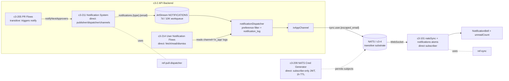

# CROSSCUT-NOTIFICATION-BELL-1 — "A notification was published but a user cannot see it. What path must you trace before blaming the UI?"

## Evidence Commands

```bash
c3() { C3X_MODE=agent bash skills/c3/bin/c3x.sh --c3-dir research/eval/skill-eval/fixtures/acountee/.c3 "$@"; }

c3 search "notification published but user cannot see it notification visibility delivery path"
c3 search "notification bell UI unread"
c3 read c3-211 --full                                   # Notification System (publisher/dispatcher/channels)
c3 read ref-pull-dispatcher --full                      # channel registration pattern
c3 read ref-sync --full                                 # NATS subjects, prefix contract, message shapes
c3 read recipe-realtime-sync --full                     # sync vs notification stream separation
c3 read c3-101 --full                                   # frontend natsSync + notifications atoms
c3 read c3-214 --full                                   # User Notification Flows (fetch/read/dismiss)
c3 read c3-209 --full                                   # NATS credential generator (client subscribe permissions, TTL)
c3 read adr-20260126-user-notification-ui --full        # bell UI decision (status: implemented — historical)
c3 read adr-20260202-notification-on-step-advance       # step-advance notify (status: implemented — historical)
c3 graph c3-211 --depth 1 --format mermaid              # dependents/governance of Notification System
c3 lookup 'apps/start/src/lib/pumped/atoms/natsSync.ts' # codemap probe — empty
c3 lookup 'apps/start/src/components/NotificationBell.tsx'  # codemap probe — empty
c3 lookup 'apps/server/src/services/notification*'      # codemap probe — empty
c3 lookup 'apps/**'                                     # codemap probe — empty (no codemap coverage at all)
```

## Answer

**Layer:** c3-211 (Notification System, backend) → c3-101 (State Management, frontend), with c3-214 (User Notification Flows) as the cold-load leg and c3-209 (NATS Credential Generator) as the transport-auth leg.

"Published" only means the message reached the JetStream `NOTIFICATIONS` stream. Between that point and the user's eyeball there are **five hops the docs make you trace before the UI is even a suspect** — and two independent last-mile legs (live push and cold fetch), so "user can't see it" can fail in one while the other still works.

### Causal chain (action → mutation → mechanism → observer → emergent property → failure boundary)

1. **Publish (given).** A flow (e.g. c3-205 `approvePr` "notifies next approvers") calls `notificationService` → `notificationPublisher`, which publishes to JetStream subject `notifications.{type}.{escaped_email}` on the `NOTIFICATIONS` stream — workqueue retention, file storage, **7-day max age, 10K max messages** (c3-211 § notificationPublisher). WHY the next hop follows: workqueue semantics mean nothing is delivered until a consumer takes it.
   *Failure here:* message aged out / stream at cap → silently gone before dispatch.

2. **Dispatch — the preference gate.** `notificationDispatcher` consumes with a durable consumer; per message it **fetches the user's preferred channels from `notification_preferences` (JSONB, defaults to `['in_app']`) and filters channels against preferences**, creates a `pending` row in `notification_log` per channel, calls the channel handler, updates the row to `sent`/`failed`, acks on success / naks on failure for retry (c3-211 § notificationDispatcher, § User Preferences, § Notification Log). WHY the next hop follows: only a channel that survives the preference filter ever runs.
   *Failure here:* if the user's preference list does not include `in_app`, **no in-app delivery is attempted and no `in_app` log row exists — the notification is invisible by design, not a UI bug.** Handler failure → `failed` log row with error details; admins can retry via `retryNotification(execCtx, logId)` (c3-211 § notificationService; ref-jtbd J31: "When notification delivery fails, I want to view history and retry dispatches", owner c3-211, NotificationTable UI).

3. **In-app channel — the fan-out into two legs.** `inAppChannel` delivers via "NATS publish (real-time) + JetStream (persistence)" (c3-211 § Built-in Channels). The real-time leg uses `publisher.publishToUser()` on subject `{prefix}.user.{escaped_email}` (default `sync.user.{escaped_email}`; `@` and `.` → `_`) per ref-sync § NATS Subjects; the persisted leg is what c3-214's fetch flow later reads. WHY both legs matter: the live leg is ephemeral; the persisted leg is what survives a page refresh.
   *Failure here:* subject mismatch — ref-sync § Subject Prefix Contract says server subjects are prefix-driven (`NATS_SUBJECT_PREFIX`, default `sync`) while **the frontend subscribes to `sync.broadcast`/`sync.user.{escaped_email}` literally; if the prefix changes, frontend wiring must change in lockstep** or the user subject never matches. Same for email-escaping or recipient-email mismatch.

4. **Transport auth — can this client even hear the subject?** The client connects over WebSocket with a per-session JWT from c3-209, whose permission model is **subscribe-only to exactly `{prefix}.broadcast` and `{prefix}.user.{escaped_email}` (the email the session was minted for), JWT expires after TTL (default 1 hour) — client must reconnect** (c3-209 § Permission Model, § Security). WHY the next hop follows: the notifications atom only receives what this subscription delivers.
   *Failure here:* expired JWT / dropped WebSocket → live leg dead; notification still persisted, so it should appear on reload via leg 5. If it appears after refresh but never live, suspect this hop, not the bell.

5. **Cold-load leg — server fetch + read/dismiss state.** c3-214 `getNotificationsFlow` fetches up to 50 non-dismissed `channel='in_app'` notification logs for the current user (over-fetching `min(51 + dismissedCount, 200)` to compensate for dismissals), enriches with read state; `dismissNotificationFlow` filters a notification out without deleting it; all flows require an authenticated user via `currentUserTag` (c3-214 § Operations, § Fetch Strategy). WHY this matters: a notification that was delivered can still be invisible because it was **dismissed** or fell past the 50-item cap.

6. **Frontend state → bell (only now the UI).** `natsSync` atom subscribes to both subjects and routes `type: 'notification'` messages into the `notifications` atom; `unreadCount` is derived from it; `NotificationBell` renders badge + dropdown (c3-101 § Atoms, § NATS Sync Wiring; adr-20260126-user-notification-ui — **status: implemented, historical**, corroborated by current c3-101/c3-214 docs).

**Emergent property:** backend delivery is durable and at-least-once (JetStream workqueue + nak-retry + per-attempt `notification_log`), but visibility is the AND of an ephemeral live push and a persisted fetch, gated upstream by per-user channel preferences. recipe-realtime-sync states the two systems are architecturally separate: "notifications are durable, sync is ephemeral."

**Failure boundary:** every dispatch attempt is observable in `notification_log` (`pending`/`sent`/`failed` + error details, powering admin retry — c3-211 § Notification Log, ref-jtbd J31), so the **first read is the log row, not the React tree**. If the live NATS leg fails, persistence is preserved and the notification surfaces on reload; if the preference filter excluded `in_app`, nothing is preserved for the in-app surface and only an admin looking at the log/preferences observes why. The docs do not describe any alerting when the dispatcher naks repeatedly — observation is pull-based (admin log UI), an explicit gap, not a guess.

### Trace order — concrete checks before blaming the UI

1. `notification_log` row for this notification: exists? `channel='in_app'`? status `sent`/`failed`/`pending`? error details (c3-211 § Notification Log). `failed` → retry via `retryNotification` (J31).
2. `notification_preferences` row for the recipient: does the JSONB channel list include `'in_app'`? (c3-211 § User Preferences — dispatcher filters on it; default is `['in_app']` but Slack work introduces other values.)
3. JetStream `NOTIFICATIONS` stream/consumer state: message older than 7 days or stream past 10K cap? durable consumer lagging? (c3-211 § notificationPublisher/§ notificationDispatcher.)
4. Subject identity: publisher's `{prefix}.user.{escaped_email}` vs the email the client's JWT was minted for — same `NATS_SUBJECT_PREFIX` (`sync`), same `@.`→`_` escaping, same account email (ref-sync § Subject Prefix Contract; c3-209 § Permission Model).
5. Client transport: WebSocket connected, JWT within 1h TTL, user-subject subscription active in `natsSync` (c3-209 § Security; c3-101 § NATS Sync Wiring).
6. Cold path: does `getNotificationsFlow` return it? If not — dismissed (`dismissNotificationFlow` filters it out) or beyond the 50 cap (c3-214 § Fetch Strategy).
7. Only after 1–6 pass: `notifications` atom contents, `unreadCount` derivation, `NotificationBell` rendering (c3-101; adr-20260126).

### Graph

`c3 graph c3-211` (depth 1) — direct vs transitive, each labeled after reading:



Direct dependents (read, behavior confirmed): c3-211, c3-101, c3-214, c3-209. Transitive: c3-205 (upstream trigger, reached via notificationService), c3-4 NATS server (substrate, reached via publisher/credentials).

**No `rule-*` entities found** in either search output for this flow — governance is via refs (ref-pull-dispatcher, ref-sync) only.

## Grounding

| Material claim | Evidence source |
| --- | --- |
| Publish target = JetStream `NOTIFICATIONS`, subject `notifications.{type}.{escaped_email}`, workqueue, 7-day/10K limits | `c3 read c3-211 --full` § notificationPublisher |
| Dispatcher fetches preferences, pending→sent/failed log per channel, ack/nak retry | `c3 read c3-211 --full` § notificationDispatcher |
| Preferences JSONB default `['in_app']`; dispatcher filters channels against preferences | `c3 read c3-211 --full` § User Preferences |
| `notification_log` tracks every attempt (pending/sent/failed + error), powers admin retry | `c3 read c3-211 --full` § Notification Log; `c3 read c3-211 --full` § notificationService (`retryNotification`) |
| Retry-on-failure is a user job owned by c3-211 (NotificationTable, NotificationTriageFlow) | `c3 search` result row ref-jtbd J31 |
| inAppChannel = NATS real-time publish + JetStream persistence | `c3 read c3-211 --full` § Built-in Channels |
| User subject `{prefix}.user.{escaped_email}`, `@.`→`_` escaping, `publishToUser()` | `c3 read ref-sync --full` § NATS Subjects |
| Prefix contract: server prefix-driven, frontend hardcodes `sync.*`, must change in lockstep | `c3 read ref-sync --full` § Subject Prefix Contract (same warning in `c3 read c3-101 --full` § NATS Sync Wiring) |
| Client JWT: subscribe-only to broadcast + own user subject, WebSocket-only, 1h TTL, reconnect required | `c3 read c3-209 --full` § Permission Model, § Security |
| Frontend dual subscription, notification → notifications atom, derived unreadCount, NotificationBell | `c3 read c3-101 --full` § Atoms, § NATS Sync Wiring; `c3 read adr-20260126-user-notification-ui --full` |
| Cold fetch: 50 non-dismissed in_app logs, over-fetch for dismissals, read/dismiss independent, `currentUserTag` required | `c3 read c3-214 --full` § Operations, § Fetch Strategy |
| Notifications durable vs sync ephemeral; separate stream | `c3 read recipe-realtime-sync --full` § Narrative, § Risk |
| Step-advance trigger gap was fixed (`stepAdvanced` signal) | `c3 read adr-20260202-notification-on-step-advance` (status: implemented — historical) |
| Bell ADR problem statement: published to `sync.user.{email}` but frontend only subscribed to broadcast | `c3 read adr-20260126-user-notification-ui --full` § Problem (status: implemented — historical; live mechanism confirmed against current c3-101/c3-214) |
| Direct/transitive dependent set | `c3 graph c3-211 --depth 1` node list + the reads above |
| "No `rule-*` entities found" | both `c3 search` outputs contain no rule-type rows |

## Caveats

- **Codemap is empty in this fixture**: `c3 lookup 'apps/**'` (and every specific path probed) returned no files/components, with c3x emitting "codemap coverage gap" hints. File paths named above (`natsSync.ts`, `NotificationBell.tsx`, `natsPublisher.ts:35`) come from doc bodies (ADR implementation details, ref-sync golden examples), not from lookup binding — verify against the working tree before editing.
- **Read/dismiss state ownership drifted between ADR and current docs**: adr-20260126 (historical) specified localStorage-only read IDs and "Reload items (empty)" on refresh; the current c3-214 doc documents server-side `markNotificationReadFlow`/`dismissNotificationFlow` and a server fetch flow. Trust c3-214 for the live read/dismiss mechanism.
- **`c3 graph --format mermaid` emitted TOON node lists in agent mode**, not mermaid; the diagram above is constructed from the graph node/edge output plus the cited reads.
- **No alerting on repeated dispatch failure is documented** — c3-211 documents only the pull-based admin log/retry surface; treat "who notices a stuck consumer" as a documented gap.
