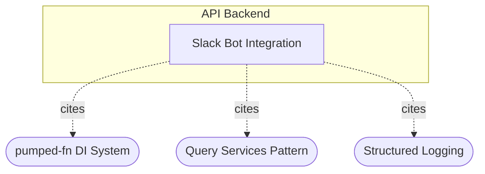

# CROSSCUT-SLACK-APPROVAL-1: When approval happens from Slack, what keeps web clients and next approvers consistent?

## Evidence Commands

```bash
c3 search "Slack approval action keeps web clients and next approvers consistent"
c3 read c3-215 --full          # Slack Bot Integration
c3 read c3-205 --full          # PR Flows
c3 read c3-211 --full          # Notification System
c3 read ref-sync --full        # Real-time Sync Pattern
c3 read ref-approval-chain --full
c3 read ref-pull-dispatcher --full
c3 read ref-nats-jwt-auth --full
c3 read adr-20260305-slack-bot-integration
c3 read adr-20260202-notification-on-step-advance
c3 read adr-20260121-notification-system
c3 read recipe-approval-workflow --full
c3 read recipe-realtime-sync --full
c3 graph c3-215 --depth 1 --format mermaid
c3 graph c3-205 --depth 1 --format mermaid
```

(One additional search, `c3 search "real-time sync to web clients after approval state change"`, failed with an FTS tokenizer error — `no such column: time` — and produced no evidence.)

## Answer

**Layer:** c3-215 (Slack Bot Integration) → c3-205 (PR Flows) → ref-sync + c3-211 (Notification System), all inside c3-2 (API Backend).

**Short answer:** Nothing Slack-specific keeps anyone consistent. Consistency comes from the Slack path converging onto the *same* flow layer (`prFlows.approvePr`/`rejectPr`) that the web uses; from there two independent NATS mechanisms fan out: (a) **service-level sync deltas** broadcast to every connected web client (ref-sync), and (b) **durable JetStream notifications** targeted at the next approvers (c3-211). Because both side effects hang off the mutation owner — not off the entry point — an approval from Slack produces the same observable propagation as one from the web.

### Causal chain (action → mutation → sync → notification → emergent → failure)

**1. Action owner — c3-215 `slackActions`.** A user clicks Approve/Reject on a DM card. Slack POSTs to `/api/slack/events` → `bot.webhooks.slack` → `slackActions` handles `approve_pr`/`reject_pr`. Because there is no HTTP cookie context, the handler manufactures its own execution context: resolves Slack user → Acountee user via `slackQueries.getSlackUserById`, builds a `UserActor`, sets `currentUserTag` and `transactionTag` inside a `db.transaction()`, and sets `app.current_user` via SQL `set_config` so audit triggers attribute the change correctly (c3-215, "slackActions" + "Execution Context in Inbound Handlers" sections).
*Why the next hop follows:* `slackActions` step 4 explicitly executes `prFlows.approvePr` / `prFlows.rejectPr` — the Slack bot owns no approval semantics of its own (c3-215 Uses table: "c3-205 PR Flows — prFlows.approvePr, prFlows.rejectPr").

**2. State mutation owner — c3-205 `approvePr` → `prService.approve`.** The flow records the approval and `prService.approve` applies the `anyof`/`allof` mode check (app-level logic, not DB constraints), inserts an `approval_record`, advances `current_step` when satisfied, and marks the PR approved when the final step completes (ref-approval-chain, "Mode Validation" + "Golden Example: Approve + Step Advance"). `prService.approve` returns `stepAdvanced: boolean` so the flow knows whether to notify the next step (adr-20260202, **implemented — historical**, consistent with the current c3-205 Operations row "approvePr … if step advances, notifies next approvers").
*Why the next hops follow:* the c3-205 Operations table marks `approvePr` with side effects "sync, conditional notification" — both legs below are contractual side effects of this one mutation owner.

**3. Sync mechanism (what keeps web clients consistent) — ref-sync.** Inside the mutation, the *service* emits the delta after the DB write: `sync.emit({ entity: 'pr', type: 'update', id, data: updatedPr }, executionId)` → `publisher.publishToAll()` → NATS subject `sync.broadcast` (default `{prefix}.broadcast`). Every connected browser holds a subscribe-only WebSocket subscription on `sync.broadcast` (ref-nats-jwt-auth permissions table) and applies the delta to its reactive atoms via `applyDelta` — delete → update → add, **full record replacement** (ref-sync, "Golden Example: Client-Side Subscription" + "applyDelta Merge Logic"). Web clients therefore see the PR move (e.g. `pending → approved`, `current_step` advanced) without refetching, regardless of where the approval originated.
*Why this is entry-point independent:* the convention "Services call sync.emit() after DB write" (ref-sync Convention table) puts the broadcast below the flow layer, so the Slack path inherits it for free by calling `prFlows.approvePr`.
*The ack leg degrades gracefully for Slack:* flows end with `sync.ack(executionId)` guarded by `if (executionId)` because "executionId may not exist in non-interactive contexts" (ref-sync). c3-215's context-setup list names only `currentUserTag`, `transactionTag`, and `app.current_user` — no `executionIdTag` — so the Slack path has no originating `executionTracker` to resolve; its confirmation surface is the Slack `resultCard` instead (c3-215 slackActions step 5). The ack/`wait()` is "a UX optimization, not correctness-critical" (ref-sync Execution ID Contract), so web-client consistency does not depend on it.

**4. Notification mechanism (what keeps next approvers consistent) — c3-211.** When `stepAdvanced` is true, the flow calls `notificationService.notifyNextApprovers(execCtx, prId)`, which looks up next-step approvers from PR data and publishes one notification per recipient to the **JetStream `NOTIFICATIONS` stream** on subject `notifications.{type}.{escaped_email}` (workqueue retention, file storage, 7-day max age, 10K max messages). The durable `notificationDispatcher` consumes each message, filters channels against `notification_preferences` (JSONB, default `['in_app']`), writes a `pending` row in `notification_log` per channel, invokes the channel handler, updates the row to `sent`/`failed`, and acks on success / naks on failure for retry (c3-211 "notificationPublisher" + "notificationDispatcher"). Channels self-register on the dispatcher (ref-pull-dispatcher — pull, not push): `inAppChannel` (NATS real-time publish + JetStream persistence), `emailChannel` (SMTP), `slackChannel` (DM with `approvalRequestCard` carrying Approve/Reject buttons — c3-215 "slackChannel"). The per-user real-time leg uses the targeted subject `sync.user.{escaped_email}` (`@`/`.` escaped to `_`), distinct from the broadcast subject (ref-sync NATS Subjects table).
*Why the loop closes:* the next approver's Slack DM card is itself actionable, so step N+1 can be approved from Slack again — re-entering this same chain at item 1 (c3-215 Architecture: outbound `notificationDispatcher → slackChannel → bot.openDM → approvalRequestCard`).

**5. Emergent properties.**
- **Entry-point independence:** web UI, Slack, and bulk `approveAll` all converge on c3-205, so deltas and notifications fire identically — that *is* the consistency mechanism (c3-205 Operations table; c3-215 Uses table).
- **Two separated planes:** sync is ephemeral broadcast (everyone gets full updated records now); notifications are durable, targeted workqueue delivery (only next approvers, retried until acked). "Sync and notifications share NATS but are architecturally separate" (recipe-realtime-sync, Risk).
- **Step-advance-only notification:** an `allof` approval that does not complete the step emits a sync delta but notifies no one — `conditional notification` (c3-205 Operations table; adr-20260202 decision).
- **Non-blocking side effects:** "Notifications fire async with error suppression (logged, not thrown)" (c3-205 Approval Integration; recipe-approval-workflow Cross-Cutting Contracts) — approval state never hostages on delivery.
- **Audit preserved from Slack:** `app.current_user` set_config keeps DB audit triggers attributing the Slack actor (c3-215); approval mutations are audit-captured by trigger on the `pr` table (recipe-approval-workflow).

**6. Failure boundary.**
- **Notification publish fails (flow side):** error is suppressed and logged, not thrown — the approval mutation and the sync delta are preserved; next approvers are silently *not* informed on that attempt (c3-205 Approval Integration). No documented re-drive for a failed *publish* (as opposed to a failed dispatch) — explicit gap.
- **Channel dispatch fails (consumer side):** dispatcher naks → JetStream redelivers; `notification_log` rows (`pending`/`sent`/`failed`) power admin retry via `notificationService.retryNotification` (c3-211 notificationDispatcher + Notification Log).
- **No Slack mapping / Slack unconfigured:** `slackChannel` "skips silently"; all atoms return `null` when `slackConfigTag` is absent; the webhook route returns 503 (c3-215). The approver still gets their other preferred channels (default `in_app`).
- **Sync ack missing (the normal Slack case):** originating-client `wait()` would fall back to its 2s timeout, but for Slack there is no waiting web client — the actor gets the `resultCard` (ref-sync Execution ID Contract; c3-215).
- **NATS broadcast leg fails or a web client is disconnected at emit time:** the read docs document no reconcile/refetch-on-reconnect mechanism for missed deltas — sync is ephemeral by design (recipe-realtime-sync). **Explicit gap, not a guess:** stale clients until whatever triggers a reload.
- **Rules:** no `rule-*` entities surfaced in any search or graph output for this flow — no coding-rule gate applies (evidence: searches returned only refs/components/ADRs/recipes).

**Graph** (from `c3 graph c3-215 --depth 1 --format mermaid`):



Runtime dependencies beyond citations (from c3-215 Uses table, direct): c3-205 PR Flows (approve/reject/list), c3-211 Notification System (slackChannel subscribes to notificationDispatcher), c3-202 Execution Context (tags), c3-204 Drizzle ORM (transaction wrapping). Web observers such as c3-105 (PaymentRequestsScreen) and c3-101 are **transitive** relative to the Slack bot — they consume the change only through ref-sync broadcast deltas (ref-sync Cited By list), not by citing c3-215.

**ADR labels:** adr-20260305-slack-bot-integration — implemented, **historical**, matches current c3-215 doc. adr-20260202-notification-on-step-advance — implemented, **historical**, its `stepAdvanced` contract is now reflected in c3-205. adr-20260121-notification-system — implemented, **historical**; note it *removed* the previous dead Slack infrastructure, which adr-20260305 later reintroduced properly, so read it only for the notification backbone, not for Slack state.

### Concrete checks (if you change this path)

1. **Same-flow invariant:** confirm `slackActions` still calls `prFlows.approvePr`/`rejectPr` (not `prService` directly) — bypassing the flow would skip `notifyNextApprovers` and `sync.ack` while the service-level delta still fires, silently breaking next-approver notification only.
2. **Delta observable:** subscribe a web client to `sync.broadcast`, approve from Slack, assert a `DeltaMessage` with `changes.prs.update` containing the **full** updated PR record (partial records = data loss under `applyDelta`).
3. **Notification observable:** after a step-advancing approval, assert a message on `notifications.{type}.{escaped_email}` for each next approver, a `notification_log` row per preferred channel reaching `sent`, and (if mapped) a Slack DM `approvalRequestCard`.
4. **Context values:** verify the Slack handler sets `currentUserTag`, `transactionTag`, and `app.current_user`; verify whether `executionIdTag` is set — if you add it, keep `executionId` a **string** end-to-end (tracker correlation breaks on type mismatch).
5. **Config/permission values:** `SLACK_BOT_TOKEN`/`SLACK_SIGNING_SECRET` (`slackConfigTag`), `NATS_SUBJECT_PREFIX` (frontend subscribes to literal `sync.*` — prefix change must be lockstep, ref-sync Subject Prefix Contract), browser JWT subscribe permissions vs the subjects the frontend actually uses (see Caveats).
6. **Failure probe:** stop the dispatcher consumer, approve from Slack — the PR mutation and broadcast delta must still land; `notification_log` should show retry behavior (nak/redeliver) once resumed; then probe a publish-side failure and confirm it is logged-and-suppressed, not thrown.

## Grounding

| Material claim | Evidence source |
| --- | --- |
| Slack approve/reject enters via `/api/slack/events` → `slackActions` → `prFlows.approvePr/rejectPr` in a DB transaction | `c3 read c3-215 --full` — "slackActions", "Webhook Route", Uses table |
| Slack handlers build their own execution context; set `currentUserTag`, `transactionTag`, `app.current_user`; no `executionIdTag` listed | `c3 read c3-215 --full` — "Execution Context in Inbound Handlers" |
| `approvePr` side effects = "sync, conditional notification"; notifications async, error-suppressed | `c3 read c3-205 --full` — Operations table, "Approval Integration" |
| anyof/allof check, `approval_record` insert, `current_step` advance, final-step `markPrAsApproved` live in `prService.approve` | `c3 read ref-approval-chain --full` — "Mode Validation", "Golden Example: Approve + Step Advance", Wiring |
| Services emit `sync.emit` after DB write; flows own guarded `sync.ack`; broadcast on `sync.broadcast`; client `applyDelta` full-record replacement; `wait()` UX-only with 2s timeout | `c3 read ref-sync --full` — Architecture, Convention, Execution ID Contract, Golden Examples, applyDelta |
| Browser clients subscribe-only on `sync.broadcast` via WebSocket; server full TCP | `c3 read ref-nats-jwt-auth --full` — Permissions Model table |
| `notifyNextApprovers` publishes per-recipient to JetStream `NOTIFICATIONS` (`notifications.{type}.{escaped_email}`, workqueue, 7-day/10K); dispatcher filters preferences, logs pending/sent/failed, ack/nak, admin retry | `c3 read c3-211 --full` — notificationService, notificationPublisher, notificationDispatcher, Notification Log |
| Channels self-register on dispatcher (pull); slackChannel DM card with Approve/Reject; silent skip without mapping/config | `c3 read ref-pull-dispatcher --full`; `c3 read c3-211 --full` Built-in Channels; `c3 read c3-215 --full` slackChannel |
| `sync.user.{escaped_email}` targeted subject; email escaping rule | `c3 read ref-sync --full` — NATS Subjects table |
| Sync ephemeral vs notifications durable; architecturally separate | `c3 read recipe-realtime-sync --full` — Narrative, Risk |
| Every mutation emits delta then ack; audit via DB trigger on `pr`; fire-and-forget notifications | `c3 read recipe-approval-workflow --full` — Cross-Cutting Contracts |
| `stepAdvanced` return signal and notify-on-step-advance decision | `c3 read adr-20260202-notification-on-step-advance` (status: implemented) |
| Old Slack infra removed then reintroduced via chat-sdk | `c3 read adr-20260121-notification-system`, `c3 read adr-20260305-slack-bot-integration` (both status: implemented) |
| Direct dependents of c3-215 (c3-205, c3-211, c3-202, c3-204); citation graph | `c3 read c3-215 --full` Uses table; `c3 graph c3-215 --depth 1 --format mermaid` |
| Web screens are transitive observers via ref-sync | `c3 read ref-sync --full` — Cited By list (c3-104, c3-105, c3-101 via graph) |
| No `rule-*` entities apply | All `c3 search` outputs for this flow returned only components/refs/ADRs/recipes; grep over search output for `rule-` returned nothing |

## Caveats

- **Subject-permission tension between two refs:** ref-nats-jwt-auth's Permissions Model grants browsers subscribe **only** on `sync.broadcast`, while ref-sync's Subject Prefix Contract says "Frontend subscriptions currently use `sync.broadcast` and `sync.user.{escaped_email}` directly." If the permission table is literal, the in-app per-user real-time leg over WebSocket would be denied. The docs disagree; resolve against code (check the JWT permission claims in the credential generator, c3-209) before relying on real-time in-app notification delivery.
- **`executionIdTag` on the Slack path is inferred from omission:** c3-215 enumerates the tags `slackActions` sets and `executionIdTag` is not among them; ref-sync independently allows for absent `executionId` in "non-interactive contexts." No read states outright "Slack sets no executionId" — verify in the handler code before depending on it.
- **No documented recovery for missed broadcast deltas:** recipe-realtime-sync calls sync "ephemeral"; none of the read docs describe refetch-on-reconnect for web clients that were offline during the emit. Gap in the docs, flagged as such above.
- **No documented re-drive for publish-side notification failures:** error suppression is documented (c3-205); JetStream retry covers only messages that reached the stream. Whether a failed `notifyNextApprovers` publish is recoverable is not stated.
- **Doc-template noise:** c3-215, c3-205, and c3-211 carry boilerplate "Migrated from legacy component form; refine during next component touch" governance rows — the generic sections (Parent Fit, Contract) are templated; the load-bearing content is in their Architecture Details sections, which is what this answer relies on.
