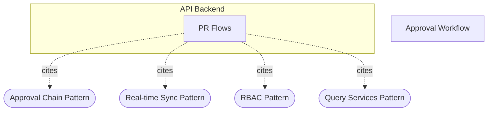

# If mass approval partially fails, is the audit trail still consistent?

**Property named (Step 0a+++):** per-mutation atomicity of audit capture vs batch-level (all-or-nothing) consistency, with a partial-success boundary. The mass-approval batch is **not atomic by design**; audit consistency is guaranteed **per committed PR mutation** (trigger-in-transaction), not per batch — and only for mutations that touch the `pr` row.

## Evidence Commands

```bash
c3() { C3X_MODE=agent bash skills/c3/bin/c3x.sh --c3-dir research/eval/skill-eval/fixtures/acountee/.c3 "$@"; }

c3 search "mass approval partial failure audit trail consistency"
c3 search "mass approve bulk approve payment requests workbench"
c3 read recipe-approval-workflow --full
c3 read ref-audit-trail --full
c3 read c3-205 --full
c3 read c3-202 --full
c3 read ref-bulk-operations --full
c3 read ref-approval-chain --full
c3 read recipe-audit-and-compliance --full
c3 read ref-audit-timeline
c3 read ref-sync
c3 graph c3-205 --format mermaid
```

(Fixture contains no source tree — `ls` of the fixture root shows only `README.md` + `.c3/` — so all claims below are bound to C3 doc reads, and code-level checks are listed as probes, not claims.)

## Answer

**Short answer:** Yes for what gets committed, with two sharp boundaries. The audit trail stays consistent **per PR** because audit capture on the `pr` table is a DB trigger firing inside the same transaction as the mutation — a PR's audit row exists if and only if its mutation committed. But (1) the batch is partial-success by design, so after a partial failure the audit table reflects only the succeeded subset and records **nothing** about the failed attempts, and (2) approval mutations that don't change the `pr` row (mid-chain approvals) fall outside both documented audit mechanisms entirely.

### Causal chain (action owner → mutation owner → transaction/audit contract → observation surface)

1. **Action owner — c3-105 PaymentRequestsScreen, Approvals mode.** Bulk approve is a UI overlay (ref-bulk-operations "Applies To: PaymentRequestsScreen (bulk approve in approvals mode)"). It invokes the backend bulk flow; the UI pattern itself carries no atomicity contract.

2. **Mutation owner — c3-205 PR Flows, `approveAll`.** Its Operations row is explicit: "Bulk approval: **iterates pr_ids, approves each, collects approved/failed arrays** | sync, conditional notifications per PR." Partial failure is a *designed outcome* — the flow loops per PR and reports a per-PR success/failure split. There is no documented all-or-nothing batch semantics. Each iteration follows the single-approve path (ref-approval-chain Wiring): `prService.approve` → `newApprovalRecord` (insert into `approval_records`), and only on step advance `updateApprovalCurrentStep` (the `approval` table) plus `markPrAsApproved` (the `pr` row) when the final step completes.

3. **Transaction + audit contract.**
   - recipe-approval-workflow, Cross-Cutting Contracts: "All operations run in transaction scope (c3-202 execution context)" and "Approval mutations are audit-captured via **DB trigger on `pr` table** — do NOT also call `createAuditEntry`."
   - c3-202 Lifecycle: transaction middleware sets `transactionTag` "within `db.transaction()`"; `executeInDrizzleTransaction` sets `app.current_user` (base64 email) before writes so the trigger attributes the actor (ref-audit-trail, "DB trigger audit").
   - ref-audit-trail: `log_change()` fires on INSERT/UPDATE/DELETE on `invoices`, `pr`, `invoice_services`; both mechanisms write the same `audit` table; anti-pattern "Auditing outside a transaction — if the mutation rolls back, the audit entry should too." A trigger satisfies this inherently: the audit row is part of the mutating transaction.
   - **Consequence:** for each PR in the batch whose `pr`-row mutation commits, exactly one consistent audit entry (with before/after JSONB, checksum, actor) commits with it. A PR whose approval fails produces no `pr`-row commit and therefore no audit row. The audit table can never show an approval that didn't happen, nor miss one that did — *at pr-row granularity*.

4. **Observation surface.** Committed audit entries surface through c3-208 Audit Flows ("timeline views with before/after diffs for compliance review", recipe-audit-and-compliance) and the AuditLogPanel embedded in detail views (ref-audit-timeline; cited by c3-105). The **failed** subset of a mass approval is observable only in the flow's returned `failed` array and the sync ack to the originating client (ref-sync: services emit deltas, flow acks with `executionId`) — it never reaches the audit timeline.

### Emergent property + failure boundary

- **Consistency is per committed mutation, not all-or-nothing for the batch.** After partial failure the audit trail shows N independent `pr` UPDATE entries for the succeeded PRs; nothing marks them as one mass operation, and nothing records the failures. The `audit.metadata` column exists (default `{}`, ref-audit-trail data model) and `executionIdTag` exists in context (c3-202), but no doc says the executionId or a batch marker is written into audit — so reconstructing "this was one bulk action, these members failed" from the audit table alone is not supported by any documented mechanism.
- **Coverage gap below the pr row.** Audited tables are exactly: triggers on `invoices`, `pr`, `invoice_services`; explicit `createAuditEntry` on `teams`, `roles`, `user_roles`, `approval_flows` (ref-audit-trail "When to Audit"; recipe-audit-and-compliance). `approval`, `approval_records`, `approval_steps`, `approval_step_users` appear in **neither** list. Per ref-approval-chain, a mid-chain approval (e.g., first signer of an `allof` step, or any non-final step advance) writes only `approval_records`/`approval` — no `pr`-row change until `markPrAsApproved` on the final step (state machine: pending → pending on incomplete approve). So inside a mass approval, individual approval records are not audit-captured at all; the recipe's "audit-captured via DB trigger on `pr`" holds only for approvals that flip the `pr` row.
- **Undocumented transaction boundary inside the loop.** c3-202 documents one `db.transaction()` per request (middleware lifecycle), while c3-205's `approveAll` documents caught-per-PR failures. The docs do not say whether each iteration gets its own transaction/savepoint or shares the request transaction. If failures are app-level rejections (mode validation is "app-level logic in `prService`, not DB constraints" — ref-approval-chain), a shared transaction can still commit the successful subset. But if a failure were a raw SQL error mid-loop in a single shared Postgres transaction without savepoints, the whole batch — including already-"approved" members and their trigger audit rows — would roll back together while the flow had already recorded them in its `approved` array. **The docs do not resolve this; it is an explicit gap, not a guess.**


(from `c3 graph c3-205 --format mermaid`, trimmed to relevant nodes; full output also shows ADR `affects` edges and ref-pumped-fn/server-functions/structured-logging cites)

### Concrete checks (if you change or rely on this)

1. **Transaction scope probe:** locate the `approveAll` flow implementation (owner c3-205; `c3 lookup` the pr flow file once a source tree exists) and confirm whether each iteration runs in its own transaction/savepoint or shares the request `db.transaction()` from c3-202 middleware.
2. **Trigger coverage probe:** read the migration defining `log_change()` and confirm the trigger list is exactly `invoices`, `pr`, `invoice_services` — i.e., that `approval_records` really is uncovered.
3. **Behavioral probe:** run a mass approval where one PR is forced to fail (e.g., not in `pending`); assert the `audit` table gains entries only for the succeeded PRs' `pr`-row changes, zero entries for the failed PR, and zero entries for mid-chain `approval_records` inserts.
4. **Correlation probe:** check whether `executionId` is written into `audit.metadata`; if not and batch reconstruction matters for compliance, that is the missing piece to add (and it must go through the trigger/session-variable path, not `createAuditEntry` on `pr` — the duplicate rule forbids that).

## Grounding

| Material claim | Evidence (command → entity/section) |
| --- | --- |
| Mass approval = `approveAll`, iterates pr_ids, collects approved/failed arrays (partial success by design) | `c3 read c3-205 --full` → Operations table, `approveAll` row |
| Bulk approve action owner is PaymentRequestsScreen Approvals mode | `c3 read ref-bulk-operations --full` → Applies To; `c3 search "mass approve bulk..."` → c3-105 snippet ("bulk approve" in Approvals mode) |
| Approval mutations audit-captured via DB trigger on `pr`; no `createAuditEntry` on trigger-covered tables | `c3 read recipe-approval-workflow --full` → Cross-Cutting Contracts; `c3 read ref-audit-trail --full` → When to Audit + duplicate rule |
| Trigger audit is atomic with the mutation (rolls back together) | `c3 read ref-audit-trail --full` → Anti-Patterns ("Auditing outside a transaction") + DB trigger audit section (trigger inside `executeInDrizzleTransaction`) |
| One `db.transaction()` per request, set by middleware as `transactionTag` | `c3 read c3-202 --full` → Lifecycle steps 3–5 |
| Per-PR approve path writes `approval_records`, then `approval.current_step`, `pr` row only on final step | `c3 read ref-approval-chain --full` → Wiring, Golden Example, State Machine |
| Audited table lists exclude `approval*` tables | `c3 read ref-audit-trail --full` → When to Audit table; `c3 read recipe-audit-and-compliance --full` → Narrative |
| Mode validation is app-level in `prService`, not DB constraints | `c3 read ref-approval-chain --full` → Mode Validation; `c3 read recipe-approval-workflow --full` → Narrative |
| Audit entries surface via c3-208 timeline UI / AuditLogPanel | `c3 read recipe-audit-and-compliance --full` → Narrative (last para); `c3 read ref-audit-timeline` → Goal/Choice |
| Failures visible only via returned arrays + sync ack (`executionId`), not audit | `c3 read c3-205 --full` → approveAll row; `c3 read ref-sync` → Architecture (emit vs ack) |
| `audit.metadata` default `{}`; no documented batch/executionId correlation in audit | `c3 read ref-audit-trail --full` → Data Model (absence of any batch field; metadata default) |
| No `rule-*` entities govern this path | Both `c3 search` outputs returned components/refs/recipes/ADRs only — no `rule-*` rows |

ADRs touching c3-205 (`adr-20260212-workbench-feature`, `adr-20260202-notification-on-step-advance`, `adr-20260121-notification-system`) surfaced in graph/search but were not relied on for any claim above — treated as **historical** work orders per query.md; current entity docs (c3-205, refs, recipes) were used instead.

## Caveats

- **Transaction granularity of `approveAll` is undocumented.** c3-202 documents request-scoped `db.transaction()`; c3-205 documents per-PR caught failures. No doc states per-iteration transactions or savepoints. The "successful subset commits + its audit commits" conclusion is solid for app-level rejections (the documented failure type — mode/status validation in `prService`, ref-approval-chain); for a raw SQL error mid-batch the docs do not define whether the whole batch (and its audit rows) rolls back. Evidence: absence in `c3 read c3-205 --full` and `c3 read c3-202 --full`.
- **Mid-chain approvals are not audit-captured by either documented mechanism** (`approval_records` is in neither the trigger list nor the explicit-call list — ref-audit-trail "When to Audit"). The recipe sentence "approval mutations are audit-captured via DB trigger on `pr`" is therefore accurate only for pr-row-changing approvals; if the recipe intends full approval-record coverage, the docs have a gap worth an audit (`c3 check` / doc sweep).
- **Fixture has no source code** (fixture root contains only `README.md` + `.c3/`), so every claim is doc-level; the four probes above are the code-level verification this answer could not perform.
- **Failed-attempt invisibility in audit** is inferred from the documented mechanism boundaries (no mutation commit → no trigger fire → no audit row; no explicit `createAuditEntry` allowed on `pr`), not from an explicit "failures are not audited" sentence in any doc.
