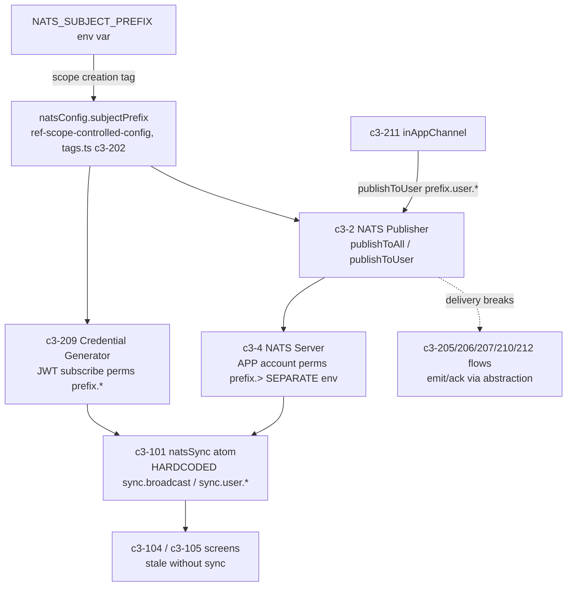

# What is affected if `NATS_SUBJECT_PREFIX` changes away from `sync`?

## Evidence Commands

```bash
c3 search "NATS_SUBJECT_PREFIX config subject prefix sync"
c3 read ref-scope-controlled-config --full        # config mechanism
c3 read ref-sync --full                           # domain contract it feeds
c3 graph ref-scope-controlled-config --direction reverse
c3 graph ref-sync --direction reverse
c3 read c3-209 --full                             # NATS Credential Generator
c3 read c3-101 --full                             # State Management (frontend)
c3 read c3-211 --full                             # Notification System
c3 read c3-4 --full                               # NATS Server (external)
c3 read ref-nats-jwt-auth --full
c3 read c3-202 --full; c3 read c3-203 --full; c3 read c3-204 --full   # other config-ref citers
c3 read recipe-realtime-sync --full
c3 read c3-104 --full; c3 read c3-105 --full      # screens citing ref-sync
c3 read c3-2 --full                               # backend container (NATS Publisher wiring)
c3 read adr-20260112-nats-auth-callout / adr-20260112-nats-websocket-sync / adr-20260126-user-notification-ui   # status check
c3 lookup '**/natsPublisher*' / '**/natsSync*' / '**/natsCredential*' / '**/tags.ts'   # codemap (all empty)
```

## Answer

### The mechanism (causal chain)

1. **Config injection (ref-scope-controlled-config):** `NATS_SUBJECT_PREFIX` is read from env exactly once, at scope creation, and injected as the tag `natsConfig.subjectPrefix` (`createScope({ tags: [natsConfig.subjectPrefix(env.NATS_SUBJECT_PREFIX), ...] })`). Nothing closure-captures the env var; all server-side consumers resolve the tag from scope. The tag itself is defined in `tags.ts` (c3-202, "Configuration Tags": natsConfig = wsUrl, accountSeed, subjectPrefix).
2. **Domain contract (ref-sync, "Subject Prefix Contract" + "NATS Subjects"):** server-side subjects are prefix-driven — `{prefix}.broadcast` (deltas + acks via `publisher.publishToAll()`) and `{prefix}.user.{escaped_email}` (per-user notifications via `publisher.publishToUser()`). Default prefix is `sync`. The ref states explicitly: *"If prefix changes from `sync`, frontend subscription wiring must change in lockstep."*
3. **Credential coupling (c3-209):** the NATS Credential Generator consumes the `natsConfig.subjectPrefix` tag and bakes subscribe-only permissions `{prefix}.broadcast`, `{prefix}.user.{escaped_email}` into every per-session client JWT (1h TTL, no publish rights).
4. **Broker coupling (c3-4):** the NATS server's APP account JWT must carry `pub/sub ["{prefix}.>"]` (doc shows `# default prefix: sync`). These permissions live in `APP_ACCOUNT_JWT` — broker-side env, not application env.
5. **Frontend coupling (c3-101):** the `natsSync` atom subscribes to **hardcoded** `sync.broadcast` and `sync.user.<email>`. Its doc states: *"The current frontend atom subscribes to `sync.*` directly; if prefix changes, frontend subscription wiring must be updated to match."* The frontend does **not** read `NATS_SUBJECT_PREFIX`.

### Blast radius — reverse graphs

Reverse graph of the config mechanism (`c3 graph ref-scope-controlled-config --direction reverse`): **c3-202, c3-203, c3-204, c3-209, c3-211, recipe-backend-foundations**.

Reverse graph of the domain contract (`c3 graph ref-sync --direction reverse`): **c3-101, c3-205, c3-206, c3-207, c3-210, c3-212, adr-20260112-nats-auth-callout, adr-20260112-nats-websocket-sync, recipe-approval-workflow, recipe-realtime-sync**. The ref-sync body's "Cited By" additionally lists **c3-104, c3-105, c3-209, c3-211** (graph and body disagree slightly — see Caveats).

Reverse-graph neighbors are candidates, not conclusions. After reading each:



### Direct consumers (read before assigning behavior)

| Entity | What it does with the prefix | Effect of change |
|--------|------------------------------|------------------|
| c3-209 NATS Credential Generator | Resolves `natsConfig.subjectPrefix` tag; embeds `{prefix}.broadcast` + `{prefix}.user.{escaped_email}` subscribe permissions in per-session client JWTs | Follows the env automatically for **new** sessions; JWTs already issued (TTL up to 1h) still carry old-prefix permissions and cannot subscribe to new subjects |
| c3-2 backend NATS Publisher (per ref-sync subjects table; c3-2 wiring "NATS Publisher → c3-4, Broadcast sync events") | Publishes deltas/acks to `{prefix}.broadcast`, notifications to `{prefix}.user.*` | Follows the env automatically — starts publishing on new-prefix subjects |
| c3-101 State Management (frontend) | `natsSync` atom subscribes to literal `sync.broadcast` / `sync.user.<email>` | **Breaks.** Does not read the env; must be edited in lockstep or it listens on dead subjects |
| c3-4 NATS Server (external) | APP account JWT permissions `pub/sub ["{prefix}.>"]`, baked into `APP_ACCOUNT_JWT` (separate broker env) | **Breaks at the broker** unless the account JWT is regenerated: backend publishes to `<new>.>` get denied, client JWTs naming `<new>.*` subjects exceed account grants |
| c3-202 Execution Context | Defines the `natsConfig.subjectPrefix` tag in `tags.ts` | Definition site only — no behavioral subject use; no code change needed |
| c3-211 Notification System | JetStream publish side uses `notifications.{type}.{escaped_email}` — **not** prefix-driven. But its `inAppChannel` delivers real-time via NATS publish to the user subject (`{prefix}.user.{escaped_email}` per ref-sync subjects table) | JetStream queue, dispatcher, log, email/slack channels unaffected; **real-time in-app delivery leg breaks** with the rest of sync |

### Transitive dependents (reached through the publisher/subscriber pair)

| Entity | Path | Effect |
|--------|------|--------|
| c3-205 PR Flows, c3-206 Invoice Flows, c3-207 Payment Flows, c3-210 Admin Flows, c3-212 Workbench Flows | call `sync.emit()` / `sync.ack()` through the publisher abstraction (ref-sync golden examples) | No code change; their mutations still commit, but deltas/acks never reach clients while prefix is mismatched |
| c3-101 executionTracker / `result.wait()` | resolves on NATS message with matching `executionId` | Every `wait()` falls back to the 2s timeout (ref-sync: timeout fallback prevents permanent hangs) — sluggish UI, no hard error |
| c3-104 InvoiceScreen, c3-105 PaymentRequestsScreen | "Real-time updates via NATS sync" via the atoms (both docs' Data Flow sections) | Show stale data until manual reload; SSR loader data still correct on refresh |
| Not affected: c3-203 Middleware Stack, c3-204 Drizzle ORM | cite ref-scope-controlled-config for other tags (logging, pgConfig) | Read both docs: zero mention of subjectPrefix — config-ref citation alone is not blast radius |

### Failure boundary

If you change only the env var:

- **DB writes and HTTP responses keep working** — flows commit, `/act` returns `{ success, executionId }`. The break is delivery-only.
- **Server publishes to `<new>.broadcast`** — and may be denied by the broker if `APP_ACCOUNT_JWT` perms are still `sync.>` (c3-4 Required Permissions). NATS pub to an unauthorized/unsubscribed subject surfaces no app-level error.
- **Clients keep subscribing to `sync.*`** (hardcoded in c3-101) — receive nothing. Every `result.wait()` resolves via the 2s timeout; UIs (c3-104/c3-105) go stale silently.
- **In-app real-time notifications stop arriving** (c3-211 inAppChannel publishes to the user subject), while the durable JetStream `NOTIFICATIONS` stream, dispatch log, email and Slack channels continue — notification_log can show `sent` while no browser ever saw the message.
- **Stale credentials linger up to 1h** (c3-209: JWT TTL default 1 hour) — even after fixing the frontend, sessions holding old JWTs are denied on new-prefix subjects until reconnect/reload.
- **Who observes it:** no one directly — degradation is silent (timeout fallback by design). Detection is sluggish mutations + stale lists.

### Lockstep change set

1. `NATS_SUBJECT_PREFIX` env on the backend (picked up at scope creation only — restart required; ref-scope-controlled-config: env read once).
2. Frontend `natsSync` subscription wiring in c3-101 (hardcoded `sync.broadcast` / `sync.user.<email>`).
3. Broker-side `APP_ACCOUNT_JWT` permissions (`{prefix}.>` pub/sub) — c3-4; regenerate per ref-nats-jwt-auth nkey/JWT procedure.
4. No code change in c3-209 or the publisher — tag-driven — but force client credential/session refresh so new JWTs carry new-prefix permissions.
5. Update docs that pin the literal default: ref-sync "Subject Prefix Contract", c3-101, c3-209 Configuration table, c3-4.

### Verification

| Check | How |
|-------|-----|
| Frontend wiring updated | grep client code for hardcoded `sync.broadcast` / `sync.user.` (natsSync atom per c3-101); must reference the new prefix or a shared config |
| Broker account permissions | confirm regenerated `APP_ACCOUNT_JWT` carries `pub/sub ["<new>.>"]` (c3-4 Required Permissions); broker health at `http://nats-server:8222/healthz` |
| Client JWT permissions | generate a session credential (c3-209 `generate(email, ttl)`) and decode: subscribe list must read `<new>.broadcast`, `<new>.user.{escaped_email}` |
| End-to-end sync observable | perform a mutation (e.g. approve PR); assert a `DeltaMessage` on `<new>.broadcast` and that `result.wait()` resolves well under the 2s timeout (not via fallback) |
| In-app notification observable | trigger an approval notification; assert `NotificationMessage` on `<new>.user.<escaped_email>` and bell-icon update |
| Failure-mode probe | change server prefix only (leave frontend): expect silent staleness — `wait()` resolves at exactly ~2s timeout, lists stale until reload, notification_log still `sent`. Confirms the degradation is the silent one described above |

## Grounding

| Claim | Source |
|-------|--------|
| Env read once at scope creation, injected as `natsConfig.subjectPrefix` tag; no closure capture | `c3 read ref-scope-controlled-config --full` — Choice, Scope Creation, Conventions |
| Tag defined in `tags.ts`, natsConfig group (wsUrl, accountSeed, subjectPrefix) | `c3 read c3-202 --full` — Configuration Tags table |
| Subjects `{prefix}.broadcast` / `{prefix}.user.{escaped_email}`, default `sync`, publishToAll/publishToUser; "frontend subscription wiring must change in lockstep" | `c3 read ref-sync --full` — NATS Subjects + Subject Prefix Contract |
| Config-ref citers list (c3-202/203/204/209/211, recipe-backend-foundations) | `c3 graph ref-scope-controlled-config --direction reverse` |
| Sync-ref dependents list (c3-101, c3-205/206/207/210/212, 2 ADRs, 2 recipes) | `c3 graph ref-sync --direction reverse` |
| c3-209 consumes subjectPrefix tag, JWT subscribe perms `{prefix}.broadcast` + `{prefix}.user.{escaped_email}`, 1h TTL, no publish | `c3 read c3-209 --full` — Dependencies, Permission Model, Configuration, Security |
| Frontend hardcodes `sync.broadcast` / `sync.user.<email>`; "must be updated to match" | `c3 read c3-101 --full` — NATS Sync Wiring |
| `wait()` 2s timeout fallback; executionId string correlation | `c3 read ref-sync --full` (Execution ID Contract) and `c3 read c3-101 --full` |
| APP account perms `pub/sub ["{prefix}.>"]` default sync, in `APP_ACCOUNT_JWT`; browser read-only; healthz check | `c3 read c3-4 --full` — Required Permissions, Permission Model, Health Check |
| c3-211 JetStream subjects `notifications.{type}.{escaped_email}` (not prefix-driven); inAppChannel = NATS real-time + JetStream persistence; email/slack channels | `c3 read c3-211 --full` — notificationPublisher, Built-in Channels |
| Notifications durable vs sync ephemeral; architecturally separate | `c3 read recipe-realtime-sync --full` — Narrative, Risk |
| Flows emit via sync.emit/ack abstraction (no direct subject strings) | `c3 read ref-sync --full` — Golden Examples (service emit, flow ack) |
| c3-104/c3-105 consume sync via atoms ("Real-time updates via NATS sync") | `c3 read c3-104 --full`, `c3 read c3-105 --full` — Data Flow |
| c3-203/c3-204 not affected (no subjectPrefix usage) | `c3 read c3-203 --full`, `c3 read c3-204 --full` — full-body grep for prefix found nothing |
| JWT regeneration procedure, resolver config in `infra/nats.conf`, client `natsSync.ts` connect | `c3 read ref-nats-jwt-auth --full` |
| ADR statuses (all three `implemented` → historical) | `c3 read adr-20260112-nats-auth-callout` / `adr-20260112-nats-websocket-sync` / `adr-20260126-user-notification-ui` frontmatter |
| Backend "NATS Publisher → c3-4, Broadcast sync events" wiring | `c3 read c3-2 --full` — Wiring + Entry Points |

## Caveats

- **Graph/body citation drift on ref-sync:** the reverse graph lists c3-210 (Admin Flows) but not c3-104/c3-105/c3-209/c3-211, while the ref-sync body's "Cited By" lists c3-104/c3-105/c3-209/c3-211 but not c3-210. Both sources were used; the union is reported above. This is an observed doc/graph inconsistency in the fixture, worth an audit.
- **No codemap bindings:** `c3 lookup '**/natsPublisher*'`, `'**/natsSync*'`, `'**/natsCredential*'`, `'**/tags.ts'` all returned empty file maps. File-path claims (`tags.ts`, `natsSync.ts`, `infra/nats.conf`, `server.tsx` serverConfig atom) come from doc bodies (c3-202, ref-nats-jwt-auth, ref-scope-controlled-config "Cited By"), not from verified codemap entries — confirm against source before editing.
- **Broker permission denial behavior is inferred from docs, not exercised:** c3-4 documents that APP-account perms are `{prefix}.>` and that NATS enforces pub/sub permissions from JWTs; the docs do not state what error (if any) the backend logs when a publish is denied. The "silent at app layer" claim for the client side is doc-backed (2s timeout fallback in ref-sync/c3-101); the server-side publish-denial observability is a documented-permissions inference.
- **ADRs cited are historical** (all `status: implemented`): adr-20260112-nats-websocket-sync, adr-20260112-nats-auth-callout, adr-20260126-user-notification-ui. Current mechanism is taken from ref-sync / component docs, not from the ADRs.
- No `rule-*` entities surfaced for the sync/prefix area in any search or graph output — governance here is via refs (ref-sync, ref-scope-controlled-config, ref-nats-jwt-auth) only.
