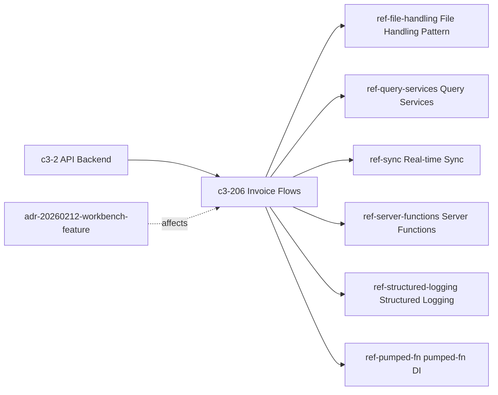

# PROPERTY-FILE-IDEMPOTENCY-1 — Invoice ZIP import with duplicates and parse failures: what keeps import/file state coherent?

## Evidence Commands

```bash
c3() { C3X_MODE=agent bash skills/c3/bin/c3x.sh --c3-dir research/eval/skill-eval/fixtures/acountee/.c3 "$@"; }

c3 search "invoice ZIP import duplicates parse failures import file state coherence"
c3 read c3-206 --full              # Invoice Flows (importFiles owner)
c3 read ref-file-handling --full   # File Handling Pattern (storage + dedup + tri-state)
c3 read c3-104 --full              # InvoiceScreen (UI action owner)
c3 read ref-sync --full            # Real-time Sync Pattern (delta/ack boundary)
c3 read ref-query-services --full  # Query Services Pattern (transactionTag)
c3 graph c3-206 --depth 1 --format mermaid
c3 search "audit log of invoice import mutations transaction boundary"
c3 read c3-2                       # API Backend container
c3 read ref-audit-trail --full     # Audit Trail Pattern (log_change trigger)
c3 read c3-202 --full              # Execution Context (transactionTag lifecycle)
c3 read ref-form-patterns --full   # Form Patterns (import dialog conventions)
c3 lookup 'src/server/**'          # returned no files — fixture is docs-only
```

## Answer

**Layer:** c3-206 (Invoice Flows), governed by ref-file-handling, with c3-104 (InvoiceScreen) as action owner and ref-sync / ref-audit-trail / ref-query-services as the sync/audit/database boundaries.

### Causal chain

**1. Action owner — c3-104 InvoiceScreen.** Users upload XML/ZIP via a drag-and-drop import dialog (Ctrl+I); files are "parsed server-side via `importFiles`", one of the seven server functions in `@/server/functions/invoice` (c3-104, "What Users Can Do" + "Key Wiring"). The screen carries no import semantics itself — coherence lives server-side.

**2. Mutation owner — c3-206 `importFiles`.** Its documented Import Flow (c3-206, "Import Flow") is per-file, per-entry:

1. Store each uploaded file via `fileStorage.store` (skip if duplicate file)
2. Retrieve stored file, detect type (XML or ZIP)
3. XML: parse invoice, compute MD5 hash, check for duplicate hash in DB, insert invoice + line-item services
4. ZIP: extract entries, process each XML entry individually (same parse/hash/insert logic)
5. Deduplication uses MD5 of raw XML content against `invoiceQueries.countInvoiceByHashValue`

**3. Deduplication is two-layered — this is the idempotency mechanism.**
- **File level** (ref-file-handling): content is MD5-hashed; the `files` table has `storing_name TEXT UNIQUE`; "Duplicate upload → Hash collision detected, skip" (Edge Cases table). The store result is a tri-state `OperationResult`: `success | failure | skipped` — "tri-state result avoids exceptions for expected conditions like duplicates."
- **Invoice level** (c3-206): each parsed invoice's raw-XML MD5 is checked against `invoiceQueries.countInvoiceByHashValue` before insert. So re-importing the same ZIP (or a ZIP overlapping a previous import) skips already-inserted invoices instead of duplicating them — dedup "without caller awareness" (ref-file-handling, "Why").

**4. Result taxonomy — partial success is explicit, not exceptional.** Per c3-206: "Import results per file: `success` (inserted), `skipped` (duplicate hash), or `failure` (parse/insert error). ZIP imports can produce `partial` state when some entries succeed and others fail." This is the partial-success contract: each ZIP entry is an independent unit of work; a parse failure on entry N does not roll back entries 1..N-1, and a duplicate is reported as `skipped`, not an error.

**5. Database boundary — per-entry consistency, transactional file storage.**
- Files are stored as BYTEA in PostgreSQL, which "keeps files transactional with the rest of the data (no external object store to sync)" (ref-file-handling, "Why") — file bytes and invoice rows live in the same database, so there is no cross-store coherence problem.
- Query services (ref-query-services) seek `transactionTag` and use `executor = tx ?? db` — inserts join an open transaction when middleware set one (c3-202 Lifecycle: "Transaction middleware sets transactionTag within db.transaction()"), else run directly.
- The documented `partial` ZIP state proves the batch is **not** all-or-nothing: consistency is per committed entry (invoice + its services), never whole-ZIP atomicity.

**6. Audit boundary — trigger-based, fires only on real writes.** ref-audit-trail: `log_change()` DB triggers fire on `invoices`, `pr`, and `invoice_services` with raw SQL action names (`INSERT`/`UPDATE`/`DELETE`), writing before/after snapshots to the `audit` table; actor attribution comes from `app.current_user` set inside `executeInDrizzleTransaction`. Anti-pattern rule: trigger-covered tables must NOT also call `createAuditEntry` (would duplicate). Consequence for this question: every successfully inserted invoice/service row is audited automatically and atomically with its insert; `skipped` duplicates and `failure` entries produce **no DB write, hence no audit row** — the audit trail records exactly what was committed, which is what keeps audit state coherent with import state.

**7. Sync boundary — deltas only for real writes, ack regardless.** ref-sync: "services emit deltas" after the DB write (`sync.emit({ entity: 'invoice', type: 'add', ... }, executionId)`), and the flow calls `sync.ack(executionId)` after all service work. c3-206 lists `importFiles` with side effect `sync`. Skipped/failed entries write nothing, so no delta is emitted for them (anti-pattern: "Emit a delta without data on add/update — sync.emit silently drops the message"); clients receive `add` change-sets only for inserted invoices and apply them via `applyDelta` (delete → update → add, full-record replacement). The originating client's `result.wait()` resolves on ack — including after a `partial` import.

**Emergent property:** import is **idempotent by content hash at two independent layers** (file bytes, invoice XML), **partial-success by design** (per-entry result taxonomy with explicit `skipped`/`failure`/`partial` states instead of batch rollback), and the **audit log and client caches converge on exactly the committed subset** because both the `log_change()` trigger and `sync.emit` are keyed to actual DB writes.

**Failure boundary:**
- A parse failure marks only that entry `failure`; sibling entries already inserted stay inserted (`partial`) — no documented compensation/rollback of siblings.
- If the NATS leg fails or is bypassed, DB and audit state are already committed; the client's `wait()` is "a UX optimization, not correctness-critical; timeout fallback (2s) prevents permanent hangs" (ref-sync), and fresh state returns via the SSR loader → atoms path (c3-104 "Data Flow"). So sync failure degrades to stale-until-refetch, never to incoherent persisted state.
- If insert fails after `fileStorage.store` succeeded (store is step 1, parse is step 3), the file row persists while the invoice does not; on retry the file-level result is `skipped` and the invoice-level hash check is the guard that still allows the missing invoice to be inserted. Whether file-level skip short-circuits further processing is not documented (see Caveats).

### Graph

From `c3 graph c3-206 --depth 1` (agent mode rendered TOON; mermaid below is a faithful transcription of its nodes/edges):



Direct dependents/governors (read): ref-file-handling, ref-sync, ref-query-services. Transitive (reached via refs, read): c3-202 (transactionTag owner), ref-audit-trail (via audit search; governs c3-208/c3-210 explicitly, governs invoices via DB trigger). adr-20260212-workbench-feature appears in the graph as **historical context only** (it shaped workbench features); no ADR is cited here as a live mechanism.

### Concrete checks (if changing import behavior)

- Re-import the same XML twice: second result must be `skipped`; verify `invoiceQueries.countInvoiceByHashValue` returns >0 for that MD5.
- Import a ZIP with one malformed entry among good ones: result must be `partial`; good entries present in `invoices` + `invoice_services`, each with an `audit` row (`table_name='invoices'`, `action='INSERT'`); no audit row for the failed entry.
- Confirm `files.storing_name` UNIQUE constraint still holds and prefix contains no underscores (ref-file-handling reject rule).
- Assert NATS delivers `add` deltas only for inserted invoices and a single `ack` with the request's `executionId`; client `wait()` must resolve <2s on the happy path.
- If touching transactionality: verify whether `transactionTag` is set for `importFiles` (c3-202 middleware) — per-entry vs per-request transaction scope changes the partial-success contract.

## Grounding

| Material claim | Evidence source |
| --- | --- |
| UI owner: drag-and-drop dialog, Ctrl+I, server-side `importFiles` | `c3 read c3-104 --full` — "What Users Can Do", "Key Wiring", "Data Flow" |
| Import flow steps 1–5, per-entry ZIP processing | `c3 read c3-206 --full` — "Import Flow" |
| Per-file result taxonomy `success/skipped/failure`, ZIP `partial` | `c3 read c3-206 --full` — "Import Flow" closing paragraph |
| Invoice dedup = MD5 of raw XML vs `countInvoiceByHashValue` | `c3 read c3-206 --full` — "Import Flow" step 5; "Uses" table (invoiceQueries) |
| File dedup, tri-state `OperationResult`, `storing_name UNIQUE`, BYTEA-in-Postgres transactional rationale, duplicate→skip edge case | `c3 read ref-file-handling --full` — "Choice", "Why", "Result Types", "Database Schema", "Edge Cases" |
| Queries join open transaction via `transactionTag`, `executor = tx ?? db` | `c3 read ref-query-services --full` — "Pattern" |
| Transaction middleware sets `transactionTag` within `db.transaction()`; executionId/currentUser tags | `c3 read c3-202 --full` — "Tags", "Lifecycle" |
| `log_change()` trigger on `invoices`/`invoice_services`, atomic-with-mutation audit, no explicit audit on trigger-covered tables, `app.current_user` via `executeInDrizzleTransaction` | `c3 read ref-audit-trail --full` — "Why", "When to Audit", "DB trigger audit", "Anti-Patterns" |
| Services emit deltas after DB write; flows ack; emit-without-data dropped; `wait()` 2s timeout non-correctness-critical; applyDelta order | `c3 read ref-sync --full` — "Architecture", "Golden Examples", "Anti-patterns", "Execution ID Contract" |
| `importFiles` has `sync` side effect | `c3 read c3-206 --full` — "Operations" table |
| c3-206 membership/graph neighbors; ADR affects edge | `c3 graph c3-206 --depth 1` output |
| Candidate discovery (c3-206, ref-file-handling, c3-104 ranked) | `c3 search "invoice ZIP import duplicates..."` output |
| Audit/transaction candidates (ref-audit-trail, c3-202, recipe-audit-and-compliance) | `c3 search "audit log of invoice import mutations transaction boundary"` output |
| No source files mapped for server code | `c3 lookup 'src/server/**'` — returned empty `files:`; fixture directory contains only C3 docs (README, adr, c3-*, refs, recipes, code-map.yaml) |

## Caveats

- **No code verification possible.** `c3 lookup 'src/server/**'` returned no files and the fixture contains no source tree — every claim above is doc-derived (c3-206, refs); none is confirmed against running code.
- **Transaction scope of `importFiles` is not documented.** c3-202 says transaction middleware sets `transactionTag` "within db.transaction()" and ref-query-services falls back to direct `db` when no tag is set, but no read states whether `importFiles` runs per-entry, per-file, or per-request transactions. The documented `partial` ZIP state only proves the whole batch is not atomic. This is an explicit gap, not a guess.
- **Behavior after a file-level `skipped` is underspecified.** c3-206 step 1 says "skip if duplicate file" but does not state whether parsing continues for a duplicate file (relevant when a prior import stored the file but its invoice insert failed). The invoice-level hash check is documented; the short-circuit behavior is not.
- **No `rule-*` entities surfaced** in either search output for import/file handling — governance here is via refs (ref-file-handling, ref-sync, ref-query-services, ref-audit-trail) only.
- **Audit-on-import is inferred from trigger coverage**, not from an importFiles-specific doc: ref-audit-trail documents `log_change()` on `invoices`/`invoice_services` generally; no read shows an import-specific audit statement. The inference (insert → trigger → audit row) follows directly from the trigger contract.
- **adr-20260212-workbench-feature** (graph "affects" edge) is cited as historical context only; it was not read in full and nothing in this answer relies on it as a live mechanism.
