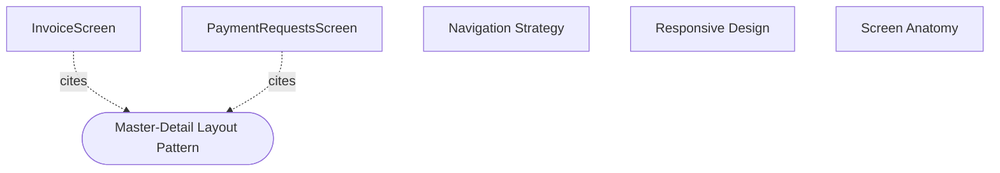

# UI-1: How should invoice and payment request screens stay consistent across detail and list layouts?

## Evidence Commands

```bash
c3() { C3X_MODE=agent bash skills/c3/bin/c3x.sh --c3-dir research/eval/skill-eval/fixtures/acountee/.c3 "$@"; }

c3 search "invoice and payment request screens consistency detail and list layouts"
c3 read recipe-screen-anatomy --full
c3 read ref-master-detail-layout --full
c3 read ref-detail-content-strategy --full
c3 read ref-list-view-patterns --full
c3 read ref-filter-footer --full
c3 read c3-104 --full
c3 read c3-105 --full
c3 read ref-responsive-layout --full
c3 graph ref-master-detail-layout --direction reverse --format mermaid   # ran once in agent TOON, once plain for mermaid text
c3 read ref-sft-behavioral-spec --full
c3 read ref-variant-system --full
c3 read ref-ui-patterns --full
c3 read adr-20260226-ui-pattern-review-gap-closure   # status check
c3 read adr-20260211-responsive-admin-layout          # status check
```

## Answer

**Layer:** c3-104 (InvoiceScreen) + c3-105 (PaymentRequestsScreen), both in c3-1 (Web Frontend)

Both screens are the system's two **Master-Detail archetype** feature screens (recipe-screen-anatomy Screen Inventory: Invoices `/invoices` and Payment Requests `/prs`,`/approvals`, both archetype "Master-Detail", docs c3-104/c3-105). Consistency is not a screen-level discipline — it is delegated to a stack of shared refs, and both component docs cite the **identical ten-ref set** (`uses:` lists on c3-104 and c3-105 are the same: ref-master-detail-layout, ref-list-view-patterns, ref-filter-footer, ref-detail-content-strategy, ref-responsive-layout, ref-ui-patterns, ref-variant-system, ref-form-patterns, ref-audit-timeline, ref-sft-behavioral-spec). Each ref owns a concrete slice of the layout; a screen stays consistent by composing the slices, never by re-implementing them.

### Pattern semantics — which ref owns which concrete behavior

**1. ref-master-detail-layout — owns the regions and responsive skeleton.**
One `MasterDetailLayout` component with **named slots** (`listHeader`, `listContent`, optional `listFooter`, `emptyState`, `detailContent`) — type-safe structure, so both screens are forced into the same zones. It owns:
- Three-tier responsive behavior: desktop ≥1024px side-by-side with list `lg:w-80` (320px), tablet 768–1023px list `md:w-64` (256px), mobile <768px stacked with a slide transition (`translate-x + opacity, 150ms ease-out`).
- Mobile back navigation via an internal `MobileBackContext`: `DetailHeader` reads `{ onBack, isMobile }` from context and renders the `IconChevronLeft` button. "Screens never interact with this context directly."
- Exported sub-components (`ListHeader`, `ListItem`, `EmptyState` with `empty-page*` classes, `DetailHeader` min-h-[50px]/border-b/p-3, `DetailContent` flex-1 overflow-auto, `DetailFooter` with `footer-bar footer-bar-detail`).
- For tabbed screens (both of these), `DetailHeader` holds the `TabsList` and **no entity identity content** — identity lives in the facet grid inside the main tab.

**2. ref-list-view-patterns — owns the list pane behavior.**
Both feature screens use `@tanstack/react-virtual` with a custom `rangeExtractor` for **sticky group headers**: month groups on InvoiceScreen, status groups on the PR grouped view. Group headers show label left / count badge right; PR group headers carry a color-coded `border-l-[3px]`. PaymentRequestsScreen has two list modes (`list` flat vs `grouped` sticky-header), toggled via `viewMode` in filter state. The ref's decision tree also fixes *why* both screens are Master-Detail: rich detail content → Master-Detail; "Screens using it: InvoiceScreen, PaymentRequestsScreen, …".

**3. ref-filter-footer — owns filtering chrome.**
The `FilterFooter` compound component (Root/Panel/Bar/Stats/Toggle/StatsToggle/CompactCount/Actions) puts filters in a **slide-up panel from the list footer bar** (max-h 50vh), not header or sidebar — preserving list viewport height. Behavior contract: ESC/click-outside closes; active-filter count badge on the toggle; `CompactCount` shows filtered vs total. Its "Applies To" is exactly these two screens (invoice filters: status/date/search/archived; PR filters: statuses/sort/view mode/amount range/date range/creator).

**4. ref-detail-content-strategy — owns the detail pane content grammar.**
Feature screens use the `detail-*` class family (labels 0.625rem) — never the `admin-detail-*` family (0.6875rem); "Pick based on screen context, never mix in the same view." Two primitives with a hard rule: **facet grid** (`detail-meta-grid`, label *above* value, 2-column at 640px+, even children get `padding-left: 1.5rem`) for 2–4 top-level summary fields; **BIG grid** (`big-grid big-grid-2col`, label *beside* value) for inline key-value pairs like bank details. "**Never** use facet grid for inline label-value pairs. **Never** use BIG grid for top-level summary fields." It also fixes the **section order 1–6** (facet strip → workflow state → parties → structured details → collections → files; omit empty sections), alignment rules (currency `font-mono`, left in facet/key-value, right in table columns; "Values take natural width only. Never `width: 100%`"), empty-state treatment (muted plain text, never bordered/dashed boxes; list-level uses `EmptyState`/`empty-page`), and the tab strategy (Main, "Services" + count badge, Audit). Its Golden Example is literally a PR detail view; the two-column parties example (`detail-columns`) is the Invoice screen's From/To supplier-buyer block.

**5. ref-responsive-layout — single source of truth for breakpoints.**
Mobile <768px / tablet 768–1023px / desktop ≥1024px, mobile-first `min-width` prefixes only; `useIsMobile()` uses 768px. ref-master-detail-layout explicitly defers to it ("See ref-responsive-layout for breakpoint definitions"), so both screens inherit the same tiers from one place.

**6. ref-variant-system + ref-ui-patterns — owns the shared visual vocabulary.**
`listItem()` tv() variant styles list rows in MasterDetailLayout (props `selected`, `status: none/inprogress/imported/completed/obselete` — the `obselete` spelling is a documented consistent typo: "Do not 'fix' it — it would break class matching"). Status badges map by meaning via `getStatusBadgeVariant` (approved→success, pending→warning, obsolete→destructive); VND currency via `Intl.NumberFormat('vi-VN')` in `font-mono`. Tabs are the shared Radix `Tabs` in the "detail pane" context: `TabsList` inside `DetailHeader` with `border-b-0` (header already provides the border), `DetailContent` with `pt-0`, count badges inline in `TabsTrigger`. PaymentRequestsScreen additionally standardizes all destructive confirmations on `ConfirmDrawer`.

### Causal chain

ref-responsive-layout (breakpoints) → ref-master-detail-layout (regions + responsive skeleton, consumes those breakpoints) → ref-list-view-patterns + ref-filter-footer (fill the list-side slots: virtualized grouped list, footer filter panel) and ref-detail-content-strategy + ref-ui-patterns (fill `detailContent`: section grammar, tabs in DetailHeader) → ref-variant-system (every interactive element inside any slot styled by `tv()` variants). Each arrow is carried by an explicit citation: the named-slot API carries list/detail content into the layout; the `detail-*` CSS class API carries the content grammar; the `listItem()` variant carries row styling.

**Graph** (reverse citations of the layout keystone):



Both screens are **direct** dependents (each cites the ref in its `uses:` list and was read to confirm it composes MasterDetailLayout + FilterFooter in "Key Wiring"). The three recipes are documentation sources, not consumers.

### What visibly breaks if a pattern changes

- **Slot/skeleton change (ref-master-detail-layout):** both screens shift at once — they are the only component citers in the reverse graph. Changing list widths (`lg:w-80`/`md:w-64`) re-proportions both screens' panes; removing/renaming a named slot is a type error in both; touching `MobileBackContext` silently removes the mobile back chevron on *both* detail panes, since neither screen wires mobile nav itself.
- **Breakpoint change (ref-responsive-layout):** moving the 768px line changes when both screens collapse to stacked-slide mode *and* desynchronizes `useIsMobile()` consumers if changed in only one place.
- **Detail grammar change (ref-detail-content-strategy):** renaming `detail-*` classes or altering the even-child `padding-left: 1.5rem` breaks the 2-column alignment of both facet strips; mixing facet and BIG primitives breaks the label-above vs label-beside scanning rhythm the ref calls "finance-ledger feel"; violating section order makes PR and Invoice detail panes read differently for the same kind of data.
- **List/filter change (ref-list-view-patterns / ref-filter-footer):** dropping the custom `rangeExtractor` loses sticky month/status headers on both lists; moving filters out of the footer shrinks the list viewport, the explicit reason the footer placement exists.
- **Variant change (ref-variant-system):** correcting the `obselete` typo breaks CSS class matching — selected-row status border coloring stops rendering; that failure mode is documented in the ref itself.

### How consistency is verified

1. **SFT behavioral spec (ref-sft-behavioral-spec, cited by both screens; `scope: c3-104,c3-105,…`):** both screens are registered with the `master-detail` archetype tag (PaymentRequests additionally `dual-mode`); `sft validate` catches spec drift (orphaned events, missing handlers), `sft impact <screen|region>` shows affected screens/flows before a change, and all screens/regions are bound to their real React components. New screens MUST be added to SFT.
2. **Compliance snapshot:** ref-ui-patterns carries a "Current Compliance Snapshot (2026-03-04)" PASS table (alerts, search input, tabs, confirmation dialogs) — produced by auditing refs against implemented screens under adr-20260226-ui-pattern-review-gap-closure (**status: implemented — historical**; its decision "update refs to reflect current FE behavior" is now embodied in the live refs).
3. **Graph-driven cascade review:** every ref read emits the help hint "c3x graph <ref> --format mermaid: show all citing components before changing shared constraint" + "cascade review: check every citing component for compliance drift" — i.e., a change to any shared ref is verified by walking its reverse graph (here: exactly c3-104 and c3-105).
4. **Component-level change safety:** both c3-104 and c3-105 carry identical Change Safety tables — contract drift detected by comparing Goal/Parent Fit/Contract, governance drift by re-reading Governance rows; required verification is `c3x check` plus targeted lookup/tests.

### Concrete checks when changing either screen's layout

- Confirm the change lives in the owning ref, not in screen code: layout regions → ref-master-detail-layout; list grouping/virtualization → ref-list-view-patterns; filter chrome → ref-filter-footer; detail sections → ref-detail-content-strategy.
- Run `c3 graph <ref> --direction reverse` and review both c3-104 and c3-105 for compliance drift; run `c3 check` after doc mutation.
- Run `sft validate` and `sft impact` for behavioral drift on the affected screen/regions.
- Assert visually: facet grid 2-col at 640px+ with even-item indent; sticky group header (month on Invoices, status on PR grouped mode); filter panel slides from footer and ESC-closes on both screens; mobile back chevron appears in `DetailHeader` below 768px on both.

## Grounding

| Material claim | Source output |
| --- | --- |
| Both screens are Master-Detail archetype, routes, doc IDs | `c3 read recipe-screen-anatomy --full` (Screen Inventory + Archetypes tables) |
| Identical ten-ref `uses:` set on both screens | `c3 read c3-104 --full`, `c3 read c3-105 --full` (frontmatter `uses:`); confirmed in `c3 graph ref-master-detail-layout --direction reverse` node payloads |
| Named slots, 320px/256px/stacked tiers, 150ms slide, MobileBackContext, DetailHeader holds TabsList not identity, sub-components | `c3 read ref-master-detail-layout --full` (Choice, Behavior, Exported Sub-components, Detail Header, Mobile Back Navigation) |
| Virtualized lists, sticky month/status group headers, rangeExtractor, PR list/grouped viewMode, border-l-[3px] | `c3 read ref-list-view-patterns --full` (Virtualized List section) |
| FilterFooter slide-up panel, ESC/click-outside, CompactCount, applies to exactly these two screens with their filter sets | `c3 read ref-filter-footer --full` (Behavior, Applies To) |
| detail-* vs admin-detail-* never mixed, facet vs BIG never-rules, section order 1–6, alignment + empty-state rules, PR golden example, Invoice parties example | `c3 read ref-detail-content-strategy --full` |
| Breakpoints 768/1024, useIsMobile(), MasterDetailLayout per-tier table, single source of truth | `c3 read ref-responsive-layout --full` |
| listItem variant, `obselete` typo do-not-fix warning, badge mapping, tv() centralization | `c3 read ref-variant-system --full` |
| Radix Tabs detail-pane context (border-b-0, pt-0), compliance snapshot PASS table, ConfirmDrawer on PR screen | `c3 read ref-ui-patterns --full` |
| Only c3-104/c3-105 cite ref-master-detail-layout among components | `c3 graph ref-master-detail-layout --direction reverse --format mermaid` |
| SFT archetype tags, sft validate/impact, component bindings, "new screens MUST be added" | `c3 read ref-sft-behavioral-spec --full` (Current inventory, Why, Scope) |
| Screens compose MasterDetailLayout + FilterFooter; Invoice month-grouped list, PR dual mode + usePaymentRequestFilters | `c3 read c3-104 --full`, `c3 read c3-105 --full` (Layout, Key Wiring, Dual Mode sections) |
| ADR statuses (both `implemented`) | `c3 read adr-20260226-ui-pattern-review-gap-closure`, `c3 read adr-20260211-responsive-admin-layout` (frontmatter `status`) |

## Caveats

- **Applies To vs graph divergence:** ref-master-detail-layout's "Applies To" lists UserManagementScreen, TeamManagementScreen, ApprovalConfigScreen in addition to the two feature screens, but the reverse graph shows only c3-104 and c3-105 as citing components — admin screens are documented under c3-107 and do not cite the ref directly. A cascade review keyed only on the citation graph would miss them.
- **Governance table thinness:** both c3-104 and c3-105 Governance sections list only ref-audit-timeline, with the note "Migrated from legacy component form; refine during next component touch" — the full ten-ref governance lives in `uses:` frontmatter, not in the Governance table (from the `c3 read c3-104/c3-105 --full` outputs).
- **SFT binding gap:** ref-sft-behavioral-spec Known Issues states FilterFooter "is ambiguous (2 instances) — component binding blocked" by lagz0ne/sft#1, so the shared filter region is not component-bound in the behavioral spec for either screen.
- **ADRs are historical:** adr-20260211-responsive-admin-layout and adr-20260226-ui-pattern-review-gap-closure are both `status: implemented` (terminal); the live mechanisms are the refs above, not the ADR texts.
- No `rule-*` entities surfaced for these screens in the search output; governance here is ref-based (search results contained refs, recipes, components, and ADRs only).
