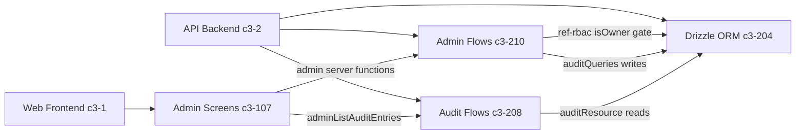

# ADMIN-1 — What owns administrator features for users, teams, audit, and approval configuration?

## Evidence Commands

```bash
c3() { C3X_MODE=agent bash skills/c3/bin/c3x.sh --c3-dir research/eval/skill-eval/fixtures/acountee/.c3 "$@"; }

c3 search "administrator features users teams audit approval configuration admin"
c3 read c3-107 --full
c3 read c3-210 --full
c3 read c3-208 --full
c3 read c3-1
c3 read c3-2
c3 read ref-rbac
c3 read adr-20260121-admin-management-features
c3 read adr-20260123-admin-features-docs
c3 graph c3-107 --format mermaid
c3 graph c3-210 --format mermaid
c3 lookup 'src/server/functions/admin*'   # returned no files
c3 lookup 'src/screens/admin/**'          # returned no files
```

## Answer

**Layer:** ownership splits across two feature components plus one audit-query component, one per side of the c3-1 / c3-2 container boundary.

### Owners

| Concern | UI owner | Backend owner |
| --- | --- | --- |
| Users (CRUD, role assignment, ownership transfer) | c3-107 (Admin Screens, parent c3-1) | c3-210 (Admin Flows, parent c3-2) |
| Teams (CRUD, member checks) | c3-107 | c3-210 |
| Roles (CRUD, assign/revoke) | c3-107 (role management inside UserManagementScreen) | c3-210 |
| Approval configuration (multi-step flows, anyof/allof, toggle active) | c3-107 (ApprovalConfigScreen) | c3-210 |
| Audit — querying (paginated list, history, export, stats) | c3-107 (AuditLogScreen) | c3-208 (Audit Flows, parent c3-2) |
| Audit — writing entries for admin mutations | — | c3-210 via `auditQueries` (team/role/approval mutations) |
| Persistence (tables `users`, `teams`, `roles`, `audit`, `approval*`) | — | c3-204 (Drizzle ORM, parent c3-2) |

- **c3-107 (Admin Screens)** — goal: "Admin management - users, teams, audit logs, notification logs, approval config, organization view" (c3-107 frontmatter `goal`). Its `## Screens` section enumerates UserManagementScreen, TeamManagementScreen, OrganizationScreen, ApprovalConfigScreen, AuditLogScreen, NotificationLogScreen with their actions (`adminCreateUser`, `adminUpdateApprovalFlow`, `adminListAuditEntries`, ...). All screens require owner role (c3-107 `## Business Purpose`).
- **c3-210 (Admin Flows)** — goal: "Admin management flows - teams, roles, users, approval configuration" (c3-210 frontmatter `goal`). Operation tables for Team / Role / User / Approval Config flows live in its `## Architecture Details`.
- **c3-208 (Audit Flows)** — goal: "Audit trail querying - history lookup, paginated list, export, statistics" (c3-208 frontmatter `goal`). Its `## Operations` table owns `listAuditEntries`, `getAuditHistory`, `exportAuditTrail`, `getAuditStats` — i.e. the backend behind c3-107's AuditLogScreen. Admin *audit UI* is c3-107; admin *audit query backend* is c3-208, not c3-210.

### Causal chain (action -> mutation -> mechanism -> observer)

1. **Action owner:** owner-role user acts in a c3-107 screen; screens call "admin server functions on mount and after mutations" against `@/server/functions/admin` (c3-107 `## Data Flow` and `## Key Wiring`). The server-function transport contract is ref-server-functions, cited by both c3-210 and c3-208 (`uses` lists).
2. **Authorization gate:** every admin flow extracts the user from `currentUserTag` -> checks `rbacQueries.isOwner` -> rejects `NOT_OWNER` (c3-210 `## Authorization`). The owner-check semantics come from ref-rbac: "Special `owner` role grants full admin access; checked via `rbacQueries.isOwner`" (ref-rbac `## Choice`).
3. **State mutation owner:** c3-210 flows mutate via query services (`teamQueries`, `userQueries`, `rbacQueries`, `approvalConfigQueries` — c3-210 `## Uses`), under ref-query-services, persisting into c3-204 tables (`users`, `teams`, `roles`, `approval`, `audit`, ... — c3-204 search-row table list).
4. **Side effect — audit write (attachment layer = flow layer):** c3-210's per-flow tables carry an explicit `Audit` column (e.g. createTeam -> "create on teams", updateApprovalFlow -> "update on approval_flows"), and its `## Uses` row says `auditQueries` provides "Explicit audit entries for team/role/approval mutations". Because the audit write is declared per-flow, a caller entering below the flow layer (direct query-service/DB call) is outside the documented audit guarantee — the c3-210 flow doc is the only place these writes are declared.
5. **Observer:** audit entries are read back through c3-208 (`listAuditEntries` with filters table_name/action/triggered_by/date — c3-208 `## Operations` and `## Filter Options`) and surfaced in c3-107's AuditLogScreen (action `adminListAuditEntries`, expandable before/after JSON diff — c3-107 `### AuditLogScreen`). Separately, RBAC mutations are logged to `security_events`, "an audit trail independent of the general audit system" (ref-rbac `## Choice` / `## Why`).

### Failure boundary

- Non-owner callers are rejected at the flow layer with `NOT_OWNER` before any mutation (c3-210 `## Authorization`); the UI additionally gates by owner role (c3-107 `## Data Flow`: "All operations gated by owner role check"), so backend enforcement holds even if the UI gate is bypassed.
- Domain guards fail closed at the flow layer: `TEAM_HAS_USERS` (deleteTeam), `ROLE_EXISTS` / `ROLE_HAS_USERS` / `CANNOT_MODIFY_OWNER_ROLE` (role flows), `CANNOT_REVOKE_LAST_OWNER` and last-owner protection on delete/removeOwnership (c3-210 operation tables).
- If a mutation happens outside c3-210 flows, the per-flow audit writes (step 4) do not fire — the docs attach them to flows, not storage triggers; no storage-level audit trigger is documented in c3-204's search-row output or c3-208's body.
- User CRUD flows (c3-210 `## User Operations` table) have **no Audit column**, unlike Team/Role/Approval tables, and the `auditQueries` Uses-row names only "team/role/approval mutations" — the docs do not declare explicit audit entries for user create/update/delete.

### Graph



(Derived from `c3 graph c3-107 --format mermaid` and `c3 graph c3-210 --format mermaid` membership/uses output plus the read component bodies; c3-210 cites ref-pumped-fn, ref-query-services, ref-rbac, ref-server-functions, ref-structured-logging, ref-sync; c3-107 cites ref-admin-page-layout, ref-form-patterns, ref-org-tiles, ref-responsive-layout, ref-sft-behavioral-spec, ref-ui-patterns, ref-variant-system.)

### ADRs (status-labelled)

- **adr-20260121-admin-management-features** — `status: implemented` -> **historical** work order that created these features (its `## Problem` records the pre-feature state: teams as a hardcoded enum, audit backend in c3-208 without UI). Current truth is the entity docs above, not this ADR.
- **adr-20260123-admin-features-docs** — `status: implemented` -> **historical**; it is why ownership is documented as exactly two components (its `## Decision`: 5 screens grouped into c3-107, team/role/user/approvalConfig flows grouped into c3-210, container README tables updated).

## Grounding

| Material claim | Evidence source |
| --- | --- |
| c3-107 owns admin UI for users/teams/audit/notification/approval-config/organization | `c3 read c3-107 --full` — frontmatter `goal`, `## Screens` |
| Screen actions (`adminCreateUser`, `adminListAuditEntries`, `adminUpdateApprovalFlow`, ...) | `c3 read c3-107 --full` — per-screen `**Actions**` lines |
| Screens call `@/server/functions/admin`, owner-gated, local useState not shared atoms | `c3 read c3-107 --full` — `## Data Flow`, `## Key Wiring` |
| c3-210 owns team/role/user/approval-config backend flows | `c3 read c3-210 --full` — frontmatter `goal`, operation tables |
| `currentUserTag` -> `rbacQueries.isOwner` -> `NOT_OWNER` on every admin flow | `c3 read c3-210 --full` — `## Authorization` |
| Guard errors (`TEAM_HAS_USERS`, `CANNOT_REVOKE_LAST_OWNER`, `CANNOT_MODIFY_OWNER_ROLE`, ...) | `c3 read c3-210 --full` — Team/Role/User/Approval operation tables |
| Audit writes attached per-flow for team/role/approval mutations via `auditQueries` | `c3 read c3-210 --full` — `## Uses` row + `Audit` columns |
| c3-208 owns audit querying (`listAuditEntries`, `exportAuditTrail`, `getAuditStats`, `getAuditHistory`) via `auditResource` | `c3 read c3-208 --full` — `## Operations`, `## Uses` |
| Audit entry shape and filter options | `c3 read c3-208 --full` — `## Audit Entry Shape`, `## Filter Options` |
| `isOwner` semantics, `security_events` as independent RBAC audit trail | `c3 read ref-rbac` — `## Choice`, `## Why`, `## Tables` |
| c3-107 is a c3-1 component ("Admin-only management and configuration"); c3-210/c3-208/c3-204 are c3-2 components | `c3 read c3-1`, `c3 read c3-2` — `## Components` tables |
| c3-204 holds `users`, `teams`, `roles`, `audit`, `approval*` tables | `c3 search` output row for c3-204 (schema.ts table list) |
| Component `uses` ref lists and ADR affects edges | `c3 graph c3-107 --format mermaid`, `c3 graph c3-210 --format mermaid` |
| Both admin ADRs `status: implemented`; pre-feature state and doc-grouping decision | `c3 read adr-20260121-admin-management-features`, `c3 read adr-20260123-admin-features-docs` |

## Caveats

- **No `rule-*` entities** surfaced for these components: search results and both graph outputs list only `ref-*` governance on c3-107/c3-210 (evidence: `c3 search` and `c3 graph` outputs above contain no rule nodes).
- **Codemap gap:** `c3 lookup 'src/server/functions/admin*'` and `c3 lookup 'src/screens/admin/**'` both returned empty `files:`/`components:` with a "coverage gap" help hint — file-level ownership of admin code paths could not be confirmed via lookup; file paths cited here come from c3-107's `## Key Wiring` doc text, not from codemap.
- **Documented UI drift (from the owner doc itself):** c3-107 `## UI Pattern Notes (2026-02-26)` records that delete confirmation still uses native `window.confirm()` in UserManagement, TeamManagement, and Organization screens (target pattern `ConfirmModal`/`ConfirmDrawer`).
- **User-mutation audit gap is doc-level evidence, not verified code behavior:** the absence of an `Audit` column on c3-210's `## User Operations` table and the team/role/approval-only `auditQueries` Uses-row are the only evidence; the fixture exposes no code to confirm runtime behavior (fixture root contains only `README.md` beside `.c3/`).
- **Approval-flow creation:** c3-210 documents list/get/update/toggle for approval flows but no `createApprovalFlow`; c3-107's ApprovalConfigScreen likewise lists only list/toggle/update actions. The docs as read do not declare a create path for approval flows.
