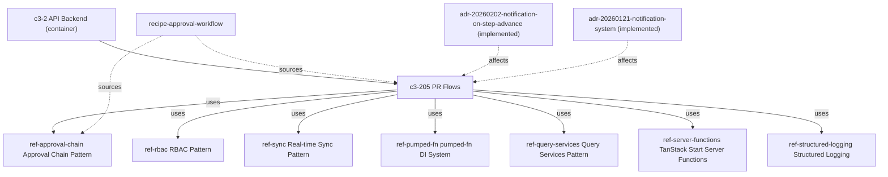

# APPROVAL-1 — Where does approval workflow live and what governs changes to approvals?

## Evidence Commands

```bash
c3 search "approval workflow where does it live and what governs changes to approvals"
c3 read recipe-approval-workflow --full
c3 read c3-205 --full
c3 read ref-approval-chain --full
c3 read ref-audit-trail --full
c3 read ref-rbac --full
c3 graph c3-205 --depth 1 --format mermaid   # agent mode returned node/edge list
c3 lookup '**/pr*'        # empty — codemap coverage gap
c3 lookup '**/approval*'  # empty — codemap coverage gap
c3 read adr-20260202-notification-on-step-advance
c3 read adr-20260121-notification-system
c3 read c3-212
c3 list --flat            # 66 entities; zero rule-* entities
```

## Answer

**Layer:** c3-205 (PR Flows), inside c3-2 (API Backend)

### Where it lives

The approval workflow's business logic lives in **c3-205**: it owns 15 operations covering the full PR lifecycle (`createPr`, `requestApprovals`, `approvePr`, `unapprovePr`, `rejectPr`, `recallPr`, `completePr`, `uncompletePr`, `approveAll`, attachment ops, reads), driving the state machine `draft → pending → approved → completed` (c3-205 Operations + State Machine sections). The actual step/mode progression decision is **app-level logic in `prService.approve`** — not DB constraints — backed by `approvalQueries` over four relational tables: `approval`, `approval_steps`, `approval_step_users`, `approval_records` (ref-approval-chain, Mode Validation + Data Model sections). The wiring is `flow (pr.ts) → prService → approvalQueries` (ref-approval-chain, Wiring section).

Surrounding owners on the path:

- **Action owners (direct dependents, frontend, c3-1):** c3-105 (PaymentRequestsScreen) exposes `requestApprovals`, `approvePr`, `rejectPr`, bulk `approveAll`, `recallPr`, `unapprovePr` (search output snippet for c3-105). c3-109 (Workbench Screen) is the finance bulk-ops surface (search output).
- **Bulk/operational extension:** c3-212 (Workbench Flows) extends the workflow with bulk operations — invoice cleanup, export of approved PRs, paid-PR import (recipe-approval-workflow Narrative; c3-212 goal). `approveAll` itself is owned by c3-205 (c3-205 Operations table).
- **Notification dependent (transitive via flow calls):** c3-211 (Notification System) receives `notifyNextApprovers` on step advance (recipe-approval-workflow; c3-205 Approval Integration).
- **End-to-end trace:** recipe-approval-workflow documents the whole path and names it "the core business domain".

### What governs changes to approvals — the causal chain

Action owner → mutation owner → mechanism → observers, each hop carried by a named contract:

1. **c3-105 / c3-109 (UI action)** → calls a c3-205 flow. Carried by the flow contract: all operations use `flow()` with namespace + Zod schema (c3-205 Uses table); the approval flow config itself is a shared Zod schema, `approvalFlowSchema` with `mode: z.enum(["anyof","allof"])` (ref-approval-chain, Shared Types).
2. **c3-205 flow → `prService.approve`** — governed by **ref-approval-chain**, the explicit Governance row of c3-205 ("Explicit cited governance beats uncited local prose"). It fixes the semantics: `anyof` = one assigned approver advances the step; `allof` = every assigned user must have an approval record; `current_step >= total steps` ⇒ PR marked approved (Mode Validation + Happy Path sections).
3. **Who may approve** — governed by **ref-rbac** (cited in c3-205 `uses`): permissions are per-role JSON (e.g. `"pr": { "approve": true }`); built-in roles `finance` (PR create, approve) and `bod` (final approvals); the `owner` role short-circuits via `rbacQueries.isOwner` (ref-rbac, Permission Model + Built-in Roles + Owner Check). Configuring approval workflows is an Admin Screens concern (c3-107) where "all screens require owner role — server functions enforce via `rbacQueries.isOwner`" (search output snippet for c3-107).
4. **Mutation semantics on the chain itself** — ref-approval-chain Edge Cases: `unapprove` only works on `currentStep - 1` and may revert the step; recall/reject resets to draft, `current_step` to 0, and clears all approval records; **updating the approval config is only allowed while the PR is in draft** (deletes all steps, recreates from new config); concurrent approvals are serialized by transaction scope.
5. **Transactionality** — all operations run in transaction scope via the execution context, c3-202 (recipe-approval-workflow, Cross-Cutting Contracts).

### Side effects and their attachment layers

- **Audit — attached at the storage layer.** The `pr` table is covered by the `log_change()` PostgreSQL trigger; flows must **NOT** also call `createAuditEntry` for trigger-covered tables or entries duplicate (ref-audit-trail, When to Audit + Anti-Patterns; restated in recipe-approval-workflow Cross-Cutting Contracts). Actor attribution comes from `executeInDrizzleTransaction` setting `app.current_user` before writes (ref-audit-trail, DB trigger audit). Because attachment is at the trigger, audit capture survives any entry path that writes `pr` inside that transaction wiring. Contrast: **approval-workflow configuration** (`approval_flows` table) is audited by **explicit** `createAuditEntry` calls in flow code, not by trigger (ref-audit-trail, When to Audit table) — so config mutations that bypass the flow layer would skip audit, while PR approval mutations would not.
- **Sync — attached at the flow layer.** Every mutation emits a sync delta (ref-sync), then the flow acks (recipe-approval-workflow Cross-Cutting Contracts; c3-205 Operations table lists `sync` on every mutating flow).
- **Notification — attached at the flow layer.** `prService.approve` returns `stepAdvanced: boolean`; the **flow** (`approvePr`, `approveAll`, `requestApprovals`) calls `notificationService.notifyNextApprovers` when it's true (adr-20260202-notification-on-step-advance Decision; confirmed live in c3-205 Approval Integration). Entering below the flow layer (calling `prService` directly) would therefore skip notifications and sync but not audit.

### Failure boundary

- Notifications are **fire-and-forget**: errors suppressed and logged, never thrown — approval state advances even if notification dispatch fails (recipe-approval-workflow Cross-Cutting Contracts; c3-205 Approval Integration).
- Audit is atomic with the mutation: it rides the same transaction, so a rolled-back approval produces no audit entry (ref-audit-trail, Anti-Patterns: "Auditing outside a transaction").
- What happens if the sync delta emit fails is **not stated** in the read docs (recipe says "every mutation emits a sync delta, then the flow acks" but documents no failure leg) — explicit gap, not a guess.
- Declared blast radius: "Approval chain logic spans c3-205 (flows) + prService + approvalQueries. Changing step semantics has blast radius across all three layers plus the notification dispatch path" (recipe-approval-workflow, Risk section).

### ADR status labels

- adr-20260202-notification-on-step-advance — `status: implemented` → **historical** (terminal, content frozen); its mechanism (`stepAdvanced` → notify) is confirmed current by c3-205's Approval Integration section.
- adr-20260121-notification-system — `status: implemented` → **historical**; established the NATS notification backbone (c3-211) the step-advance notify rides on.

### Rules

No `rule-*` entities exist in this topology — `c3 list --flat` shows 66 entities, all of type system/container/component/recipe/ref/adr; governance here is carried entirely by refs (ref-approval-chain, ref-rbac, ref-audit-trail, ref-sync) cited from c3-205.

**Graph:** (rendered from `c3 graph c3-205 --depth 1` node/edge output; agent mode emitted the relation list rather than mermaid text)



### Concrete checks before changing approval behavior

- Touching step/mode semantics: change lands in `prService.approve` per the ref-approval-chain Mode Validation contract; verify the `stepAdvanced` return signal is preserved (adr-20260202 made flows depend on it for notifications).
- Do NOT add `createAuditEntry` for `pr` writes — `log_change()` trigger already covers it; adding one duplicates entries (ref-audit-trail rule).
- Confirm approval-config edits stay draft-only and still delete + recreate steps (ref-approval-chain Edge Cases).
- Assert the sync delta is emitted after each mutating flow and the notification observable fires only on step advance (`anyof` satisfied or `allof` complete), and that a suppressed notification error still leaves the approval committed.
- Re-check both citing surfaces of ref-approval-chain before changing it: c3-205 and recipe-approval-workflow (graph output, `cited` edges).

## Grounding

| Material claim | Evidence source |
| --- | --- |
| Approval workflow is the core business domain; lifecycle `draft → pending → approved → completed`; governed by multi-step chains | `c3 read recipe-approval-workflow --full`, Narrative |
| c3-205 owns 15 lifecycle operations incl. `approvePr`, `approveAll`, `recallPr`, `unapprovePr` with sync/notification side effects | `c3 read c3-205 --full`, Operations table |
| Wiring `flow (pr.ts) → prService → approvalQueries`; 4 tables `approval`, `approval_steps`, `approval_step_users`, `approval_records` | `c3 read ref-approval-chain --full`, Wiring + Data Model |
| `anyof`/`allof` validation is app-level in `prService.approve`, not DB constraints | `c3 read ref-approval-chain --full`, Mode Validation; restated in recipe-approval-workflow Narrative |
| Unapprove only on `currentStep - 1`; recall/reject resets step 0 + clears records; config update draft-only; concurrency via transaction scope | `c3 read ref-approval-chain --full`, Edge Cases |
| ref-approval-chain is the explicit Governance row for c3-205 | `c3 read c3-205 --full`, Governance section |
| Who can approve: JSON permissions (`pr.approve`), roles finance/bod, `isOwner` short-circuit | `c3 read ref-rbac --full`, Permission Model + Built-in Roles + Owner Check |
| Admin Screens (c3-107) configure approval workflows, owner-only via `rbacQueries.isOwner` | `c3 search` output, c3-107 snippet |
| `pr` table audited by `log_change()` DB trigger; explicit `createAuditEntry` forbidden there; `approval_flows` audited explicitly in flow code; actor via `app.current_user` set in `executeInDrizzleTransaction` | `c3 read ref-audit-trail --full`, When to Audit + Anti-Patterns + DB trigger audit; recipe-approval-workflow Cross-Cutting Contracts |
| Every mutation emits sync delta then flow acks; transactions via c3-202 execution context; notifications fire-and-forget (error suppressed, logged) | `c3 read recipe-approval-workflow --full`, Cross-Cutting Contracts |
| `stepAdvanced` returned by prService; flow layer triggers `notifyNextApprovers` | `c3 read adr-20260202-notification-on-step-advance` Decision; `c3 read c3-205 --full` Approval Integration |
| ADR statuses `implemented` for both cited ADRs | `c3 read adr-20260202-...` / `c3 read adr-20260121-...` frontmatter `status` |
| c3-105 exposes requestApprovals/approvePr/rejectPr/approveAll/recallPr/unapprovePr; c3-109 is the workbench screen | `c3 search` output snippets for c3-105 and c3-109 |
| c3-212 extends workflow with bulk invoice cleanup / export / paid-PR import | `c3 read c3-212` goal; recipe-approval-workflow Narrative |
| Blast radius spans c3-205 + prService + approvalQueries + notification dispatch | `c3 read recipe-approval-workflow --full`, Risk |
| No `rule-*` entities exist | `c3 list --flat` (66 entities, no `rule` type rows) |
| Graph relations (uses/cited/affects edges around c3-205) | `c3 graph c3-205 --depth 1` output |

## Caveats

- **Codemap coverage gap:** `c3 lookup '**/pr*'` and `c3 lookup '**/approval*'` both returned empty `files`/`components`; the CLI's own help flagged "codemap coverage gap". File-level paths in this answer (`pr.ts`, `prService`, `approvalQueries`) come from ref-approval-chain's Wiring section, not from a code-map lookup, so exact file locations are unverified against the codemap.
- **DB does not enforce approval modes:** ref-approval-chain states modes are app-level in `prService.approve`; the DB only stores the mode string — a write path bypassing `prService` could advance steps without honoring `anyof`/`allof`.
- **Sync failure leg undocumented:** the read docs state the delta-then-ack contract but not what happens if the sync emit fails (explicit gap noted above).
- **c3-205 governance row self-flags drift risk:** its Notes column reads "Migrated from legacy component form; refine during next component touch".
- **`c3 graph --format mermaid` in agent mode emitted a TOON node list, not mermaid text;** the mermaid block above is a faithful rendering of that returned node/edge data, not raw tool output.
