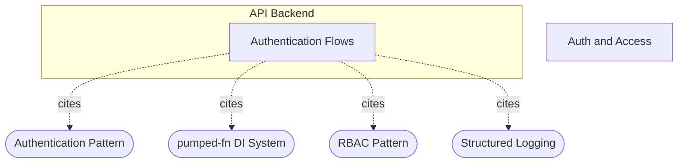

# AUTH-1: How is authentication handled and what governs it?

## Evidence Commands

```bash
c3 search "how is authentication handled and what governs it"
c3 read c3-213 --full
c3 read ref-authentication --full
c3 read c3-203 --full
c3 read ref-rbac --full
c3 read c3-209 --full
c3 read ref-nats-jwt-auth --full
c3 read adr-20260112-nats-auth-callout --full
c3 graph c3-213 --format mermaid
c3 graph c3-209 --format mermaid
c3 read recipe-auth-and-access --full
c3 read adr-20260113-nats-jwt-resolver
c3 lookup 'apps/start/src/**/auth*'
c3 lookup 'apps/start/src/lib/pumped/atoms/natsSync.ts'
c3 lookup '**/_authed*'
c3 read c3-202
c3 list --flat
```

## Answer

**Layer:** `c3-2` (API Backend) — auth components `c3-213`, `c3-203`, `c3-202`, `c3-209`; governed by `ref-authentication`, `ref-rbac`, `ref-nats-jwt-auth`; traced end-to-end by `recipe-auth-and-access`.

Authentication spans **three distinct layers** (per `recipe-auth-and-access` Narrative): HTTP session (cookies), application RBAC, and NATS transport auth. Each has its own owner and its own governing ref.

### Causal chain

**1. Action owner — login routes -> `c3-213` (Authentication Flows).**
Two entry paths, both owned by `c3-213` and governed by `ref-authentication`:

- **Google OAuth (production):** `/login` -> redirect to Google -> `/cb?code=...` -> `authenticateWithGoogle` exchanges credentials via the `gauthSvc` atom (`google.auth.OAuth2` wrapper), normalizes email to lowercase, then calls `initUserActor` to look the user up in the DB (`c3-213` Flows section; `ref-authentication` Routes + Google OAuth Flow sections).
- **Test token (E2E only):** `/test-login?token=...&user=...` -> `authenticateWithTestToken` checks `appConfig.enableTestToken` is true AND token matches `appConfig.testToken` before calling `initUserActor` (`c3-213` Flows; `ref-authentication` Test Token Authentication).

The load-bearing policy, stated in `ref-authentication` (Choice + Security Notes): **the user must already exist in the database — OAuth alone does not grant access.** A valid Google account with no `users` row gets `{ success: false, reason: 'USER_NOT_FOUND' }` (`c3-213` Results table). This is why the chain continues to a DB lookup rather than ending at token validation.

**2. Session establishment — cookie, set by the route handler.**
On success the flow returns the user; the *route handler* (not the flow) sets a `user` cookie = Base64(email), flags `HttpOnly; Path=/` (`c3-213` Cookie Management; `ref-authentication` Cookie-Based Session). The session is stateless — no server-side session store, no refresh tokens stored (`ref-authentication` Why + Security Notes).

**3. Per-request restore — `c3-203` (Middleware Stack) -> `c3-202` (Execution Context).**
Chain: `Request -> executionContextMiddleware -> getCurrentUserMiddleware -> Handler` (`c3-203` Middleware Chain). `getCurrentUserMiddleware` parses the `user` cookie, looks the user up in the DB (`userQueriesService.getUser`), fetches team capabilities, and sets `currentUserTag` on the request-scoped execution context owned by `c3-202` (`c3-203` body; `c3-202` goal: "Request-scoped context with tags for currentUser, transaction, executionId"). The arrow from step 2 to step 3 is the cookie contract; the arrow from 3 to 4 is the `currentUserTag`.

**4. Authorization — flows consume the tag, governed by `ref-rbac`.**
The tag carries the full actor: email, permissions, team, teamCapabilities, plus `can(p)` / `asserts(p)` (throws `Permission denied`) (`c3-203` code; `recipe-auth-and-access` UserActor section). RBAC semantics come from `ref-rbac`: JSON permissions per role with parent-role inheritance (effective = parent merged with role), special `owner` role checked via `rbacQueries.isOwner`, built-in roles owner/finance/admin/bod. `c3-203` distinguishes **permissions** (direct user authorization, via `can()`/`asserts()`) from **team capabilities** (feature gating). Side effect: all RBAC mutations are logged to the `security_events` table via `rbacQueries.logSecurityEvent` — an audit trail independent of the general audit system (`ref-rbac` Choice + Security Events).

**Attachment layers (who enforces what):** identity restoration is attached at the *middleware* layer (`c3-203`), but authorization checks are attached at the *flow* layer — flows call `ctx.data.seekTag(currentUserTag)` then `asserts()`/`isOwner` themselves (`ref-rbac` Usage in Flows + Admin Flow Guard). The middleware never rejects: with no cookie or an unknown user it simply does not set `currentUserTag` and "handler must check" (`c3-203` Auth Logic table). RBAC security-event logging is attached at the `rbacQueries` layer, so it fires for RBAC mutations regardless of which flow invokes them (`ref-rbac` Security Events).

**5. Dependent transport — HTTP auth feeds NATS auth (`c3-209`, governed by `ref-nats-jwt-auth`).**
At authed page load, the loader resolves `natsCredentialGenerator` and calls `generate(currentUser.email, 3600)` — so NATS credentials are derived from the HTTP-authenticated identity (`ref-nats-jwt-auth` Credential Flow, `_authed.tsx` loader snippet). `c3-209` creates an ephemeral user nkey pair, signs a user JWT with the server-held account seed, and returns `{ jwt, seed }` via `loaderData`; the browser connects to NATS (`c3-4`) with `jwtAuthenticator`. NATS validates the JWT signature itself using a MEMORY resolver with `resolver_preload` — **no auth callout service** (`ref-nats-jwt-auth` How It Works + NATS Server Config). Permissions embedded in the JWT: subscribe-only to `{prefix}.broadcast` and `{prefix}.user.{escaped_email}` (`@`/`.` -> `_`), empty publish allow, WebSocket-only connection (`c3-209` Permission Model). NATS remains "its own identity layer", separate from HTTP auth (`recipe-auth-and-access` NATS auth section).



(From `c3 graph c3-213 --format mermaid`. The `c3-209` graph shows the parallel structure: `c3-209` cites `ref-nats-jwt-auth`, `ref-pumped-fn`, `ref-scope-controlled-config`, `ref-structured-logging`; `ref-nats-jwt-auth` is cited by `c3-209`, `adr-20260113-nats-jwt-resolver`, and `recipe-auth-and-access`.)

### What governs it

| Layer | Owner | Governing ref | Key constraint |
| --- | --- | --- | --- |
| Login + session | `c3-213` | `ref-authentication` | User must pre-exist in DB; HttpOnly Base64(email) cookie; test token gated by `ENABLE_TEST_TOKEN` |
| Request identity | `c3-203` -> `c3-202` | `ref-pumped-fn` (cited governance on `c3-203`) | `currentUserTag` set only for cookie + valid DB user; middleware never rejects |
| Authorization | flows (e.g. `c3-210` admin flows cite `ref-rbac`) | `ref-rbac` | `can()`/`asserts()`, owner check, parent-role inheritance, `security_events` logging |
| NATS transport | `c3-209` (+ `c3-4` external) | `ref-nats-jwt-auth` | Server-side account seed, per-session ephemeral JWT+nkey, subscribe-only, 1h TTL |

Governance precedence is explicit in the component docs: "Explicit cited governance beats uncited local prose" (`c3-213`, `c3-209`, `c3-203` Governance tables). No `rule-*` entities exist in this fixture at all (`c3 list --flat` over all 66 entities returns no `rule` type rows), so refs are the only governing constraint layer here. Reverse-graph note: `ref-rbac`'s direct citers are `c3-205`, `c3-210`, `c3-213`, and `recipe-auth-and-access`/`recipe-audit-and-compliance` (from `c3 graph c3-213` node data) — `c3-205`/`c3-210` are direct consumers of the RBAC contract; screens reaching auth through flows are transitive and were not individually read.

### ADR history (status-labeled)

- `adr-20260112-nats-auth-callout` — **superseded** (its body Status says "Superseded - 2026-01-13, replaced by JWT resolver approach"). It records why NATS auth exists at all: WebSocket connections were previously open, anyone with the URL could subscribe, bypassing app auth. Do NOT treat its `$SYS.REQ.USER.AUTH` auth-callout design as the live mechanism.
- `adr-20260113-nats-jwt-resolver` — **implemented (historical work order)**; the live mechanism it produced is what `ref-nats-jwt-auth` and `c3-209` now document: JWT resolver chosen over auth callout because the callout required a running auth service ("more moving parts", a failure point).

### Failure boundaries

- **Login:** result taxonomy is explicit (`c3-213` Results): `NO_CREDENTIALS` (no email in Google profile), `INVALID_TOKEN` (test token mismatch/disabled), `USER_NOT_FOUND` (email not in users table). Failures never set the cookie.
- **Per request:** no cookie, or cookie for a non-DB user -> `currentUserTag` not set; the request still reaches the handler — enforcement falls to the flow (`c3-203` Auth Logic). A flow that skips its own check is the unprotected path; `ref-rbac` guards show flows returning `USER_NOT_FOUND` / `NOT_OWNER` on missing tag / failed owner check.
- **NATS leg:** JWT expires after 1h TTL — client must reconnect; account seed is server-only; user seeds ephemeral, never stored (`c3-209` Security). If HTTP auth fails, no NATS credentials are generated at all (generation lives in the authed loader, `ref-nats-jwt-auth` Credential Flow). Compromised client credentials cannot publish or reach internal subjects — subscribe-only, WebSocket-only (`ref-nats-jwt-auth` Why). Degradation of the NATS leg loses real-time sync delivery only; HTTP auth and flow authorization are unaffected (separate identity layers per `recipe-auth-and-access`).
- **RBAC edges:** no roles = no permissions; expired role = unassigned; deleting the last owner / self-removal of last owner "should be prevented" (`ref-rbac` Edge Cases — stated as expectations, not as verified enforcement).

### Concrete checks (if changing auth)

- Config to confirm: `GOOGLE_CLIENT_ID`, `GOOGLE_CLIENT_SECRET`, `GOOGLE_REDIRECT_URI` (production); `ENABLE_TEST_TOKEN`, `TEST_TOKEN` (E2E only — `ref-authentication` Environment Variables); `NATS_ACCOUNT_SEED`, `NATS_ACCOUNT_PUBLIC_KEY`, `NATS_OPERATOR_PUBLIC_KEY` and the `resolver_preload` block in `infra/nats.conf` must agree (`ref-nats-jwt-auth` Configuration + Troubleshooting).
- Probe login failure modes: wrong test token -> `INVALID_TOKEN`; email absent from `users` table -> `USER_NOT_FOUND` (`c3-213` Results).
- Assert `currentUserTag` present in a flow after authed request; assert `asserts('x')` throws for a missing permission (`c3-203`, `ref-rbac`).
- NATS observable: authed page load returns `loaderData.natsCredentials`; client subscribes to `{prefix}.broadcast` + `{prefix}.user.{escaped_email}` only; an expired JWT forces reconnect (`c3-209`, `ref-nats-jwt-auth`).
- If touching RBAC mutations: verify a `security_events` row is written (`ref-rbac` Security Events).

## Grounding

| Material claim | Evidence source |
| --- | --- |
| Three auth layers: HTTP session, RBAC, NATS transport | `c3 read recipe-auth-and-access --full` (Narrative) |
| Google OAuth + test token flows, email normalization, `initUserActor` DB lookup | `c3 read c3-213 --full` (Flows, Dependencies) |
| Result taxonomy NO_CREDENTIALS / INVALID_TOKEN / USER_NOT_FOUND | `c3 read c3-213 --full` (Results table) |
| Cookie set by route handler, Base64(email), HttpOnly, stateless, no refresh tokens | `c3 read c3-213 --full` (Cookie Management); `c3 read ref-authentication --full` (Cookie-Based Session, Why, Security Notes) |
| Pre-existing user required; OAuth alone grants nothing | `c3 read ref-authentication --full` (Choice, Security Notes) |
| Routes table (/login, /cb, /test-login, /logout) | `c3 read ref-authentication --full` (Routes) |
| Middleware chain, cookie parse, `currentUserTag`, "handler must check", permission vs capability | `c3 read c3-203 --full` (Middleware Chain, Auth Logic, Permission vs Capability) |
| `c3-202` owns request-scoped context/tags | `c3 read c3-202` (goal, Parent Fit) |
| RBAC: JSON permissions, inheritance, owner check, security_events, built-in roles, edge cases, flow-layer guards | `c3 read ref-rbac --full` (Choice, Permission Hierarchy, Owner Check, Usage in Flows, Admin Flow Guard, Security Events, Edge Cases) |
| NATS creds: ephemeral keypair, account-seed signing, subscribe-only subjects, email escaping, 1h TTL, seed server-only | `c3 read c3-209 --full` (How It Works, Permission Model, Security) |
| JWT MEMORY resolver, no auth callout, loader generation from `currentUser.email`, env vars, nats.conf | `c3 read ref-nats-jwt-auth --full` (Choice, Credential Flow, Configuration) |
| Auth-callout ADR superseded; prior state = open WebSocket connections | `c3 read adr-20260112-nats-auth-callout --full` (Status, Problem) |
| JWT-resolver ADR implemented; rationale vs callout | `c3 read adr-20260113-nats-jwt-resolver` (Status, Decision, Rationale) |
| Citation graphs; `ref-rbac` citers c3-205/c3-210/c3-213; `ref-nats-jwt-auth` citers | `c3 graph c3-213 --format mermaid`, `c3 graph c3-209 --format mermaid` (node data) |
| No `rule-*` entities in fixture | `c3 list --flat` (66 entities, no `rule` type rows; grep for "rule" empty) |
| Governance precedence line | Governance tables in `c3 read c3-213/c3-209/c3-203 --full` |

## Caveats

- **Codemap gap for auth files:** `c3 lookup 'apps/start/src/**/auth*'`, `c3 lookup 'apps/start/src/lib/pumped/atoms/natsSync.ts'`, and `c3 lookup '**/_authed*'` all returned empty `file_map`/`components` with a "codemap coverage gap" help hint. File paths cited above (`server.tsx`, `_authed.tsx`, `natsSync.ts`, `infra/nats.conf`) come from doc bodies, not from a verified code-map binding, and I did not read fixture source code.
- **ADR status inconsistency:** `adr-20260112-nats-auth-callout` has frontmatter `status: implemented` while its body Status section says "**Superseded** - 2026-01-13". I label it superseded per the body and the newer `adr-20260113-nats-jwt-resolver`, but the frontmatter disagrees — audit candidate.
- **Stale Cited By naming:** `ref-authentication` and `ref-rbac` both list "Cited By: c3-2-api (...)" — an id form that does not match the current topology ids (`c3-2`, `c3-213`); the live citation graph (from `c3 graph`) is what I relied on.
- **Cookie integrity not documented:** `ref-authentication`'s cookie snippet shows only Base64 encoding with `HttpOnly; Path=/` — no signing/encryption/SameSite is mentioned anywhere in the read docs. I report what the docs show; whether additional protection exists in code is unverified (see codemap gap above).
- **RBAC edge-case enforcement is aspirational wording:** `ref-rbac` Edge Cases says delete-last-owner and self-removal "Should be prevented" — the docs state the expectation, not evidence of enforcement.
- **`c3-203`'s Governance table cites only `ref-pumped-fn`** (with note "Migrated from legacy component form; refine during next component touch") even though it implements the cookie-session restore that `ref-authentication` governs conceptually — a governance-citation gap flagged by the doc's own migration note.
