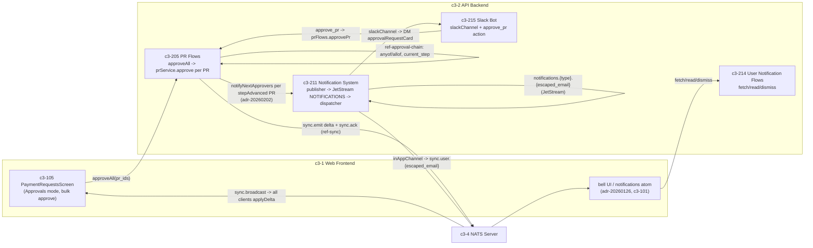

# CROSSCUT-MASS-APPROVAL-1 — How mass-approval gets done and informs other users

## Evidence Commands

All via `c3() { C3X_MODE=agent bash skills/c3/bin/c3x.sh --c3-dir research/eval/skill-eval/fixtures/acountee/.c3 "$@"; }`:

1. `c3 search "mass approval bulk approve and inform other users notification"` — candidate discovery (recipe + components + ADRs)
2. `c3 read recipe-approval-workflow --full` — end-to-end recipe (Step 0a+)
3. `c3 read ref-bulk-operations --full` — bulk-selection UI contract
4. `c3 read c3-205 --full` — mutation owner (`approveAll` operation row)
5. `c3 read c3-105 --full` — action owner (Approvals mode, bulk approve)
6. `c3 read c3-211 --full` — notification publisher/dispatcher/channels
7. `c3 read ref-sync --full` — delta/ack contract, NATS subjects
8. `c3 read adr-20260202-notification-on-step-advance --full` — step-advance notification decision
9. `c3 read c3-214 --full` — user-facing notification fetch/read/dismiss
10. `c3 graph c3-205 --depth 1 --format mermaid` — PR Flows relationship graph
11. `c3 read ref-approval-chain --full` — anyof/allof step semantics, wiring
12. `c3 read c3-215 --full` — Slack channel + inbound approve actions
13. `c3 read ref-audit-trail --full` — audit attachment layers (trigger vs explicit)
14. `c3 graph c3-211 --depth 1 --format mermaid` — Notification System graph (surfaced adr-20260126)
15. `c3 list --flat --compact` — full 66-entity inventory (zero `rule-*` entities)
16. `c3 read adr-20260121-notification-system` / `c3 read adr-20260126-user-notification-ui` / `c3 read adr-20260305-slack-bot-integration` — ADR status labels

(One failed probe: `c3 search "notification bell in-app unread badge frontend"` errored with `SQL logic error: no such column: app` — FTS could not parse the hyphenated term; the bell UI was found via the `c3 graph c3-211` output instead.)

## Answer

**Layer:** spans c3-1 (Web Frontend) → c3-2 (API Backend) → c3-4 (NATS Server), traced by `recipe-approval-workflow`.

### Causal chain (action → mutation → sync → notification → emergent → failure)

**1. Action owner — c3-105 (PaymentRequestsScreen), Approvals mode.**
c3-105 operates in two modes; **Approvals mode** shows "Only PRs pending current user's approval" with actions "Approve, reject, bulk approve" (c3-105 `Dual Mode` table). The bulk-selection UX is governed by `ref-bulk-operations`: bulk mode toggles via header button or the `B` key, checkboxes overlay the existing list, non-actionable items render at reduced opacity, and the bulk action bar replaces the footer with buttons like "Approve (3)" (`ref-bulk-operations` `Activation` / `Selection UI`). `ref-bulk-operations` `Applies To` explicitly lists "PaymentRequestsScreen (bulk approve in approvals mode)".
→ *Why the next hop follows:* c3-105 `Data Flow` lists `approveAll` among the server functions in `@/server/functions/pr`, and `Key Wiring` names the `useBulkOperations` hook — the screen's bulk action is wired to the `approveAll` server function.

**2. State-mutation owner — c3-205 (PR Flows), `approveAll`.**
c3-205's `Operations` table: `approveAll` — "Bulk approval: iterates pr_ids, approves each, collects approved/failed arrays | sync, conditional notifications per PR". Each iteration calls `prService.approve` (c3-205 `Uses` table: "prService — Core PR mutations"). The semantics of "approves each" are governed by `ref-approval-chain` (the only governance ref in c3-205's `Governance` table): `prService.approve` inserts an `approval_record`, evaluates the step's mode app-level — `anyof` (one approver suffices) or `allof` (every assigned user must have a record) — and if `isProgressed`, advances `current_step`; when `current_step` reaches the final step it calls `prQueries.markPrAsApproved` (`ref-approval-chain` `Mode Validation` + `Golden Example: Approve + Step Advance`). So a "mass approval" is **per-PR sequential approval with per-PR success/failure collection**, not a single batch mutation.
→ *Why the next hop follows:* c3-205 cites `ref-sync` in `uses`, and every mutation row in its `Operations` table carries the `sync` side effect — the contract that makes other users see the change.

**3. Sync mechanism — `ref-sync` (Real-time Sync Pattern) over c3-4 NATS.**
Two-layer contract: **services emit deltas, flows send acks**, correlated by a string `executionId`. Inside each `prService.approve`, after the DB write, `sync.emit({ entity: 'pr', type: 'update', id, data: updatedPr }, executionId)` publishes a full-record `DeltaMessage` via `publisher.publishToAll()` on the NATS subject `sync.broadcast` (default `{prefix}.broadcast`, prefix `sync` from `NATS_SUBJECT_PREFIX`). Every connected client's `natsSync` subscription applies the delta to its `prs` atom with `applyDelta` (delete → update → add, full-record replacement). When the flow finishes all service calls, it sends `sync.ack(executionId)`; the **originating** approver's client resolves `result.wait()` on whichever of delta/ack arrives first (2s timeout fallback). This is how *all* users' PR lists update in real time after a mass approval — broadcast to all, RBAC-filtered client-side (`ref-sync` `Convention`: "Broadcast to all, filter on client").
→ *Why the next hop follows:* sync deltas update data everywhere but target nobody; the conditional-notification side effect on `approveAll` (c3-205 `Operations`) is what *informs specific next approvers*.

**4. Notification mechanism — c3-211 (Notification System), per-PR on step advance.**
Per `adr-20260202-notification-on-step-advance` (**status: implemented — this is the current live mechanism**, confirmed by c3-205's `Approval Integration` section and `stepAdvanced` wording in its `Operations` table): `prService.approve` returns `stepAdvanced: isProgressed && !willEnd`, and `approvePr`/`approveAll` flows call `notificationService.notifyNextApprovers(prId)` **for each PR whose step advanced** — and only those. The ADR's rationale row is the layer contract: "Services should not trigger side effects; flows orchestrate per C3 pattern".

Inside c3-211, the pipeline is: `notificationService.notifyNextApprovers` looks up next-step approvers from PR data and publishes **one notification per recipient** → `notificationPublisher` publishes to the **NATS JetStream `NOTIFICATIONS` stream** on subject `notifications.{type}.{escaped_email}` (workqueue retention, file storage, 7-day max age, 10K max messages) → `notificationDispatcher` (durable consumer) fetches the user's preferred channels from `notification_preferences` (JSONB, defaults to `['in_app']`), creates a `pending` row in `notification_log` per channel, calls the channel handler, updates the row to `sent`/`failed`, and acks on success / naks on failure (JetStream retry). Channels self-register via `dispatcher.subscribe()` (`ref-pull-dispatcher` governs this inversion):

- **inAppChannel** — "NATS publish (real-time) + JetStream (persistence)" (c3-211 `Built-in Channels`). The real-time leg is the user-targeted subject `sync.user.{escaped_email}` (`ref-sync` `NATS Subjects`: `publisher.publishToUser()`; `@`/`.` escaped to `_`). The bell UI consumes it: per `adr-20260126-user-notification-ui` (**implemented — current**, affects c3-1/c3-101/c3-211), the frontend subscribes to both `sync.broadcast` and `sync.user.{escaped_email}`, feeds a `notifications` atom with derived `unreadCount`.
- **emailChannel** — SMTP with HTML template (c3-211).
- **slackChannel** — DM via the Slack bot (c3-215): looks up `slack_user_links` by email, opens a DM, sends an `approvalRequestCard` with Approve/Reject buttons; skips silently if Slack is unconfigured or no user mapping exists (c3-211 + c3-215 `slackChannel`).

**How informed users then act/manage notifications:** c3-214 (User Notification Flows) owns fetch/read/dismiss — `getNotificationsFlow` returns up to 50 non-dismissed in-app notifications (over-fetching to compensate for dismissed ones; read and dismiss are independent states). On the screen side, c3-105 "Auto-mark notifications — selecting a PR auto-marks matching notifications as read" (`useAutoMarkNotificationsRead` hook). The Slack card closes the loop: c3-215 `slackActions` handles `approve_pr`/`reject_pr` by re-entering `prFlows.approvePr`/`rejectPr` — so a notification recipient can advance the chain directly, which re-triggers this whole chain for the *next* step's approvers.

**5. Emergent properties.**
- **Per-PR partial success in bulk:** `approveAll` collects `approved`/`failed` arrays (c3-205) — one failing PR does not abort the rest; the bulk operation is not all-or-nothing at the batch level.
- **Step-advance-only notification:** approvers are notified only when a step actually advances; a non-advancing `allof` approval and a *final* approval send nothing ("No action required - PR is done", adr-20260202 `Step-Advancing Paths Audit`).
- **Async, non-blocking informing:** "Notifications fire async with error suppression (logged, not thrown)" (c3-205 `Approval Integration`; recipe `Cross-Cutting Contracts`) — informing users never blocks or fails the approval itself.
- **Targeted vs broadcast split:** data changes go to everyone on `sync.broadcast`; "you're up next" goes only to the recipient on `notifications.{type}.{escaped_email}` → `sync.user.{escaped_email}`.
- **Idempotent under racing approvals:** "if two approvals race and both trigger notifications, `notificationPublisher.publish` is idempotent (JetStream dedupes by message ID)" (adr-20260202 `Concurrency/Idempotency`).
- **Audit without flow code:** each approval mutation is captured by the `log_change()` DB trigger on the `pr` table — flows must NOT also call `createAuditEntry` (recipe `Cross-Cutting Contracts`; `ref-audit-trail` `When to Audit`).

**6. Failure boundary.**
- **Notification leg fails:** error suppressed and logged (c3-205, recipe) — the approval and its sync delta are preserved; the user simply isn't proactively informed. Downstream, the dispatcher naks → JetStream redelivers; a definitive channel failure is recorded as `failed` in `notification_log`, observable in the admin UI and recoverable via `notificationService.retryNotification(execCtx, logId)` (c3-211 `notificationService` / `Notification Log`). So the *observer* of a notification failure is an admin (log), not the approver.
- **Slack leg degraded:** `slackChannel` "gracefully skips if Slack is not configured (no user mapping or bot token)" (c3-211) — silent skip, no `failed` log mention for that case in the docs.
- **Sync/ack leg fails or is skipped:** the originating client's `executionTracker` falls back to a 2s timeout — "sluggish UI", not data loss; `result.wait()` is "a UX optimization, not correctness-critical" (`ref-sync` `Execution ID Contract` / `Anti-patterns`). Other users would miss the live delta but get correct state on next load (deltas are full records, server state is canonical).
- **Per-PR failure inside the batch:** lands in the `failed` array returned to c3-105; remaining PRs continue (c3-205). **Documented gap:** the recipe says "All operations run in transaction scope (c3-202 execution context)" but no read states whether `approveAll` wraps the whole batch in one transaction or one per PR — the `approved/failed` collection implies per-PR continuation, but rollback granularity for a mid-batch crash is not documented. Explicit gap, not a guess.
- **Side-effect attachment layers / bypass behavior (who keeps what):**
  - *Delta emit* attaches at the **service layer** (`ref-sync` `Convention`: "Services call sync.emit() after DB write").
  - *Ack and notification* attach at the **flow layer** (`ref-sync`: "Flows call sync.ack(executionId) at the end"; adr-20260202: services must not trigger side effects).
  - *Audit* attaches at the **storage layer** for the `pr` table (`ref-audit-trail`: `log_change()` trigger on `invoices`, `pr`, `invoice_services`).
  - Consequence: both documented entry paths — UI bulk approve (c3-105 → `approveAll`) and Slack button (c3-215 `slackActions` → `prFlows.approvePr`) — enter at the flow layer and therefore trigger **all three** side effects. A hypothetical direct `prService.approve` call would still emit deltas (service layer) and still be audited (DB trigger) but would **skip notification and ack** (flow layer). Audit *attribution* additionally depends on the entry path's setup: c3-215 documents that Slack inbound handlers must manually set `transactionTag` and `app.current_user` via `set_config` "for audit triggers" (c3-215 `Execution Context in Inbound Handlers`; `ref-audit-trail` `DB trigger audit`) — an entry path that skips this still audits, but misattributes the actor.

**Graph** (relationships from `c3 graph c3-205` and `c3 graph c3-211` outputs; agent mode emitted node lists rather than mermaid text, so this diagram is rendered from those node/edge lists):

**Direct vs transitive dependents** (each labeled after reading): c3-105 — **direct** (calls `approveAll`; auto-marks notifications read). c3-215 — **direct** both ways (subscribes to `notificationDispatcher`; re-enters `prFlows.approvePr`). c3-214 — **direct** on notification data (reads `notification_log` channel `in_app`). Other screens citing `ref-sync` (e.g. c3-104, c3-212 from `ref-sync` `Cited By`) — **transitive** observers: they receive the same `sync.broadcast` deltas but were not read in depth here beyond the citation list.

**Concrete checks for a change touching this path:**
- **Owner surfaces:** c3-105 (`paymentRequestHooks.ts`: `useBulkOperations`, `usePRActions`; `@/server/functions/pr`), c3-205 (`approveAll` flow, `prService.approve` return contract — keep `stepAdvanced` intact), c3-211 (`notificationService.notifyNextApprovers`), c3-215 (`slackActions` execution-context setup).
- **Config/runtime values:** `NATS_SUBJECT_PREFIX` must stay `sync` or frontend subscriptions change in lockstep (`ref-sync` `Subject Prefix Contract`); `notification_preferences` default `['in_app']`; `SLACK_BOT_TOKEN`/`SLACK_SIGNING_SECRET` presence decides slackChannel skip; `executionId` must remain a string end-to-end.
- **Observables to assert** (mirrors adr-20260202 `Verification`): run `approveAll` over PRs at different steps — assert one `notification_log` row per next-approver per step-advanced PR (and none for final approvals); assert a `pr` update delta per approved PR on `sync.broadcast` plus one ack with the batch's `executionId`; assert `audit` rows from the `pr` trigger with correct `triggered_by`.
- **Failure probes:** stop the dispatcher (or force a channel error) and confirm the approval still commits, the log row goes `pending`→`failed`, and admin retry re-sends; include a non-actionable PR in the batch and confirm it lands in `failed` while others succeed; approve from the Slack card and confirm the audit row attributes the Slack user (the `set_config('app.current_user', ...)` path).

**No `rule-*` entities found** — the full `c3 list --flat --compact` inventory (66 entities) contains components, refs, recipes, and containers only; governance on this path is carried entirely by refs (`ref-approval-chain`, `ref-sync`, `ref-bulk-operations`, `ref-audit-trail`, `ref-pull-dispatcher`).

## Grounding

| Material claim | Evidence source |
| --- | --- |
| Bulk approve lives in c3-105 Approvals mode; B-key/checkbox overlay; "Approve (3)" action bar; non-actionable items dimmed | `c3 read ref-bulk-operations --full` (`Activation`, `Selection UI`, `Applies To`); `c3 read c3-105 --full` (`Dual Mode`, `Business Purpose`) |
| c3-105 wires bulk action to `approveAll` server function via `useBulkOperations` | `c3 read c3-105 --full` (`Data Flow`, `Key Wiring`) |
| `approveAll` iterates pr_ids, approves each, collects approved/failed arrays; side effects "sync, conditional notifications per PR" | `c3 read c3-205 --full` (`Operations` table) |
| anyof/allof mode validation is app-level in `prService.approve`; step advance + `markPrAsApproved` on final step | `c3 read ref-approval-chain --full` (`Mode Validation`, `Golden Example: Approve + Step Advance`, `Wiring`) |
| Services emit deltas / flows ack; `sync.broadcast` and `sync.user.{escaped_email}` subjects; executionId string contract; applyDelta full replacement; 2s wait fallback | `c3 read ref-sync --full` (`Architecture`, `NATS Subjects`, `Execution ID Contract`, `applyDelta`, golden examples) |
| `stepAdvanced` flag + per-PR `notifyNextApprovers` in approvePr/approveAll; services-don't-side-effect rationale; JetStream dedupe on racing approvals; no notification on final approval | `c3 read adr-20260202-notification-on-step-advance --full` (`Decision`, `Rationale`, `Step-Advancing Paths Audit`, `Concurrency/Idempotency`); confirmed current by `c3 read c3-205 --full` (`Approval Integration`) |
| JetStream `NOTIFICATIONS` stream, subject `notifications.{type}.{escaped_email}`, workqueue/7-day/10K; dispatcher pending→sent/failed log, ack/nak; preferences default `['in_app']`; channels email/in_app/slack; retryNotification | `c3 read c3-211 --full` (`notificationPublisher`, `notificationDispatcher`, `Built-in Channels`, `User Preferences`, `Notification Log`, `notificationService`) |
| Bell UI subscribes `sync.user.{escaped_email}`, notifications atom + unreadCount | `c3 read adr-20260126-user-notification-ui` (`Problem`, `Decision`); surfaced by `c3 graph c3-211` |
| Fetch/read/dismiss semantics; over-fetch strategy; read and dismiss independent | `c3 read c3-214 --full` (`Operations`, `Fetch Strategy`) |
| Slack card with Approve/Reject; silent skip without mapping/config; `approve_pr` re-enters `prFlows.approvePr`; manual `currentUserTag`/`transactionTag`/`app.current_user` setup | `c3 read c3-215 --full` (`slackChannel`, `slackActions`, `Execution Context in Inbound Handlers`) |
| Notifications fire-and-forget (error suppressed, logged); audit via DB trigger on `pr`, no `createAuditEntry`; transaction scope via c3-202 | `c3 read recipe-approval-workflow --full` (`Cross-Cutting Contracts`); `c3 read c3-205 --full` (`Approval Integration`) |
| Audit attachment at storage layer (`log_change()` on `pr`); actor via `set_config('app.current_user', ...)` | `c3 read ref-audit-trail --full` (`When to Audit`, `DB trigger audit`) |
| ADR status labels (20260121 / 20260126 / 20260202 / 20260305 all `status: implemented`) | respective `c3 read adr-*` frontmatter |
| Zero `rule-*` entities in the fixture | `c3 list --flat --compact` (66 entities enumerated, none with `rule` type) |
| c3-105 auto-marks notifications read on PR selection | `c3 read c3-105 --full` (`What Users Can Do`, `Key Wiring`: `useAutoMarkNotificationsRead`) |

ADR labels: `adr-20260202-notification-on-step-advance` — implemented, **current** (entity docs c3-205/c3-211 match it). `adr-20260126-user-notification-ui` — implemented, **current** (no newer ADR or entity doc contradicts the bell/`sync.user.*` subscription). `adr-20260121-notification-system` — implemented, **historical**; its "remove Slack infrastructure completely" decision was **superseded** by `adr-20260305-slack-bot-integration` (implemented), which explicitly says "Previous Slack integration (removed in ADR-20260121)... This time: proven SDK"; the notification core it introduced survives as documented in c3-211 (current entity doc is authoritative).

## Caveats

- **Batch transaction granularity is undocumented.** `recipe-approval-workflow` states "All operations run in transaction scope (c3-202 execution context)" and c3-205 says `approveAll` "collects approved/failed arrays", but no read specifies whether `approveAll` uses one transaction for the whole batch or one per PR, hence rollback behavior on a mid-batch crash is an explicit documentation gap.
- **slackChannel silent skip is unlogged in docs.** c3-211 documents graceful skip when Slack is unconfigured/unmapped, but does not say whether a skipped Slack dispatch produces a `notification_log` row — observable only in code, which was not read here (component bodies were the deepest layer read).
- **Generic scaffold sections.** c3-105's `Governance` table cites only `ref-audit-timeline` with the note "Migrated from legacy component form; refine during next component touch" — its real bulk-approve governance (`ref-bulk-operations` `Applies To`, and `ref-sft-behavioral-spec`'s `BulkApproveFlow` row seen in search output) lives in `uses`/ref citations rather than the Governance table; mild doc drift signal from the docs themselves.
- **One search probe failed:** `c3 search "notification bell in-app unread badge frontend"` returned `SQL logic error: no such column: app` (FTS parsing of the hyphenated term); the bell UI evidence came from `c3 graph c3-211` instead.
- The mermaid diagram is rendered from `c3 graph` node/edge output because `--format mermaid` under `C3X_MODE=agent` returned TOON node lists, not mermaid text, in both graph invocations.
