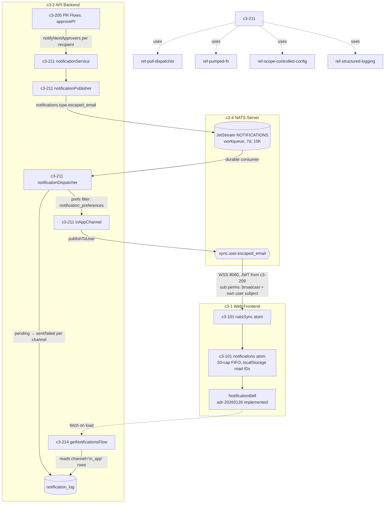

# CROSSCUT-NOTIFICATION-BELL-1 — "A notification was published but a user cannot see it. What path must you trace before blaming the UI?"

## Evidence Commands

```bash
c3() { C3X_MODE=agent bash skills/c3/bin/c3x.sh --c3-dir research/eval/skill-eval/fixtures/acountee/.c3 "$@"; }

c3 search "notification published but user cannot see it - notification delivery path"
c3 read c3-211 --full                                  # Notification System (publisher/dispatcher/channels)
c3 read ref-pull-dispatcher --full                     # channel registration pattern governing c3-211
c3 read ref-sync --full                                # NATS subjects, prefix contract, message shapes
c3 read adr-20260126-user-notification-ui --full       # bell UI decision (status: implemented)
c3 read c3-101 --full                                  # frontend State Management (natsSync, notifications atom)
c3 read c3-214 --full                                  # User Notification Flows (fetch/read/dismiss)
c3 read c3-209 --full                                  # NATS Credential Generator (JWT permission model)
c3 read c3-4 --full                                    # NATS Server container (JetStream, browser perms)
c3 graph c3-211 --depth 1 --format mermaid             # relationships: refs, ADRs, recipe-realtime-sync
c3 search "notification bell dropdown sidebar UI component"
c3 read recipe-realtime-sync --full                    # sync vs notification separation
c3 read adr-20260202-notification-on-step-advance      # upstream trigger gap (status: implemented)
c3 list --flat --compact                               # full topology; rule inventory check
```

## Answer

**Layer:** c3-211 (Notification System), spanning c3-2 (API Backend) → c3-4 (NATS Server (External)) → c3-1 (Web Frontend, via c3-101 and c3-214)

"Published" in this system does **not** mean "delivered to the user." Per c3-211 (Architecture section), `notificationPublisher` publishing means one thing only: a message was written to the JetStream `NOTIFICATIONS` stream on subject `notifications.{type}.{escaped_email}` (Workqueue retention, file storage, 7-day max age, 10K max messages). Between that write and the user's bell there are five more legs, each with its own failure mode. The causal chain, with WHY each hop follows:

### Causal chain (action → mutation → mechanisms → observer → emergent property → failure boundary)

1. **Action/recipient selection — c3-205 (PR Flows) → c3-211 `notificationService`.** `notifyNextApprovers(execCtx, prId)` looks up next approvers from PR data and publishes **one notification per recipient** (c3-211, Components section). WHY this hop matters even though "published" is given: the message is addressed by *email embedded in the subject* — if the approver lookup used a different email than the one the user logs in with, the message was published to a subject the user's session will never be authorized to read (see leg 5). adr-20260202-notification-on-step-advance (status: **implemented** — historical) records that step-advance triggers were once silently missing; the trigger leg has failed before in this codebase.

2. **Durable enqueue — `notificationPublisher` → JetStream `NOTIFICATIONS` stream (c3-211, c3-4).** WHY the next hop follows: the stream is Workqueue — nothing leaves it until a consumer processes it. If `notificationDispatcher`'s durable consumer is down or stuck, the message sits in JetStream and **no downstream artifact exists at all** — no log row, no NATS publish, nothing to fetch. c3-4 documents the stream (`store_dir: /data/jetstream`, NOTIFICATIONS file-based, persistent across restarts) and the backend's required `$JS.API.>` permissions; if those account permissions regressed, consumption breaks while publishing may still appear to work.

3. **Dispatch + side-effect attachment — `notificationDispatcher` (c3-211).** For each consumed message the dispatcher: (1) parses, (2) fetches the user's preferred channels from `notification_preferences` (JSONB per-user channel list, **defaults to `['in_app']`**), (3) creates a `pending` `notification_log` entry **per channel**, (4) calls the channel handler, (5) updates the log to `sent`/`failed`, (6) acks on success / naks on failure (retry). Two traces to run here:
   - **Preference filter:** if the user's `notification_preferences` row excludes `in_app`, the in-app leg is *skipped by design* — the user not seeing it is correct behavior, not a bug anywhere.
   - **Side-effect attachment layer (decisive for "blame the UI"):** the `notification_log` row — the system's only durable per-recipient delivery record, and the very thing the UI's fetch path reads (leg 6) — is attached at the **dispatcher layer**, not the publisher or the flow. So: *no log row* ⇒ the dispatcher never ran for this message (look at legs 2–3); *log row `failed`* ⇒ the channel handler failed (nak/retry, admin-retryable via `retryNotification(execCtx, logId)`); *log row `sent`* ⇒ backend completed, and only now is the frontend a suspect. Channels self-register via `dispatcher.subscribe({channel, handler})` per ref-pull-dispatcher; `notificationController` "validates all required channels are subscribed; throws if any are missing" (c3-211) — so a silently-unregistered `inAppChannel` is guarded at startup, not a likely silent failure.

4. **In-app delivery — `inAppChannel` → NATS real-time + JetStream persistence (c3-211).** `inAppChannel` delivers via "NATS publish (real-time) + JetStream (persistence)". The real-time half is `publisher.publishToUser()` on subject `{prefix}.user.{escaped_email}` (default `sync.user.{escaped_email}`) per ref-sync's NATS Subjects table, with `@` and `.` escaped to `_`. WHY the next hop follows: a real-time publish only reaches a client that is *connected, authorized, and subscribed to that exact subject string at that moment*. recipe-realtime-sync warns sync and notifications "share NATS but are architecturally separate" — notifications are durable, broadcast sync is ephemeral; a healthy delta sync proves nothing about the user-subject leg.

5. **Transport/auth coupling — c3-209 (NATS Credential Generator) → c3-4 (NATS Server).** The browser connects over WSS 8080 using a per-session JWT generated by c3-209 with subscribe permissions of exactly `{prefix}.broadcast` and `{prefix}.user.{escaped_email}` (subscribe-only, WebSocket-only, publish allow empty). WHY this can hide failures: NATS enforces these permissions from the JWT (c3-4, Permission Enforcement + Authentication Flow), so a JWT minted for a *different* email than the notification's subject means the message is routed past the user invisibly. The JWT also "expires after TTL (default 1 hour) — client must reconnect" (c3-209) — an expired session silently stops real-time delivery. And per ref-sync's Subject Prefix Contract, server subjects are prefix-driven (`natsConfig.subjectPrefix`, default `sync`) while "frontend subscriptions currently use `sync.broadcast` and `sync.user.{escaped_email}` directly" — a prefix change breaks the frontend unless changed in lockstep.

6. **Frontend ingestion — c3-101 (State Management) + c3-214 (User Notification Flows).** Two independent client paths must both be checked before the bell itself is blamed:
   - **Live path:** the `natsSync` atom subscribes to both `sync.broadcast` and `sync.user.<email>` and routes `type: 'notification'` messages into the `notifications` atom (c3-101, NATS Sync Wiring; decided in adr-20260126-user-notification-ui, status: **implemented** — current state confirmed by c3-101's live doc). The atom caps items at 50 with FIFO cleanup and tracks read IDs in localStorage (adr-20260126).
   - **Fetch path (covers offline users):** `getNotificationsFlow` (c3-214) fetches up to 50 non-dismissed in-app notifications by reading **notification logs with `channel='in_app'`** — over-fetching `min(51 + dismissedCount, 200)`, filtering dismissed, enriching with read state. WHY this closes the loop: the fetch reads the *dispatcher's* log rows (leg 3) — if dispatch never happened, the fetch is correctly empty and the UI is innocent. Conversely, "dismissed" is a filter, not a delete: a notification the user previously dismissed is invisible *by design*; and with >200 in-app logs plus many dismissals, the 200-row over-fetch cap can clip older items.

**Emergent property:** delivery is two-phase and asynchronous. "Published" only guarantees durable enqueue; user visibility additionally requires (a) the dispatcher to have produced a `sent` in_app log row, and (b) either an authorized live `sync.user.{escaped_email}` subscription at publish time or a later `getNotificationsFlow` fetch of that log row. The notification path is deliberately decoupled from broadcast sync (recipe-realtime-sync), so the rest of the app can look perfectly real-time while notifications are stuck.

**Failure boundary (Step 0a++ item 6):**

| Leg fails | What is preserved | Who observes it |
| --- | --- | --- |
| Dispatcher down / JetStream consumer stuck | Message persists in NOTIFICATIONS (file storage, 7-day max age, 10K cap — beyond those, messages age out/cap) | Nobody in-app: no log row exists, so the admin log and user fetch are both empty. Docs describe no alerting for a stuck consumer — **explicit gap**; closest probe is NATS monitoring port 8222 (c3-4) |
| Preference filter excludes in_app | Other preferred channels (email/slack) still dispatch with their own log rows | User via the other channel; admin via per-channel log rows |
| Channel handler fails | `failed` log row + nak (JetStream retry) | Admin: notification log powers "admin UI retry and monitoring" (c3-211); ref-jtbd J31 maps failure triage to NotificationTable / NotificationTriageFlow, owner c3-211 |
| Real-time NATS leg fails / user offline / JWT expired | The `sent` log row — `getNotificationsFlow` recovers it on next load | User, but only after reload/fetch; no doc describes the recipient being told a live push was missed |
| Subject mismatch (wrong email, escaping, prefix drift) | Log row may say `sent` even though the user can never receive it | Nobody directly — `sent` reflects the publish, not receipt; **this is the most deceptive leg** |

**No `rule-*` entities found** — `c3 list --flat --compact` over the full topology contains containers, components, refs, recipes, and ADRs only; no rule entities govern this path.

**Graph:** (relationships from `c3 graph c3-211 --depth 1 --format mermaid`, rendered in agent TOON; mermaid below reproduces those edges plus the traced path documented in c3-211 / adr-20260126-user-notification-ui)



### Concrete checks, in trace order (run these before touching UI code)

1. **`notification_log` row for this user, `channel='in_app'`** (admin notification log UI, c3-211): no row ⇒ dispatcher never ran — check JetStream consumer; `failed` ⇒ inspect error details, retry via `retryNotification(execCtx, logId)`; `sent` ⇒ backend done, continue down.
2. **`notification_preferences` row**: does the user's JSONB channel list include `in_app`? (Default is `['in_app']`, but an explicit row can exclude it.)
3. **Recipient email**: the email `notifyNextApprovers` resolved must equal the user's login email; verify the subject `sync.user.{escaped_email}` with `@`/`.` → `_` escaping matches what the client computes (same escaping rule documented in c3-209, ref-sync, and adr-20260126).
4. **JetStream NOTIFICATIONS stream**: stream/consumer health via NATS monitoring (port 8222, `curl http://nats-server:8222/healthz`, c3-4); message older than 7 days or beyond 10K cap is gone.
5. **Subject prefix**: confirm `NATS_SUBJECT_PREFIX` is still `sync` — the frontend hardcodes `sync.*` (ref-sync Subject Prefix Contract; c3-101).
6. **Session JWT**: minted for this user's email, within 1h TTL, subscribe perms include their own user subject (c3-209 Permission Model).
7. **Only now the UI**: `natsSync` connected and dual-subscribed (c3-101); notification not dismissed earlier (c3-214 filters dismissed — by design invisible); not clipped by the 50-item atom cap / 200-row over-fetch cap; read-ID localStorage state.

## Grounding

| Material claim | Evidence source |
| --- | --- |
| "Published" = write to JetStream NOTIFICATIONS, subject `notifications.{type}.{escaped_email}`; workqueue, file storage, 7-day max age, 10K max messages | `c3 read c3-211 --full` — notificationPublisher section |
| `notifyNextApprovers` looks up next approvers and publishes one notification per recipient; `retryNotification(execCtx, logId)` republishes from log | `c3 read c3-211 --full` — notificationService section |
| Dispatcher steps: parse → fetch preferred channels → `pending` log per channel → handler → `sent`/`failed` → ack/nak | `c3 read c3-211 --full` — notificationDispatcher section |
| `notification_preferences` JSONB defaults to `['in_app']`; dispatcher filters channels against it | `c3 read c3-211 --full` — User Preferences section |
| `notification_log` tracks every dispatch attempt (`pending`/`sent`/`failed`) and "powers admin UI retry and monitoring" | `c3 read c3-211 --full` — Notification Log section |
| inAppChannel = "NATS publish (real-time) + JetStream (persistence)"; channels self-register via `dispatcher.subscribe`; controller throws if required channels missing | `c3 read c3-211 --full` — Built-in Channels / notificationController; `c3 read ref-pull-dispatcher --full` |
| User subject `{prefix}.user.{escaped_email}` via `publisher.publishToUser()`; escaping `@`/`.` → `_`; prefix contract: frontend hardcodes `sync.*`, must change in lockstep | `c3 read ref-sync --full` — NATS Subjects + Subject Prefix Contract |
| Browser JWT: subscribe-only to `{prefix}.broadcast` + `{prefix}.user.{escaped_email}`, WEBSOCKET only, TTL 1h, must reconnect | `c3 read c3-209 --full` — Permission Model / Security |
| NATS enforces pub/sub permissions from JWT; browser read-only; backend needs `$JS.API.>`; port 8222 health check; NOTIFICATIONS file-based persistent | `c3 read c3-4 --full` — Responsibilities / Required Permissions / JetStream / Health Check |
| `natsSync` subscribes to both `sync.broadcast` and `sync.user.<email>`, routes notification messages to `notifications` atom | `c3 read c3-101 --full` — Atoms table + NATS Sync Wiring |
| Bell UI decision: dual subscription, notifications atom (max 50 FIFO), localStorage read IDs, NotificationBell in AppSidebar; problem statement "notifications are being sent but users can't see them" | `c3 read adr-20260126-user-notification-ui --full` (status: implemented — historical record; current state confirmed by c3-101 live doc) |
| `getNotificationsFlow` reads notification logs `channel='in_app'`, over-fetches `min(51 + dismissedCount, 200)`, filters dismissed, caps at 50; read and dismiss are independent states | `c3 read c3-214 --full` — Operations + Fetch Strategy |
| Sync and notifications are architecturally separate (durable vs ephemeral); confusing them breaks both | `c3 read recipe-realtime-sync --full` — Narrative + Risk |
| Step-advance notifications were historically missing in approvePr/approveAll | `c3 read adr-20260202-notification-on-step-advance` (status: implemented — historical) |
| Failure triage job J31 → NotificationTable / NotificationTriageFlow, owner c3-211 | `c3 search` result row for ref-jtbd |
| No `rule-*` entities found | `c3 list --flat --compact` full output (containers/components/refs/recipes only; grep for "rule" over the listing returned nothing) |
| Graph relationships (c3-211 uses ref-pull-dispatcher/ref-pumped-fn/ref-scope-controlled-config/ref-structured-logging; affected by adr-20260126, adr-20260202, adr-20260305; recipe-realtime-sync adjacent) | `c3 graph c3-211 --depth 1 --format mermaid` (agent-mode TOON node list) |

## Caveats

- **Stuck-consumer observability gap is real, not inferred:** no read surfaced any alerting/monitoring hook for an idle JetStream durable consumer; c3-4 documents only the 8222 monitoring port and `/healthz`. If the dispatcher leg dies, the docs name no observer — reported as a gap per Step 0a++ item 6.
- **`sent` means published, not received:** c3-211's log states track dispatch attempts; no document claims end-user receipt confirmation. A subject/email mismatch can therefore coexist with a `sent` log row (derived from c3-211 log semantics + c3-209/ref-sync subject construction; the combination is the inference, each half is documented).
- **adr-20260126-user-notification-ui and adr-20260202-notification-on-step-advance are `status: implemented`** — historical work orders, per query guidance not architectural truth; every behavioral claim sourced from them was cross-checked against the live docs c3-101 / c3-211 / c3-214, which agree.
- **`c3 graph --format mermaid` rendered TOON in agent mode**, so the mermaid block above is reproduced from the graph's node/edge list plus the architecture diagrams inside c3-211 and adr-20260126 — not raw tool output.
- The 200-row over-fetch clip in `getNotificationsFlow` is a documented cap (c3-214); whether it bites depends on the user's dismissed-notification volume, which no doc quantifies.
