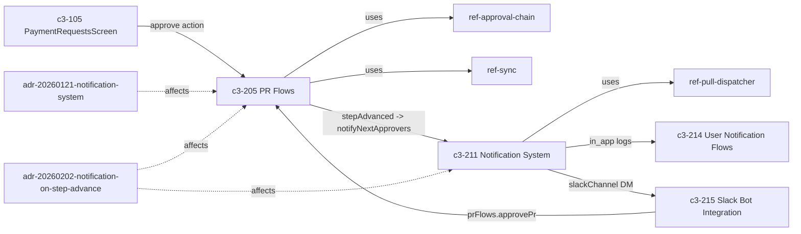

# Why do later-step approvers hear about a PR only after the prior step completes?

## Evidence Commands

```bash
c3 search "notification when approval step advances on a PR"
c3 read recipe-approval-workflow --full
c3 read ref-approval-chain --full
c3 read c3-205 --full
c3 read c3-211 --full
c3 read adr-20260202-notification-on-step-advance --full
c3 read adr-20260121-notification-system --full
c3 read ref-sync --full
c3 read ref-pull-dispatcher --full
c3 read c3-214 --full
c3 read c3-215 --full
c3 graph c3-205 --depth 1 --format mermaid
c3 graph c3-211 --depth 1 --format mermaid
```

## Answer

**Layer:** `c3-205` (PR Flows) -> `c3-211` (Notification System), governed by `ref-approval-chain` and decided by `adr-20260121-notification-system` + `adr-20260202-notification-on-step-advance`.

**Short version:** It is a deliberate two-part decision, not an accident. (1) The notification system was scoped so that only the users in the **next actionable step** are ever notified — "notify all approvers at once" was explicitly rejected as information overload (`adr-20260121-notification-system`). (2) The only moment a step-N+1 user *becomes* the next actionable approver is the commit of step N's completion, so the `approvePr`/`approveAll` flows gate the notification call on an explicit `stepAdvanced` flag returned by the approval service (`adr-20260202-notification-on-step-advance`). Recipients are computed from the PR's `current_step` *after* the advance, so the mechanism cannot address step-N+1 users any earlier.

### Causal chain (action -> mutation -> mechanism -> observer -> emergent property -> failure boundary)

**1. Action owner — `approvePr` / `approveAll` flows in `c3-205`.**
Entry paths into the approve capability: the web UI (`c3-105` shows step-by-step approval progress and whether the current user can act — per its search snippet), and the Slack bot `c3-215`, whose inbound `approve_pr` action "Executes `prFlows.approvePr` or `prFlows.rejectPr` within a DB transaction" (`c3-215` Architecture/slackActions sections). Both enter at the **flow layer** — this matters for the failure boundary below.
*Why the next hop follows:* the `c3-205` Operations table binds `approvePr` to "Records current user's approval; if step advances, notifies next approvers | sync, conditional notification", and the `ref-approval-chain` Wiring section routes `approvePr.flow -> prService.approve`.

**2. State mutation owner — `prService.approve`, governed by `ref-approval-chain`.**
The service inserts an `approval_record`, then runs the **app-level** mode check (`ref-approval-chain` "Mode Validation (App-Level)"): `anyof` = one assigned approver suffices, `allof` = every assigned user must have a record. Only when `isProgressed` is true does `updateApprovalCurrentStep` move `current_step` from N to N+1 (`ref-approval-chain` Happy Path + Golden Example "Approve + Step Advance"). This is the structural reason "prior step completes" is the trigger: **step N+1 does not exist as the pending step until the mode condition for step N is satisfied** — under `allof`, a single approval at step N advances nothing, and per `adr-20260202-notification-on-step-advance` Rationale, inferring from `next_approver` presence was rejected precisely because "next_approver exists even when step didn't advance (multiple approvers in same step)".
*Why the next hop follows:* `adr-20260202-notification-on-step-advance` Decision 1 added `stepAdvanced: isProgressed && !willEnd` to the service return — the explicit contract "step advanced, you should notify" — because before that fix the advance happened but "this information is not returned to the calling flow, so the flow cannot know to trigger notifications" (its Problem section: step 1+ users were never notified).

**3. Notification mechanism — `c3-211` via `ref-pull-dispatcher`.**
The flow (not the service) calls `notificationService.notifyNextApprovers(execCtx, prId)`, which "looks up next approvers from PR data, publishes one notification per recipient" (`c3-211` notificationService section). Because recipients are derived from the PR's approval state, the lookup resolves to step-N+1 users **only after** `current_step` was advanced in step 2 — a second mechanical reason the notification cannot reach them earlier. The publish path (`c3-211` Architecture): `notificationService -> notificationPublisher -> NATS JetStream NOTIFICATIONS stream` on subjects `notifications.{type}.{escaped_email}` (Workqueue retention, file storage, 7-day max age, 10K max messages), consumed by `notificationDispatcher` (durable consumer) which filters channels against per-user `notification_preferences` (JSONB, default `['in_app']`), writes a `pending` row in `notification_log` per channel, dispatches, then marks `sent`/`failed` and acks/naks. Channels self-register via `dispatcher.subscribe({ channel, handler })` per `ref-pull-dispatcher`.
*Why the next hop follows:* the dispatcher's channel handlers are the only thing that turns the queued message into something a user observes.

**4. Observers — per-user channels, distinct from broadcast sync.**
- `inAppChannel`: "NATS publish (real-time) + JetStream (persistence)" (`c3-211` Built-in Channels); the targeted user subject is `{prefix}.user.{escaped_email}` (default `sync.user.{escaped_email}`) carrying a `NotificationMessage` (`ref-sync` NATS Subjects + Delta Payload Shape). The bell UI reads these via `c3-214` (`getNotificationsFlow` fetches non-dismissed `channel='in_app'` logs).
- `emailChannel`: SMTP with HTML template (`c3-211`).
- `slackChannel`: DM via the Slack bot — `notificationDispatcher -> slackChannel -> bot.openDM -> approvalRequestCard`; "Skips silently if no Slack user mapping exists" (`c3-215`).
Contrast: the **sync** leg (`ref-sync`) is a *separate* observable — `prService.approve` emits a delta on `sync.broadcast` to **all** clients on every mutation ("Broadcast to all, filter on client"), so everyone's PR list updates even when no notification fires. Notification is the targeted, step-advance-only signal; sync is the untargeted state mirror.

**5. Emergent property.**
Step-advance-only, next-step-only, per-recipient notification: a step-N+1 approver gets exactly one actionable ping, at exactly the moment they can act. This falls out of two rejected alternatives recorded in the ADRs — "Notify all approvers at once | Information overload, only next step is actionable" (`adr-20260121-notification-system` Rationale) and "Notify on every approval | Wasteful - only notify when step actually advances" + "Notify when PR fully approved | No action required - PR is done" (`adr-20260202-notification-on-step-advance` Rationale). The notification is also async/non-blocking: "Notifications fire async with error suppression (logged, not thrown)" (`c3-205` Approval Integration; same in `recipe-approval-workflow` Cross-Cutting Contracts).

**6. Failure boundary.**
- **Notification leg fails:** the approval mutation, audit (DB trigger on `pr` per `recipe-approval-workflow`), and sync delta are preserved — errors are suppressed and logged, never thrown back into the flow (`c3-205` Approval Integration). The approver misses the push but can still discover the PR via the broadcast sync delta in the UI or the Slack `/pending` command (`c3-215` slackCommands filters PRs where the user is next approver). Downstream, the dispatcher naks on failure for JetStream retry, `notification_log` records `failed` with error details, and `retryNotification(execCtx, logId)` "republishes a failed notification from the log" powering admin retry (`c3-211` notificationService + Notification Log).
- **Racing approvals:** "If two approvals race and both trigger notifications, `notificationPublisher.publish` is idempotent (JetStream dedupes by message ID)" (`adr-20260202-notification-on-step-advance` Concurrency/Idempotency).
- **Side-effect attachment layers (bypass analysis):** the notification dispatch is attached at the **flow layer** — `adr-20260202-notification-on-step-advance` explicitly rejected "Notify in prService.approve" because "Services should not trigger side effects; flows orchestrate per C3 pattern". The sync **delta** is attached at the **service layer** ("Services call sync.emit() after DB write", `ref-sync` Convention), and the sync **ack** at the flow layer. The audit write is attached at the **storage layer** (DB trigger on `pr`, `recipe-approval-workflow`). Consequence per entry path: UI and Slack-bot approvals both enter through `prFlows.approvePr`, so all three side effects fire; a hypothetical direct `prService.approve` call would advance the step, emit the delta, and hit the audit trigger, but **skip the notification and the ack** — step-N+1 approvers would silently never be pinged. The documented step-advancing paths audit (`adr-20260202-notification-on-step-advance`) lists only `approvePr`, `approveAll` (advance + notify), `requestApprovals` (sets step 0, already notifies first-step approvers), and reject/recall (revert, no notification); "Admin override | Not implemented".

**Graph** (relationships from `c3 graph c3-205` / `c3 graph c3-211` output):



**ADR status labels:** `adr-20260121-notification-system` — `status: implemented` (historical work order; its mechanism is confirmed live by current `c3-211` and `c3-205` docs). `adr-20260202-notification-on-step-advance` — `status: implemented` (historical; confirmed current by the `c3-205` Operations row "approvePr ... if step advances, notifies next approvers" and `ref-approval-chain` Wiring "`notificationService.notifyNextApprovers (if stepAdvanced)`"). Neither is superseded by any newer ADR in the graph/search outputs collected.

**Direct vs transitive dependents:** direct — `c3-205` (calls `notifyNextApprovers`), `c3-211` (publishes/dispatches), `c3-215` (enters via `prFlows.approvePr`; consumes via `slackChannel`). Transitive — `c3-214` (reads `notification_log` rows the dispatcher wrote; never touches the approve path), `c3-105` (UI observer of sync deltas + initiator of the flow).

**Concrete checks if you change this behavior** (from `adr-20260202-notification-on-step-advance` Verification + `c3-211`):
- Create a PR with a 3-step chain (A step 0, B step 1, C step 2); request approvals -> A notified; approve as A -> B notified; approve as B -> C notified; approve as C -> **no** notification (PR done).
- Test an `allof` step with two approvers: first approval must NOT notify the next step.
- Test `approveAll` with PRs at different steps -> per-PR conditional notifications.
- Assert `notification_log` rows per recipient/channel and `notification_preferences` filtering (default `['in_app']`).
- Probe the failure mode: break a channel, confirm the approve flow still succeeds, the log row goes `failed`, JetStream naks/retries, and admin retry republishes.
- Owner surfaces to touch: `c3-205` flows (`approvePr`/`approveAll` gating), `prService.approve` return contract (`stepAdvanced`), `c3-211` `notifyNextApprovers` recipient lookup; runtime values: `NOTIFICATIONS` stream config (Workqueue, 7-day), subjects `notifications.{type}.{escaped_email}` and `sync.user.{escaped_email}` (email escaping: `@`/`.` -> `_`).

## Grounding

| Material claim | Evidence source |
| --- | --- |
| Only next-step users are notified; "notify all approvers at once" rejected as information overload | `c3 read adr-20260121-notification-system --full` — Decision 3 + Rationale table |
| Notification gated on explicit `stepAdvanced: isProgressed && !willEnd` flag returned by `prService.approve`; flow performs the call | `c3 read adr-20260202-notification-on-step-advance --full` — Decision 1 & 2 |
| Pre-fix bug: step 1+ users never notified because advance info wasn't returned to the flow | same ADR — Problem section |
| "Notify on every approval" rejected as wasteful; "notify when fully approved" rejected as non-actionable; "infer from next_approver" rejected as fragile; "notify in service" rejected (flows orchestrate side effects) | same ADR — Rationale table |
| Step advances only when `anyof`/`allof` app-level mode check passes; `current_step` moves N->N+1 via `updateApprovalCurrentStep`; `notifyNextApprovers (if stepAdvanced)` wiring | `c3 read ref-approval-chain --full` — Mode Validation, Happy Path, Wiring, Golden Example |
| `approvePr` op = "if step advances, notifies next approvers; sync, conditional notification"; notifications fire async with error suppression (logged, not thrown) | `c3 read c3-205 --full` — Operations table + Approval Integration |
| `notifyNextApprovers` looks up next approvers from PR data, one notification per recipient; publisher->JetStream `NOTIFICATIONS` (`notifications.{type}.{escaped_email}`, Workqueue, 7-day)->dispatcher (durable, preferences filter, `pending`/`sent`/`failed` log, ack/nak); channels in_app/email/slack; `retryNotification` republishes from log | `c3 read c3-211 --full` — notificationService, notificationPublisher, notificationDispatcher, Built-in Channels, Notification Log |
| Channels self-register via `dispatcher.subscribe()` (dependency inversion) | `c3 read ref-pull-dispatcher --full` — Choice + Pattern |
| Sync delta broadcast to ALL clients on every mutation (`sync.broadcast`); targeted user subject `sync.user.{escaped_email}`; `NotificationMessage` shape; services emit deltas, flows ack; email escaping `@`/`.`->`_` | `c3 read ref-sync --full` — NATS Subjects, Delta Payload Shape, Convention |
| Slack bot approve enters via `prFlows.approvePr` in a DB transaction; `slackChannel` DMs via `bot.openDM`; skips silently without user mapping; `/pending` lists next-approver PRs | `c3 read c3-215 --full` — slackActions, slackChannel, slackCommands |
| Bell UI reads `channel='in_app'` notification logs (fetch/read/dismiss) | `c3 read c3-214 --full` — Operations + Fetch Strategy |
| Every mutation emits sync delta then flow acks; audit captured via DB trigger on `pr`; notifications fire-and-forget | `c3 read recipe-approval-workflow --full` — Cross-Cutting Contracts |
| Racing approvals deduped (JetStream message-ID idempotency) | `c3 read adr-20260202-notification-on-step-advance --full` — Concurrency/Idempotency |
| Step-advancing paths audit (approvePr/approveAll yes; requestApprovals step 0; reject/recall no; admin override not implemented) | same ADR — Step-Advancing Paths Audit table |
| affects edges (`adr-20260202-notification-on-step-advance` -> c3-205, c3-211) and citing relationships | `c3 graph c3-205 --depth 1 --format mermaid`, `c3 graph c3-211 --depth 1 --format mermaid` |
| `c3-105` shows step-by-step approval progress and whether current user can act | `c3 search` result snippet for `c3-105` |

## Caveats

- **No `rule-*` entities found** governing this flow — the search and both graph outputs (`c3 graph c3-205`, `c3 graph c3-211`) returned only `ref-*`, `adr-*`, `recipe-*`, and component/container entities; governance here is via refs, not rules.
- **`unapprovePr` reverts a step with no documented notification**: the `c3-205` Operations row lists side effects as "sync" only, and the `adr-20260202-notification-on-step-advance` Step-Advancing Paths Audit covers reverts only for reject/recall ("approval chain reset — no"). Whether prior-step approvers should be re-notified after an unapprove revert is not addressed in any read doc — an explicit gap, not a guess. A related fix exists (`adr-20260408-unapprove-revert-fix`, surfaced in search: unapprove returns the PR to the correct pending step), but I did not read it in full; it addresses step correctness, and nothing in its search snippet mentions notification.
- **Direct service-call bypass is a documented-contract inference, not an observed path**: no doc shows any caller invoking `prService.approve` outside the flows; the skip-notification consequence follows from the flow-layer attachment declared in `adr-20260202-notification-on-step-advance` Rationale and is stated as the contract's implication.
- **Both cited ADRs are `status: implemented` (historical work orders)**; their content was cross-checked against current `c3-205`, `c3-211`, and `ref-approval-chain` docs, which agree. Code itself was not read (component code-map exploration was not required to answer the why; the fixture docs carry the contract).
- `c3 search` with the literal question failed (`SQL logic error: no such column: step` — FTS choked on the hyphenated "later-step"); a rephrased query was used. Noted in case search behavior matters for reproduction.
