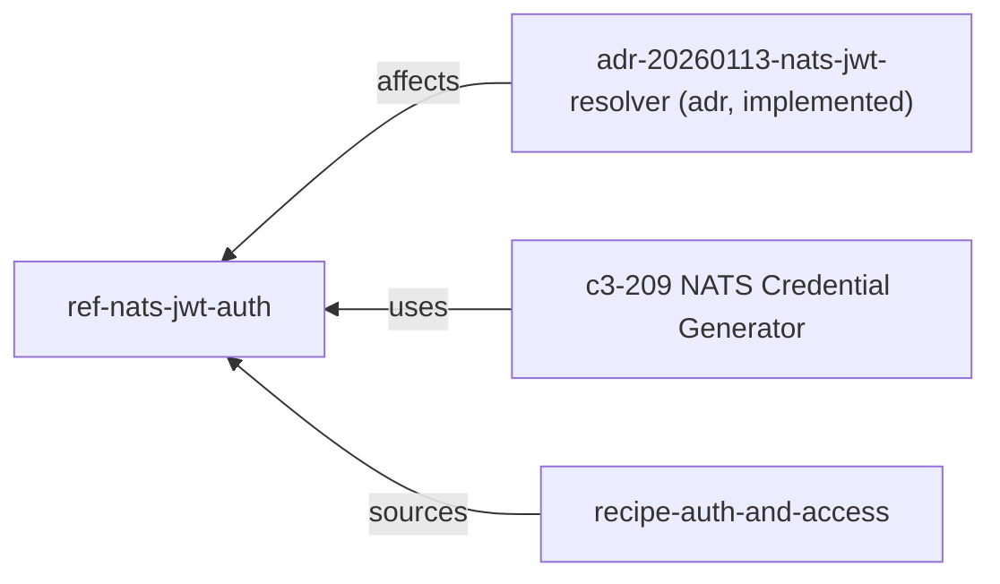

# What breaks if I change NATS websocket authentication?

## Evidence Commands

```bash
c3 search "NATS websocket authentication"
c3 read ref-nats-jwt-auth --full
c3 graph ref-nats-jwt-auth --direction reverse --depth 2
c3 graph ref-nats-jwt-auth --direction reverse --format mermaid
c3 read c3-209 --full
c3 graph c3-209 --direction reverse --depth 1
c3 read ref-sync --full
c3 read adr-20260113-nats-jwt-resolver
c3 read adr-20260112-nats-auth-callout
c3 read adr-20260112-nats-websocket-sync
c3 search "client websocket sync subscription natsSync"
c3 read c3-101 --full
c3 read c3-4 --full
c3 read c3-211 --full
c3 read recipe-realtime-sync --full
c3 read recipe-auth-and-access --full
c3 lookup src/routes/_authed.tsx ; c3 lookup '**/natsSync.ts' ; c3 lookup infra/nats.conf ; c3 lookup '**/natsCredentialGenerator*'
c3 list --flat   # rule inventory: zero rule-* entities in 66-entity topology
```

## Answer

**Layer:** ref-nats-jwt-auth (NATS JWT Resolver Authentication) — the governing ref; runtime owners are c3-209 (server credential generation), c3-4 (broker validation/enforcement), c3-101 (browser consumption).

### Impact Graph (reverse — who depends on the changed mechanism)



The reverse graph of ref-nats-jwt-auth is small (adr-20260113-nats-jwt-resolver, c3-209, recipe-auth-and-access) — but the graph understates the blast radius, because the impact travels through the *credential at runtime*, not through doc citations. The credential chain below is the real dependency surface.

### Causal chain (credential generation → enforcement → dependent runtime paths)

1. **Credential generation (c3-209, governed by ref-nats-jwt-auth).** On every authenticated page load, the server-side `natsCredentialGenerator` atom signs a per-session User JWT with the account NKey (`natsConfig.accountSeed` / `NATS_ACCOUNT_SEED`) and embeds permissions: subscribe-only to `{prefix}.broadcast` and `{prefix}.user.{escaped_email}` (email escaped `@`/`.` → `_`), empty publish allow, WEBSOCKET-only connection, 1h TTL. Credentials are handed to the browser via the loader (`loaderData.natsCredentials` in `_authed.tsx`). (ref-nats-jwt-auth Credential Flow; c3-209 How It Works + Permission Model.)
2. **Enforcement (c3-4 NATS Server, external container).** The broker validates the JWT signature with a MEMORY resolver preloaded with the account public key (`infra/nats.conf` `resolver_preload`, `APP_ACCOUNT_PUBLIC_KEY`), checks expiry, and enforces the embedded pub/sub permissions — no auth-callout service exists. (ref-nats-jwt-auth NATS Server Config; c3-4 Responsibilities + Authentication Flow.)
3. **Consumption (c3-101 State Management).** The `natsSync` atom receives credentials via `natsCredentialsTag` from loader data, connects over WSS with `jwtAuthenticator`/`credsAuthenticator`, and subscribes to exactly two subjects: `sync.broadcast` (deltas + acks) and `sync.user.<email>` (notifications). (c3-101 SSR Hydration + NATS Sync Wiring.)
4. **Dependent mechanism A — real-time sync (ref-sync).** Services emit deltas, flows emit acks on `{prefix}.broadcast` with a shared `executionId`; the client's `executionTracker` resolves `result.wait()` when a matching message arrives. (ref-sync Architecture + Execution ID Contract.)
5. **Dependent mechanism B — in-app notifications (c3-211).** The `inAppChannel` delivers via "NATS publish (real-time) + JetStream (persistence)"; the real-time leg lands on `sync.user.{escaped_email}` and is received by the same authenticated WebSocket subscription in c3-101. (c3-211 Built-in Channels; c3-101 NATS Sync Wiring; ref-sync NATS Subjects.)

### What concretely breaks, by change type

**A. Key/resolver mismatch (rotate `NATS_ACCOUNT_SEED` without updating `resolver_preload`/`APP_ACCOUNT_PUBLIC_KEY`, or vice versa).** Every browser WS connection is rejected ("Invalid JWT signature" / "Connection rejected" — ref-nats-jwt-auth Troubleshooting). The server's own publishing is *not* gated by this path — the server uses full TCP access (ref-nats-jwt-auth Permissions Model; c3-4 Wiring: backend on TCP 4222) — so this is the classic coupling where the upstream feature still looks healthy: HTTP `/act` mutations succeed, DB writes commit, deltas/acks are published into NATS, but no browser receives them.

**B. Permission shape change in the JWT (c3-209 Permission Model).** Permissions are *embedded in the JWT* and enforced by c3-4, so a generation-side change silently changes what clients may receive:
- Drop/alter the `{prefix}.user.{escaped_email}` subscribe grant → in-app real-time notifications stop arriving (c3-211 inAppChannel real-time leg) while broadcast sync still works.
- Drop/alter `{prefix}.broadcast` → deltas and acks stop; notifications may still arrive.
- Change the email-escaping convention (`@`/`.` → `_`) on only one side → the user subject in the JWT grant no longer matches the subject the publisher targets (`publishToUser()`, ref-sync NATS Subjects), killing per-user delivery with no connection error at all.
- Grant publish rights → violates the documented security posture "No publish: clients cannot write to NATS" (ref-nats-jwt-auth Security Considerations; c3-209 Security).

**C. Credential handoff change (shape, timing, or location of `loaderData.natsCredentials`).** c3-101 builds its scope with `natsCredentialsTag(loaderData.natsCredentials)`; changing the generator's return shape (`{ jwt, seed }` per c3-209; ref-nats-jwt-auth calls it `jwt` + `nkey`) or moving generation out of the `_authed.tsx` loader breaks the client connect in `natsSync` (c3-101 SSR Hydration).

**D. TTL change.** JWTs expire after 1h and "client must reconnect" (c3-209 Security). Shortening TTL increases mid-session expiry events; the docs read so far do not document an automatic re-credential flow (credentials are generated at page load — ref-nats-jwt-auth), so an expired session degrades to the failure boundary below until reload.

**E. Subject-prefix interaction.** JWT grants are prefix-driven (`natsConfig.subjectPrefix`, default `sync`) but the frontend subscribes to literal `sync.broadcast`/`sync.user.*` — "if prefix changes from `sync`, frontend subscription wiring must change in lockstep" (ref-sync Subject Prefix Contract; c3-101 NATS Sync Wiring). An auth change that touches the prefix breaks client subscriptions even with valid credentials.

**F. Weakening/removing auth.** The pre-auth state is documented: "NATS WebSocket connections are currently open... Any client with the WebSocket URL can connect and subscribe to sync messages, bypassing the application's auth layer" (adr-20260112-nats-auth-callout Problem, status: superseded — used here as historical evidence of the open-access failure mode). This is severe because sync deliberately broadcasts to all and relies on client-side filtering: "Broadcast to all, filter on client; RBAC filtering happens in UI atoms" (ref-sync Convention). The JWT gate is therefore the *only* server-side barrier between an anonymous WS client and every user's invoice/PR/payment deltas.

### Direct vs transitive dependents

| Entity | Type | Impact | Reason (from read) |
|--------|------|--------|--------------------|
| ref-nats-jwt-auth | ref | direct | The governing contract itself; must be updated with any auth change |
| c3-209 | component | direct | Cites ref-nats-jwt-auth; generates the JWT/nkey and embedded permissions |
| c3-4 | container | direct | Validates JWTs via MEMORY resolver preload; enforces embedded permissions (Responsibilities) |
| c3-101 | component | direct | Consumes credentials via `natsCredentialsTag`; `natsSync` connects with JWT auth (NATS Sync Wiring) |
| adr-20260113-nats-jwt-resolver | adr | direct | implemented — the live mechanism's decision record; affects c3-0, c3-1, c3-2, ref-nats-jwt-auth |
| recipe-auth-and-access | recipe | direct | Documents NATS auth as a layer; narrative must stay true |
| ref-sync | ref | transitive | Its delivery leg (deltas/acks on `{prefix}.broadcast`) rides the authenticated WS; contract text itself unchanged |
| c3-211 | component | transitive | inAppChannel real-time leg publishes to the user subject the JWT must grant; reached through subject permissions |
| c3-104, c3-105 | components | transitive | Cite ref-sync (ref-sync Cited By); UI staleness when deltas stop |
| c3-205, c3-206, c3-207, c3-212 | components | transitive | Flow emitters citing ref-sync; their emits still succeed (server TCP) but stop reaching browsers |
| ref-zerobased-dev | ref | transitive | Documents the local NATS WebSocket endpoint (`http://nats-80.acountee.localhost`); dev-env URL/auth must stay consistent |

Explicitly **not** affected: HTTP authentication (c3-213 / ref-authentication). recipe-auth-and-access states NATS auth is "Separate from HTTP auth — NATS has its own identity layer". Login, sessions, and RBAC keep working when WS auth breaks.

### Failure boundary

If WS auth fails (rejected connection or expired JWT): server-side everything is preserved — mutations, DB writes, delta/ack publishes (server publishes over TCP with full access, not the changed WS path). What is lost is *delivery to browsers*: the originating client's `result.wait()` degrades to the 2s timeout fallback ("a UX optimization, not correctness-critical" — ref-sync Execution ID Contract), so actions feel sluggish but complete; other clients see stale data until reload; in-app real-time notifications stop, but JetStream-persisted notifications and the `notification_log` survive (c3-211: durable workqueue stream, 7-day retention; recipe-realtime-sync: "notifications are durable, sync is ephemeral"). Observers: end users (stale UI, sluggish actions, silent bell), and operators via the NATS monitoring port 8222 `healthz` (c3-4 Health Check) plus the troubleshooting checks in ref-nats-jwt-auth. In the opposite failure direction (auth weakened), nobody observes anything — open subscribe access to `sync.broadcast` leaks all users' data silently (adr-20260112-nats-auth-callout Problem; ref-sync broadcast-to-all convention).

### Side-effect attachment layers

Sync emits attach at the **service layer** (`sync.emit()` after DB write), acks at the **flow layer** (`sync.ack(executionId)`), notifications at the **flow → notificationService → JetStream** path (ref-sync Convention; c3-211 Architecture). WS auth sits **below all of them, on the client delivery leg only** — changing it skips no server-side side effect; it gates only whether browsers receive what was emitted.

### ADR status labels

- adr-20260113-nats-jwt-resolver — **implemented, current mechanism** (status: implemented; JWT resolver, no auth callout — matches ref-nats-jwt-auth and c3-4 Wiring "no external auth callout").
- adr-20260112-nats-auth-callout — **superseded** (body: "Superseded - 2026-01-13. Replaced by JWT resolver approach"). Do not implement against it; cited only for the open-access problem statement.
- adr-20260112-nats-websocket-sync — **historical** (implemented 2026-01-12; its "NATS auth callout" plan was overtaken by the JWT resolver per the two later ADRs).

### Verification (run these after any auth change)

| Check | How |
|-------|-----|
| Signing/validation keys match | Confirm `NATS_ACCOUNT_SEED` (app env, c3-209 Configuration) signs JWTs the `resolver_preload` account public key in `infra/nats.conf` verifies (ref-nats-jwt-auth NATS Server Config; c3-4 env vars) |
| Client can connect | Load an authenticated page; assert `natsSync` WS connect succeeds with `loaderData.natsCredentials` (c3-101 SSR Hydration); on failure walk ref-nats-jwt-auth Troubleshooting |
| Broadcast leg alive | Perform a mutation in one browser, assert delta arrives on `sync.broadcast` in another, and `result.wait()` resolves **before** the 2s timeout (ref-sync Golden Examples) — timeout-resolution is the sluggish-degradation tell |
| Per-user leg alive | Trigger an approval notification; assert message on `sync.user.{escaped_email}` reaches the notifications store (c3-211 inAppChannel; c3-101 NATS Sync Wiring); verify email escaping matches on both generator and publisher |
| Permissions still least-privilege | Attempt a client-side `publish` and a subscribe outside the granted subjects; both must be denied (c3-209 Permission Model; c3-4 Permission Model) |
| Negative auth probe | Connect with no/expired/garbage JWT to the WSS port; connection must be rejected (guards against regressing to the open state in adr-20260112-nats-auth-callout) |
| TTL behavior | Hold a session past the JWT TTL; confirm the documented degradation (reconnect required) and that UI recovers on reload (c3-209 Security) |
| Broker health | `curl http://nats-server:8222/healthz` (c3-4 Health Check) |
| Docs follow the change | Update ref-nats-jwt-auth + c3-209 (and c3-4/c3-101 if subjects/handoff changed); `c3 check`; per skill contract a change starts with `c3 add adr <slug>` |

## Grounding

| Material claim | Evidence source |
|---|---|
| JWT resolver pattern: server signs user JWT, NATS validates via account public key, no auth callout | `c3 read ref-nats-jwt-auth --full` (Goal, Choice, NATS Server Config) |
| Credentials generated at page load in loader, `loaderData.natsCredentials`, 1h expiry | `c3 read ref-nats-jwt-auth --full` (Choice, Credential Flow) |
| Direct citers of the auth ref = adr-20260113-nats-jwt-resolver, c3-209, recipe-auth-and-access | `c3 graph ref-nats-jwt-auth --direction reverse --depth 2` |
| c3-209 builds subscribe-only perms on `{prefix}.broadcast` + `{prefix}.user.{escaped_email}`, empty publish, WEBSOCKET-only, returns `{ jwt, seed }`, email escaping `@`/`.`→`_` | `c3 read c3-209 --full` (How It Works, Permission Model) |
| Broker validates with MEMORY resolver preload, enforces embedded permissions, browser WSS 8080, backend TCP 4222, no external auth callout | `c3 read c3-4 --full` (Wiring, Responsibilities, Ports, Permission Model) |
| Client receives creds via `natsCredentialsTag`, connects with JWT auth, subscribes to exactly `sync.broadcast` + `sync.user.<email>`; literal `sync` prefix | `c3 read c3-101 --full` (SSR Hydration, NATS Sync Wiring) |
| Two-layer sync (service deltas / flow acks), executionId correlation, `result.wait()` = UX optimization with 2s timeout fallback | `c3 read ref-sync --full` (Architecture, Execution ID Contract) |
| Broadcast-to-all with client-side RBAC filtering | `c3 read ref-sync --full` (Convention) |
| Prefix lockstep requirement | `c3 read ref-sync --full` (Subject Prefix Contract) + `c3 read c3-101 --full` (NATS Sync Wiring) |
| ref-sync citers (c3-104, c3-105, c3-205, c3-206, c3-207, c3-212, c3-209, c3-211) | `c3 read ref-sync --full` (Cited By) |
| inAppChannel = NATS real-time + JetStream persistence; NOTIFICATIONS stream durable (workqueue, 7-day) | `c3 read c3-211 --full` (Built-in Channels, notificationPublisher) |
| Notifications durable vs sync ephemeral | `c3 read recipe-realtime-sync --full` (Narrative) |
| NATS auth separate from HTTP auth (c3-213 unaffected) | `c3 read recipe-auth-and-access --full` (Narrative) |
| Pre-auth open-access risk wording | `c3 read adr-20260112-nats-auth-callout` (Problem; status Superseded 2026-01-13) |
| ADR statuses (implemented / superseded / historical) | `c3 read` of all three ADRs (frontmatter `status` + body Status sections) |
| Zero `rule-*` entities; topology = 66 entities | `c3 list --flat` grep count = 0; `c3 list` totalCount |
| Dev NATS WebSocket endpoint documented in ref-zerobased-dev | `c3 search "NATS websocket authentication"` result row for ref-zerobased-dev |

## Caveats

- **Code-map coverage gap:** `c3 lookup` on every surfaced file path (`src/routes/_authed.tsx`, `**/natsSync.ts`, `infra/nats.conf`, `**/natsCredentialGenerator*`) returned no matching component ("codemap coverage gap" in lookup help output). All file-level claims here come from doc bodies, not from code-map-verified file ownership; verify actual paths in the repo before editing.
- **Credential field naming drift:** ref-nats-jwt-auth names the returned fields `jwt` + `nkey` and shows `jwtAuthenticator`, while c3-209 says `{ jwt, seed }` and `credsAuthenticator`. The two governing docs disagree on the exact shape/authenticator name — confirm in code before changing the handoff.
- **No `rule-*` entities found** in the topology (`c3 list --flat`, 0 rows) — governance for this area is carried entirely by refs; there is no golden-pattern rule gate to catch a violation automatically.
- **No documented mid-session re-credential flow:** credentials are issued only at page load (ref-nats-jwt-auth) and c3-209 says "client must reconnect" after TTL; none of the read docs describe automatic credential refresh, so TTL-expiry behavior beyond "reconnect" is undocumented — treat as a gap, not a guarantee.
- Per the sweep reference this assessment is **advisory only**; an actual change must start with `c3 add adr <slug>` (skill ADR-first contract).
