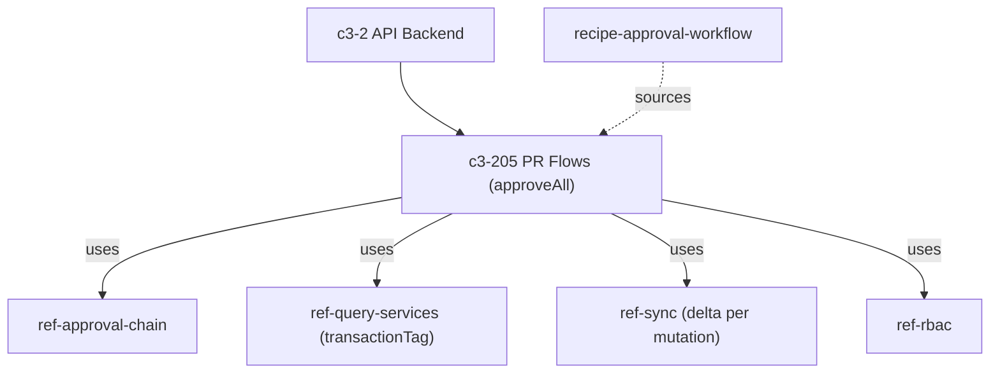

# If mass approval partially fails, is the audit trail still consistent?

**Property named (Step 0a+++):** audit-trail consistency under a partial-success bulk operation. The traced question is whether audit consistency is **per committed mutation** or **all-or-nothing for the whole batch**, and where the partial-success boundary sits.

## Evidence Commands

```bash
c3() { C3X_MODE=agent bash skills/c3/bin/c3x.sh --c3-dir research/eval/skill-eval/fixtures/acountee/.c3 "$@"; }

c3 search "mass approval partial failure audit trail consistency"
c3 search "bulk approve transaction atomicity rollback"
c3 read recipe-approval-workflow --full
c3 read recipe-audit-and-compliance --full
c3 read ref-bulk-operations --full
c3 read ref-audit-trail --full
c3 read c3-205 --full
c3 read c3-105 --full
c3 read c3-202 --full
c3 read ref-query-services --full
c3 read c3-208 --full
c3 graph c3-205 --format mermaid
c3 lookup 'src/server/functions/pr.ts'
c3 lookup '**/pr.ts'
```

## Answer

**Short answer: Yes — per committed mutation, by construction of the trigger mechanism, but NOT as a batch-level guarantee.** Mass approval is designed to partially succeed (per-PR `approved`/`failed` arrays), and the audit trail for `pr` is written by a DB trigger that only fires when a row actually mutates, atomically with that mutation. So every PR that was actually approved has exactly one corresponding audit entry, and failed PRs leave no audit entry and no mutation. There is no documented batch-level atomicity, and the docs do not state the transaction granularity of the bulk loop — that boundary is unknown.

### Causal chain

**1. Action owner — `c3-105` (PaymentRequestsScreen), Approvals mode.** Bulk approve is a first-class UI action: "Approvals mode (focused approval queue for approvers with bulk approve)"; the action calls server function `approveAll` (`c3-105` "What Users Can Do" / "Data Flow"). `ref-bulk-operations` "Applies To" confirms "PaymentRequestsScreen (bulk approve in approvals mode)" — but that ref governs only the selection UI overlay, not transaction semantics.

**2. Mutation owner — `c3-205` (PR Flows), `approveAll`.** The Operations table states: "approveAll | Bulk approval: **iterates pr_ids, approves each, collects approved/failed arrays** | sync, conditional notifications per PR". Partial failure is therefore the *designed* result shape, not an anomaly: the loop continues past failures and reports per-PR outcomes. This sets the partial-success boundary at **per PR**, not per batch.

**3. Transaction/audit contract — `c3-202` + `ref-audit-trail`.**
- `c3-202` (Execution Context) Lifecycle: "Transaction middleware sets `transactionTag` within `db.transaction()`" — flows run in a request-scoped transaction; `ref-query-services` shows every query resolving `seekTag(transactionTag)` so all writes join that transaction.
- `ref-audit-trail` "When to Audit": the `pr` table is audited by the **`log_change()` DB trigger**, which "fires on INSERT/UPDATE/DELETE". A trigger entry can only exist if the row mutation itself executed, and it lives **inside the same transaction** as the mutation — `ref-audit-trail` Anti-Patterns makes this the contract: "the audit write must be atomic with the mutation. If the mutation rolls back, the audit entry should too."
- Actor attribution survives the batch: `executeInDrizzleTransaction` sets `set_config('app.current_user', <base64 email>, true)` before writes, so "All writes within that transaction are attributed to the correct user" (`ref-audit-trail` "DB trigger audit").
- No dual-write divergence is possible for approvals: recipe-approval-workflow and recipe-audit-and-compliance both state the critical rule — `pr` is trigger-covered, "do NOT also call `createAuditEntry`" — so there is a single audit mechanism for approval mutations, with no second write path that could drift from it.

**4. Emergent property.** Combining 2 + 3: audit consistency is **per committed mutation**. For each PR in the `approved` array, the row mutation and its trigger-written audit entry committed together (atomic pair). For each PR in the `failed` array, no mutation committed, so the trigger never fired — no orphaned or half-written audit entry exists. The audit trail cannot show an approval that didn't happen, and cannot miss an approval that did. What it equally does **not** do: record the failed attempts at all — failures are visible only in the flow's returned `failed` array (`c3-205` Operations), not in the `audit` table.

**5. Failure boundary.**
- **Documented:** the boundary is per-PR partial success (`approved`/`failed` arrays, `c3-205`). Side effects follow the same per-PR boundary: "sync, conditional notifications per PR" (`c3-205`), "Every mutation emits a sync delta (ref-sync), then the flow acks" and "Notifications are fire-and-forget (error suppressed, logged)" (recipe-approval-workflow Cross-Cutting Contracts) — so a failed PR also emits no sync delta and no notification.
- **Boundary unknown, docs do not state:** whether `approveAll`'s loop runs inside ONE request transaction (which `c3-202`'s lifecycle implies for a single request) or opens a transaction per PR; whether a mid-loop SQL error rolls back earlier successes in the same batch or only that item (no savepoint mechanism is documented anywhere read); and whether `failed` entries are pre-write validation rejections vs caught write errors. If the whole loop shares one transaction and an item failure aborts it, the per-mutation consistency above still holds (everything rolls back together, audit included), but the *observed* partial-success result shape would then require per-item error isolation that the docs do not describe.
- **Batch correlation unknown:** `c3-202` defines `executionIdTag` for tracing and the `audit` table has a `metadata` jsonb column (`ref-audit-trail` Data Model), but no read output states that the executionId or any batch marker is written into audit entries — so reconstructing "these N entries were one mass approval" from the audit trail alone is not a documented capability.

**6. Observation surface.** `c3-208` (Audit Flows) exposes the trail: `getAuditHistory` (per table + record_id), `listAuditEntries` (filter by `table_name`, `action`, `triggered_by`, date range), `exportAuditTrail`, `getAuditStats`. In the UI, `c3-105`'s detail pane has an Audit tab (AuditLogPanel) per PR. Note `listAuditEntries` filters per entry — there is no batch-level view, consistent with the per-mutation audit granularity.

### Graph

Relationship graph of the mutation owner (derived from `c3 graph c3-205 --format mermaid` output; agent-mode emitted node/edge listing, transcribed here):



(`ref-audit-trail` is notably NOT an edge of `c3-205` — correct per the critical rule: PR flows never call audit explicitly; the trigger on the `pr` table does it.)

### Concrete checks (if changing or verifying this)

1. **Transaction granularity:** read `approveAll` in `src/server/functions/pr.ts` / prFlows (note: `c3 lookup 'src/server/functions/pr.ts'` and `'**/pr.ts'` returned no codemap matches — path is uncharted, confirm by source inspection) and confirm whether each iteration opens its own transaction or shares the request transaction, and how item errors are caught.
2. **Count invariant:** after a partial bulk approve in a dev environment, assert `audit` rows for `table_name='pr'` with `action='UPDATE'` in the batch window == length of the returned `approved` array, and zero entries for IDs in `failed`.
3. **Attribution invariant:** assert `triggered_by` on those entries equals the approver's email (exercises the `app.current_user` wiring in `executeInDrizzleTransaction`).
4. **No duplicates:** assert exactly one audit entry per approved PR mutation (guards the "trigger-covered tables must not also call createAuditEntry" rule).
5. **Batch correlation gap:** check whether audit `metadata` carries the executionId; if compliance needs batch reconstruction, that is a documented-gap to close.

## Grounding

| Material claim | Source (read output: entity + section) |
| --- | --- |
| Bulk approve is a UI action in Approvals mode calling `approveAll` | `c3 read c3-105 --full` — "Business Purpose", "What Users Can Do", "Data Flow" |
| Bulk-operations ref governs selection UI only, applies to PaymentRequestsScreen | `c3 read ref-bulk-operations --full` — "Goal", "Applies To" |
| `approveAll` iterates pr_ids, approves each, collects approved/failed arrays; sync + conditional notifications per PR | `c3 read c3-205 --full` — "Operations" table |
| All operations run in transaction scope; approval mutations audit-captured via DB trigger on `pr`; do NOT also call `createAuditEntry`; every mutation emits sync delta; notifications fire-and-forget | `c3 read recipe-approval-workflow --full` — "Cross-Cutting Contracts" |
| Hybrid audit strategy; `log_change()` trigger on `invoices`, `pr`, `invoice_services`; actor from `set_config('app.current_user', ..., true)` set by `executeInDrizzleTransaction`; duplicate rule | `c3 read recipe-audit-and-compliance --full` — "Narrative"; `c3 read ref-audit-trail --full` — "When to Audit", "DB trigger audit" |
| Audit write must be atomic with mutation; rolls back together | `c3 read ref-audit-trail --full` — "Anti-Patterns" ("Auditing outside a transaction") |
| Audit entry shape (action, record_before/after, triggered_by, checksum, metadata) | `c3 read ref-audit-trail --full` — "Data Model" |
| Transaction middleware sets `transactionTag` within `db.transaction()`; executionIdTag exists for tracing | `c3 read c3-202 --full` — "Lifecycle", "Tags" |
| Queries join the active transaction via `seekTag(transactionTag)` | `c3 read ref-query-services --full` — "Pattern"; `c3 read ref-audit-trail --full` — "Query service wiring" |
| Observation surface: getAuditHistory / listAuditEntries / exportAuditTrail / getAuditStats and their filters | `c3 read c3-208 --full` — "Operations", "Filter Options" |
| PR detail Audit tab (AuditLogPanel) | `c3 read c3-105 --full` — "What Users Can Do" (View detail), "Key Wiring" |
| `c3-205` does not cite ref-audit-trail (no explicit audit edge) | `c3 graph c3-205 --format mermaid` — uses list for c3-205 |
| `pr.ts` is uncharted in codemap | `c3 lookup 'src/server/functions/pr.ts'` and `c3 lookup '**/pr.ts'` — empty matches |
| No `rule-*` entities govern this path | Both `c3 search` outputs — no `rule-*` ids among results |

ADRs surfaced by search/graph (`adr-20260121-admin-management-features`, `adr-20260212-workbench-feature`, `adr-20260305-slack-bot-integration`, notification ADRs) were treated as **historical** work orders per the query reference; no claim above rests on them and none is cited as a live mechanism.

## Caveats

- **Transaction granularity of `approveAll` is undocumented.** `c3-205` documents the iterate-and-collect result shape and `c3-202` documents one transaction-middleware-per-request lifecycle, but no read output states whether the bulk loop shares one transaction, uses per-item transactions, or uses savepoints. Boundary unknown, docs do not state. The per-committed-mutation audit consistency holds in either design; what differs is whether earlier successes in a batch can survive a later item's hard failure.
- **Failed attempts are not audited.** The trigger fires only on actual INSERT/UPDATE/DELETE (`ref-audit-trail` "When to Audit"); the only documented record of a failed item is the `failed` array returned by `approveAll` (`c3-205` Operations). If compliance requires evidence of attempted-but-failed approvals, the documented audit trail does not provide it.
- **No documented batch correlation in audit entries.** `executionIdTag` exists (`c3-202` Tags) and `audit.metadata` exists (`ref-audit-trail` Data Model), but no doc states they are connected. Boundary unknown, docs do not state.
- **Codemap gap:** `c3 lookup` found no component owning `src/server/functions/pr.ts` (empty matches), so the file-level claims here rest on doc-cited paths in `c3-105`/`c3-205`, not on codemap-verified ownership. Source inspection is the verification step.
- The atomicity claim for trigger-vs-mutation is stated by `ref-audit-trail` as the pattern's contract ("the audit write must be atomic with the mutation"); it is a documented contract, not a behavior I executed and observed in this run.
