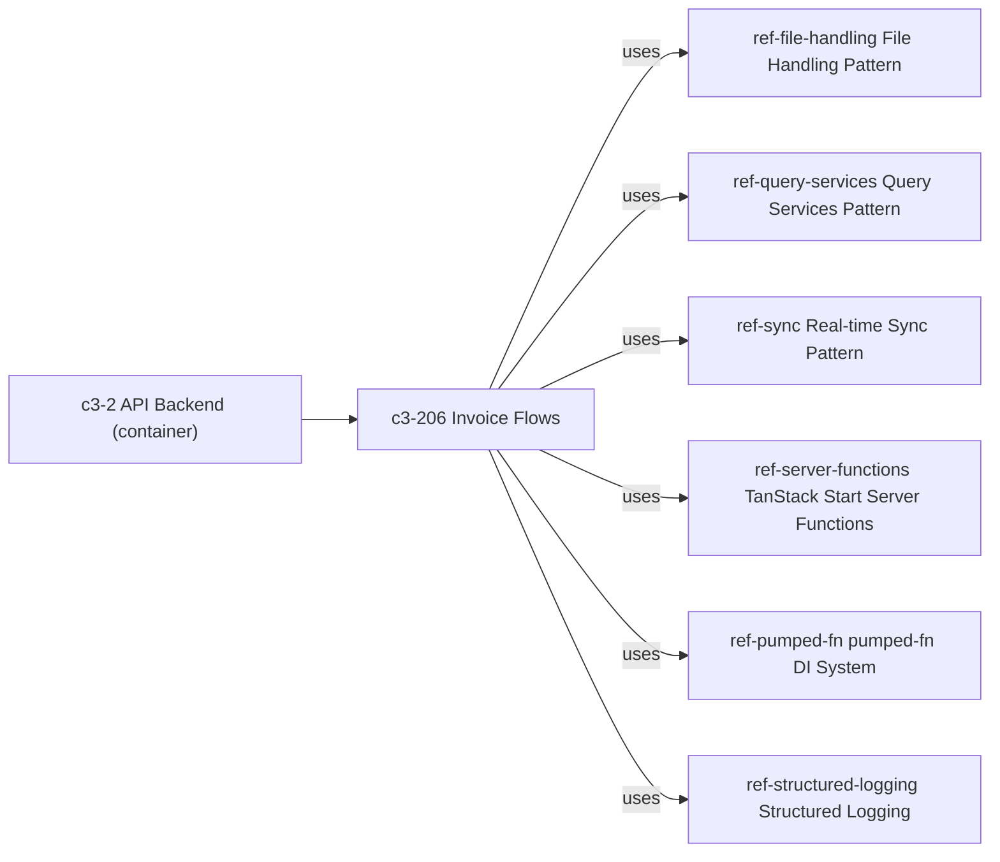

# PROPERTY-FILE-IDEMPOTENCY-1 — Invoice ZIP import with duplicates and parse failures: what keeps import/file state coherent?

## Evidence Commands

```bash
c3 search "invoice ZIP import duplicates parse failures file state"
c3 read c3-206 --full            # Invoice Flows — importFiles owner: Import Flow, Operations, result taxonomy
c3 read ref-file-handling --full # File Handling Pattern — dedup, tri-state result, files table schema
c3 read c3-104 --full            # InvoiceScreen — UI action owner (import dialog, importFiles)
c3 search "database schema owner files invoices tables storage"
c3 graph c3-206 --format mermaid # relationships: refs governing Invoice Flows
c3 read c3-204 --full            # Drizzle ORM — schema/storage owner: schema.ts tables, Transactions, transactionTag
c3 read ref-audit-trail --full   # Audit Trail Pattern — log_change() trigger tables, atomicity, actor wiring
c3 read ref-sync --full          # Real-time Sync Pattern — services emit deltas after DB write, flows ack
c3 read ref-query-services --full # Query Services Pattern — transactionTag participation, executor = tx ?? db
c3 lookup 'src/server/functions/invoice.ts'  # no matches (codemap gap)
c3 lookup 'schema.ts'                        # no matches (codemap gap)
```

## Answer

**Layer:** c3-206 (Invoice Flows), governed by ref-file-handling, with storage schema owned by c3-204 (Drizzle ORM).

### Causal chain

**1. Action owner — c3-104 (InvoiceScreen).** Users upload files via the drag-and-drop import dialog (Ctrl+I); files are "parsed server-side via `importFiles`" (c3-104, "What Users Can Do" and "Data Flow" sections). The UI does no dedup or parsing itself — everything coherence-relevant happens server-side.

**2. State mutation owner — c3-206 (Invoice Flows), `importFiles` flow.** Its documented "Import Flow" section is the contract:

1. Store each uploaded file via `fileStorage.store` (skip if duplicate file)
2. Retrieve stored file, detect type (XML or ZIP)
3. XML: parse invoice, compute MD5 hash, check for duplicate hash in DB, insert invoice + line-item services
4. ZIP: extract entries, process each XML file individually (same parse/hash/insert logic)
5. Deduplication uses MD5 of raw XML content against `invoiceQueries.countInvoiceByHashValue`

**3. Result taxonomy (the partial-success contract).** c3-206 ("Import Flow" section) states verbatim: "Import results per file: `success` (inserted), `skipped` (duplicate hash), or `failure` (parse/insert error). ZIP imports can produce `partial` state when some entries succeed and others fail." The file-storage layer mirrors this: ref-file-handling ("Result Types" section) defines `OperationResult` as `success | failure | skipped`, chosen because "tri-state result avoids exceptions for expected conditions like duplicates" (ref-file-handling, "Why" section).

**4. Storage boundary — c3-204 (Drizzle ORM) is the schema owner.** All tables — including `invoices`, `files`, and `audit` — are defined in `schema.ts` via `pgTable()` (c3-204, "Schema" section). Files are stored as BYTEA in PostgreSQL precisely so "files [stay] transactional with the rest of the data (no external object store to sync)" (ref-file-handling, "Why" section) — file rows and invoice rows live in the same database, so there is no cross-store sync problem to keep coherent. c3-204 ("Transactions" section) provides `executeInDrizzleTransaction` (sets `app.current_user` for audit triggers) and stores the transaction on the execution context via `transactionTag`; ref-query-services ("Pattern"/"Convention" sections) shows query services check `transactionTag` first (`executor = tx ?? db`), so DB calls participate in an open transaction when one exists.

**5. Observers — sync and audit.**
- **Sync:** c3-206 ("Operations" table) lists `sync` as the side effect of `importFiles`. Per ref-sync ("Convention" table): "Services call sync.emit() after DB write" and "Flows call sync.ack(executionId) at the end". Deltas are tied to DB writes, so only inserted invoices produce deltas; `skipped`/`failure` entries have no documented emit. The originating client resolves on the ack; `result.wait()` has a 2s timeout fallback ("Execution ID Contract" section), so a missing/failed ack degrades to a sluggish UI, not lost data.
- **Audit:** ref-audit-trail ("When to Audit" table) puts `invoices` and `invoice_services` under the `log_change()` DB trigger (fires on INSERT/UPDATE/DELETE). Every successful invoice/service insert is therefore audit-captured at the storage layer — the trigger attachment point means no entry path can skip it. The `files` table is in neither the trigger list nor the explicit-call list of that table, so file stores produce no audit rows.

### The named properties

- **Deduplication — two independent documented layers.** (a) File-level: content-hash dedup in `fileStorage.store` — "Duplicate upload → hash collision detected, skip" (ref-file-handling, "Edge Cases" table); hash is MD5, first 8 chars ("Store Operation" section). (b) Invoice-level: MD5 of raw XML content checked against the DB via `invoiceQueries.countInvoiceByHashValue` (c3-206, "Import Flow" step 5). Because the invoice gate is keyed on XML content in the `invoices` table — not on file presence — a leftover stored file from a failed earlier attempt does not block a later successful insert, and a duplicate invoice is skipped even if it arrives inside a different ZIP.
- **Idempotency — by dedup check, sequentially.** Re-importing the same ZIP yields `skipped` per entry rather than duplicate inserts, per the documented hash checks above. Strictly: this is a documented check-then-insert (`countInvoiceByHashValue`), not a documented DB uniqueness constraint on the invoice hash — so race-safety under concurrent imports of the same content is boundary unknown, docs do not state. (The only documented uniqueness constraint is `storing_name TEXT UNIQUE NOT NULL` on `files` — and `storingName` embeds a timestamp, so it does not by itself enforce content-level dedup.)
- **Transactionality — per entry at most, not per batch.** The documented `partial` state for ZIPs proves the batch is **not** all-or-nothing: entries that succeeded stay inserted while sibling entries fail. Whether each entry's "insert invoice + line-item services" pair is wrapped in one transaction is boundary unknown — c3-206 does not name a transaction wrapper for `importFiles`; c3-204 documents that the substrate exists (`executeInDrizzleTransaction` / `transactionTag`) and ref-query-services documents the fallback `executor = tx ?? db` (direct DB if no transaction), but no read output binds `importFiles` to it.
- **Partial success — explicit and per-file.** Each file resolves independently to `success | skipped | failure`; a ZIP aggregates to `partial` when entries diverge (c3-206, "Import Flow"). A parse failure in one ZIP entry does not roll back sibling entries.

### Emergent property

Coherence is **convergence by content-hash gate, not batch atomicity**. The stored file and the invoice row are coupled only through content hashes: the file row is written first (step 1), and the invoice gate (step 5) is evaluated against the `invoices` table independently. Duplicates collapse to `skipped` at whichever layer they hit; failures isolate to their entry; successful inserts are each audit-captured by the `log_change()` trigger at the storage layer and broadcast as sync deltas tied to the DB write.

### Failure boundary

- **Parse failure after store:** the file is stored in step 1, parsed in step 3 — a parse `failure` leaves a `files` row with no corresponding invoice. No cleanup/removal of that orphan file row is documented (`remove`/`removeByPrefix` exist on the service, but no doc binds them to import failure). Boundary unknown, docs do not state.
- **Re-upload after failure:** step 1 says "skip if duplicate file" — whether a file-level `skipped` still proceeds to parse (allowing retry of a previously failed parse) is not stated in any read output. Boundary unknown, docs do not state.
- **Concurrent duplicate import:** invoice dedup is a documented count check, not a documented constraint; concurrent-race behavior is boundary unknown, docs do not state.
- **Sync leg fails:** DB inserts and trigger-audit rows persist regardless (audit is attached at the storage layer; sync emit happens after the DB write per ref-sync). The originating client degrades to the 2s `wait()` timeout (ref-sync, "Execution ID Contract").
- **Audit attribution:** `log_change()` reads the actor from `app.current_user`, which is set by `executeInDrizzleTransaction` (ref-audit-trail, "DB trigger audit"; c3-204, "Transactions"). Since no read output binds `importFiles` to that wrapper, actor attribution on import audit rows is boundary unknown, docs do not state.

**Graph** (from `c3 graph c3-206 --format mermaid` output nodes/edges):



### Concrete checks if changing this path

- Confirm in code whether `importFiles` runs each entry under `executeInDrizzleTransaction` (decides per-entry atomicity AND audit actor attribution) — c3-204 "Transactions", ref-query-services executor fallback.
- Confirm whether file-level `skipped` continues to parse (retry-after-failure semantics).
- Assert observables: one `log_change()` audit row per inserted invoice/service (none for skipped), one sync delta per inserted invoice, one ack per import execution.
- Probe duplicate handling: re-import the same ZIP and assert all-`skipped` with zero new `invoices`/`audit` rows.

## Grounding

| Material claim | Source (read output: entity + section) |
| --- | --- |
| UI entry: drag-and-drop dialog, Ctrl+I, server-side `importFiles` | `c3 read c3-104 --full` — "What Users Can Do", "Data Flow" |
| 5-step import flow; store-then-parse order; ZIP entries processed individually | `c3 read c3-206 --full` — "Import Flow" |
| Per-file result taxonomy `success/skipped/failure`; ZIP `partial` state | `c3 read c3-206 --full` — "Import Flow" (verbatim sentence) |
| `importFiles` side effect = sync; uses fileStorage, invoiceQueries, sync | `c3 read c3-206 --full` — "Operations", "Uses" tables |
| Invoice dedup = MD5 of raw XML vs `invoiceQueries.countInvoiceByHashValue` | `c3 read c3-206 --full` — "Import Flow" step 5 |
| File dedup = content hash (MD5/8), duplicate → skip; tri-state `OperationResult` | `c3 read ref-file-handling --full` — "Choice", "Store Operation", "Edge Cases", "Result Types" |
| Files stored as BYTEA in PostgreSQL, "transactional with the rest of the data" | `c3 read ref-file-handling --full` — "Choice", "Why" |
| `files` table schema; `storing_name TEXT UNIQUE NOT NULL`; storingName embeds timestamp | `c3 read ref-file-handling --full` — "Database Schema", "Naming Convention" |
| `remove`/`removeByPrefix` exist but no import-failure cleanup documented | `c3 read ref-file-handling --full` — "File Storage Service" (interface only) |
| Schema/storage owner: c3-204 defines `invoices`, `files`, `audit` in `schema.ts` | `c3 read c3-204 --full` — "Schema" |
| `executeInDrizzleTransaction` sets `app.current_user`; `transactionTag` on context; query services participate | `c3 read c3-204 --full` — "Transactions" |
| Query services check `transactionTag` first; `executor = tx ?? db` fallback | `c3 read ref-query-services --full` — "Convention", "Pattern"; also `c3 read ref-audit-trail --full` — "Query service wiring" |
| `log_change()` trigger covers `invoices`, `pr`, `invoice_services`; `files` not listed | `c3 read ref-audit-trail --full` — "When to Audit" table |
| Trigger actor read from `app.current_user`, wired in `executeInDrizzleTransaction` | `c3 read ref-audit-trail --full` — "DB trigger audit" |
| Services emit deltas after DB write; flows ack; 2s `wait()` timeout fallback | `c3 read ref-sync --full` — "Convention" table, "Execution ID Contract" |
| c3-206 governed by refs only; relationship set | `c3 graph c3-206` output (nodes/uses lists) |
| Surfaced file paths uncharted in codemap | `c3 lookup 'src/server/functions/invoice.ts'` and `c3 lookup 'schema.ts'` — empty `matches:` |
| No `rule-*` entities apply to this path | `c3 search` results and `c3 graph c3-206` uses-list contain no `rule-*` entities |

## Caveats

- **Per-entry transactionality is undocumented.** No read output states `importFiles` wraps invoice + line-item-service inserts in `executeInDrizzleTransaction`; only the substrate (c3-204 "Transactions") and the query-layer fallback `executor = tx ?? db` (ref-query-services "Pattern") are documented. Boundary unknown, docs do not state.
- **Orphan file rows on parse failure are undocumented.** Store (step 1) precedes parse (step 3) in c3-206 "Import Flow"; no doc binds any cleanup to a `failure` result. Boundary unknown, docs do not state.
- **Retry-after-failure semantics undocumented.** "Skip if duplicate file" (c3-206 step 1) does not say whether a skipped file still proceeds to parse. Boundary unknown, docs do not state.
- **Concurrent-import race undocumented.** Invoice dedup is a documented count check (c3-206 step 5); no unique constraint on invoice hash appears in any read output. Boundary unknown, docs do not state.
- **Codemap gap:** both `c3 lookup` calls on surfaced file paths returned no matches, so code-level verification of the above unknowns was not possible from the fixture's c3 topology; the answer rests on doc contracts only.
- **No ADRs are cited as live mechanism.** `adr-20260212-workbench-feature` surfaced in search/graph (historical work order affecting c3-206) but no claim above relies on it.
