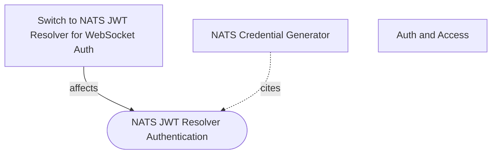

# How does changing NATS JWT auth affect the sync layer?

## Evidence Commands

```bash
c3() { C3X_MODE=agent bash skills/c3/bin/c3x.sh --c3-dir research/eval/skill-eval/fixtures/acountee/.c3 "$@"; }

c3 search "NATS JWT auth credentials sync layer"
c3 read ref-nats-jwt-auth --full
c3 read ref-sync --full
c3 read c3-209 --full
c3 read c3-101 --full
c3 read c3-4
c3 read c3-202
c3 read c3-211 --full
c3 read recipe-realtime-sync --full
c3 read adr-20260113-nats-jwt-resolver
c3 read adr-20260112-nats-auth-callout
c3 read adr-20260112-nats-websocket-sync
c3 graph ref-nats-jwt-auth --direction reverse --format mermaid
c3 graph c3-209 --direction reverse --format mermaid
c3 graph c3-209 --depth 1 --format mermaid
c3 graph ref-sync --direction reverse --format mermaid
```

## Answer

**Layer:** spans `c3-2` (API Backend: `c3-209`, `c3-202`), `c3-4` (NATS Server, external), `c3-1` (frontend: `c3-101`), governed by `ref-nats-jwt-auth` and `ref-sync`.

### The property

The sync layer does not own its transport credentials. Every sync byte the browser receives flows through a NATS WebSocket connection whose admission and subject visibility are decided entirely by a user JWT minted by `c3-209` and verified by `c3-4`. Changing NATS JWT auth therefore changes whether the sync layer's client half exists at all — while the server half keeps running and reporting success.

### Causal chain: credential generation -> enforcement -> dependent runtime path

1. **Credential generation — `c3-209` (NATS Credential Generator), governed by `ref-nats-jwt-auth`.** At authenticated page load, the loader resolves the generator and calls `generate(currentUser.email, 3600)` (ref-nats-jwt-auth, "Credential Flow"). The generator creates an ephemeral user keypair, builds claims with scoped permissions, signs the JWT with the account key from the `natsConfig.accountSeed` tag, and returns `{ jwt, seed }` to the client via `loaderData.natsCredentials` (c3-209, "How It Works" / "Configuration"). The JWT embeds the permission set: **subscribe-only** on `{prefix}.broadcast` and `{prefix}.user.{escaped_email}`, **empty publish allow**, **WEBSOCKET-only** connection, default TTL 1 hour (c3-209, "Permission Model" / "Security"). Config tags (`natsConfig.wsUrl`, `natsConfig.accountSeed`, `natsConfig.subjectPrefix`) come through `c3-202` (Execution Context goal: request-scoped tags) per the search hit `natsConfig | wsUrl, accountSeed, subjectPrefix | NATS connection and JWT signing`.

2. **Enforcement point — `c3-4` (NATS Server, external).** NATS uses a MEMORY JWT resolver with `resolver_preload` mapping the **account public key** to the account JWT; `NATS_ACCOUNT_SEED` (signing side) must pair with `NATS_ACCOUNT_PUBLIC_KEY` (verification side) (ref-nats-jwt-auth, "Configuration" / "NATS Server Config"). c3-4's Wiring table states it validates user JWT signatures and **enforces subject permissions from the JWT itself** — "no external auth callout" (c3-4, "Wiring" / "Responsibilities": "Permission Enforcement — Enforce pub/sub permissions from JWT"). There is no application-side check after this point; the JWT *is* the policy.

3. **Dependent runtime path — `c3-101` (State Management) `natsSync` atom, governed by `ref-sync`.** `natsSync` connects via WebSocket with the loader-passed JWT and subscribes to exactly two subjects: `sync.broadcast` (deltas + acks -> `applyDelta` into prs/invoices/payments stores, `executionTracker.notify(executionId)`) and `sync.user.<email>` (notifications store) (c3-101, "Atoms" / "NATS Sync Wiring"). Server-side, services emit deltas and flows emit acks over the backend's separate full-access TCP connection (ref-sync "Architecture"; ref-nats-jwt-auth "Permissions Model": server internal = All/All over TCP; c3-4 Wiring: backend publishes via TCP 4222).

### The coupling, named

**Credential→subject coupling:** the JWT minted by `c3-209` embeds the only subscribe grants the browser ever gets, and those grants name the exact subjects the sync contract (`ref-sync`, "NATS Subjects") publishes on: `{prefix}.broadcast` and `{prefix}.user.{escaped_email}` (default prefix `sync`, escaping `@`/`.` -> `_`). Three values must agree simultaneously:

| Shared token/value | Producer side | Consumer/enforcer side |
| --- | --- | --- |
| Account NKey pair: `natsConfig.accountSeed` / `NATS_ACCOUNT_SEED` signs the user JWT | `c3-209` | `c3-4` resolver_preload keyed by `NATS_ACCOUNT_PUBLIC_KEY` (ref-nats-jwt-auth "Configuration") |
| Subject permissions embedded in the JWT: `{prefix}.broadcast`, `{prefix}.user.{escaped_email}` | `c3-209` "Permission Model" | `c3-4` enforces them; `c3-101` subscribes to the literal `sync.*` subjects |
| `natsConfig.subjectPrefix` (default `sync`) | server publishers per `ref-sync` "Subject Prefix Contract" | frontend subscriptions are hardcoded to `sync.*` — "if prefix changes from `sync`, frontend subscription wiring must change in lockstep" (ref-sync; restated in c3-101) |

A "change to NATS JWT auth" can hit any row: rotating the account seed without updating the resolver preload breaks signature verification; narrowing or renaming embedded subscribe permissions (e.g. dropping `{prefix}.user.{escaped_email}`, or changing prefix only in the generator) breaks subject visibility; shortening TTL changes how often the connection dies mid-session ("JWT expires after TTL (default 1 hour) — client must reconnect", c3-209 "Security").

### Failure boundary: dependent path fails while upstream looks healthy

This is the defining hazard, and the docs spell out why it is **silent**:

- **The mutation path does not traverse the user JWT.** Flows (`c3-205`, `c3-206`, `c3-207`, `c3-210`, `c3-212` — all citing `ref-sync` per its reverse graph) run over HTTP, write to the DB, and `sync.emit()`/`sync.ack()` publish over the backend's full-access TCP connection (ref-sync "Architecture"; ref-nats-jwt-auth "Permissions Model" server row). `/act` still returns `{ success, executionId }`. Every server-side health signal stays green.
- **The client leg dies at connect or subscribe.** If the JWT signature no longer verifies against the resolver's account public key, or embedded permissions no longer cover the subscribed subjects, `c3-4` rejects the connection/subscription (ref-nats-jwt-auth "Troubleshooting": connection fails / invalid JWT signature / connection rejected). `natsSync` (`c3-101`) then receives nothing.
- **The sync contract is explicitly designed to degrade rather than error.** `ref-sync` ("Execution ID Contract"): "`result.wait()` is a UX optimization, not correctness-critical; timeout fallback (2s) prevents permanent hangs." With NATS unreachable, `executionTracker.notify()` never fires, so every `result.wait()` resolves only via the 2s timeout — the documented symptom is "sluggish UI" (ref-sync "Anti-patterns", skip-ack row), not an exception. Deltas never arrive, so other clients' prs/invoices/payments atoms go stale until full reload; the originating client survives only because the HTTP response already carried its result.
- **Per-user notification delivery loses its real-time leg.** `sync.user.{escaped_email}` is one of the two JWT-granted subjects (c3-209 "Permission Model"); `c3-211`'s `inAppChannel` delivers via "NATS publish (real-time) + JetStream (persistence)" (c3-211 "Built-in Channels"). The JetStream `NOTIFICATIONS` workqueue side is backend-internal and durable (recipe-realtime-sync: "notifications are durable, sync is ephemeral"), so dispatch/logging continue — but the live push to the browser stops with the same silence.

So the failure boundary sits at the `c3-4` WebSocket admission gate: everything backend-side of it keeps succeeding; everything browser-side of it (delta application, ack correlation, real-time notifications) disappears, observable only as stale data and uniform 2s waits.

### Direct vs transitive dependents

- **Direct on the JWT auth mechanism** (`c3 graph ref-nats-jwt-auth --direction reverse`): `c3-209` (cites), `adr-20260113-nats-jwt-resolver` (affects), `recipe-auth-and-access`. `c3-101` consumes the credentials at runtime via `loaderData.natsCredentials` (read-verified in c3-101 "SSR Hydration" / ref-nats-jwt-auth "Credential Flow"), even though it cites `ref-sync`, not `ref-nats-jwt-auth` — a runtime-direct dependent the citation graph under-reports.
- **Transitive** (reached through the transport, verified via `c3 graph ref-sync --direction reverse` then reads): `c3-205`, `c3-206`, `c3-207`, `c3-210`, `c3-212` (flows emitting deltas/acks — their emits succeed regardless of user-JWT state, but their client-visible effect vanishes), and `c3-211` (real-time in-app leg only; JetStream leg unaffected).

### Graph

(from `c3 graph ref-nats-jwt-auth --direction reverse --format mermaid`)



### ADR labels

| ADR | Status label | Basis |
| --- | --- | --- |
| `adr-20260113-nats-jwt-resolver` | **current** (status `implemented`; its decision — JWT resolver, no auth callout — matches the live mechanism in `ref-nats-jwt-auth` and `c3-4`) | read of ADR + ref + container |
| `adr-20260112-nats-auth-callout` | **superseded** (body: "Superseded - 2026-01-13. Replaced by JWT resolver approach. See adr-20260113-nats-jwt-resolver") | read of ADR body |
| `adr-20260112-nats-websocket-sync` | **historical** — its NATS-as-transport decision still underlies `ref-sync`, but its auth element ("NATS auth callout delegates authentication") was never the shipped mechanism (per adr-20260112-nats-auth-callout: "planned for auth callout but it was not implemented") and is superseded by the JWT resolver | reads of both 2026-01-12 ADRs + ref-nats-jwt-auth |

### Concrete checks if you change NATS JWT auth

1. **Key rotation:** confirm `NATS_ACCOUNT_SEED` (generator) and the account public key in `infra/nats.conf` `resolver_preload` (c3-4 side) rotate together (ref-nats-jwt-auth "Configuration" / "Troubleshooting: Invalid JWT signature").
2. **Permission set:** confirm the generated JWT still allows subscribe on both `{prefix}.broadcast` and `{prefix}.user.{escaped_email}` with the same email escaping (`@`/`.` -> `_`) used by publishers (c3-209 "Permission Model"; ref-sync "NATS Subjects").
3. **Prefix lockstep:** if `natsConfig.subjectPrefix` moves off `sync`, update `c3-101`'s hardcoded `sync.broadcast` / `sync.user.<email>` subscriptions in the same change (ref-sync "Subject Prefix Contract"; c3-101 "NATS Sync Wiring").
4. **Runtime probe for the silent failure:** after the change, perform a mutation in one browser and watch a second browser — assert the delta arrives and `result.wait()` resolves well under the 2s timeout; uniform ~2s resolutions mean the client leg is dead while HTTP still succeeds (ref-sync "Execution ID Contract").
5. **TTL behavior:** if expiry changes from 3600s, verify the client reconnect path, since "JWT expires after TTL... client must reconnect" (c3-209 "Security").
6. **Owner docs to touch:** `c3-209`, `ref-nats-jwt-auth`, `c3-4`; plus `c3-101`/`ref-sync` only if subjects or prefix change.

## Grounding

| Material claim | Evidence source |
| --- | --- |
| Credentials generated at page load in loader, `generate(email, 3600)`, returned as `loaderData.natsCredentials`, 1h expiry | `c3 read ref-nats-jwt-auth --full` ("Choice", "Credential Flow") |
| Generator signs with account key from `natsConfig.accountSeed`; ephemeral user keypair; `{ jwt, seed }` | `c3 read c3-209 --full` ("How It Works", "Configuration") |
| JWT embeds subscribe-only on `{prefix}.broadcast` + `{prefix}.user.{escaped_email}`, no publish, WEBSOCKET-only | `c3 read c3-209 --full` ("Permission Model") |
| NATS validates via MEMORY resolver + `resolver_preload`; seed must match resolver public key; no auth callout | `c3 read ref-nats-jwt-auth --full` ("Configuration", "Troubleshooting") |
| c3-4 enforces pub/sub permissions from JWT; backend publishes TCP 4222, browser WSS 8080 | `c3 read c3-4` ("Wiring", "Responsibilities") |
| `natsSync` subscribes to `sync.broadcast` + `sync.user.<email>`; hardcoded prefix; applies deltas to stores; notifies `executionTracker` | `c3 read c3-101 --full` ("Atoms", "NATS Sync Wiring") |
| Two-layer delta/ack contract; `executionId` correlation; `result.wait()` 2s timeout fallback "UX optimization, not correctness-critical"; skip-ack symptom = sluggish UI | `c3 read ref-sync --full` ("Architecture", "Execution ID Contract", "Anti-patterns") |
| Prefix lockstep requirement | `c3 read ref-sync --full` ("Subject Prefix Contract") + `c3 read c3-101 --full` |
| Server connection is full-access TCP (All/All), separate from browser creds | `c3 read ref-nats-jwt-auth --full` ("Permissions Model") |
| natsConfig tags (`wsUrl`, `accountSeed`, `subjectPrefix`) surfaced under c3-202 | `c3 search` result row for `c3-202`; `c3 read c3-202` (goal: request-scoped tags) |
| Notifications: JetStream `NOTIFICATIONS` durable/workqueue, backend-internal; `inAppChannel` = NATS real-time + JetStream persistence | `c3 read c3-211 --full` ("notificationPublisher", "Built-in Channels"); `c3 read recipe-realtime-sync --full` ("Narrative", "Risk") |
| Direct dependents of ref-nats-jwt-auth: c3-209, adr-20260113-nats-jwt-resolver, recipe-auth-and-access | `c3 graph ref-nats-jwt-auth --direction reverse` |
| ref-sync dependents: c3-101, c3-205, c3-206, c3-207, c3-210, c3-212 + recipes/ADRs | `c3 graph ref-sync --direction reverse` |
| ADR statuses and supersession chain | `c3 read` of all three ADRs (Status sections) |
| TTL reconnect requirement | `c3 read c3-209 --full` ("Security") |

## Caveats

- **Subject-permission table drift between docs:** `ref-nats-jwt-auth` "Permissions Model" lists browser subscribe as `sync.broadcast` only, while `c3-209` "Permission Model" and `c3-101` both include `{prefix}.user.{escaped_email}` as well. The component-level docs are mutually consistent and match the notification path, so the ref's table appears stale on this row (evidence: the three reads above). Worth an audit touch.
- **Authenticator naming inconsistency:** `ref-nats-jwt-auth` shows `jwtAuthenticator(jwt, nkeySeed)` while `c3-209` says the client uses `credsAuthenticator(jwt, seed)`. Docs disagree on the exact nats.js authenticator; I did not resolve this against code.
- **`adr-20260112-nats-auth-callout` frontmatter/body mismatch:** frontmatter `status: implemented`, body says "Superseded - 2026-01-13". I labeled it superseded per the body's explicit supersession pointer.
- **Citation-graph under-report:** `ref-sync`'s "Cited By" body list includes `c3-104`, `c3-105`, `c3-209`, `c3-211`, but `c3 graph ref-sync --direction reverse` returns only c3-101/205/206/207/210/212 (+ recipes/ADRs). I assigned behavior only to entities I read; the screen-level dependents (`c3-104`, `c3-105`) were not read and are not claimed beyond the body list's existence.
- **No `rule-*` entities surfaced** for the NATS auth or sync path in the search and reverse-graph outputs collected above.
- Claims are doc-grounded via c3 only; no fixture source files were read to confirm code matches docs (the fixture's code-map was not consulted beyond what entity docs state).
