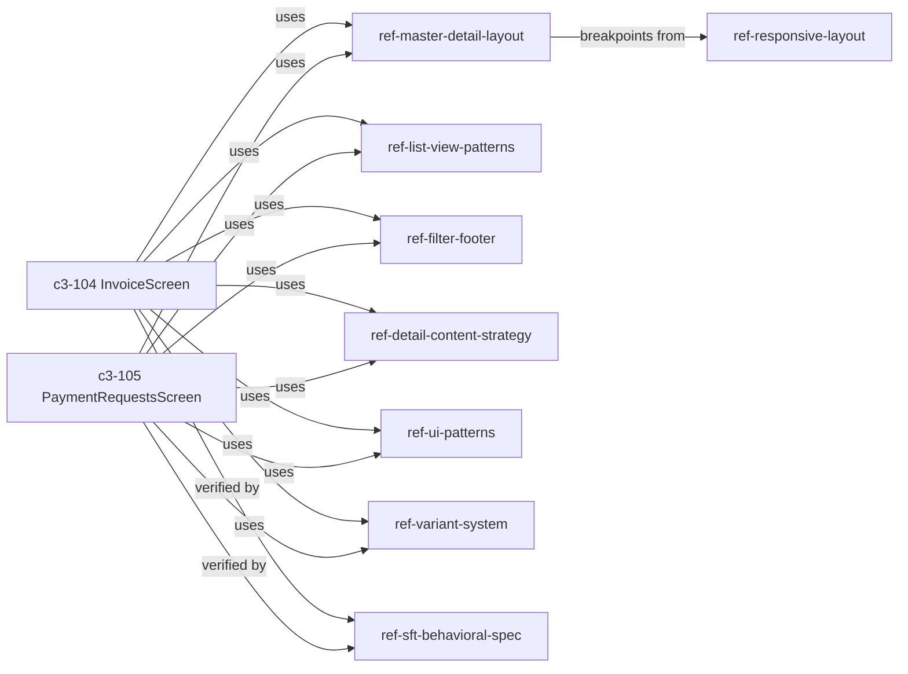

# UI-1: How should invoice and payment request screens stay consistent across detail and list layouts?

## Evidence Commands

```bash
c3 search "invoice and payment request screens consistency detail and list layouts"
c3 read recipe-screen-anatomy --full
c3 read ref-master-detail-layout --full
c3 read ref-detail-content-strategy --full
c3 read ref-list-view-patterns --full
c3 read c3-104 --full
c3 read c3-105 --full
c3 read ref-filter-footer --full
c3 read ref-responsive-layout --full
c3 read ref-variant-system --full
c3 read ref-ui-patterns --full
c3 read ref-sft-behavioral-spec --full
c3 read adr-20260226-ui-pattern-review-gap-closure
c3 graph ref-master-detail-layout --format mermaid
```

## Answer

**Layer:** `c3-104` (InvoiceScreen) and `c3-105` (PaymentRequestsScreen), both in container `c3-1` (Web Frontend).

Both screens are the same archetype — **Master-Detail** per `recipe-screen-anatomy`'s Screen Inventory (Invoices `/invoices` → `c3-104`; Payment Requests `/prs`, `/approvals` → `c3-105`) — and consistency is not a matter of copying each other. It is enforced by a shared stack of refs, each owning one concrete slice of behavior. Both component docs carry the **identical `uses` list** (`ref-master-detail-layout`, `ref-list-view-patterns`, `ref-filter-footer`, `ref-detail-content-strategy`, `ref-ui-patterns`, `ref-variant-system`, `ref-responsive-layout`, `ref-form-patterns`, `ref-audit-timeline`, `ref-sft-behavioral-spec`), confirmed by `c3 graph ref-master-detail-layout` showing `c3-104` and `c3-105` as direct citing components.

### Pattern semantics: which ref owns which concrete behavior

**1. `ref-master-detail-layout` owns the structural shell.** One `MasterDetailLayout` component with named slot children — `listHeader`, `listContent`, `listFooter?`, `emptyState`, `detailContent` — plus exported zone sub-components (`ListHeader`, `ListItem`, `EmptyState`, `DetailHeader`, `DetailContent`, `DetailFooter`). It owns the three-tier responsive behavior (desktop ≥1024px: list 320px `lg:w-80`, detail `flex-1`; tablet 768–1023px: list 256px `md:w-64`; mobile <768px: stacked with slide transition, `translate-x + opacity, 150ms ease-out`) and mobile back navigation via an internal `MobileBackContext` — "screens never interact with this context directly". The list panel uses `flex flex-col` + `flex-1` so `EmptyState` (class `empty-page`) centers vertically; screens render empty states inside `listContent`, not the `emptyState` prop. Convention table: "Use for all list+detail screens", "Pass children as named slots", "Let layout handle mobile nav".

**2. `ref-list-view-patterns` owns list-pane behavior and pattern selection.** Its decision tree ("Does the entity have rich detail content? → Yes → Master-Detail") is why both screens share the archetype. It owns virtualization: both feature screens use `@tanstack/react-virtual` with a custom `rangeExtractor` for **sticky group headers** — month groups on `c3-104` (InvoiceScreen), status groups on `c3-105` (PR grouped view) — header shows label left / count badge right, PR group headers get a color-coded `border-l-[3px]`, and `activeStickyIndexRef` keeps exactly one sticky header at a time. `c3-105` additionally owns two list modes (`list` flat vs `grouped` sticky-header, toggled via `viewMode` in filter state).

**3. `ref-filter-footer` owns filtering UX.** Filters live in a slide-up panel from the list-panel **footer bar** (never header or sidebar): `FilterFooter` compound component with context provider, `FilterFooter.Panel` (absolute, max-h 50vh, z-10), active-filter-count badge on the toggle (variant: ghost → secondary → default by state), `CompactCount` showing filtered vs total, ESC/click-outside dismissal. Its Applies To names exactly these two screens with their concrete filter sets: InvoiceScreen (status, date range, search, archived) and PaymentRequestsScreen (statuses, sort, view mode, amount range, date range, creator).

**4. `ref-detail-content-strategy` owns the detail-pane content grammar.** Feature screens (Invoice, PR) use the `detail-*` class family (label font-size 0.625rem) — never the `admin-detail-*` family (0.6875rem); "Pick based on screen context, never mix in the same view." Two primitives with a hard rule: facet grid (`detail-meta-grid`, label **above** value) for 2–4 top-level summary fields; BIG grid (`big-grid big-grid-2col`, label **beside** value) for inline key-value pairs like bank details — "**Never** use facet grid for inline label-value pairs. **Never** use BIG grid for top-level summary fields." A fixed section order (1 facet strip → 2 workflow state → 3 parties via `detail-columns` → 4 structured details → 5 collections via `detail-list-item` → 6 files; omit empty sections), alignment rules (currency mono, left in facet/key-value but right in table columns; values take natural width — never `width:100%`/`flex:1`), and empty-state rules (muted plain text, "Never bordered/dashed empty boxes"). Its Golden Example is literally a PR detail view; its two-column parties example is the Invoice supplier/buyer split. Cited By names `c3-104` and `c3-105` explicitly.

**5. `ref-ui-patterns` owns the tab mechanism and micro-conventions.** Detail panes on both screens use the shared Radix `Tabs`: `Tabs` wraps `DetailHeader` + `DetailContent` + `DetailFooter`; `TabsList` sits inside `DetailHeader` with `border-b-0` (header already provides the border); `DetailContent` uses `pt-0`; **no entity identity content in `DetailHeader`** — the facet grid in the main tab carries identity (per both this ref and `ref-master-detail-layout` § Detail Header; admin screens without tabs are the documented exception). It also owns the status-badge-by-meaning mapping (`getStatusBadgeVariant`: approved→success, pending→warning, completed→info, obsolete→destructive), VND formatting via `Intl.NumberFormat('vi-VN')` with `font-mono`, and the confirmation standard (`c3-105` uses `ConfirmDrawer` for all destructive actions: delete, reject, recall, unapprove, unlink).

**6. `ref-variant-system` owns the styling vocabulary.** All interactive elements are `tv()` variant functions in `variants.ts` (`button()`, `badge()`, `listItem()`), never inline class strings. `listItem` — used by `MasterDetailLayout`'s `ListItem` — takes `selected` and `status` (`none/inprogress/imported/completed/obselete`) controlling the selected left-border color. Note the documented warning: `obselete` is a consistent intentional typo across CSS and JS — "Do not 'fix' it — it would break class matching."

**7. `ref-responsive-layout` is the single source of truth for breakpoints** (mobile <768px base, tablet `md:`, desktop `lg:`; `useIsMobile()` at 768px; mobile-first `min-width` only). `ref-master-detail-layout` explicitly defers to it for breakpoint definitions, so both screens inherit identical responsive tiers.



(Direct citers per `c3 graph ref-master-detail-layout`: `c3-104`, `c3-105`; `recipe-navigation-strategy`, `recipe-responsive-design`, `recipe-screen-anatomy` cite it only as navigation sources — transitive, not behavior owners.)

### What visibly breaks if a pattern changes

- **Shell (`ref-master-detail-layout`):** mobile back nav is centralized in `MobileBackContext` and "screens don't wire mobile nav manually" — so a change to the layout's slot contract or context breaks the back chevron / stacked slide transition on **both** screens at once; renaming a named slot is a type-level break for every list+detail screen. Pane widths (320px/256px) diverging would visibly desynchronize the two screens' list panels at the same viewport.
- **List pane (`ref-list-view-patterns`):** dropping the custom `rangeExtractor` loses sticky group headers while scrolling; removing the PR `border-l-[3px]` loses visual status identification of groups; breaking `activeStickyIndexRef` stacks multiple sticky headers.
- **Filter footer (`ref-filter-footer`):** moving filters to the header violates "Footer placement preserves list viewport height" — the visible list shrinks; removing the count badge means users no longer know filters are active; `CompactCount` loss removes filtered-vs-total feedback.
- **Detail grammar (`ref-detail-content-strategy`):** mixing `detail-*` with `admin-detail-*` shifts label sizes (0.625rem vs 0.6875rem) mid-view; using BIG for summary fields (or facet for key-value) breaks the label-above vs label-beside distinction that makes both detail panes scannable the same way; violating section order makes Invoice and PR details read differently; `width:100%` on values breaks the "finance-ledger feel" natural-width rule.
- **Tabs (`ref-ui-patterns`):** putting identity content in `DetailHeader` duplicates the facet grid; dropping `border-b-0` on `TabsList` double-borders the header; custom tab CSS breaks the single underline-indicator style shared by both detail panes.
- **Variants (`ref-variant-system`):** "fixing" the `obselete` status spelling breaks `listItem` class matching — selected-state left borders stop rendering for archived items; inline class strings instead of `tv()` cause exactly the visual drift the ref exists to prevent.

### How consistency is verified

1. **Behavioral spec (`ref-sft-behavioral-spec`):** both screens are inventoried in SFT with the `master-detail` archetype tag (Invoices, PaymentRequests + dual-mode); regions/events/flows are stored queryably; `sft validate` "catches orphaned events, missing handlers" (spec drift detection), `sft impact <screen|region>` shows affected screens/flows before changes, and screens/regions are bound to their React components. Scope: "New screens MUST be added to SFT when created."
2. **Compliance snapshot audits:** `ref-ui-patterns` carries a "Current Compliance Snapshot (2026-03-04)" table (alerts, search input, tabs, confirmation standard — all PASS). The audit mechanism that produced it is `adr-20260226-ui-pattern-review-gap-closure` (**status: implemented — historical**, cited only as the precedent for ref-vs-implementation reconciliation; its findings, e.g. confirm-dialog migration, are reflected in the current refs).
3. **Component Change Safety contracts:** `c3-104` and `c3-105` each declare Governance-drift detection ("Cited references, rules, or parent responsibilities change → Re-read Governance rows... Run c3x verify plus targeted lookup") and Contract-drift checks via `c3x check` plus project tests.
4. **Graph-before-change discipline:** the `help[]` output on every shared ref instructs `c3x graph <ref> --format mermaid` to "show all citing components before changing shared constraint" and "cascade review: check every citing component for compliance drift" — i.e., a change to any of these refs requires re-checking both `c3-104` and `c3-105`.

**Practical checklist when touching either screen:** keep content inside the named slots; pick list primitives from `ref-list-view-patterns` (never invent a layout — "Every screen that displays a collection... should use one of these patterns"); detail sections in the documented order using the `detail-*` family only; filters only via `FilterFooter`; styles only via `variants.ts`; then run `sft validate` + `c3 check`, and `c3 graph <changed-ref> --direction reverse` to cascade-review the sibling screen.

## Grounding

| Material claim | Evidence source |
| --- | --- |
| Both screens are Master-Detail archetype, routes /invoices and /prs,/approvals | `c3 read recipe-screen-anatomy --full` § Screen Inventory |
| Identical `uses` ref list on both screens; c3-104/c3-105 are direct citers | `c3 read c3-104 --full` / `c3 read c3-105 --full` frontmatter `uses:`; `c3 graph ref-master-detail-layout --format mermaid` nodes |
| Named slots, zone sub-components, 320px/256px/stacked tiers, 150ms slide, MobileBackContext, empty-state centering | `c3 read ref-master-detail-layout --full` §§ Choice, Behavior, Exported Sub-components, Mobile Back Navigation, List Panel Empty State |
| Decision tree, virtualization, sticky group headers, month vs status groups, border-l-[3px], activeStickyIndexRef, PR list/grouped modes | `c3 read ref-list-view-patterns --full` §§ Decision Flow, Virtualized List with Sticky Group Headers |
| Filter slide-up panel, count badge, CompactCount, ESC/click-outside, per-screen filter sets | `c3 read ref-filter-footer --full` §§ Choice, Behavior, Applies To |
| detail-* vs admin-detail-* (0.625rem vs 0.6875rem), never mix, facet vs BIG never-rules, section order, alignment, empty-state rules, PR golden example, invoice parties example | `c3 read ref-detail-content-strategy --full` §§ Two Class Families, Decision, Section Order, Alignment Rules, Empty States, Golden Example |
| Radix Tabs structure, TabsList border-b-0 in DetailHeader, no header identity, badge mapping, VND formatting, ConfirmDrawer for PR destructive actions | `c3 read ref-ui-patterns --full` §§ Tabs, Status Badge Mapping, Formatting, Confirmation Standard; `ref-master-detail-layout` § Detail Header |
| tv() variants, listItem selected/status, `obselete` typo warning | `c3 read ref-variant-system --full` §§ Convention, listItem |
| Breakpoint single source of truth, useIsMobile 768px, MasterDetailLayout tier table | `c3 read ref-responsive-layout --full` §§ Breakpoints, MasterDetailLayout |
| SFT inventory/archetype tags, sft validate/impact, component binding, "MUST be added to SFT" | `c3 read ref-sft-behavioral-spec --full` §§ Why, Current inventory, Scope |
| Compliance snapshot dated 2026-03-04, all PASS | `c3 read ref-ui-patterns --full` § Current Compliance Snapshot |
| Audit precedent ADR, status implemented | `c3 read adr-20260226-ui-pattern-review-gap-closure` frontmatter `status: implemented` |
| Change Safety / governance drift verification rows | `c3 read c3-104 --full` / `c3 read c3-105 --full` § Change Safety |
| Graph-before-change + cascade review instruction | `help[]` lines in `c3 read ref-*` and `c3 graph` outputs |

## Caveats

- **Graph vs Applies-To mismatch on `ref-master-detail-layout`:** its body's Applies To also lists UserManagementScreen, TeamManagementScreen, ApprovalConfigScreen, but `c3 graph ref-master-detail-layout` shows only `c3-104` and `c3-105` as citing components (admin screens live under `c3-107`, which does not appear as a citer in the graph output). Changes to the shared layout may affect admin screens not visible in the citation graph.
- **No `rule-*` entities surfaced** for these screens — the search output and both components' `uses` lists contain only `ref-*` entries; the Governance tables in `c3-104`/`c3-105` cite only `ref-audit-timeline`. Enforcement is by ref convention + check/SFT, not coding rules.
- **`c3-104`/`c3-105` Governance tables are thin:** both carry the note "Migrated from legacy component form; refine during next component touch" and list only `ref-audit-timeline` in Governance despite the full `uses` list — per the docs themselves, these rows are pending refinement.
- **SFT known issue:** `ref-sft-behavioral-spec` § Known Issues records that `FilterFooter` is ambiguous (2 instances) and its component binding is blocked by [lagz0ne/sft#1] — so SFT's component-mapping verification has a documented gap exactly on the shared filter component.
- **Compliance snapshot is point-in-time** (2026-03-04, in `ref-ui-patterns`); the docs provide no automated re-audit — staying green depends on the cascade-review discipline in the `help[]` hints and `sft validate`.
