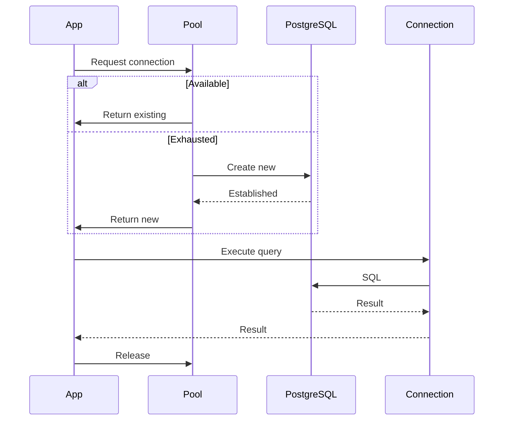
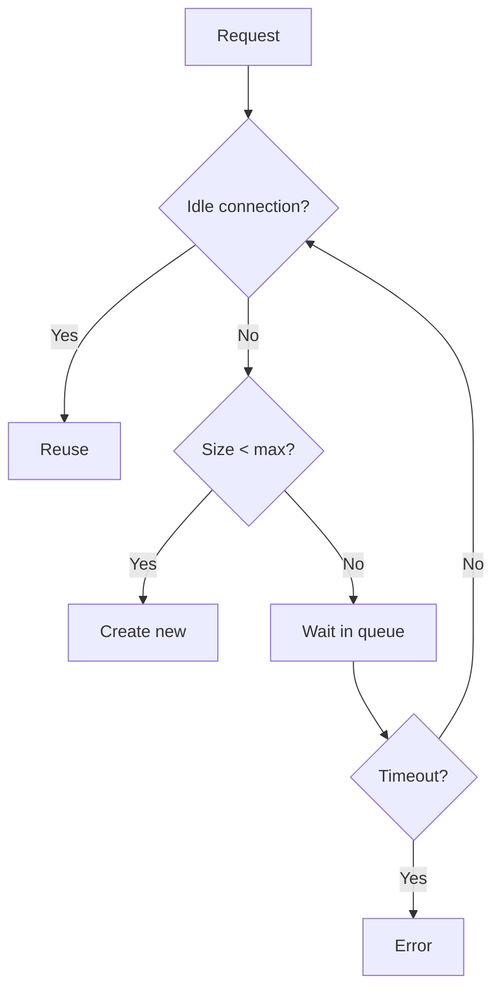
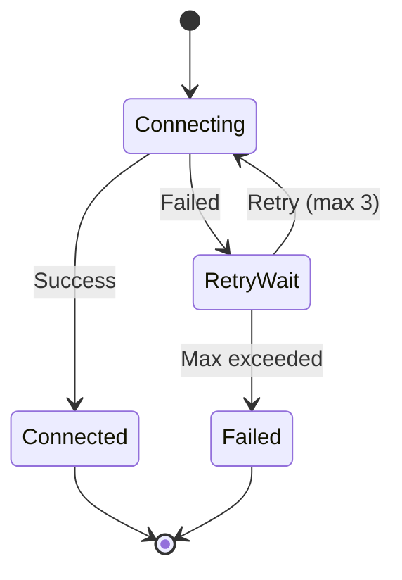

# C3 Component Level Design

## Purpose

Define individual components with implementation-level detail: configuration, dependencies, technical specifics, and actual behavior.

**Abstraction Level:** Implementation details. Code examples, configuration snippets, specific library usage are appropriate here.

## Component Defines

- **Component identity**: Name, purpose, responsibility within container
- **Technical implementation**: Libraries, patterns, algorithms
- **Configuration**: Environment variables, config files, initialization
- **Dependencies**: External libraries, other components
- **Interfaces**: Methods/APIs exposed, data structures
- **Data handling**: What data processed, validation, transformations
- **Error handling**: Failures, retry logic, fallback strategies
- **Performance**: Caching, optimization, resource usage

## When Invoked

- ADR identifies Component-level changes
- User explicitly calls `/c3-component-design`
- Container references a component needing detailed spec
- Implementation-level changes required

## Workflow

### Step 1: Read Existing Component Doc

```bash
# Find component
find .c3/components -name "COM-*.md"

# Read specific
awk '/^---$/,/^---$/ {print}' .c3/components/backend/COM-001-db-pool.md
```

### Step 2: Read Parent Container

```bash
# Understand component's role in container
grep -l "COM-001-db-pool" .c3/containers/CON-*.md
```

### Step 3: Identify Scope

From ADR:
- New component or updating?
- What's changing: config, dependencies, behavior?
- Related components affected?

### Step 4: Gather Details (Targeted Socratic)

Ask ONLY if needed:
- Component's specific responsibility?
- Libraries/packages used?
- Configuration? (env vars, files, init)
- Dependencies?
- Interfaces exposed?
- Error handling approach?
- Performance considerations?
- Data processing/transformation?

### Step 5: Generate/Update Diagrams

**Component-specific diagrams:**
- Class diagram (if OOP)
- Sequence diagram (key operations)
- State diagram (if stateful)
- Flow diagram (algorithms/logic)
- Data structure diagram

### Step 6: Write/Update Component Document

**Determine file path:**
```bash
# Determine container directory
container_dir=".c3/components/backend"
mkdir -p "$container_dir"

# If new component
last_com=$(find .c3/components -name "COM-*.md" | sed 's/.*COM-\([0-9]*\).*/\1/' | sort -n | tail -1)
next_num=$(printf "%03d" $((10#$last_com + 1)))
file_path="$container_dir/COM-${next_num}-${slug}.md"
```

**Document structure:**

```markdown
---
id: COM-001-db-pool
title: Database Connection Pool Component
summary: >
  Explains PostgreSQL connection pooling strategy, configuration, and
  retry behavior. Read this to understand how the backend manages database
  connections efficiently and handles connection failures.
---

# [COM-001-db-pool] Database Connection Pool Component

::: info Container
Belongs to [CON-001-backend: Backend Container](../../containers/CON-001-backend.md#con-001-db-pool)
:::

## Overview {#com-001-overview}
<!--
What this component does and why it exists.
-->

Manages PostgreSQL connections using pool pattern for efficient resource usage and resilient access.

## Purpose {#com-001-purpose}
<!--
Specific responsibilities and goals.
-->

- Maintain reusable connections
- Prevent connection exhaustion
- Handle failures with retry
- Provide health checks

## Technical Implementation {#com-001-implementation}
<!--
How it's built - libraries, patterns, architecture.
-->

### Libraries {#com-001-libraries}
- **pg** (v8.11.0): PostgreSQL client
- **pg-pool**: Connection pooling

### Architecture {#com-001-architecture}



## Configuration {#com-001-configuration}
<!--
Explains environment variables, configuration loading strategy, and
differences between development and production. Read this section to
understand how to configure the connection pool for different environments.
-->

### Environment Variables {#com-001-env-vars}

| Variable | Dev | Production | Description |
|----------|-----|------------|-------------|
| `DB_HOST` | `localhost` | `db.prod.example.com` | Database host |
| `DB_PORT` | `5432` | `5432` | Database port |
| `DB_POOL_MIN` | `2` | `10` | Min connections |
| `DB_POOL_MAX` | `10` | `50` | Max connections |
| `DB_IDLE_TIMEOUT` | `10000` | `30000` | Idle timeout (ms) |

### Configuration Loading {#com-001-config-loading}

Loaded from `.env` files:
- `.env.development`
- `.env.production`

**Example `.env`:**
```bash
DB_HOST=localhost
DB_PORT=5432
DB_POOL_MIN=2
DB_POOL_MAX=10
```

## Connection Pool Behavior {#com-001-pool-behavior}
<!--
How the pool manages connections, sizing strategy, lifecycle.
-->

### Pool Sizing {#com-001-pool-sizing}



**Sizing Guidelines:**
- Min: Keep warm connections (reduce latency)
- Max: `(available_memory / connection_overhead) * 0.8`
- Dev: Small pool (2-10)
- Prod: Larger pool (10-50) based on load

### Lifecycle {#com-001-lifecycle}

1. Acquisition: Request from pool
2. Usage: Execute queries
3. Release: Return to pool
4. Idle timeout: Close after timeout
5. Health check: Periodic validation

## Error Handling {#com-001-error-handling}
<!--
How errors are handled, retry strategy, error types.
-->

### Retry Strategy {#com-001-retry-strategy}



**Configuration:**
- Max attempts: 3
- Backoff: Exponential (1s, 2s, 4s)
- Retriable: Connection timeout, network errors
- Non-retriable: Auth failure, DB not found

### Error Types {#com-001-error-types}

| Error | Cause | Handling |
|-------|-------|----------|
| Connection timeout | DB unreachable | Retry with backoff |
| Pool exhausted | Too many requests | Queue or reject |
| Auth failure | Invalid credentials | Fail immediately |

## Performance {#com-001-performance}
<!--
Performance characteristics, benefits, monitoring.
-->

### Benefits {#com-001-pooling-benefits}
- Reduced latency: ~50ms saved per request
- Resource efficiency: Share connections
- Throughput: More concurrent requests

### Metrics {#com-001-metrics}
- Active connections (gauge)
- Idle connections (gauge)
- Wait queue length (gauge)
- Acquisition time (histogram)
- Query execution time (histogram)

## Health Checks {#com-001-health-checks}
<!--
Health check implementation and frequency.
-->

```sql
SELECT 1;  -- Simple validation

SELECT numbackends, max_connections
FROM pg_stat_database
WHERE datname = current_database();
```

Runs every 30 seconds.

## Related {#com-001-related}

- [CON-001-backend: Backend Container](../../containers/CON-001-backend.md#con-001-db-pool)
- [COM-002-user-service: User Service](./COM-002-user-service.md)
- [ADR-004: Connection pooling](../../adr/ADR-004-connection-pooling.md)
```

### Step 7: Update VitePress Config

Add to sidebar under appropriate container section.

### Step 8: Regenerate TOC

```bash
.c3/scripts/build-toc.sh
```

## Document Conventions

### Frontmatter
```yaml
---
id: COM-NNN-slug
title: Component Name
summary: >
  What this component does and why read this doc.
---
```

### Heading IDs
Pattern: `{#com-nnn-heading-slug}`

### Links
- Up to container: `[CON-001](../../containers/CON-001-backend.md)`
- To container section: `[Middleware](../../containers/CON-001-backend.md#con-001-middleware)`
- Across components: `[COM-002](./COM-002-user-service.md)`

## Key Principles

- **Implementation details welcome**: Code examples, configs, specifics
- **Environment differences**: Call out dev vs prod configs
- **Error handling explicit**: Document failure modes and retry logic
- **Performance metrics**: Include monitoring and optimization details
