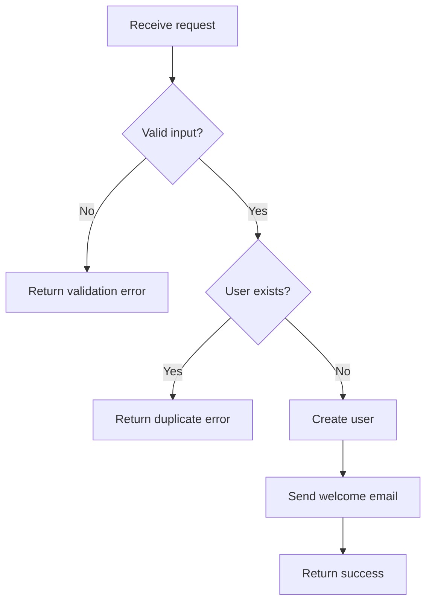

# C3 Component Level Exploration

## Overview

Component is the **leaf layer** - it inherits all constraints from above and implements actual behavior.

**Position:** LEAF (c3-{N}{NN}) | Parent: Container (c3-{N}) | Grandparent: Context (c3-0)

As the leaf:
- I INHERIT from Container: technology, patterns, interfaces
- I INHERIT from Context (via Container): boundary, protocols, cross-cutting
- I implement HOW things work
- Changes here are CONTAINED unless they break inherited contracts

**Announce:** "I'm using the c3-component-design skill to explore Component-level impact."

---

## Load Settings

Read `.c3/settings.yaml` and merge with `defaults.md`.

```bash
cat .c3/settings.yaml 2>/dev/null
```

**Default litmus:** "Could a developer implement this from the documentation?"

---

## Decision: Is This Component Level?

**Component-level indicators (ALL must be true):**
- Change is about HOW to implement (not WHAT)
- Stays within Container's technology constraints
- Follows Container's patterns
- Keeps interface contract unchanged
- Isolated to this component

**Escalate to Container if (ANY):**
- Affects multiple components the same way
- Requires changing internal patterns
- Needs different technology
- Changes interface contract
- Is about WHAT/WHY not HOW

**Common "looks like Component, but isn't":**
- "Just add a new field to the API" → Interface change (Container)
- "Just change how auth works here" → Cross-cutting (Context)
- "Just use a different library" → Technology change (Container)

---

## Phase 1: Inherit From Container (and Context)

**ALWAYS START HERE.**

```bash
cat .c3/README.md  # Context constraints
find .c3 -name "c3-{N}-*" -type d | head -1 | xargs -I {} cat {}/README.md  # Container constraints
```

**Extract inheritance chain:**

| Source | What to Extract |
|--------|-----------------|
| Context | Boundary, cross-cutting patterns |
| Container | Technology, patterns, interface contract |

**Escalation triggers:** boundary violation, cross-cutting deviation, tech constraint violation, pattern deviation, interface change

---

## Phase 2: Understand the Contract

The Container defines WHAT this component does. Component docs explain HOW.

**Find the contract:**
```bash
# Read Container doc to find this component's responsibility
cat .c3/c3-{N}-*/README.md | grep -A5 "c3-{N}{NN}"
```

**Extract from Container:**
- What responsibility is assigned to this component?
- What other components does it relate to?
- What flows involve this component?

This contract is what the Component doc must explain HOW to implement.

---

## Phase 3: Load Current State & Explore Code

```bash
find .c3/c3-{N}-* -name "c3-{N}{NN}-*.md" 2>/dev/null | head -1 | xargs cat 2>/dev/null
```

**Code exploration checklist:**
- [ ] What files implement this component?
- [ ] Does current code match documentation?
- [ ] Which files would the change affect?
- [ ] Can this be done within Container's technology?

---

## Phase 4: Analyze Change Impact

| Check | Question | If Yes |
|-------|----------|--------|
| Breaks interface? | Does Container need to know? | Escalate |
| Breaks patterns? | Does it deviate from Container's patterns? | Escalate |
| Needs new tech? | Outside Container's tech stack? | Escalate |
| Affects siblings? | Multiple components same way? | Escalate |
| Affects boundary? | Outside system boundary? | Escalate (Context) |
| Contained? | Just implementation details? | Proceed |

---

## Phase 5: Document the Implementation

### Documentation Principles

1. **Implement the contract** - Container says WHAT, Component explains HOW
2. **No code** - Code lives in the codebase
3. **Flows and dependencies** - Show how it processes and what it calls
4. **Edge cases matter** - Non-obvious scenarios need explanation

### Template

```markdown
---
id: c3-{N}{NN}
title: [Component Name]
---

# [Component Name]

## Contract
From Container: [paste the responsibility defined in Container doc]

## How It Works

### Main Flow
[Mermaid flowchart showing the processing steps]

### Dependencies
| Dependency | Purpose | When Called |
|------------|---------|-------------|

### Decision Points
| Decision | Condition | Outcome |
|----------|-----------|---------|

## Edge Cases

| Scenario | Behavior | Rationale |
|----------|----------|-----------|

## Error Handling

| Error | Detection | Recovery |
|-------|-----------|----------|
```

### Example: UserService

```markdown
# UserService

## Contract
From Container: "Handles user registration, authentication, and profile management"

## How It Works

### Main Flow (Registration)


### Dependencies
| Dependency | Purpose | When Called |
|------------|---------|-------------|
| DBAdapter | Persist user data | After validation |
| EmailService | Send notifications | After creation |

### Decision Points
| Decision | Condition | Outcome |
|----------|-----------|---------|
| Skip email | Test environment | Don't send |
| Hash algorithm | Password length | bcrypt vs argon2 |

## Edge Cases
| Scenario | Behavior | Rationale |
|----------|----------|-----------|
| Duplicate email | Reject with specific error | Prevent enumeration |
| Very long name | Truncate to 255 chars | DB constraint |

## Error Handling
| Error | Detection | Recovery |
|-------|-----------|----------|
| DB connection lost | Timeout after 5s | Retry 3x with backoff |
| Email service down | Circuit breaker open | Queue for later |
```

---

## Socratic Discovery

**To understand the flow:**
- "What happens when this component receives a request?"
- "What steps does it go through?"
- "What can go wrong at each step?"

**To understand dependencies:**
- "What other components does this call?"
- "Why does it need each dependency?"
- "What happens if a dependency fails?"

**To understand edge cases:**
- "What's the non-obvious behavior here?"
- "What happens with invalid input?"
- "What happens under load?"

---

## Output Format

```xml
<component_exploration_result component="c3-{N}{NN}">
  <inherited_verification>
    <container_constraints honored="[yes|no]"/>
    <context_constraints honored="[yes|no]"/>
    <escalation_needed>[yes|no]</escalation_needed>
  </inherited_verification>

  <changes>
    <change type="[config|behavior|dependency]">[description]</change>
    <contained>[yes|no]</contained>
  </changes>

  <sibling_impact>
    <component id="c3-{N}{MM}" impact="[none|needs_update]"/>
  </sibling_impact>

  <delegation>
    <to_skill name="c3-container-design" if="[escalation needed]"/>
  </delegation>
</component_exploration_result>
```

---

## Checklist

- [ ] Container constraints loaded and understood
- [ ] Context constraints loaded (via Container)
- [ ] Component nature determined
- [ ] Current state loaded (if exists)
- [ ] Change impact analyzed
- [ ] All inherited constraints still honored
- [ ] Documentation matches component nature
- [ ] Escalation decision made (if needed)

---

## Related

- [hierarchy-model.md](../../references/hierarchy-model.md) - C3 layer inheritance
- [role-taxonomy.md](../../references/role-taxonomy.md) - Component roles
- [testing-discovery.md](../../references/testing-discovery.md) - Test patterns
- [diagram-patterns.md](../../references/diagram-patterns.md) - Diagram guidance
