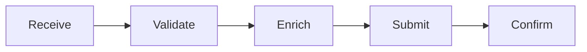
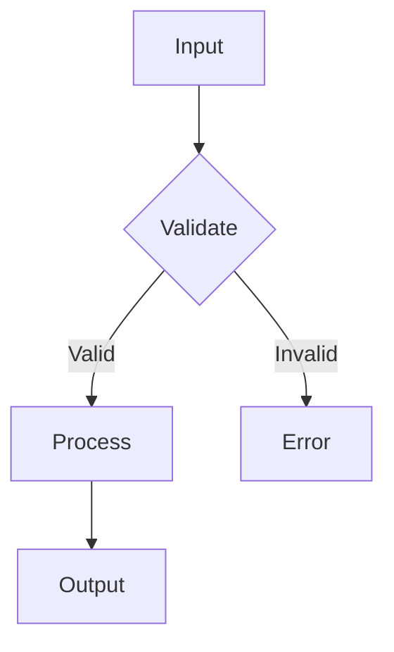

# C3 Component Level Exploration

## Overview

Explore Component-level impact during the scoping phase of c3-design. Component is the **leaf layer** - it inherits all constraints from above and implements the actual behavior.

<component_position>
Layer: LEAF (c3-{N}{NN})
Parent: Container (c3-{N})
Grandparent: Context (c3-0)
Children: None (implementation code)

As the leaf layer:
- I INHERIT from Container: technology, patterns, interfaces
- I INHERIT from Context (via Container): boundary, protocols, cross-cutting
- I implement HOW things work
- I am the closest to actual code
- Changes here are CONTAINED unless they break inherited contracts
</component_position>

**Announce at start:** "I'm using the c3-component-design skill to explore Component-level impact."

---

## Load Settings & Defaults

<chain_prompt id="load_settings">
<instruction>Load project settings and merge with defaults</instruction>

<action>
```bash
# Check for project settings
cat .c3/settings.yaml 2>/dev/null
```
</action>

<merge_logic>
```xml
<settings_merge layer="component">
  <!-- Step 1: Load defaults from this skill's defaults.md -->
  <defaults source="skills/c3-component-design/defaults.md">
    <include>Stack details, environment config, implementation patterns, interfaces, error handling, usage examples</include>
    <exclude>Container purpose (→Container), API endpoint list (→Container), system protocols (→Context)</exclude>
    <litmus>"Could a developer implement this from the documentation?"</litmus>
    <diagrams>Flowchart (decision logic), Sequence (method calls), State chart (lifecycle), ERD (data), Class diagram (types)</diagrams>
  </defaults>

  <!-- Step 2: Check settings.yaml for component section -->
  <project_settings source=".c3/settings.yaml">
    <if key="component.useDefaults" value="false">
      <!-- Don't load defaults, use only project settings -->
    </if>
    <if key="component.useDefaults" value="true" OR missing>
      <!-- Merge: project settings extend defaults -->
      <include>defaults + component.include</include>
      <exclude>defaults + component.exclude</exclude>
      <litmus>component.litmus OR default</litmus>
      <diagrams>component.diagrams OR default</diagrams>
      <guidance>component.guidance (layer-specific prose)</guidance>
    </if>
  </project_settings>

  <!-- Step 3: Also load global settings -->
  <global>
    <diagrams_tool>settings.diagrams (e.g., mermaid)</diagrams_tool>
    <guard>settings.guard (team guardrails)</guard>
  </global>
</settings_merge>
```
</merge_logic>

<output>
Display active configuration:
```
Component Layer Configuration:
├── Include: [merged list]
├── Exclude: [merged list]
├── Litmus: [active test]
├── Diagrams: [tool] - [types]
├── Guidance: [layer-specific notes]
└── Guardrails: [if any]
```
</output>
</chain_prompt>

<apply_throughout>
Use loaded settings when:
- Deciding what belongs at Component level (litmus test)
- Choosing diagram types for implementation flows
- Applying team guardrails
- Writing documentation (guidance from settings)
- Checking include/exclude rules for content placement
- Validating abstraction level (is this too high for Component?)
</apply_throughout>

---

## Hierarchical Position

> See [hierarchy-model.md](../../references/hierarchy-model.md) for full inheritance diagram.

**Component (c3-NNN) is the LEAF layer:**
- **Inherits from Container:** technology stack, patterns, interface contracts
- **Inherits from Context (via Container):** boundary constraints, cross-cutting patterns
- **Defines:** HOW things work - actual implementation, configuration, error handling

---

## Content Longevity Principles

<critical>
**Architectural documents don't hold code - code lives on its own.** These principles keep component documentation stable and useful over time.
</critical>

### Rule 1: Prefer Generic Over Specific

<principle>
**Document code organization and structure, not exact locations.**

Architecture docs should cover 80-90% of cases. Exact file paths and line numbers drift quickly.

<good_example>
```markdown
## Organization
Services follow a layered pattern:
- Handlers: Request/response transformation
- Services: Business logic orchestration
- Repositories: Data access

Each service has its own directory with `handler.ts`, `service.ts`, and `types.ts`.
```
</good_example>

<bad_example>
```markdown
## File Structure
- `/src/users/handler.ts` - Lines 45-89: createUser endpoint
- `/src/users/service.ts` - Lines 12-56: UserService class
- `/src/users/repository.ts` - Lines 23-67: Database queries
```
</bad_example>

Discrepancies between docs and code are acceptable when the pattern holds true. Document the pattern, not the instance.
</principle>

### Rule 2: Light Code, Heavy Patterns

<principle>
**Code blocks show patterns and direction, not implementations.**

Readers must understand: these are illustrative patterns, not copy-paste code.

<good_example>
```typescript
// Pattern: All handlers follow this structure
async function handle(req, res) {
  const input = validate(req.body)
  const result = await service.process(input)
  return format(result)
}
```
</good_example>

<bad_example>
```typescript
// Actual implementation from UserHandler
async function createUser(req: Request, res: Response): Promise<void> {
  const validatedInput = await userValidation.validateCreateUser(req.body);
  if (!validatedInput.success) {
    throw new ValidationError(validatedInput.errors);
  }
  const user = await userService.createUser({
    email: validatedInput.data.email,
    name: validatedInput.data.name,
    // ... 20 more lines
  });
  // ... response formatting
}
```
</bad_example>

<guidance>
- Show the shape, not the specifics
- Use placeholders: `[field]`, `...`, `// continues`
- Mark patterns clearly: "Pattern:", "Structure:", "Approach:"
- Keep examples under 10-15 lines
</guidance>
</principle>

### Rule 3: Flow Maps, Not Implementation Details

<principle>
**Document flows as a mini-map for quick orientation.**

Component docs should trace the logical path of business operations without drowning in implementation details.

<good_example>
```markdown
## Order Processing Flow



**Stages:**
| Stage | Purpose | Key Decision |
|-------|---------|--------------|
| Validate | Check required fields | Reject malformed |
| Enrich | Add pricing/inventory | Fail if unavailable |
| Submit | Send to fulfillment | Retry on timeout |
```
</good_example>

<bad_example>
```markdown
## Order Processing

1. First, the order comes into `OrderController.create()` which calls `validateOrder()`
2. `validateOrder()` checks that `customerId` is not null, then calls `CustomerService.exists()`
3. If customer exists, it then calls `validateLineItems()` which iterates through each item...
4. For each item, it calls `InventoryService.check()` which queries the database...
[... continues for 50 more steps]
```
</bad_example>

<guidance>
- Flows are navigational aids, not step-by-step tutorials
- Show what connects to what
- Highlight key decision points and branching logic
- Let readers discover implementation details by reading actual code
</guidance>
</principle>

### Summary: The 80/20 Documentation Rule

<validation_checklist>
When documenting a component, verify:

1. **Will this change tomorrow?** → Keep it generic
2. **Is this copy-paste code?** → Simplify to pattern
3. **Does this explain the "what"?** → Good
4. **Does this explain every "how"?** → Too detailed

Readers use architecture docs to **orient**, then read code to **implement**.
</validation_checklist>

---

## Critical Decision: Is This a Component-Level Change?

<extended_thinking>
<goal>Determine if the proposed change is truly at Component level or should escalate</goal>

<component_level_indicators>
DEFINITELY Component level if ALL are true:
- [ ] Change is about HOW to implement (not WHAT)
- [ ] Stays within Container's technology constraints
- [ ] Follows Container's patterns
- [ ] Keeps interface contract unchanged
- [ ] Isolated to this component (no sibling impact)

PROBABLY Container level (escalate UP) if ANY are true:
- [ ] Affects multiple components the same way
- [ ] Requires changing internal patterns
- [ ] Needs different technology than Container specifies
- [ ] Changes interface contract with siblings
- [ ] Is about WHAT/WHY not HOW

PROBABLY Context level (escalate HIGHER) if ANY are true:
- [ ] Affects system boundary
- [ ] Changes cross-cutting approach
- [ ] Impacts inter-container protocols
</component_level_indicators>

<common_mistakes>
Watch for these "looks like Component, but isn't" patterns:
- "Just add a new field to the API" → May be interface change (Container)
- "Just change how auth works here" → May be cross-cutting (Context)
- "Just use a different library" → May be technology change (Container)
- "Just refactor this pattern" → May affect siblings (Container)
</common_mistakes>

<decision>
IF all_component_indicators THEN proceed with Component exploration
ELIF any_container_indicator THEN escalate to c3-container-design
ELIF any_context_indicator THEN escalate to c3-context-design
</decision>

<output>
"This change [is/is not] at Component level because [specific reason].
[If not]: Escalating to [c3-container-design/c3-context-design] because [reason]."
</output>
</extended_thinking>

---

## Phase 1: Inherit From Container (and Context)

<critical>
**ALWAYS START HERE** - Before exploring this component, load what Container AND Context expect from it.
</critical>

<chain_prompt id="load_parent_hierarchy">
<instruction>Read both Container and Context to understand full inheritance chain</instruction>

<action_context>
```bash
cat .c3/README.md
```
</action_context>

<action_container>
```bash
# Find parent container
find .c3 -name "c3-{N}-*" -type d | head -1 | xargs -I {} cat {}/README.md
```
</action_container>

<extract_inheritance>
```xml
<inherited_hierarchy component="c3-{N}{NN}">
  <!-- From Context (c3-0) - via Container -->
  <from_context>
    <boundary>
      <can_access>[system-internal resources]</can_access>
      <cannot_access>[external to system]</cannot_access>
    </boundary>
    <cross_cutting>
      <auth pattern="[pattern]">[my implementation responsibility]</auth>
      <logging pattern="[pattern]">[my implementation responsibility]</logging>
      <errors pattern="[pattern]">[my implementation responsibility]</errors>
    </cross_cutting>
  </from_context>

  <!-- From Container (c3-{N}) - direct parent -->
  <from_container>
    <technology>
      <runtime>[version I must use]</runtime>
      <framework>[version I must use]</framework>
      <required_libraries>[what I must import]</required_libraries>
    </technology>
    <patterns>
      <pattern name="[name]">[how I must implement]</pattern>
    </patterns>
    <interface>
      <must_expose>[methods/endpoints I must provide]</must_expose>
      <must_accept>[input types I must handle]</must_accept>
      <must_return>[output types I must produce]</must_return>
    </interface>
  </from_container>
</inherited_hierarchy>
```
</extract_inheritance>
</chain_prompt>

<extended_thinking>
<goal>Verify this component honors all inherited constraints</goal>

<verification_chain>
**From Context (system-wide):**
1. Am I staying within system boundary?
   - Not accessing external resources inappropriately?
   - Not exposing internal data externally?

2. Am I implementing cross-cutting correctly?
   - Auth: Using the pattern Context specified?
   - Logging: Using the format Context specified?
   - Errors: Handling errors as Context specified?

**From Container (my direct parent):**
3. Am I using the right technology?
   - Correct runtime version?
   - Correct framework version?
   - Required libraries imported?

4. Am I following Container's patterns?
   - Error handling pattern?
   - Data access pattern?
   - Other internal patterns?

5. Am I exposing the right interface?
   - Methods/endpoints present?
   - Input types correct?
   - Output types correct?
</verification_chain>

<escalation_triggers>
IF violates_context_boundary THEN escalate to c3-container-design (will cascade to Context)
IF violates_cross_cutting THEN escalate to c3-container-design
IF violates_container_technology THEN escalate to c3-container-design
IF violates_container_patterns THEN escalate to c3-container-design
IF violates_container_interface THEN escalate to c3-container-design
IF contained_change THEN proceed with component documentation
</escalation_triggers>
</extended_thinking>

---

## Phase 2: Determine Component Nature

<chain_prompt id="determine_nature">
<instruction>Identify component nature to guide documentation focus</instruction>

<nature_detection>
```xml
<component_nature_detection>
  <resource_integration if="connects to external systems">
    <indicators>Database, cache, API client, queue, file system</indicators>
    <focus>Configuration, env vars, connection handling, retries</focus>
  </resource_integration>

  <business_logic if="implements domain rules">
    <indicators>Services, domain models, workflows, rules engines</indicators>
    <focus>Domain flows, business rules, edge cases, validation</focus>
  </business_logic>

  <framework_entrypoint if="handles incoming requests">
    <indicators>Controllers, handlers, middleware, event consumers</indicators>
    <focus>Request handling, auth, validation, response format</focus>
  </framework_entrypoint>

  <cross_cutting if="used across components">
    <indicators>Utilities, helpers, shared modules</indicators>
    <focus>Interface stability, usage patterns, versioning</focus>
  </cross_cutting>

  <build_deployment if="CI/CD related">
    <indicators>Build scripts, deployment configs, CI pipelines</indicators>
    <focus>Build steps, environment config, deployment process</focus>
  </build_deployment>
</component_nature_detection>
```

<decision>
Nature determines documentation focus:
- Resource: Config tables, env vars, error handling
- Business: Flow diagrams, rules tables, edge cases
- Framework: Request/response, middleware chain, auth
- Cross-cutting: API surface, usage examples
- Build: Steps, environments, artifacts
</decision>
</nature_detection>
</chain_prompt>

---

## Phase 3: Load Current Component State

<chain_prompt id="load_component">
<instruction>Read existing component documentation if it exists</instruction>
<action>
```bash
# Find component doc
find .c3/c3-{N}-* -name "c3-{N}{NN}-*.md" 2>/dev/null | head -1 | xargs cat 2>/dev/null
```
</action>
<extract>
- Current purpose/responsibility
- Current configuration
- Current behavior
- Current dependencies
- Current usage patterns
</extract>
</chain_prompt>

---

## Phase 3b: Explore Actual Code

<extended_thinking>
<goal>Understand the implementation reality before documenting changes</goal>

<code_exploration_strategy>
Component is closest to code. Before documenting, understand:

1. EXISTING IMPLEMENTATION
   - What files/modules implement this component?
   - What's the current code structure?
   - What dependencies are used?

2. BEHAVIOR VERIFICATION
   - Does current code match documentation?
   - Are there undocumented behaviors?
   - Are there technical debt items?

3. CHANGE SCOPE VALIDATION
   - Which files would the proposed change affect?
   - Is the change truly isolated?
   - Are there hidden dependencies in the code?

4. IMPLEMENTATION FEASIBILITY
   - Can this be done within Container's technology?
   - Does it require new dependencies?
   - Are there performance implications?
</code_exploration_strategy>

<exploration_actions>
Use Task tool with Explore subagent to:
- Find relevant source files
- Understand current implementation patterns
- Identify potential impact areas
- Validate change feasibility
</exploration_actions>

<reality_check>
Component docs should reflect ACTUAL code, not aspirational state.
If exploration reveals doc/code drift:
- Flag in findings
- Determine if doc or code is "source of truth"
- Include drift resolution in ADR
</reality_check>
</extended_thinking>

---

## Phase 4: Analyze Change Impact

<extended_thinking>
<goal>Determine if change is contained or requires escalation</goal>

<analysis_framework>
**ESCALATION CHECK (breaks inherited contracts?):**
- Does this change break Container's interface contract?
- Does this change violate Container's patterns?
- Does this change require different technology?
- Does this change affect other components the same way?
- Does this change affect system boundary or cross-cutting?

IF ANY = YES → ESCALATE to c3-container-design

**CONTAINED CHECK (implementation details only?):**
- Is this purely HOW something is implemented?
- Does it keep the same interface?
- Does it follow existing patterns?
- Is it isolated to this component?

IF ALL = YES → PROCEED with component documentation

**ADJACENT CHECK (sibling components):**
- Do other components depend on this?
- Will they need updates?
- Are there shared utilities affected?
</analysis_framework>

<decision_tree>
IF breaks_interface THEN escalate("Interface change requires Container update")
IF breaks_patterns THEN escalate("Pattern deviation requires Container approval")
IF needs_new_tech THEN escalate("Technology change is Container-level")
IF affects_siblings_same_way THEN escalate("Cross-component change is Container-level")
IF affects_boundary THEN escalate("Boundary change is Context-level")
IF contained THEN proceed with component documentation
</decision_tree>
</extended_thinking>

---

## Phase 5: Document Implementation

<documentation_by_nature>

### For Resource/Integration Components

<prefill_template type="resource">
```markdown
---
id: c3-{N}{NN}
c3-version: 3
title: [Resource Name]
nature: resource
---

# [Resource Name]

## Inherited Constraints {#c3-nnn-inherited}
<!--
What Container and Context require of this component.
-->

### From Container (c3-{N})
- Technology: [what I must use]
- Patterns: [what I must follow]
- Interface: [what I must expose]

### From Context (c3-0)
- Boundary: [what I can/cannot access]
- Cross-cutting: [auth/logging/errors I must implement]

## Overview {#c3-nnn-overview}
<!--
What this resource does and why it exists.
-->

## Configuration {#c3-nnn-config}
<!--
Implementation detail - HOW to configure.
-->

| Env Var | Dev Value | Prod Value | Purpose |
|---------|-----------|------------|---------|
| [VAR] | [value] | [value] | [why] |

## Connection Handling {#c3-nnn-connection}
<!--
Implementation detail - HOW to connect.
-->

```[language]
// Connection pattern
```

## Error Handling {#c3-nnn-errors}
<!--
Implementation of Container's error pattern.
-->

| Error Type | Retriable | Action |
|------------|-----------|--------|
| [error] | yes/no | [what to do] |

## Usage {#c3-nnn-usage}
<!--
HOW to use this component.
-->

```[language]
// Usage example
```
```
</prefill_template>

### For Business Logic Components

<prefill_template type="business">
```markdown
---
id: c3-{N}{NN}
c3-version: 3
title: [Service/Logic Name]
nature: business
---

# [Service/Logic Name]

## Inherited Constraints {#c3-nnn-inherited}

### From Container (c3-{N})
- Technology: [what I must use]
- Patterns: [what I must follow]
- Interface: [what I must expose]

### From Context (c3-0)
- Boundary: [what I can/cannot access]
- Cross-cutting: [auth/logging/errors I must implement]

## Overview {#c3-nnn-overview}
<!--
What business problem this solves.
-->

## Domain Flow {#c3-nnn-flow}
<!--
Implementation detail - HOW the logic flows.
-->



## Business Rules {#c3-nnn-rules}
<!--
Implementation detail - WHAT rules apply.
-->

| Rule | Condition | Action |
|------|-----------|--------|
| [name] | [when] | [what] |

## Edge Cases {#c3-nnn-edges}
<!--
Implementation detail - HOW to handle edges.
-->

| Case | Handling |
|------|----------|
| [case] | [how] |

## Usage {#c3-nnn-usage}

```[language]
// Usage example
```
```
</prefill_template>

### For Framework/Entrypoint Components

<prefill_template type="framework">
```markdown
---
id: c3-{N}{NN}
c3-version: 3
title: [Handler/Controller Name]
nature: framework
---

# [Handler/Controller Name]

## Inherited Constraints {#c3-nnn-inherited}

### From Container (c3-{N})
- Technology: [framework, middleware]
- Patterns: [request handling pattern]
- Interface: [endpoints I must expose]

### From Context (c3-0)
- Boundary: [what I can access]
- Cross-cutting: [auth/logging/errors]

## Overview {#c3-nnn-overview}
<!--
What requests this handles.
-->

## Endpoints {#c3-nnn-endpoints}
<!--
Implementation detail - WHAT is exposed.
-->

| Method | Path | Auth | Purpose |
|--------|------|------|---------|
| [GET/POST] | [path] | [required/optional] | [what it does] |

## Request/Response {#c3-nnn-request-response}
<!--
Implementation detail - HOW to call.
-->

### Request
```json
{
  "field": "type - description"
}
```

### Response
```json
{
  "field": "type - description"
}
```

## Middleware Chain {#c3-nnn-middleware}
<!--
Implementation detail - WHAT runs before/after.
-->

```
Request → Auth → Validate → Handler → Format → Response
```

## Error Responses {#c3-nnn-error-responses}
<!--
Implementation of cross-cutting error pattern.
-->

| Status | Error Code | When |
|--------|------------|------|
| [4xx/5xx] | [code] | [condition] |
```
</prefill_template>
</documentation_by_nature>

---

## Socratic Discovery

<chain_prompt id="socratic_discovery">
<instruction>Ask questions based on component nature and gaps</instruction>

<gap_analysis>
Component nature: [Resource|Business|Framework|Cross-cutting|Build]

Understanding gaps:
- Purpose: [clear|unclear]
- Configuration: [clear|unclear]
- Behavior: [clear|unclear]
- Error handling: [clear|unclear]
- Usage: [clear|unclear]
</gap_analysis>

<question_bank_by_nature>
**For Resource components:**
- "What does this connect to?"
- "What environment variables does it need?"
- "What errors can occur and how to handle them?"

**For Business Logic components:**
- "What business problem does this solve?"
- "What are the main rules/validations?"
- "What edge cases exist?"

**For Framework components:**
- "What endpoints/events does this handle?"
- "What authentication is required?"
- "What's the request/response format?"
</question_bank_by_nature>
</chain_prompt>

---

## Abstraction Level Check

<extended_thinking>
<goal>Verify this change belongs at Component level</goal>

<level_check>
**Signs it should be HIGHER (Container level):**
- [ ] Affects multiple components the same way
- [ ] Changes the interface contract
- [ ] Requires technology change
- [ ] Deviates from Container patterns
- [ ] Is about WHAT/WHY not HOW

**Signs it should be HIGHER (Context level):**
- [ ] Affects multiple containers
- [ ] Changes system boundary
- [ ] Changes protocol contracts
- [ ] Changes cross-cutting approach

**Signs it's correctly at Component level:**
- [x] About HOW to implement something
- [x] Isolated to this component
- [x] Follows existing patterns
- [x] Keeps interface unchanged
- [x] Code examples are relevant
- [x] Configuration is component-specific
</level_check>

<escalation_decision>
IF any_higher_level_sign THEN escalate("This change belongs at [Container|Context] level because [reason]")
ELSE proceed with component documentation
</escalation_decision>
</extended_thinking>

---

## Impact Assessment Output

<extended_thinking>
<goal>Summarize Component exploration for c3-design</goal>

<output_structure>
1. INHERITED VERIFICATION
   - Verified Container constraints honored
   - Verified Context constraints honored (via Container)
   - Any violations requiring escalation?

2. COMPONENT CHANGES
   - What changed at implementation level
   - Is it contained or does it affect siblings?

3. ESCALATION CHECK
   - Does Container need updating?
   - Does Context need updating?
   - Does hypothesis need revision?
</output_structure>
</extended_thinking>

<output_format>
```xml
<component_exploration_result component="c3-{N}{NN}">
  <inherited_verification>
    <container_constraint type="technology" honored="[yes|no]"/>
    <container_constraint type="patterns" honored="[yes|no]"/>
    <container_constraint type="interface" honored="[yes|no]"/>
    <context_constraint type="boundary" honored="[yes|no]"/>
    <context_constraint type="cross_cutting" honored="[yes|no]"/>
    <escalation_needed>[yes|no]</escalation_needed>
    <escalation_reason>[if yes, why]</escalation_reason>
  </inherited_verification>

  <changes>
    <change type="[config|behavior|interface|dependency]">
      [Description of what changed]
    </change>
    <contained>[yes|no]</contained>
  </changes>

  <sibling_impact>
    <component id="c3-{N}{MM}" impact="[none|needs_update|affected]"/>
  </sibling_impact>

  <delegation>
    <to_skill name="c3-container-design" if="[escalation needed]">
      <reason>[Why Container needs to know]</reason>
    </to_skill>
  </delegation>

  <hypothesis_revision needed="[yes|no]">
    <reason>[Why revision needed or not]</reason>
  </hypothesis_revision>
</component_exploration_result>
```
</output_format>

---

## Checklist

<verification_checklist>
- [ ] Container constraints loaded and understood
- [ ] Context constraints loaded (via Container) and understood
- [ ] Component nature determined
- [ ] Current component state loaded (if exists)
- [ ] Change impact analyzed (escalation vs contained)
- [ ] All inherited constraints still honored
- [ ] Documentation matches component nature
- [ ] Code examples included where relevant
- [ ] Configuration documented where relevant
- [ ] Escalation decision made (if needed)
- [ ] Hypothesis revision decision made
</verification_checklist>

---

## Related

- [hierarchy-model.md](../../references/hierarchy-model.md) - C3 layer inheritance
- [derivation-guardrails.md](../../references/derivation-guardrails.md) - Core principles
- [v3-structure.md](../../references/v3-structure.md) - Document structure
- [role-taxonomy.md](../../references/role-taxonomy.md) - Actor classification
- [testing-discovery.md](../../references/testing-discovery.md) - Test patterns
- [diagram-patterns.md](../../references/diagram-patterns.md) - When/how to diagram
