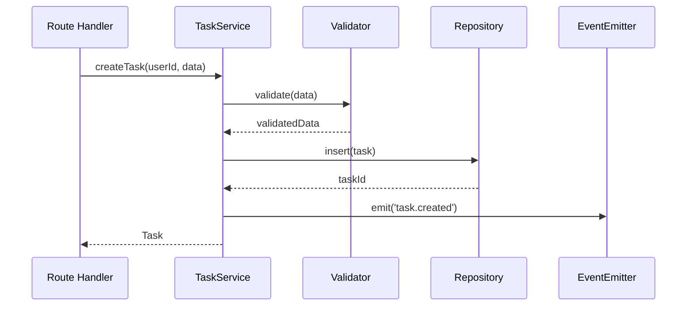
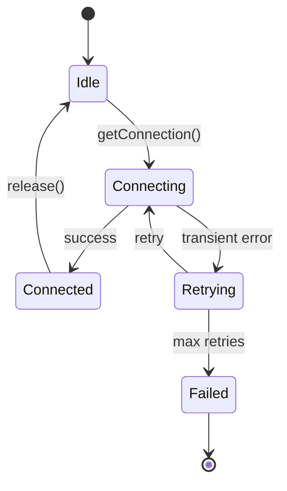
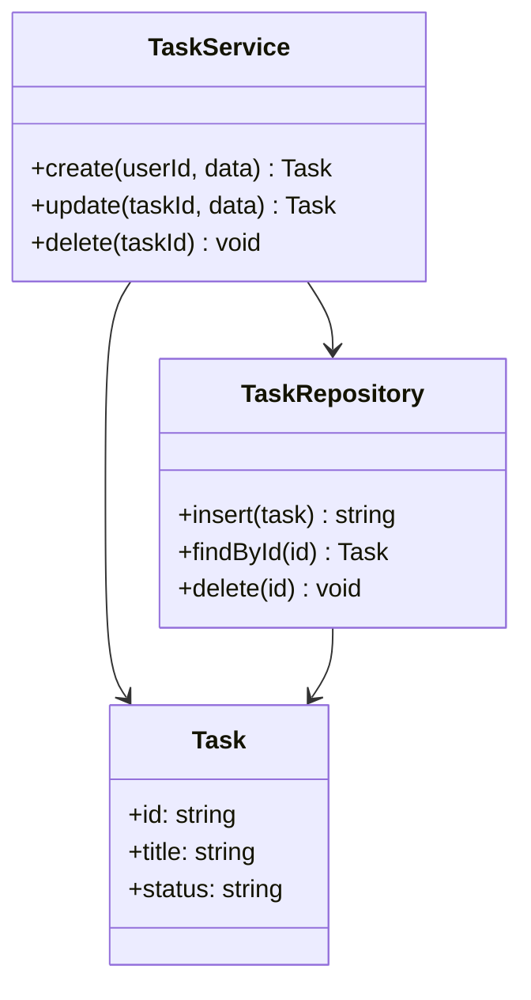
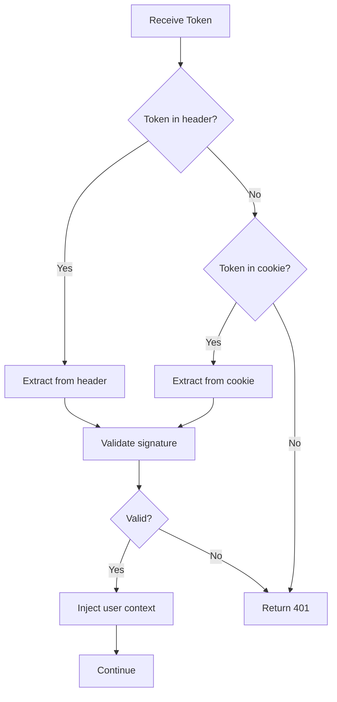

# C3 Component Level Exploration

## Overview

Explore Component-level impact during the scoping phase of c3-design. Component is the implementation layer: detailed specifications, configuration, and technical behavior.

**Abstraction Level:** Implementation details. Code examples, configuration snippets, and library usage are appropriate here.

**Announce at start:** "I'm using the c3-component-design skill to explore Component-level impact."

## When Invoked

Called during EXPLORE phase of c3-design when:
- Hypothesis suggests Component-level impact
- Need to understand implementation implications
- Exploring downstream from Container
- Change affects specific technical behavior

Also called by c3-adopt to CREATE initial Component documentation.

---

## What Belongs at Component Level

### Inclusion Criteria

**INCLUDE at Component level:**

| Element | Why Component | Example |
|---------|--------------|---------|
| Implementation details | HOW it works | Connection pooling algorithm |
| Libraries & versions | Specific dependencies | `pg: 8.11.x` |
| Configuration values | Actual env vars | `DB_POOL_MAX=50` |
| Code examples | Usage patterns | TypeScript snippets |
| Error handling | Specific strategies | Retry with backoff |
| Interfaces/Types | Data structures | `interface Task { ... }` |
| Algorithms | Logic specifics | Token validation steps |
| Performance tuning | Specific optimizations | Pool sizing formula |
| Health checks | Implementation | `SELECT 1` ping |
| Testing approach | How to test | Mock strategies |

**EXCLUDE from Component (push to Container or Context):**

| Element | Why Not Component | Where It Belongs |
|---------|------------------|------------------|
| Container purpose | Too high level | Container |
| API endpoint list | Container scope | Container |
| Middleware order | Container pipeline | Container |
| Technology choice rationale | Container decision | Container |
| System protocols | System-wide | Context |
| Cross-cutting concerns | Span containers | Context |
| Deployment topology | System-wide | Context |

### Litmus Test

Ask: "Could a developer implement this from the documentation?"
- **Yes** → Correct level (Component)
- **No, needs more detail** → Add implementation specifics
- **No, it's about structure** → Push up to Container

---

## Expressing Relationships at Component Level

### Relationship Types

| Relationship | Expression | Example |
|--------------|------------|---------|
| Dependency injection | Constructor param | `constructor(private db: Pool)` |
| Method call | Interface method | `taskService.create(data)` |
| Event emission | Event name + payload | `emit('task.created', { task })` |
| Data flow | Input → Transform → Output | `request → validate → persist` |
| Error propagation | Throws/catches | `throws DatabaseError` |

### Interface Documentation

```markdown
## Service Interface

```typescript
interface TaskService {
  create(userId: string, data: CreateInput): Promise<Task>;
  update(taskId: string, data: UpdateInput): Promise<Task>;
  delete(taskId: string): Promise<void>;
}
```
```

### Dependency Graph

```markdown
## Dependencies

| This Component | Uses | For |
|----------------|------|-----|
| TaskService | DBPool | Database queries |
| TaskService | Validator | Input validation |
| TaskService | EventEmitter | Domain events |
```

### Event Contracts

```markdown
## Events Emitted

| Event | Payload | When |
|-------|---------|------|
| `task.created` | `{ task, userId }` | After successful create |
| `task.deleted` | `{ taskId, userId }` | After successful delete |
```

### DO NOT Express at Component

- Container-to-container communication (Container level)
- Actor interactions (Context level)
- System-wide patterns (Context level)

---

## Diagrams for Component Level

### Primary: Sequence Diagram (with code)

**Purpose:** Show method calls and data flow in detail.



**When to use:** When documenting component interactions and flow.

### Secondary: State Diagram

**Purpose:** Show component state transitions.



**When to use:** When component has state machine behavior.

### Tertiary: Class/Interface Diagram

**Purpose:** Show type relationships and interfaces.



**When to use:** When documenting complex type relationships.

### Quaternary: Flowchart (with logic)

**Purpose:** Show algorithm or decision logic.



**When to use:** When documenting decision logic or algorithms.

### Avoid at Component Level

| Diagram Type | Why Not | Where It Belongs |
|--------------|---------|------------------|
| System context | Too high level | Context |
| Container overview | Too high level | Container |
| Deployment diagrams | Infrastructure | Context/Container |
| ER diagrams (high level) | Schema overview | Container |

### Appropriate at Component Level

| Diagram Type | Use Case |
|--------------|----------|
| Detailed sequence | Method calls with params |
| State machine | Component lifecycle |
| Class diagram | Type relationships |
| Flowchart | Algorithm logic |
| ER diagram (detailed) | Specific table columns |

---

## Component Level Defines

| Concern | Examples |
|---------|----------|
| **Component identity** | Name, purpose within container |
| **Technical implementation** | Libraries, patterns, algorithms |
| **Configuration** | Environment variables, config files |
| **Dependencies** | External libraries, other components |
| **Interfaces** | Methods, data structures, APIs |
| **Error handling** | Failures, retry logic, fallbacks |
| **Performance** | Caching, optimization, resources |
| **Health checks** | Monitoring, observability |

## Exploration Questions

When exploring Component level, investigate:

### Isolated (at Component)
- What implementation details change?
- What configuration affected?
- What error handling needs updating?

### Upstream (to Container)
- Does this change container responsibilities?
- Does middleware need modification?
- Are container APIs affected?

### Adjacent (same level)
- What sibling components related?
- What shared utilities affected?
- What component interactions change?

### Downstream (consumers)
- What code uses this component?
- What tests need updating?
- What documentation affected?

## Socratic Questions for Component Discovery

When creating or validating Component documentation, ask:

### Purpose
1. "What specific problem does this component solve?"
2. "What would you have to write inline if this didn't exist?"
3. "What's the single most important thing this does?"

### Implementation
4. "What library/framework does this use?"
5. "Why this library over alternatives?"
6. "What's the core algorithm or pattern?"

### Interface
7. "What are the public methods/functions?"
8. "What are the input types and output types?"
9. "What events does this emit or listen to?"

### Configuration
10. "What environment variables does this need?"
11. "What are sensible defaults?"
12. "What must change between dev and prod?"

### Error Handling
13. "What can go wrong?"
14. "What errors are retriable vs fatal?"
15. "How are errors communicated to callers?"

### Testing
16. "How would you test this in isolation?"
17. "What would you mock?"
18. "What edge cases matter?"

## Reading Component Documents

Use c3-locate to retrieve:

```
c3-locate COM-001                    # Overview
c3-locate #com-001-implementation    # Technical details
c3-locate #com-001-configuration     # Config options
c3-locate #com-001-pool-behavior     # Specific behavior
c3-locate #com-001-error-handling    # Error strategies
c3-locate #com-001-performance       # Performance characteristics
c3-locate #com-001-health-checks     # Health monitoring
c3-locate #com-001-usage             # Usage examples
```

## Impact Signals

| Signal | Meaning |
|--------|---------|
| Interface change | Consumers need updating |
| Configuration change | Deployment affected |
| Dependency change | Security/compatibility review |
| Error handling change | Monitoring may need updates |
| Component should be higher level | Revisit hypothesis at Container |

## Output for c3-design

After exploring Component level, report:
- What Component-level elements are affected
- Impact on sibling components
- Whether Container level needs changes
- Whether this is truly Component-level or should be higher
- Whether hypothesis needs revision

## Abstraction Check

**Critical question:** Does this change belong at Component level?

Signs it should be **higher** (Container/Context):
- Affects multiple components similarly
- Changes middleware behavior
- Alters container responsibilities
- Impacts system protocols

Signs it's correctly at **Component**:
- Isolated to single component
- Implementation detail only
- No upstream contract changes
- Configuration/behavior tweak

If change belongs higher, report this to c3-design for hypothesis revision.

## Document Template Reference

Component documents follow this structure:

```markdown
---
id: COM-NNN-slug
title: [Component Name] Component
summary: >
  [Why read this document - what it covers]
---

# [COM-NNN-slug] [Component Name] Component

::: info Container
Belongs to [CON-XXX: Container Name](../../containers/CON-XXX-slug.md)
:::

## Overview {#com-nnn-overview}
<!--
What this component does and why it exists.
-->

## Purpose {#com-nnn-purpose}
<!--
Specific responsibilities and goals.
-->

## Technical Implementation {#com-nnn-implementation}
<!--
How it's built - libraries, patterns, architecture.
-->

## Configuration {#com-nnn-configuration}
<!--
Environment variables and configuration options.
-->

## [Behavior Section] {#com-nnn-behavior}
<!--
Component-specific behavior (e.g., Pool Behavior, Token Validation).
-->

## Error Handling {#com-nnn-error-handling}
<!--
How errors are handled, retry strategy, error types.
-->

## Performance {#com-nnn-performance}
<!--
Performance characteristics, optimizations, metrics.
-->

## Health Checks {#com-nnn-health-checks}
<!--
Health check implementation and monitoring.
-->

## Usage Example {#com-nnn-usage}
<!--
How to use this component in application code.
-->

## Related {#com-nnn-related}
```

Use these heading IDs for precise exploration.
