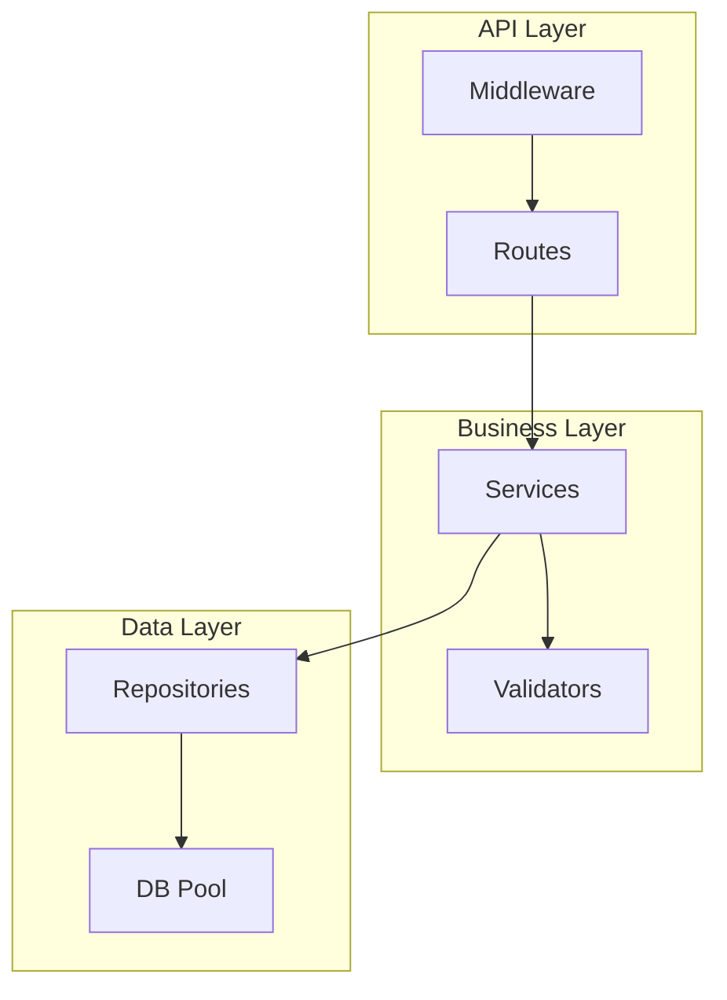
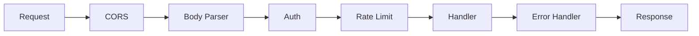
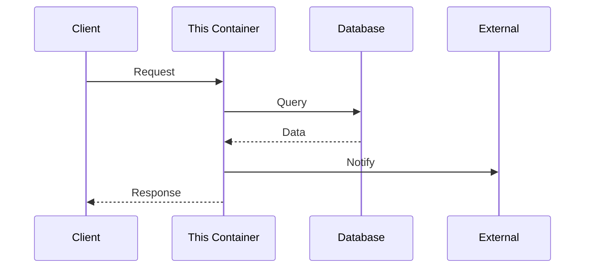
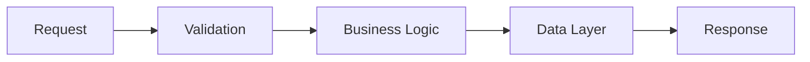

# C3 Container Level Exploration

## Overview

Explore Container-level impact during the scoping phase of c3-design. Container is the middle layer: individual services, their technology, and component organization.

**Abstraction Level:** WHAT and WHY, not HOW. Characteristics and architecture, not implementation code.

**Announce at start:** "I'm using the c3-container-design skill to explore Container-level impact."

## When Invoked

Called during EXPLORE phase of c3-design when:
- Hypothesis suggests Container-level impact
- Need to understand service-level implications
- Exploring downstream from Context
- Exploring upstream from Component
- Change affects technology stack or middleware

Also called by c3-adopt to CREATE initial Container documentation.

---

## What Belongs at Container Level

### Inclusion Criteria

**INCLUDE at Container level:**

| Element | Why Container | Example |
|---------|--------------|---------|
| Technology stack | Container-specific choices | Node.js 20, Express 4.18 |
| Container responsibilities | What this container does | "Handles API requests" |
| Middleware pipeline | Request processing flow | Auth → RateLimit → Handler |
| Component inventory | WHAT components exist | "DB Pool, Auth Middleware, Services" |
| API surface | Endpoints exposed | `POST /api/v1/tasks` |
| Data ownership | What data this owns | "User accounts, Tasks" |
| Inter-container communication | How it talks to siblings | "REST to Backend, SQL to DB" |
| Configuration approach | How config is managed | Environment variables |
| Deployment specifics | Container deployment | Docker image, resources |

**EXCLUDE from Container (push to Context or Component):**

| Element | Why Not Container | Where It Belongs |
|---------|------------------|------------------|
| System boundary | Affects multiple containers | Context |
| Cross-cutting concerns | Span containers | Context |
| Protocol decisions | System-wide | Context |
| Implementation code | Too detailed | Component |
| Library specifics | Implementation | Component |
| Configuration values | Implementation | Component |
| Error handling details | Implementation | Component |
| Algorithm specifics | Implementation | Component |

### Litmus Test

Ask: "Is this about WHAT this container does and WITH WHAT, not HOW it does it internally?"
- **Yes** → Container level
- **No (system-wide)** → Push up to Context
- **No (implementation)** → Push down to Component

---

## Expressing Relationships at Container Level

### Relationship Types

| Relationship | Expression | Example |
|--------------|------------|---------|
| Container → Container | Protocol + purpose | "Calls Auth Service via gRPC for validation" |
| Container → Database | Connection type | "PostgreSQL via connection pool" |
| Container → External | Integration type | "SMTP to SendGrid" |
| Layer → Layer (internal) | Arrow with label | Routes → Services → Repositories |
| Component → Component | Dependency | "TaskService depends on DBPool" |

### Relationship Table Format

```markdown
## Component Dependencies

| Component | Depends On | Relationship |
|-----------|------------|--------------|
| TaskService | DBPool | Uses for queries |
| TaskService | AuthMiddleware | Protected by |
| Routes | TaskService | Delegates to |
```

### Internal Structure Diagram

Show layers and component groups:

```markdown
## Component Organization

| Layer | Components | Responsibility |
|-------|------------|----------------|
| API | Routes, Middleware | HTTP handling |
| Business | Services, Validators | Domain logic |
| Data | Repositories, DBPool | Persistence |
```

### DO NOT Express at Container

- Actor interactions (Context level)
- System-wide protocols (Context level)
- Method signatures (Component level)
- Data structures (Component level)

---

## Diagrams for Container Level

### Primary: Internal Layer Diagram

**Purpose:** Show internal structure and component organization.



**When to use:** Always include to show component organization.

### Secondary: Middleware Pipeline Diagram

**Purpose:** Show request processing flow.



**When to use:** When container has middleware/pipeline.

### Tertiary: Communication Diagram

**Purpose:** Show how this container communicates with others.



**When to use:** When documenting inter-container communication patterns.

### Quaternary: Data Flow Diagram

**Purpose:** Show how data moves through the container.



**When to use:** When data transformation is important.

### Avoid at Container Level

| Diagram Type | Why Not | Where It Belongs |
|--------------|---------|------------------|
| System context diagram | Too high level | Context |
| Actor diagrams | System level | Context |
| Class diagrams with methods | Too detailed | Component |
| Detailed sequence with code | Implementation | Component |
| State machines for logic | Implementation | Component |

---

## Container Level Defines

| Concern | Examples |
|---------|----------|
| **Container identity** | Name, purpose, responsibilities |
| **Technology stack** | Language, framework, runtime |
| **Component organization** | Internal structure, layers |
| **Middleware pipeline** | Auth, rate limiting, request flow |
| **APIs** | Endpoints exposed and consumed |
| **Data responsibilities** | What data this container owns |
| **Deployment specifics** | Container-level deployment |

## Exploration Questions

When exploring Container level, investigate:

### Isolated (at Container)
- What container responsibilities change?
- What middleware pipeline affected?
- What APIs need modification?

### Upstream (to Context)
- Does this change system boundaries?
- Do protocols need updating?
- Are cross-cutting concerns affected?

### Adjacent (same level)
- What sibling containers related?
- What inter-container communication affected?
- What shared dependencies exist?

### Downstream (to Components)
- Which components inside this container affected?
- What new components needed?
- How does component organization change?

## Socratic Questions for Container Discovery

When creating or validating Container documentation, ask:

### Identity & Purpose
1. "What is the single responsibility of this container?"
2. "If this container disappeared, what would break?"
3. "What would you name this container in one word?"

### Technology
4. "What language and framework does this use?"
5. "Why was this technology chosen over alternatives?"
6. "What are the key libraries/dependencies?"

### Structure
7. "How is code organized inside? Layers? Modules?"
8. "What are the main entry points?"
9. "How do requests flow through this container?"

### APIs
10. "What endpoints does this container expose?"
11. "What APIs does it consume from other containers?"
12. "What is the API versioning strategy?"

### Data
13. "What data does this container own?"
14. "What data does it read from other sources?"
15. "How is data validated and transformed?"

### Configuration
16. "How is this container configured?"
17. "What differs between dev and production?"
18. "What secrets are required?"

## Reading Container Documents

Use c3-locate to retrieve:

```
c3-locate CON-001                    # Overview
c3-locate #con-001-technology-stack  # Tech choices
c3-locate #con-001-middleware        # Request pipeline
c3-locate #con-001-components        # Internal structure
c3-locate #con-001-api-endpoints     # API surface
c3-locate #con-001-communication     # Inter-container
c3-locate #con-001-data              # Data ownership
c3-locate #con-001-configuration     # Config approach
c3-locate #con-001-deployment        # Deployment details
```

## Impact Signals

| Signal | Meaning |
|--------|---------|
| New middleware layer needed | Cross-component change |
| API contract change | Consumers affected |
| Technology stack change | Major container rewrite |
| Data ownership change | Migration needed |
| New container needed | Context-level impact |

## Output for c3-design

After exploring Container level, report:
- What Container-level elements are affected
- Impact on adjacent containers
- Components that need deeper exploration
- Whether Context level needs revisiting
- Whether hypothesis needs revision

## Document Template Reference

Container documents follow this structure:

```markdown
---
id: CON-NNN-slug
title: [Container Name] Container
summary: >
  [Why read this document - what it covers]
---

# [CON-NNN-slug] [Container Name] Container

::: info Context
This container is part of [CTX-001: System Overview](../CTX-001-system-overview.md).
:::

## Overview {#con-nnn-overview}
<!--
High-level description of container purpose and responsibilities.
-->

## Technology Stack {#con-nnn-technology-stack}
<!--
Lists languages, frameworks, and key libraries used. Read to understand
the technical foundation.
-->

## Middleware Pipeline {#con-nnn-middleware}
<!--
Describes the request processing pipeline. Read this to understand how
requests flow through this container.
-->

## Component Organization {#con-nnn-components}
<!--
Shows how components are structured inside the container.
-->

## API Endpoints {#con-nnn-api-endpoints}
<!--
Documents the main API endpoints exposed by this container.
-->

## Communication Patterns {#con-nnn-communication}
<!--
Explains how this container talks to other containers.
-->

## Data Responsibilities {#con-nnn-data}
<!--
What data this container owns and manages.
-->

## Configuration {#con-nnn-configuration}
<!--
Environment-based configuration for this container.
-->

## Deployment {#con-nnn-deployment}
<!--
Container-specific deployment characteristics.
-->

## Related {#con-nnn-related}
```

Use these heading IDs for precise exploration.
