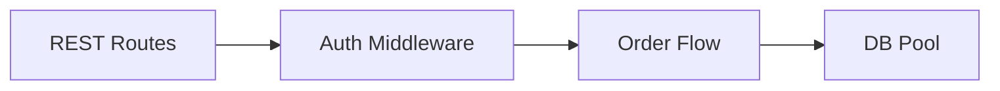
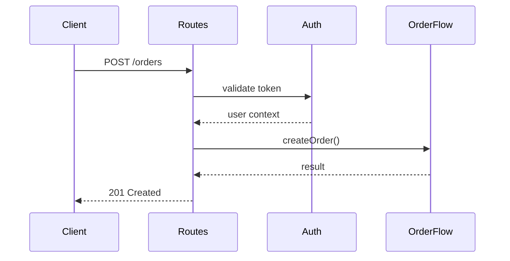

# C3 Container Level Exploration

## Overview

Explore Container-level impact during the scoping phase of c3-design. Container is the middle layer: individual services, their technology, and component organization.

**Abstraction Level:** WHAT and WHY, not HOW. Characteristics and architecture, not implementation code.

**Announce at start:** "I'm using the c3-container-design skill to explore Container-level impact."

## Role Vocabulary

Reference @references/role-taxonomy.md for component role patterns.

Use roles as **discovery vocabulary**, not requirements:
- "This looks like a Request Handler role - accurate?"
- "I see Database Access here - what database?"

## When Invoked

Called during EXPLORE phase of c3-design when:
- Hypothesis suggests Container-level impact
- Need to understand service-level implications
- Change affects technology stack or middleware

Also called by c3-adopt to CREATE initial Container documentation.

## Quick Reference

| Direction | Question | Action |
|-----------|----------|--------|
| **Isolated** | What container responsibilities change? | Investigate this container |
| **Upstream** | Does this change system boundaries? | May need c3-context-design |
| **Adjacent** | What sibling containers related? | Check inter-container communication |
| **Downstream** | Which components inside affected? | Delegate to c3-component-design |

## Two Container Types

| Type | Has Components? | Focus |
|------|-----------------|-------|
| **Code Container** | Yes | Tech stack, component inventory, protocol implementations |
| **Infrastructure Container** | No (leaf) | Engine, config, features provided |

Infrastructure containers are **leaf nodes** - no component level beneath them.

---

## What Belongs at Container Level

### Include

| Element | Example |
|---------|---------|
| Technology stack | Node.js 20, Express 4.18 |
| Container responsibilities | "Handles API requests" |
| Component relationships | Flowchart of connections |
| Data flow | Sequence diagram |
| Component inventory | Links to component docs |
| API surface | Endpoints exposed |
| Data ownership | "Owns User accounts, Tasks" |
| Inter-container communication | "REST to Backend, SQL to DB" |

### Exclude

| Element | Where |
|---------|-------|
| System boundary | Context |
| Cross-cutting concerns | Context |
| Implementation code | Component |
| Library specifics | Component |
| Configuration values | Component |

### Litmus Test

> "Is this about WHAT this container does and WITH WHAT, not HOW internally?"
- **Yes** → Container level
- **No (system-wide)** → Push to Context
- **No (implementation)** → Push to Component

---

## Diagrams

### Required: Component Relationships Flowchart



### Required: Data Flow Sequence



**Avoid:** System context, actor diagrams, detailed class diagrams (wrong level).

---

## Exploration Questions

### Isolated
- What container responsibilities change?
- What middleware pipeline affected?
- What APIs need modification?

### Upstream
- Does this change system boundaries?
- Do protocols need updating?

### Adjacent
- What sibling containers related?
- What inter-container communication affected?

### Downstream
- Which components inside affected?
- What new components needed?

---

## Socratic Questions

Use @references/discovery-questions.md for full question bank.

**Use AskUserQuestion tool when presenting choices:**

Example for technology discovery:
```
Question: "What web framework does this use?"
Options (from Task Explore findings):
- Express (discovered in package.json)
- Fastify
- Other
```

**Use open-ended questions for context:**
- "What is this container's primary responsibility?"
- "What would break if this was removed?"

**Identity:**
- "What is the single responsibility of this container?"
- "If this disappeared, what would break?"

**Technology:**
- "What language and framework?"
- "Why was this chosen?"

**Structure:**
- "How is code organized? Layers? Modules?"
- "What are the main entry points?"

**APIs:**
- "What endpoints exposed?"
- "What APIs consumed from other containers?"

---

## Code Container Template

```markdown
---
id: c3-{N}
c3-version: 3
title: [Container Name]
---

# [Container Name]

## Overview {#c3-n-overview}
[Purpose and responsibilities]

## Technology Stack {#c3-n-stack}
- Runtime: [version]
- Framework: [version]
- Language: [version]

## Component Relationships {#c3-n-relationships}
[Flowchart]

## Data Flow {#c3-n-data-flow}
[Sequence diagram]

## Cross-Cutting {#c3-n-cross-cutting}
### Logging
Implemented by: [component link]

### Error Handling
Implemented by: [component link]

## Components {#c3-n-components}
| Component | Nature | Responsibility |
|-----------|--------|----------------|
| [link] | [type] | [description] |
```

### Code Container Checklist

- [ ] Technology stack recorded
- [ ] Protocol implementations mapped
- [ ] Component relationships flowchart present
- [ ] Data flow sequence diagram present
- [ ] Cross-cutting mapped to components
- [ ] Component inventory complete
- [ ] Anchors use `{#c3-n-*}` format

## Infrastructure Container Template

```markdown
---
id: c3-{N}
c3-version: 3
title: [Infrastructure Name]
---

# [Infrastructure Name]

## Engine {#c3-n-engine}
[Technology] [Version]

## Configuration {#c3-n-config}
| Setting | Value | Why |
|---------|-------|-----|

## Features Provided {#c3-n-features}
| Feature | Used By |
|---------|---------|
```

### Infrastructure Checklist

- [ ] Engine/version stated
- [ ] Configuration with rationale
- [ ] Features table with consumers
- [ ] No component sections (leaf node)

---

## Meta-Framework Containers

For Next.js, Nuxt, SvelteKit containers, document by execution context:

Reference @references/archetype-hints.md for execution context table.

```markdown
## Execution Contexts {#c3-n-contexts}

| Context | Roles | Examples |
|---------|-------|----------|
| Server Build-time | Data Access, View Layer | getStaticProps, generateStaticParams |
| Server Runtime | Request Handler, Business Logic | API routes, server actions |
| Client Runtime | View Layer, State Container | Client components, stores |
```

Document components by which context they run in.

---

## Impact Signals

| Signal | Meaning |
|--------|---------|
| New middleware layer needed | Cross-component change |
| API contract change | Consumers affected |
| Technology stack change | Major rewrite |
| New container needed | Context-level impact |

## Output for c3-design

After exploring, report:
- Container-level elements affected
- Impact on adjacent containers
- Components needing deeper exploration
- Whether Context level needs revisiting
- Whether hypothesis needs revision

## Related

- [derivation-guardrails.md](../../references/derivation-guardrails.md)
- [v3-structure.md](../../references/v3-structure.md)
