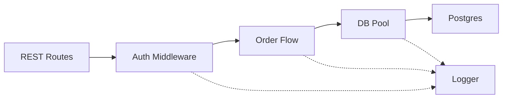
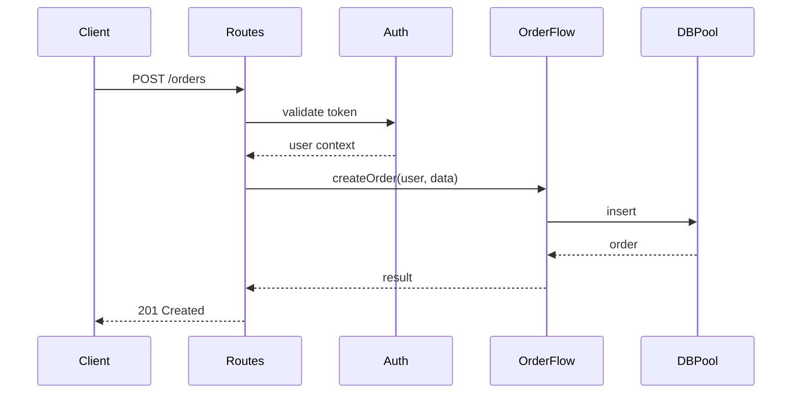

# C3 Container Level Exploration

## Overview

Explore Container-level impact during the scoping phase of c3-design. Container is the middle layer: individual services, their technology, and component organization.

**Abstraction Level:** WHAT and WHY, not HOW. Characteristics and architecture, not implementation code.

**Announce at start:** "I'm using the c3-container-design skill to explore Container-level impact."

**Reading order:** Navigate Context → Container → Component.

**Reference direction:** Links flow downward. Container docs link to Component docs/sections that implement protocols and cross-cutting concerns. Infrastructure containers are leaf nodes and do not link further down.

## When Invoked

Called during EXPLORE phase of c3-design when:
- Hypothesis suggests Container-level impact
- Need to understand service-level implications
- Exploring downstream from Context
- Exploring upstream from Component
- Change affects technology stack or middleware

Also called by c3-adopt to CREATE initial Container documentation.

---

## Container Types

| Type | Has Components? | Documentation Focus |
|------|-----------------|---------------------|
| **Code Container** | Yes | Tech stack, component inventory, how protocols are implemented |
| **Infrastructure Container** | No (leaf node) | Engine/technology, configuration, features provided to code containers |

Code containers must document how Context-level protocols and cross-cutting concerns are implemented, and link to Component docs/sections. Infrastructure containers stop the derivation chain and describe what they provide to code containers.

---
## What Belongs at Container Level

### Inclusion Criteria

**Code Containers: include**

| Element | Why Container | Example |
|---------|--------------|---------|
| Technology stack | Container-specific choices | Node.js 20, Express 4.18 |
| Component inventory (link to Component docs) | Defines WHAT exists in this container | [COM-001-rest-routes], [COM-002-auth-middleware] |
| Component relationships (flowchart) | Shows how components connect | Routes → Auth → Business → DB Pool |
| Data flow (sequence diagram) | Shows how data moves through container | Client → Routes → Auth → Service → DB |
| Container cross-cutting (link to components) | Logging, error handling within this container | [COM-006-logger], [COM-007-error-handler] |
| Protocol implementations | How Context protocols are fulfilled; link to component sections | REST endpoints and clients |
| Configuration approach | How config is managed across components | Environment variables, secrets |
| Deployment specifics | Container deployment footprint | Docker image, resources |

**Infrastructure Containers: include**

| Element | Why Container | Example |
|---------|--------------|---------|
| Engine/technology | Defines the platform | PostgreSQL 15, NATS |
| Configuration | Settings and tuning | `wal_level: logical`, `max_connections: 100` |
| Features provided | Inputs consumed by code container components | WAL logical replication, LISTEN/NOTIFY |

**EXCLUDE from Container (push to Context or Component):**

| Element | Why Not Container | Where It Belongs |
|---------|------------------|------------------|
| System boundary | Affects multiple containers | Context |
| System-wide cross-cutting/protocol decisions | Span containers | Context |
| Component internals | Implementation detail | Component |
| Library specifics or code | Implementation | Component |
| Configuration values per environment | Implementation | Component |
| Algorithm details | Implementation | Component |

### Litmus Test

Ask: "Is this about WHAT this container does and WITH WHAT, not HOW it does it internally?"
- **Yes (code container)** → Document and link to Components for implementation
- **Yes (infrastructure container)** → Document engine, config, and features (leaf)
- **No (system-wide)** → Push up to Context
- **No (implementation)** → Push down to Component

---

## Expressing Relationships at Container Level

### Downward Linking to Components

- Component inventory rows must link to Component docs/sections.
- Protocol implementations should link to the Component sections that fulfill each side.
- Container cross-cutting concerns must link to the Component sections implementing them.
- Keep links unidirectional (Container → Component). Do not add upward references.

### Component Relationships (Flowchart)

Show how components connect inside the container.



### Data Flow (Sequence Diagram)

Illustrate how data moves through the container for a representative request.



### Container Cross-Cutting

| Concern | Pattern | Implemented By |
|---------|---------|----------------|
| Logging | Structured JSON with correlation IDs | [COM-006-logger] |
| Error Handling | Unified error envelope | [COM-007-error-handler] |
| Authentication | JWT verification | [COM-002-auth-middleware] |

### Infrastructure Containers Are Leaf Nodes

- Do not create component inventories for infrastructure containers.
- Document features they provide and which code components consume them.

```markdown
| Feature | Used By |
|---------|---------|
| WAL logical replication | [CON-001-backend] → [COM-005-event-streaming] |
| LISTEN/NOTIFY | [CON-001-backend] → [COM-003-db-pool] |
```

### Avoid at Container Level

- Actor interactions (Context level)
- System-wide protocols (Context level definitions)
- Method signatures or implementation details (Component level)
- Data structures and algorithms (Component level)

---

## Diagrams for Container Level

Include both diagrams below for code containers:

- **Flowchart (Component Relationships)**: Shows how components connect.
- **Sequence Diagram (Data Flow)**: Shows how requests/data traverse the container.

### Avoid at Container Level

| Diagram Type | Why Not | Where It Belongs |
|--------------|---------|------------------|
| System context diagram | Too high level | Context |
| Actor diagrams | System level | Context |
| Class diagrams with methods | Too detailed | Component |
| Detailed sequence with code | Implementation | Component |
| State machines for logic | Implementation | Component |

---

## Container Level Defines

| Concern | Examples |
|---------|----------|
| **Container identity** | Name, purpose, responsibilities |
| **Technology stack** | Language, framework, runtime |
| **Component relationships** | How components connect (flowchart) |
| **Data flow** | Sequence of request/data through container |
| **Container cross-cutting** | Logging, errors, auth within this container |
| **Protocol implementations** | How Context protocols are fulfilled (with links down) |
| **APIs** | Endpoints exposed and consumed |
| **Data responsibilities** | What data this container owns |
| **Deployment specifics** | Container-level deployment |

## Exploration Questions

When exploring Container level, investigate:

### Isolated (at Container)
- What container responsibilities change?
- What middleware pipeline affected?
- What APIs need modification?

### Upstream (to Context)
- Does this change system boundaries?
- Do protocols need updating?
- Are cross-cutting concerns affected?

### Adjacent (same level)
- What sibling containers related?
- What inter-container communication affected?
- What shared dependencies exist?

### Downstream (to Components)
- Which components inside this container affected?
- What new components needed?
- How does component organization change?

## Socratic Questions for Container Discovery

When creating or validating Container documentation, ask:

### Identity & Purpose
1. "What is the single responsibility of this container?"
2. "If this container disappeared, what would break?"
3. "What would you name this container in one word?"

### Technology
4. "What language and framework does this use?"
5. "Why was this technology chosen over alternatives?"
6. "What are the key libraries/dependencies?"

### Structure
7. "How is code organized inside? Layers? Modules?"
8. "What are the main entry points?"
9. "How do requests flow through this container?"

### APIs
10. "What endpoints does this container expose?"
11. "What APIs does it consume from other containers?"
12. "What is the API versioning strategy?"

### Data
13. "What data does this container own?"
14. "What data does it read from other sources?"
15. "How is data validated and transformed?"

### Configuration
16. "How is this container configured?"
17. "What differs between dev and production?"
18. "What secrets are required?"

## Reading Container Documents

Use c3-locate to retrieve:

```
c3-locate CON-001                    # Overview
c3-locate #con-001-stack             # Tech choices
c3-locate #con-001-relationships     # Component relationships (flowchart)
c3-locate #con-001-data-flow         # Data flow (sequence diagram)
c3-locate #con-001-cross-cutting     # Logging, errors, auth
c3-locate #con-001-protocol-implementations # Context protocol implementations
c3-locate #con-001-components        # Component inventory with links
c3-locate #con-001-data              # Data ownership
c3-locate #con-001-configuration     # Config approach
c3-locate #con-001-deployment        # Deployment details
```

## Impact Signals

| Signal | Meaning |
|--------|---------|
| New middleware layer needed | Cross-component change |
| API contract change | Consumers affected |
| Technology stack change | Major container rewrite |
| Data ownership change | Migration needed |
| New container needed | Context-level impact |

## Output for c3-design

After exploring Container level, report:
- What Container-level elements are affected
- Impact on adjacent containers
- Components that need deeper exploration
- Whether Context level needs revisiting
- Whether hypothesis needs revision

## Document Template Reference

### Code Container Template

```markdown
---
id: CON-NNN-slug
title: [Container Name] Container (Code)
summary: >
  [Why read this document - what it covers]
---

# [CON-NNN-slug] [Container Name] Container (Code)

::: info Context
This container is part of [CTX-001: System Overview](../CTX-001-system-overview.md).
:::

## Overview {#con-nnn-overview}

## Technology Stack {#con-nnn-stack}
- Runtime: [Node.js 20]
- Framework: [Express 4.18]
- Language: [TypeScript 5.x]

## Component Relationships {#con-nnn-relationships}

<!-- Flowchart showing how components connect -->

## Data Flow {#con-nnn-data-flow}

<!-- Sequence diagram showing request/data flow -->

## Container Cross-Cutting {#con-nnn-cross-cutting}
| Concern | Pattern | Implemented By |
|---------|---------|----------------|
| Logging | Structured JSON with correlation IDs | [COM-006-logger] |
| Error Handling | Unified error envelope | [COM-007-error-handler] |
| Authentication | JWT verification | [COM-002-auth-middleware] |
<!-- Link to Component sections implementing each concern. -->

## Protocol Implementations {#con-nnn-protocol-implementations}
| Context Protocol | Implemented By |
|------------------|----------------|
| REST/HTTPS | [COM-001-rest-routes], [COM-004-api-client] |
| SQL | [COM-003-db-pool] |
<!-- Satisfies Context protocol rows with downward links. -->

## Components {#con-nnn-components}
| Component | Nature | Responsibility |
|-----------|--------|----------------|
| [COM-001-rest-routes](./components/COM-001-rest-routes.md) | Entrypoint | HTTP handling |
| [COM-002-auth-middleware](./components/COM-002-auth-middleware.md) | Cross-cutting | Token validation |
| [COM-003-db-pool](./components/COM-003-db-pool.md) | Resource | Connection management |
| [COM-004-order-flow](./components/COM-004-order-flow.md) | Business | Domain logic |
<!-- Inventory links down to Component docs. -->

## Data Responsibilities {#con-nnn-data}
<!-- What data this container owns and manages. -->

## Configuration {#con-nnn-configuration}
| Env Var | Dev | Prod | Notes |
|---------|-----|------|-------|
| DB_POOL_MAX | 10 | 50 | Pool sizing |
| API_PORT | 3000 | 8080 | Service port |

## Deployment {#con-nnn-deployment}
<!-- Container-specific deployment characteristics. -->

## Related {#con-nnn-related}
```

### Infrastructure Container Template

```markdown
---
id: CON-NNN-slug
title: [Container Name] Container (Infrastructure)
summary: >
  [Why read this document - what it covers]
---

# [CON-NNN-slug] [Container Name] Container (Infrastructure)

::: info Context
This container is part of [CTX-001: System Overview](../CTX-001-system-overview.md).
:::

## Overview {#con-nnn-overview}

## Engine {#con-nnn-engine}
[e.g., PostgreSQL 15]

## Configuration {#con-nnn-config}
| Setting | Value | Why |
|---------|-------|-----|
| max_connections | 100 | Support pooling from backend |
| wal_level | logical | Enable event streaming |

## Features Provided {#con-nnn-features}
| Feature | Used By |
|---------|---------|
| WAL logical replication | [CON-001-backend] → [COM-005-event-streaming] |
| LISTEN/NOTIFY | [CON-001-backend] → [COM-003-db-pool] |

## Related {#con-nnn-related}
```

Use these heading IDs for precise exploration.
