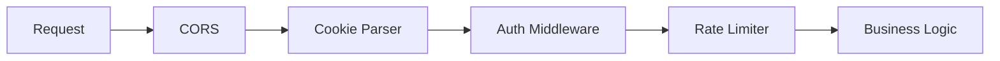
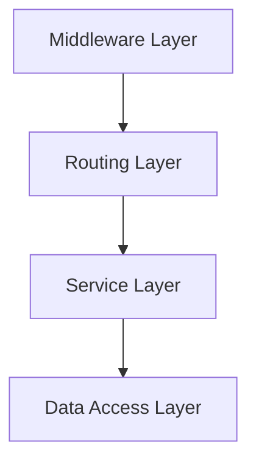

# C3 Container Level Design

## Purpose

Define individual containers: their characteristics, technology stack, internal component organization, and communication patterns.

**Abstraction Level:** WHAT and WHY, not HOW. Focus on characteristics, properties, architectural decisions - not implementation code.

## Container Defines

- **Container identity**: Name, purpose, responsibility
- **Technology stack**: Language, framework, runtime, platform
- **Component organization**: What components exist inside, how structured
- **Middleware/Proxy layer**: Auth, cookies, rate limiting, request pipeline
- **Dependencies**: Other containers it communicates with
- **Interfaces**: APIs exposed, APIs consumed
- **Data responsibilities**: What data it owns/manages
- **Deployment specifics**: Container-level deployment details

## When Invoked

- ADR identifies Container-level changes
- User explicitly calls `/c3-container-design`
- Context references a container needing elaboration
- Adding/modifying containers in system

## Workflow

### Step 1: Read Existing Container Doc

```bash
# Find container document
find .c3/containers -name "CON-*.md"

# Read specific container
awk '/^---$/,/^---$/ {print}' .c3/containers/CON-001-backend.md
```

### Step 2: Read Parent Context

```bash
# Understand container's role in system
grep -l "CON-001-backend" .c3/CTX-*.md
```

### Step 3: Identify Scope

From ADR:
- New container or updating existing?
- What's changing: tech stack, middleware, components?
- Which other containers affected?

### Step 4: Gather Details (Targeted Socratic)

Ask ONLY if needed:
- Container's responsibility?
- Technology stack? (language, framework, libraries)
- Middleware/proxy layer? (auth interceptors, cookie handlers)
- Component organization?
- Communication with other containers?
- APIs/interfaces exposed?
- Data ownership?

### Step 5: Generate/Update Diagrams

**MUST HAVE:**
- C4 Container diagram OR Internal component structure diagram

**SHOULD HAVE:**
- Component organization diagram
- Middleware/proxy flow diagram
- Data flow diagram
- Sequence diagram for key interactions
- Deployment diagram (container-specific)

### Step 6: Write/Update Container Document

**Determine file path:**
```bash
# If updating
file_path=".c3/containers/CON-001-backend.md"

# If new
last_con=$(find .c3/containers -name "CON-*.md" | sed 's/.*CON-\([0-9]*\).*/\1/' | sort -n | tail -1)
next_num=$(printf "%03d" $((10#$last_con + 1)))
file_path=".c3/containers/CON-${next_num}-${slug}.md"
```

**Document structure:**

```markdown
---
id: CON-001-backend
title: Backend Container
summary: >
  Describes the backend API service architecture, middleware pipeline,
  and component organization. Read this to understand how the backend
  handles requests, manages authentication, and structures its components.
---

# [CON-001-backend] Backend Container

::: info Context
This container is part of [CTX-001: System Context](../CTX-001-system-overview.md).
:::

## Overview {#con-001-overview}
<!--
High-level description of container purpose and responsibilities.
-->

REST API service handling business logic, authentication, and data management.

## Technology Stack {#con-001-technology-stack}
<!--
Lists languages, frameworks, and key libraries used. Read to understand
technical foundation.
-->

- **Language**: TypeScript 5.3
- **Framework**: Express.js 4.18
- **Runtime**: Node.js 20 LTS
- **ORM**: Prisma 5

## Middleware Pipeline {#con-001-middleware}
<!--
Describes the request processing pipeline through authentication, cookie
handling, and rate limiting layers. Read this to understand how requests
flow through the backend before reaching business logic.
-->



### Authentication Middleware {#con-001-auth-middleware}
**Component**: [COM-003-auth-middleware](../components/backend/COM-003-auth-middleware.md)

JWT token validation via cookies:
- Token validation and expiry
- Session state management
- User context injection

### Cookie Handler {#con-001-cookie-handler}
**Component**: [COM-004-cookie-handler](../components/backend/COM-004-cookie-handler.md)

Cookie management with security characteristics:

**Properties**:
- `HttpOnly`: true (XSS prevention)
- `Secure`: true in production, false in dev
- `SameSite`: Strict for auth, Lax for tracking
- `Path`: `/api` for API cookies

**Environment Differences**:
- Development: localhost, relaxed security
- Production: secure flags, short expiry, production domain

### Rate Limiter {#con-001-rate-limiter}
**Component**: [COM-005-rate-limiter](../components/backend/COM-005-rate-limiter.md)

Request throttling:
- IP-based: 100 req/min
- User-based: 1000 req/min
- Redis-backed sliding window

## Component Organization {#con-001-components}
<!--
Shows how components are structured inside the container.
-->



Layers:
- **Middleware**: Cross-cutting concerns
- **Routing**: HTTP endpoints
- **Service**: Business logic
- **Data Access**: Database queries

### Key Components
- [COM-001-db-pool](../components/backend/COM-001-db-pool.md) - Database connection management
- [COM-002-user-service](../components/backend/COM-002-user-service.md) - User operations

## Communication Patterns {#con-001-communication}
<!--
Explains how this container talks to other containers.
-->

### To Database Container {#con-001-to-database}
**Container**: [CON-003-database](./CON-003-database.md)

- Protocol: PostgreSQL wire protocol
- Connection: Pooled (10-50 connections)
- Security: SSL/TLS in production

### To Auth Service {#con-001-to-auth-service}
**Container**: [CON-004-auth-service](./CON-004-auth-service.md)

- Protocol: gRPC
- Pattern: Synchronous request/response
- Fallback: Cached public keys

## Data Responsibilities {#con-001-data}
<!--
What data this container owns and manages.
-->

- **Owns**: User business data, application state
- **Manages**: Session tokens (cookies), rate limit counters (Redis)
- **Transient**: Request/response data, in-memory caches

## Deployment {#con-001-deployment}
<!--
Container-specific deployment characteristics.
-->

- **Scaling**: Horizontal (stateless)
- **Health checks**: `/health` with DB check
- **Graceful shutdown**: 30s drain period

## Related {#con-001-related}

- [CTX-001: System Context](../CTX-001-system-overview.md)
- [ADR-003: Cookie-based sessions](../adr/ADR-003-cookie-sessions.md)
```

### Step 7: Update VitePress Config

Add to sidebar if new container.

### Step 8: Regenerate TOC

```bash
.c3/scripts/build-toc.sh
```

## Document Conventions

### Frontmatter
```yaml
---
id: CON-NNN-slug
title: Container Name
summary: >
  What this container does and why you should read this doc.
---
```

### Heading IDs
Pattern: `{#con-nnn-heading-slug}`

### Heading Summaries
```markdown
## Section {#con-001-section}
<!--
What this section explains.
-->
```

### Links
- Up to context: `[CTX-001](../CTX-001-system-overview.md)`
- Down to components: `[COM-001](../components/backend/COM-001-db-pool.md)`
- Across containers: `[CON-002](./CON-002-frontend.md)`
- To specific sections: `[Middleware](./CON-001-backend.md#con-001-middleware)`

## Key Principles

- **Characteristics, not code**: Properties and patterns, not implementation
- **Middleware is key**: Document request pipeline and cross-cutting concerns
- **Environment differences**: Call out dev vs prod configurations
- **Link everything**: Up to context, down to components, across to peers
