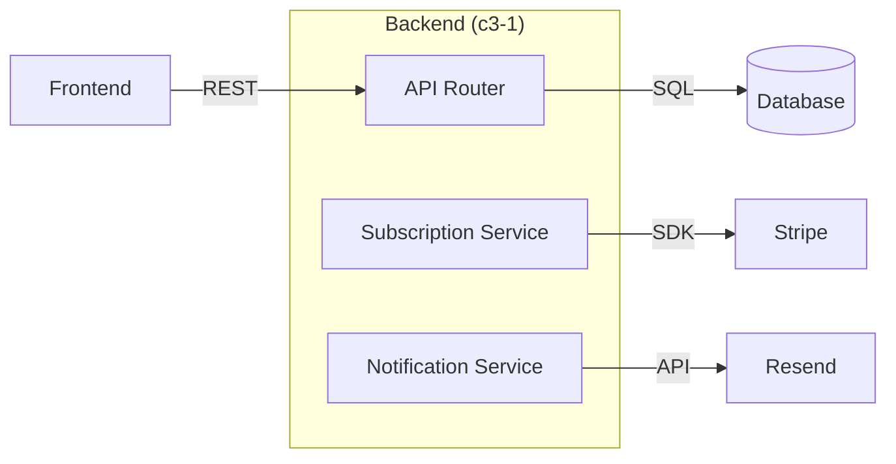
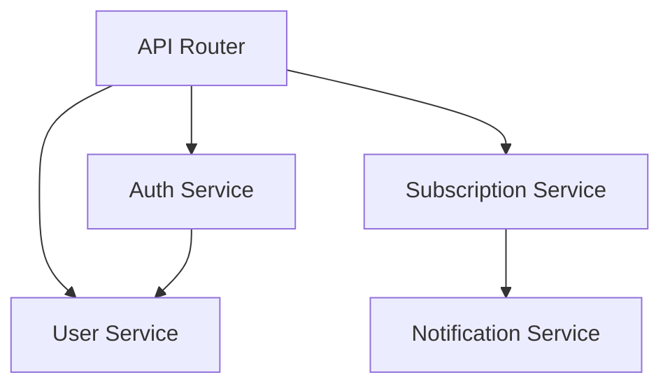

# C3 Container Level Exploration

## Overview

The Container level is the **architectural command center** of C3:
- **Full context awareness** from above (inherits from Context)
- **Complete control** over component responsibilities below
- **Mediator** for all interactions

**Position:** MIDDLE (c3-{N}) | Parent: Context (c3-0) | Children: Components (c3-{N}NN)

**Announce:** "I'm using the c3-container-design skill to explore Container-level impact."

---

## The Principle

**Reference:** [core-principle.md](../../references/core-principle.md)

> **Upper layer defines WHAT. Lower layer implements HOW.**

At Container level:
- Context defines WHAT I am (my existence, my responsibility)
- I define WHAT components exist and WHAT they do
- Component implements my definitions (HOW it works)
- I do NOT define how components work internally - that's Component's job

**Integrity rules:**
- I must be listed in Context before I can exist
- Components cannot exist without being listed in my inventory

---

## Container Archetypes

**Reference:** [container-archetypes.md](../../references/container-archetypes.md)

Different containers have different relationships to content. Common archetypes:

| Archetype | Relationship | Typical Components |
|-----------|--------------|-------------------|
| **Service** | Creates/processes | Handlers, Services, Adapters |
| **Data** | Stores/structures | Schema, Indexes, Migrations |
| **Boundary** | Interface to external | Contract, Client, Fallback |
| **Platform** | Operates on containers | CI/CD, Deployment, Networking |

**The principle matters more than archetypes.** Ask: "What is this container's relationship to content?" Components follow from that answer.

---

## Load Settings

Read `.c3/settings.yaml` and merge with `defaults.md`.

```bash
cat .c3/settings.yaml 2>/dev/null
```

Display active config:
```
Container Layer Configuration:
├── Include: [merged list]
├── Exclude: [merged list]
├── Litmus: [active test]
└── Diagrams: [tool] - [types]
```

**Default litmus:** "Is this about WHAT this container does and WITH WHAT, not HOW internally?"

---

## Decision: Is This Container Level?

**Container-level indicators (ANY = yes):**
- Changes technology stack
- Reorganizes component structure
- Modifies internal patterns
- Changes API contracts between components
- Adds/removes components
- Changes cross-container interactions

**Escalate to Context if (ANY):**
- Requires new inter-container protocol
- Changes actor interfaces
- Violates system boundary

**Delegate to Component if (ALL):**
- Single component change
- Tech stack unchanged
- Patterns followed
- Interface unchanged

---

## Phase 1: Inherit From Context

**ALWAYS START HERE.**

```bash
cat .c3/README.md  # Load Context constraints
```

Extract for this container:
- **Boundary:** What can/cannot access
- **Protocols:** What we implement (provider/consumer)
- **Actors:** Who we serve
- **Cross-cutting:** Patterns we must follow (auth, logging, errors)

**Escalation triggers:** boundary violation, protocol break, actor change, cross-cutting deviation

---

## Phase 2: Load Current Container

```bash
find .c3 -name "c3-{N}-*" -type d | head -1 | xargs -I {} cat {}/README.md
```

**Must be able to answer:**
- What runtime/framework?
- What are the major components?
- How do components interact internally?
- How does this container interact with others?
- What patterns are established?

---

## Phase 3: Analyze Change Impact

| Direction | Check | Action |
|-----------|-------|--------|
| **Upstream** (Context) | New protocol? Boundary violation? | Escalate |
| **Isolated** (this Container) | Stack/pattern/API/org change? | Document |
| **Adjacent** (siblings) | Component-to-component impact? | Coordinate |
| **Downstream** (Components) | New/changed/removed components? | Delegate |

**Key insight:** Inter-container = Component-to-Component mediated by Container.
- Our component initiates/handles
- Their component responds
- Protocol defined in Context

---

## Phase 4: Diagram Decisions

**Reference:** [diagram-decision-framework.md](../../references/diagram-decision-framework.md)

Use the framework's Quick Reference table to select diagrams based on container complexity (simple/moderate/complex).

**For each potential diagram, ask:**
1. Does this clarify what prose cannot?
2. Will readers return to this as a "north star"?
3. Is maintenance cost justified?

**Document decision:** INCLUDE / SKIP / SIMPLIFY with one-sentence justification.

---

## Phase 5: Downstream Contracts

For each affected component, document what Container expects:

```yaml
component: c3-{N}{NN}
inherits_from: c3-{N}
technology:
  runtime: [version]
  framework: [version]
patterns:
  - [pattern name]: [how to implement]
interface:
  exposes: [methods/endpoints]
  accepts: [input types]
  returns: [output types]
```

---

## Socratic Discovery

**First, identify archetype** (see [container-archetypes.md](../../references/container-archetypes.md)):
- "What is this container's relationship to content?"

**Then, gap analysis by archetype:**

For **Service** (creates/processes):
- "What is this container's single main responsibility?"
- "What are the 3-5 most important components and what does each do?"
- "What's the most critical flow through this container?"
- "How does this container interact with others?"

For **Data** (stores/structures):
- "What engine/version is this?"
- "What's the schema/structure?"
- "What components in other containers access this?"

For **Boundary** (interface to external):
- "What do we expect from this external system? (contract)"
- "How do we call it? (client)"
- "What if it fails? (fallback)"
- "How do we receive their events? (webhook/events)"

For **Platform** (operates on containers):
- "What operational processes exist?"
- "What does each process do?"
- "What containers does this affect?"

For **custom archetypes** - derive questions from the relationship to content.

---

## Output Format

```xml
<container_exploration_result container="c3-{N}">
  <inherited_verification>
    <context_constraints honored="[yes|no]"/>
    <escalation_needed>[yes|no]</escalation_needed>
  </inherited_verification>

  <changes>
    <change type="[stack|pattern|api|organization|component]">
      [Description]
    </change>
  </changes>

  <adjacent_impact>
    <container id="c3-{M}">
      <our_component>[name]</our_component>
      <their_component>[name]</their_component>
      <impact>[description]</impact>
    </container>
  </adjacent_impact>

  <diagram_decisions>
    <diagram type="[type]" include="[yes|no]">
      <reason>[one sentence justification]</reason>
    </diagram>
  </diagram_decisions>

  <downstream_propagation>
    <component id="c3-{N}{NN}" action="[update|create|remove]">
      <inherited_change>[what component must do]</inherited_change>
    </component>
  </downstream_propagation>

  <delegation>
    <to_skill name="c3-context-design" if="[escalation needed]"/>
    <to_skill name="c3-component-design" components="[list]"/>
  </delegation>
</container_exploration_result>
```

---

## Diagram Requirements

**Container level REQUIRES two diagrams:**

### 1. External Relationships Diagram (REQUIRED)

Shows how this container connects to external boundaries (other containers, external systems).



### 2. Internal Component Diagram (REQUIRED)

Shows how components within this container relate to each other.



**Why diagrams are required:**
- Faster to understand than tables
- Shows relationships at a glance
- Reveals architectural patterns immediately

Tables supplement diagrams for details (IDs, responsibilities).

---

## Template

```markdown
---
id: c3-{N}
title: [Container Name]
type: container
parent: c3-0
---

# [Container Name]

## Inherited From Context
- **Boundary:** [what this container can/cannot access]
- **Protocols:** [what protocols this container uses]
- **Cross-cutting:** [patterns inherited from Context]

## Overview
[Single paragraph purpose]

## Technology Stack
| Technology | Version | Purpose |
|------------|---------|---------|

## Architecture

### External Relationships
[REQUIRED: Diagram showing connections to other containers and external systems]

### Internal Structure
[REQUIRED: Diagram showing how components relate to each other]

## Components
| Component | ID | Responsibility |
|-----------|-----|----------------|

## Key Flows
[1-2 critical flows - describe WHAT happens, not HOW (that's Component's job)]
```

---

## Checklist

Before completing Container exploration:

- [ ] Context constraints loaded and verified
- [ ] Container type determined (Code/Infrastructure)
- [ ] Change impact analyzed (upstream/isolated/adjacent/downstream)
- [ ] Diagram decisions made with justification
- [ ] Downstream contracts documented
- [ ] Delegation list prepared

---

## Related

- [core-principle.md](../../references/core-principle.md) - The C3 principle (upper defines WHAT, lower implements HOW)
- [container-archetypes.md](../../references/container-archetypes.md) - Container types and patterns
- [diagram-decision-framework.md](../../references/diagram-decision-framework.md) - Full diagram guidance
- [hierarchy-model.md](../../references/hierarchy-model.md) - C3 layer inheritance
