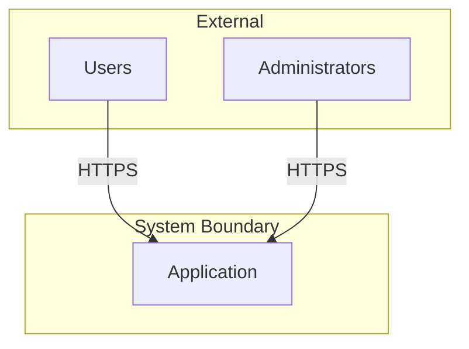
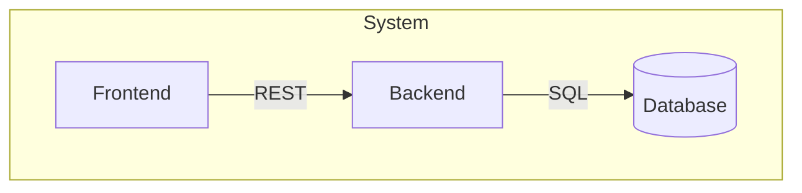

# C3 Context Level Exploration

## Overview

Explore Context-level impact during the scoping phase of c3-design. Context is the bird's-eye view: system boundaries, actors, and cross-component interactions.

**Abstraction Level:** WHAT exists and HOW they relate. No implementation details.

**Announce at start:** "I'm using the c3-context-design skill to explore Context-level impact."

## When Invoked

Called during EXPLORE phase of c3-design when:
- Hypothesis suggests Context-level impact
- Need to understand system-wide implications
- Change affects system boundaries or protocols

Also called by c3-adopt to CREATE initial Context documentation.

## Quick Reference

| Direction | Question | Action |
|-----------|----------|--------|
| **Isolated** | What system boundaries change? | Investigate context |
| **Upstream** | What external systems depend on this? | Check third-party impacts |
| **Adjacent** | What cross-cutting concerns related? | Check protocols |
| **Downstream** | Which containers affected? | Delegate to c3-container-design |

---

## What Belongs at Context Level

### Include

| Element | Example |
|---------|---------|
| System boundary | "TaskFlow system includes..." |
| Actors | Users, Admin, External APIs |
| Container inventory | Links to container docs |
| Protocols | REST, gRPC, WebSocket |
| Cross-cutting concerns | Auth strategy, logging approach |
| Deployment topology | Cloud, multi-region |

### Exclude

| Element | Where |
|---------|-------|
| Technology choices | Container |
| Middleware specifics | Container |
| API endpoints | Container |
| Configuration values | Component |
| Code examples | Component |

### Litmus Test

> "Would changing this require coordinating multiple containers or external parties?"
- **Yes** → Context level
- **No** → Push to Container

---

## Diagrams

### Primary: System Context Diagram



### Secondary: Container Overview



**Avoid:** Sequence diagrams with methods, class diagrams, flowcharts with logic (too detailed).

---

## Exploration Questions

### Isolated
- What system boundaries change?
- What actors are affected?
- What protocols need modification?

### Upstream
- What external systems depend on this?
- What third-party integrations affected?

### Adjacent
- What other cross-cutting concerns related?
- What other protocol decisions affected?

### Downstream
- Which containers affected?
- What new containers needed?

---

## Socratic Questions

See [socratic-method.md](../../references/socratic-method.md) for techniques.

**System Boundary:**
- "What is inside vs external?"
- "Who/what interacts from outside?"

**Actors:**
- "What types of users interact?"
- "Are there other systems that call in?"

**Containers:**
- "What would be separately deployed?"
- "What data stores exist?"

**Protocols:**
- "How do containers talk to each other?"
- "Synchronous or asynchronous?"

**Cross-Cutting:**
- "How is authentication handled?"
- "How does logging work?"

---

## Document Template

```markdown
---
id: c3-0
c3-version: 3
title: [System Name] Overview
---

# [System Name] Overview

## Overview {#c3-0-overview}
[System description]

## Architecture {#c3-0-architecture}
[System context diagram]

## Containers {#c3-0-containers}
| Container | Type | Description |
|-----------|------|-------------|
| [link] | Code/Infra | [purpose] |

## Protocols {#c3-0-protocols}
| From | To | Protocol | Implementations |
|------|-----|----------|-----------------|
| Frontend | Backend | REST | [container#section links] |

## Cross-Cutting Concerns {#c3-0-cross-cutting}
### Authentication
[Strategy], implemented in: [container#section links]

### Logging
[Approach], implemented in: [container#section links]

## Deployment {#c3-0-deployment}
[High-level topology]

## Platform {#c3-0-platform}

Platform infrastructure documentation (if applicable):
- [Deployment](platform/deployment.md)
- [Networking](platform/networking.md)
- [Secrets Management](platform/secrets.md)
- [CI/CD Pipeline](platform/ci-cd.md)

See @references/platform-patterns.md for templates.

## System Testing {#c3-0-testing}

Reference @references/testing-discovery.md for approach.

Document system-level tests if they exist:
- End-to-end tests
- Cross-container integration
- Chaos/resilience testing

Accept TBD if not yet established.
```

### Checklist

- [ ] System boundary and actors listed
- [ ] Container inventory with types and links
- [ ] Protocols table with implementation links
- [ ] Cross-cutting decisions with downward links
- [ ] Deployment topology described
- [ ] Platform links added (if applicable)
- [ ] System testing documented (or TBD)
- [ ] Anchors use `{#c3-0-*}` format

---

## Reference Direction

**References only flow DOWN** - Context links to Container implementations.

- Context defines protocols → links to Container#sections
- Context defines containers → links to Container docs
- **No upward links** - reader came from above

See [derivation-guardrails.md](../../references/derivation-guardrails.md).

---

## Impact Signals

| Signal | Meaning |
|--------|---------|
| System boundary change | Major architectural shift |
| New actor type | Interface design needed |
| Protocol change | All using containers affected |
| Cross-cutting change | Ripples through all layers |

## Output for c3-design

After exploring, report:
- Context-level elements affected
- Impact magnitude
- Downstream containers needing exploration
- Whether hypothesis needs revision

## Related

- [v3-structure.md](../../references/v3-structure.md)
- [socratic-method.md](../../references/socratic-method.md)
