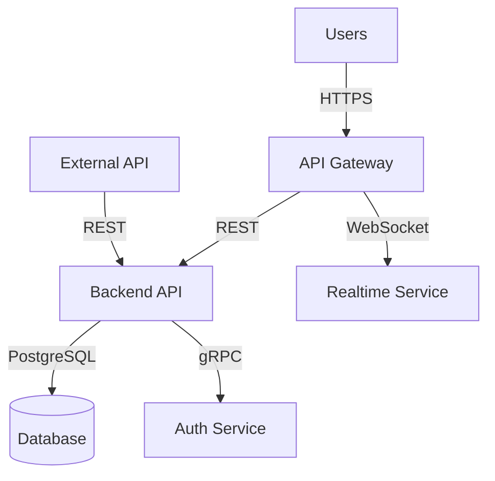
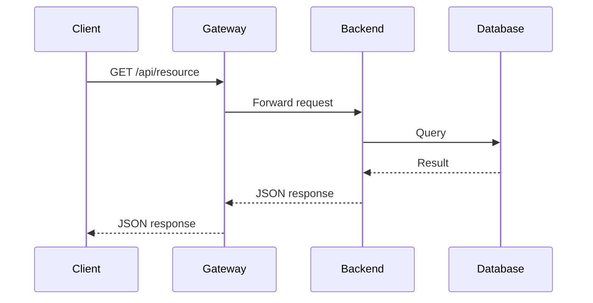

# C3 Context Level Design

## Purpose

Define the system landscape: what containers/users/systems exist, how they interact cross-component, and high-level cross-cutting concerns.

**Abstraction Level:** Bird's-eye view. Focus on WHAT exists and HOW they relate, not implementation details.

## Context Defines

- **Components underneath**: All containers, users, external systems
- **Cross-component interactions**: Communication patterns across the system
- **High-level concerns**:
  - Protocols (HTTP/REST, gRPC, WebSocket, message queues)
  - Interfaces/APIs (gateway patterns, versioning)
  - Gateway/Load balancer architecture
  - Deployment model (cloud, on-prem, hybrid - very high level)
  - Authentication/Authorization strategy
  - Data flow patterns

## When Invoked

- ADR identifies Context-level changes
- User explicitly calls `/c3-context-design`
- New system design from scratch
- Cross-cutting changes affecting system boundaries

## Workflow

### Step 1: Read Existing Context

```bash
# Check for existing context documents
find .c3 -maxdepth 1 -name "CTX-*.md"

# Read frontmatter and content
awk '/^---$/,/^---$/ {print}' .c3/CTX-001-*.md
```

If exists: Understand current architecture, containers, protocols
If not exists: Starting fresh

### Step 2: Identify Scope

From ADR or user request:
- What's changing at Context level?
- New containers being added?
- Protocol changes?
- Deployment architecture shifts?
- New external systems integrating?

### Step 3: Gather Details (Targeted Socratic)

Ask ONLY if needed:
- What containers exist in the system?
- What users/actors interact?
- What external systems integrate?
- What protocols for cross-component communication?
- Any gateway/interface patterns?
- High-level deployment architecture?
- Cross-cutting concerns (auth, logging, monitoring)?

Use AskUserQuestion for structured choices.

### Step 4: Generate/Update Diagrams

**MUST HAVE:**
- Architecture diagram or flowchart showing landscape

**SHOULD HAVE:**
- Sequence diagrams for key protocols/flows
- Flow diagrams for special concepts
- Deployment diagram (high-level)
- Protocol-specific diagrams

Use mermaid syntax embedded in markdown.

### Step 5: Write/Update Context Document

**Determine file path:**
```bash
# If updating existing
file_path=".c3/CTX-001-system-overview.md"

# If new context aspect
last_ctx=$(find .c3 -maxdepth 1 -name "CTX-*.md" | sed 's/.*CTX-\([0-9]*\).*/\1/' | sort -n | tail -1)
next_num=$(printf "%03d" $((10#$last_ctx + 1)))
file_path=".c3/CTX-${next_num}-${slug}.md"
```

**Document structure:**

```markdown
---
id: CTX-001-system-overview
title: System Architecture Overview
summary: >
  Explains the overall system landscape, how users interact with the system,
  and how different containers communicate. Read this to understand the
  bird's-eye view before diving into individual containers.
---

# [CTX-001-system-overview] System Architecture Overview

## Overview {#ctx-001-overview}
<!--
Describes the system at the highest level - what it does, who uses it,
and what the major components are. Read to understand the big picture.
-->

High-level prose description of the system.

## Architecture {#ctx-001-architecture}
<!--
Shows the complete system diagram with all containers, external systems,
and their relationships. Read to understand how pieces fit together.
-->



Description of architecture and key relationships.

## Containers {#ctx-001-containers}
<!--
Lists all containers with brief descriptions and links. Read to navigate
to specific container details.
-->

- [CON-001-backend: Backend API](./containers/CON-001-backend.md) - Core business logic
- [CON-002-frontend: Web Frontend](./containers/CON-002-frontend.md) - User interface
- [CON-003-database: PostgreSQL DB](./containers/CON-003-database.md) - Data storage

## Protocols & Communication {#ctx-001-protocols}
<!--
Explains communication protocols used across the system and why chosen.
Read to understand integration patterns.
-->

### REST API
Primary protocol for client-server communication.



### WebSocket
For real-time updates.

## Cross-Cutting Concerns {#ctx-001-cross-cutting}
<!--
Describes concerns that span multiple containers like authentication,
logging, and monitoring. Read to understand system-wide patterns.
-->

- **Authentication**: OAuth2 with JWT tokens via Auth Service
- **Rate Limiting**: Gateway-level throttling
- **Monitoring**: Prometheus + Grafana stack

## Deployment {#ctx-001-deployment}
<!--
High-level deployment architecture - cloud vs on-prem, scaling approach,
infrastructure patterns. Read to understand operational context.
-->

Kubernetes-based deployment in AWS:
- Multi-AZ for high availability
- Horizontal auto-scaling
- Blue-green deployments

## Related {#ctx-001-related}

- [ADR-001: REST API Choice](./adr/ADR-001-rest-api.md)
```

### Step 6: Update VitePress Config

If new context document, add to `.c3/.vitepress/config.ts` sidebar.

### Step 7: Regenerate TOC

```bash
.c3/scripts/build-toc.sh
```

## Document Conventions

### Frontmatter
```yaml
---
id: CTX-NNN-slug
title: Title
summary: >
  Concise explanation of what this context document covers and why
  someone should read it. Focus on helping navigation.
---
```

### Heading IDs
Pattern: `{#ctx-nnn-heading-slug}`

### Heading Summaries (Optional)
```markdown
## Section Name {#ctx-001-section}
<!--
Summary of what this section explains and why to read it.
-->
```

### Links
- Down to containers: `[CON-001-backend](./containers/CON-001-backend.md)`
- To specific sections: `[Backend Middleware](./containers/CON-001-backend.md#con-001-middleware)`
- Related ADRs: `[ADR-001](./adr/ADR-001-rest-api.md)`

## Key Principles

- **Focus on landscape**: What exists and how it relates
- **Don't dive into implementation**: That's Container/Component level
- **Use diagrams liberally**: Visual communication of architecture
- **Link to everything**: Context is navigation hub
- **Keep abstraction high**: Characteristics and patterns, not code
