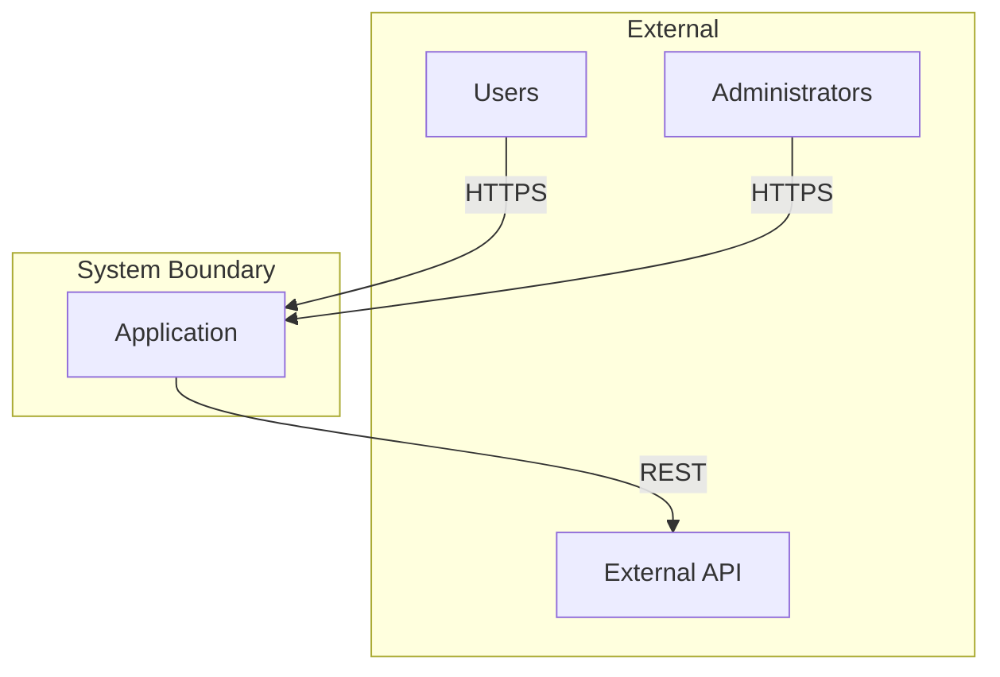
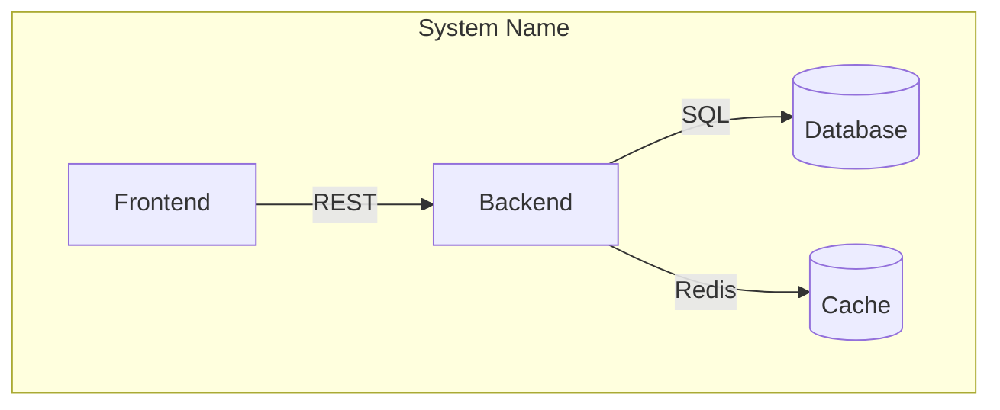
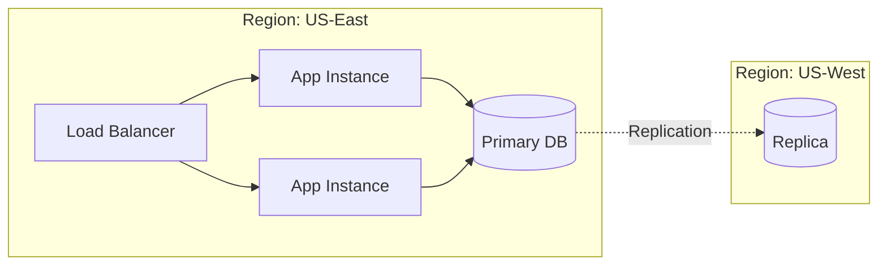

# C3 Context Level Exploration

## Overview

Explore Context-level impact during the scoping phase of c3-design. Context is the bird's-eye view: system boundaries, actors, and cross-component interactions.

**Abstraction Level:** WHAT exists and HOW they relate. No implementation details.

**Announce at start:** "I'm using the c3-context-design skill to explore Context-level impact."

## When Invoked

Called during EXPLORE phase of c3-design when:
- Hypothesis suggests Context-level impact
- Need to understand system-wide implications
- Exploring upstream from Container/Component
- Change affects system boundaries or protocols

Also called by c3-adopt to CREATE initial Context documentation.

---

## What Belongs at Context Level

### Inclusion Criteria

**INCLUDE at Context level:**

| Element | Why Context | Example |
|---------|-------------|---------|
| System boundary | Defines inside vs outside | "TaskFlow system includes..." |
| Actors | Who/what interacts with system | Users, Admin, External APIs |
| Container inventory | WHAT containers exist (not HOW) | "Backend API, Frontend, Database" |
| Protocols between containers | Communication contracts | REST, gRPC, WebSocket |
| Cross-cutting concerns | Span multiple containers | Auth strategy, logging approach |
| Deployment topology | High-level infrastructure | Cloud, multi-region, CDN |

**EXCLUDE from Context (push down to Container):**

| Element | Why Not Context | Where It Belongs |
|---------|-----------------|------------------|
| Technology choices | Implementation detail | Container |
| Middleware specifics | Container internal | Container |
| API endpoint details | Container responsibility | Container |
| Component structure | Too granular | Container/Component |
| Configuration values | Implementation | Container/Component |
| Code examples | Implementation | Component |

### Litmus Test

Ask: "Would changing this require coordinating multiple containers or external parties?"
- **Yes** → Context level
- **No** → Push down to Container

---

## Expressing Relationships at Context Level

### Relationship Types

| Relationship | Expression | Example |
|--------------|------------|---------|
| Actor → System | "interacts with", "uses" | Users use TaskFlow via HTTPS |
| Container → Container | Protocol name | Backend → Database via PostgreSQL |
| System → External | "integrates with", "depends on" | System integrates with SendGrid |
| Containment | "contains", "comprises" | System contains Backend, Frontend, DB |

### Relationship Table Format

```markdown
## Container Relationships

| From | To | Protocol | Purpose |
|------|-----|----------|---------|
| Frontend | Backend | REST/HTTPS | API calls |
| Backend | Database | PostgreSQL | Data persistence |
| Backend | Email Service | SMTP | Notifications |
```

### DO NOT Express at Context

- Internal component dependencies (Container level)
- Method calls or interfaces (Component level)
- Data flow within a container (Container level)

---

## Diagrams for Context Level

### Primary: System Context Diagram

**Purpose:** Show system boundary, actors, and external systems.



**When to use:** Always include in CTX document.

### Secondary: Container Overview Diagram

**Purpose:** Show containers within system and their protocols.



**When to use:** When system has multiple containers.

### Tertiary: Deployment Topology

**Purpose:** Show high-level infrastructure layout.



**When to use:** When deployment affects architecture decisions.

### Avoid at Context Level

| Diagram Type | Why Not | Where It Belongs |
|--------------|---------|------------------|
| Sequence diagrams with methods | Too detailed | Component |
| Class diagrams | Implementation | Component |
| Flowcharts with logic | Implementation | Component |
| ER diagrams with columns | Too detailed | Container/Component |

---

## Context Level Defines

| Concern | Examples |
|---------|----------|
| **System boundaries** | What's inside vs outside the system |
| **Actors** | Users, external systems, third parties |
| **Containers** | High-level view of all containers |
| **Cross-cutting concerns** | Auth strategy, logging, monitoring |
| **Protocols** | REST, gRPC, WebSocket, message queues |
| **Deployment model** | Cloud, on-prem, hybrid (high level) |

## Exploration Questions

When exploring Context level, investigate:

### Isolated (at Context)
- What system boundaries change?
- What actors are affected?
- What protocols need modification?

### Upstream (external)
- What external systems depend on this?
- What third-party integrations affected?
- What user-facing contracts change?

### Adjacent (same level)
- What other cross-cutting concerns related?
- What other protocol decisions affected?

### Downstream (to Containers)
- Which containers does this affect?
- How do container responsibilities change?
- What new containers might be needed?

## Socratic Questions for Context Discovery

When creating or validating Context documentation, ask:

### System Boundary
1. "What is inside your system vs what is external?"
2. "Who or what interacts with your system from outside?"
3. "Are there third-party services your system depends on?"

### Actors
4. "What types of users interact with the system?"
5. "Are there other systems that call into yours?"
6. "Are there background processes or scheduled jobs?"

### Containers
7. "If you deployed this system, what would be the separately deployable units?"
8. "What processes would be running?"
9. "What data stores exist?"

### Protocols
10. "How do your containers talk to each other?"
11. "What protocols are used for external communication?"
12. "Is communication synchronous or asynchronous?"

### Cross-Cutting
13. "How is authentication handled across the system?"
14. "How does logging and monitoring work?"
15. "Are there shared concerns that span multiple containers?"

## Reading Context Documents

Use c3-locate to retrieve:

```
c3-locate CTX-001                    # Overview
c3-locate #ctx-001-architecture      # System diagram
c3-locate #ctx-001-containers        # Container list
c3-locate #ctx-001-protocols         # Communication patterns
c3-locate #ctx-001-cross-cutting     # System-wide concerns
c3-locate #ctx-001-deployment        # Deployment overview
```

## Impact Signals

| Signal | Meaning |
|--------|---------|
| Change affects system boundary | Major architectural shift |
| New actor type introduced | Interface design needed |
| Protocol change | All containers using it affected |
| Cross-cutting concern change | Ripples through all layers |

## Output for c3-design

After exploring Context level, report:
- What Context-level elements are affected
- Impact magnitude (boundary change = high, protocol tweak = medium)
- Downstream containers that need exploration
- Whether hypothesis needs revision

## Document Template Reference

Context documents follow this structure:

```markdown
---
id: CTX-NNN-slug
title: [System Name] System Architecture Overview
summary: >
  [Why read this document - what it covers]
---

# [CTX-NNN-slug] [System Name] System Architecture Overview

## Overview {#ctx-nnn-overview}
<!--
Describes the system at the highest level - what it does, who uses it,
and what the major components are. Read to understand the big picture.
-->

## Architecture {#ctx-nnn-architecture}
<!--
Shows the complete system diagram with all containers, external systems,
and their relationships. Read to understand how pieces fit together.
-->

## Containers {#ctx-nnn-containers}
<!--
Lists all containers with brief descriptions and links. Read to navigate
to specific container details.
-->

## Protocols & Communication {#ctx-nnn-protocols}
<!--
Explains communication protocols used across the system and why chosen.
Read to understand integration patterns.
-->

## Cross-Cutting Concerns {#ctx-nnn-cross-cutting}
<!--
Describes concerns that span multiple containers like authentication,
logging, and monitoring. Read to understand system-wide patterns.
-->

## Deployment {#ctx-nnn-deployment}
<!--
High-level deployment architecture - cloud vs on-prem, scaling approach,
infrastructure patterns. Read to understand operational context.
-->

## Related {#ctx-nnn-related}
```

Use these heading IDs for precise exploration.
