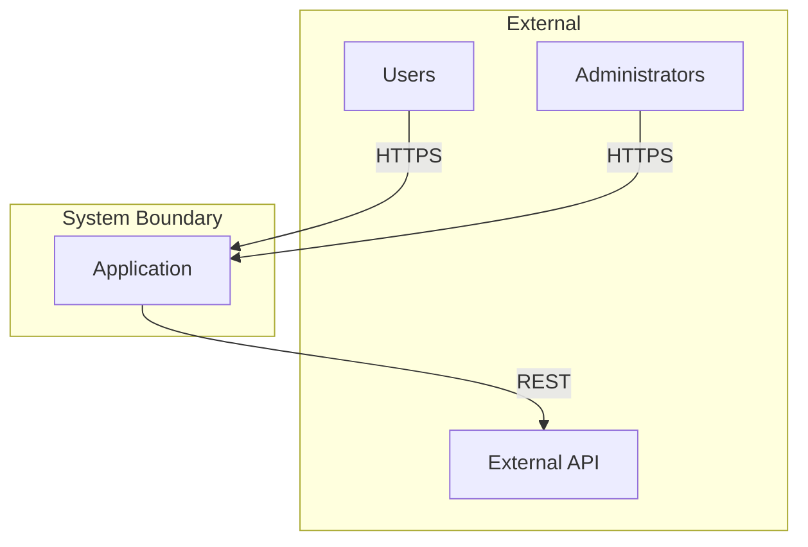
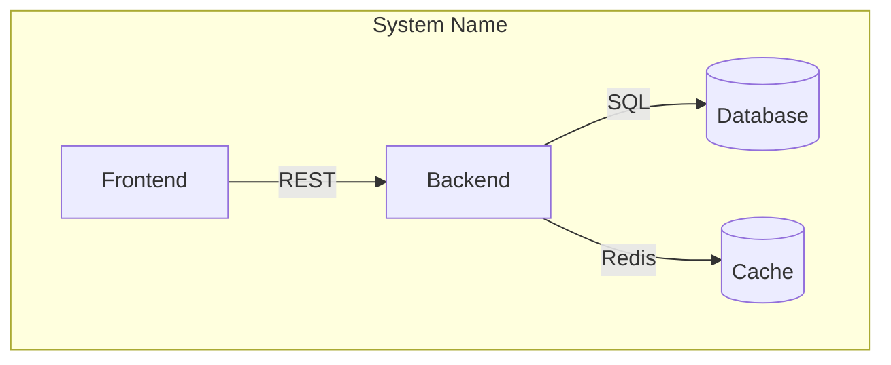
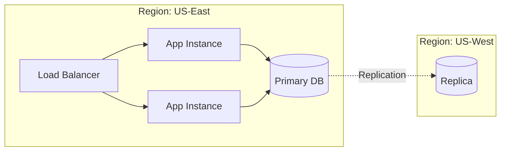

# C3 Context Level Exploration

## Overview

Explore Context-level impact during the scoping phase of c3-design. Context is the bird's-eye view: system boundaries, actors, and cross-component interactions.

**Abstraction Level:** WHAT exists and HOW they relate. No implementation details.

**Announce at start:** "I'm using the c3-context-design skill to explore Context-level impact."

## When Invoked

Called during EXPLORE phase of c3-design when:
- Hypothesis suggests Context-level impact
- Need to understand system-wide implications
- Exploring upstream from Container/Component
- Change affects system boundaries or protocols

Also called by c3-adopt to CREATE initial Context documentation.

---

## Core Principles for Context Documents

- **Reading order:** Context → Container → Component. Context sets constraints; lower layers implement.
- **Reference direction:** Downward-only. CTX links to specific Container sections; no upward references required.
- **Single source:** Define protocols/cross-cutting once here; Containers implement and link back down.
- **Anchors:** Use stable anchors `{#ctx-xxx-*}` for every section you expect to link to (protocols, cross-cutting, containers).

---

## Required Outputs (CTX)
- System boundary (inside vs outside) and actors.
- Container inventory table with type (Code/Infra) and links.
- Protocols table with downward links to Container sections implementing each side.
- Cross-cutting decisions with downward links to Container sections.
- Deployment topology (diagram or text).
- Diagrams: system context diagram (actors + boundary), container overview diagram (containers + protocols), optional high-level topology.

---

## Template (copy/paste and fill)

```markdown
# CTX-XXX <Name>

## System Boundary {#ctx-xxx-boundary}
- Inside: ...
- Outside: ...

## Actors {#ctx-xxx-actors}
| Actor | Role |
|-------|------|
| ...   | ...  |

## Containers {#ctx-xxx-containers}
| Container | Type (Code/Infra) | Description |
|-----------|-------------------|-------------|
| [CON-XXX-name](./containers/CON-XXX-name.md) | Code | ... |
| ... | ... | ... |

## Protocols {#ctx-xxx-protocols}
| From | To | Protocol | Implementations |
|------|----|----------|-----------------|
| Frontend | Backend | REST/HTTPS | [CON-002#api], [CON-001#rest] |
| ... | ... | ... | ... |

## Cross-Cutting {#ctx-xxx-cross-cutting}
- Auth: ... implemented in [CON-####auth]
- Logging: ... implemented in [CON-####logging]
- Error strategy: ... implemented in [CON-####errors]

## Deployment Topology {#ctx-xxx-deployment}
- Diagram or bullets for high-level infra layout
```

### Checklist (CTX must be true)
- System boundary and actors listed.
- Container inventory table includes every container with type and link.
- Protocols table has every inter-container communication with downward links to Container sections.
- Cross-cutting decisions list where each is implemented (downward links).
- Deployment topology captured (diagram or text).
- Anchors follow `{#ctx-xxx-*}` scheme for all link targets.

---

## What Belongs at Context Level

### Inclusion Criteria

**INCLUDE at Context level:**

| Element | Why Context | Example |
|---------|-------------|---------|
| System boundary | Defines inside vs outside | "TaskFlow system includes..." |
| Actors | Who/what interacts with system | Users, Admin, External APIs |
| Container inventory | WHAT containers exist (not HOW) | "Backend API, Frontend, Database" |
| Protocols between containers | Communication contracts | REST, gRPC, WebSocket |
| Cross-cutting concerns | Span multiple containers | Auth strategy, logging approach |
| Deployment topology | High-level infrastructure | Cloud, multi-region, CDN |

**EXCLUDE from Context (push down to Container):**

| Element | Why Not Context | Where It Belongs |
|---------|-----------------|------------------|
| Technology choices | Implementation detail | Container |
| Middleware specifics | Container internal | Container |
| API endpoint details | Container responsibility | Container |
| Component structure | Too granular | Container/Component |
| Configuration values | Implementation | Container/Component |
| Code examples | Implementation | Component |

### Litmus Test

Ask: "Would changing this require coordinating multiple containers or external parties?"
- **Yes** → Context level
- **No** → Push down to Container

---

## Expressing Relationships at Context Level

### Relationship Types

| Relationship | Expression | Example |
|--------------|------------|---------|
| Actor → System | "interacts with", "uses" | Users use TaskFlow via HTTPS |
| Container → Container | Protocol name | Backend → Database via PostgreSQL |
| System → External | "integrates with", "depends on" | System integrates with SendGrid |
| Containment | "contains", "comprises" | System contains Backend, Frontend, DB |

### Relationship Table Format

```markdown
## Container Relationships

| From | To | Protocol | Purpose |
|------|-----|----------|---------|
| Frontend | Backend | REST/HTTPS | API calls |
| Backend | Database | PostgreSQL | Data persistence |
| Backend | Email Service | SMTP | Notifications |
```

### DO NOT Express at Context

- Internal component dependencies (Container level)
- Method calls or interfaces (Component level)
- Data flow within a container (Container level)

---

## Diagrams for Context Level (required/optional)

### Primary: System Context Diagram (required)

**Purpose:** Show system boundary, actors, and external systems.



**When to use:** Always include in CTX document.

### Secondary: Container Overview Diagram (recommended)

**Purpose:** Show containers within system and their protocols.



**When to use:** When system has multiple containers.

### Tertiary: Deployment Topology (recommended)

**Purpose:** Show high-level infrastructure layout.



**When to use:** When deployment affects architecture decisions.

### Avoid at Context Level

| Diagram Type | Why Not | Where It Belongs |
|--------------|---------|------------------|
| Sequence diagrams with methods | Too detailed | Component |
| Class diagrams | Implementation | Component |
| Flowcharts with logic | Implementation | Component |
| ER diagrams with columns | Too detailed | Container/Component |

---

## Exploration Questions (keep Socratic)
- System boundary: What is inside vs external? Who/what interacts? Which third parties?
- Containers: What deployable units exist? What data stores? Any new containers needed?
- Protocols: How do containers talk? Sync vs async? What protocols need change?
- Cross-cutting: Auth, logging, monitoring strategies? Are they changing?
- Downstream: Which containers must implement protocols/cross-cutting decisions?

Use responses to populate the CTX template and ensure every protocol/cross-cutting item has a downward link to the implementing container sections.
