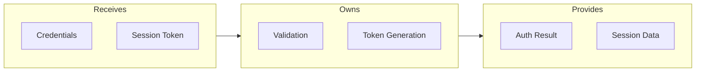

# C3 Implementation Design

## Critical Gate

> **STOP** - Before ANY component work:
> ```bash
> cat .c3/c3-{N}-*/README.md 2>/dev/null || echo "NO_CONTAINER"
> grep "c3-{N}{NN}" .c3/c3-{N}-*/README.md 2>/dev/null || echo "NOT_IN_INVENTORY"
> ```

- If "NO_CONTAINER" → Container must exist first. Use c3-structure skill.
- If "NOT_IN_INVENTORY" → Add component to Container inventory first.

**A component doc cannot exist without being listed in parent Container.**

---

## The Principle

> **Component implements Container's contract.**

Container defines WHAT the component does. Component documents HOW.

See `references/core-principle.md`.

---

## When to Create a Component Doc

| Has conventions for consumers? | Action |
|-------------------------------|--------|
| Yes - rules consumers must follow | Create component doc |
| No - just "we use X library" | Leave in Container inventory only |

### What Counts as Conventions

- Hand-off patterns (specific inputs/outputs)
- Error handling rules
- Configuration expectations
- Usage constraints

### What Does NOT Need a Doc

- Standard library usage
- Framework defaults
- Single-consumer internal details

---

## NO CODE Enforcement

**Component docs describe HOW, not the actual implementation.**

| Prohibited | Use Instead |
|------------|-------------|
| `function foo() {}` | Flow diagram |
| `interface X {}` | Table: Field, Type, Purpose |
| JSON/YAML examples | Table with dot notation |
| Config snippets | Settings table |
| SQL queries | Access pattern description |

### Why

- Code changes → doc drift
- Tables are scannable
- Diagrams show flow without syntax

### Mermaid is Allowed

Mermaid = visual architecture. JSON/YAML = data syntax.

**Rule:** If a JSON/YAML parser could parse it → use table instead.

---

## Required Sections

### 1. Contract

What Container says about this component.

```markdown
## Contract

From c3-1 (API Backend): "Handles user authentication and session management"
```

### 2. Interface Diagram (REQUIRED)

Shows boundary and hand-offs. Use Mermaid.



### 3. Hand-offs Table

| Direction | What | To/From |
|-----------|------|---------|
| IN | Credentials | Request Handler |
| OUT | Auth Result | Calling Service |

### 4. Conventions Table

| Rule | Why |
|------|-----|
| Always validate before processing | Security |
| Return structured errors | Consistency |

### 5. Edge Cases & Errors

| Scenario | Behavior |
|----------|----------|
| Invalid credentials | Return 401, log attempt |
| Expired token | Return 401, prompt refresh |

---

## Optional Sections

Include only if relevant:

- **Configuration** - If significant config surface
- **Dependencies** - If external dependencies matter
- **State/Lifecycle** - If component has states
- **Performance** - If throughput/latency matters

---

## Foundation vs Business Components

| Type | Doc Focus |
|------|-----------|
| **Foundation** | What it PROVIDES to consumers, interface conventions |
| **Business** | Processing flow, domain rules, edge cases |

### Foundation Example (Logger)

- Interface: provides Logger instance
- Conventions: structured fields (requestId, component), log levels
- Hand-offs: what consumers receive

### Business Example (Auth Service)

- Flow: validate → generate token → store session
- Rules: password requirements, session duration
- Edge cases: lockout after N failures

---

## Verification

Before completing:

- [ ] Component IS listed in parent Container inventory
- [ ] Interface diagram present (IN/PROCESS/OUT boundary)
- [ ] Hand-offs table present
- [ ] Conventions table present
- [ ] **NO code blocks** (except Mermaid)

---

## Escalation

| Situation | Action |
|-----------|--------|
| Component not in inventory | Add to Container first (c3-structure) |
| Change affects component relationships | Update Container (c3-structure) |
| Change affects container relationships | Update Context (c3-structure) |
