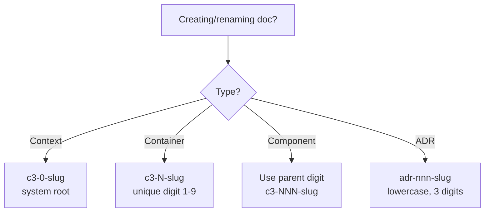

# C3 Naming Conventions (v3)

## Overview
Short, hierarchical names prevent collisions and make derivation obvious. Use all-lowercase with numeric IDs that encode parentage. IDs are stable (numeric only); slugs can change. Container directories hold their components, creating a natural tree structure.

## When to Use
- Creating or renaming C3 docs (context/container/component/ADR)
- Adding new components to an existing container
- Resolving ID collisions across containers or examples
- Aligning legacy names that lost their parent connection

## Core Principles
- Single context: `c3-0` (the root of the system).
- Containers own a single digit (extend to two digits if >9 containers): `c3-{N}` where N=1-9.
- Components inherit container digit and add 2-digit sequence: `c3-{N}{NN}` (NN zero-padded; extend to three digits if >99 components).
- All lowercase: IDs, slugs, and filenames are lowercase.
- IDs are numeric only: The numeric portion (`c3-1`, `c3-101`) is stable; slugs can change.
- Hierarchical paths: Components live inside their container's directory.
- Downward-only links; names must stand alone outside folder context.

## Quick Reference
| Level | ID Pattern | File Path Pattern | Example |
|-------|------------|-------------------|---------|
| Context | `c3-0` | `.c3/c3-0-{slug}/README.md` | `.c3/c3-0-system/README.md` |
| Container | `c3-{N}` (`N` = 1-9) | `.c3/c3-{N}-{slug}/README.md` | `.c3/c3-1-backend/README.md` |
| Component | `c3-{N}{NN}` (`NN` = 01-99) | `.c3/c3-{N}-{slug}/c3-{N}{NN}-{slug}.md` | `.c3/c3-1-backend/c3-101-api-client.md` |
| ADR | `adr-{nnn}` | `.c3/adr/adr-{nnn}-{slug}.md` | `.c3/adr/adr-002-postgresql.md` |

## Search Patterns

Container and component IDs share the `c3-` prefix but differ in digit count. Use these patterns for reliable extraction:

| Element | Simple Search | Regex Pattern | Notes |
|---------|--------------|---------------|-------|
| Context | `c3-0` | `c3-0-[a-z]` | Zero digit, then slug |
| Container | Find `c3-X-` where X is 1-9 | `c3-[1-9]-[a-z]` | Single digit (1-9) + dash + letter |
| Component | Find `c3-XXX-` where XXX is 3+ digits | `c3-[1-9][0-9]{2,}-` | 3+ digits encode container + sequence |
| ADR | `adr-` | `adr-[0-9]{3}-` | Always 3 digits, lowercase |

**Examples:**
```bash
# Find all containers (directories)
ls -d .c3/c3-[1-9]-*/

# Find all components in container 2
ls .c3/c3-2-*/c3-2*.md

# Find all ADRs
ls .c3/adr/adr-*.md
```

## Flow (small)


## How to Name
1) Assign/confirm container digit `N` (1-9; extend to two digits if needed). Do not reuse across containers.
2) For components, prefix with `c3-`, container digit, and two/three-digit seq: `c3-{N}{NN}-slug` (NN starts at `01` for each container; use three digits if you exceed 99 components).
   - Example: container `c3-2-frontend` directory contains `c3-201-api-client.md`, `c3-202-auth-guard.md`.
3) Slugs: short, lowercase, hyphenated nouns (no spaces or uppercase).
4) File paths mirror hierarchy:
   - Context: `.c3/c3-0-system/README.md`
   - Container: `.c3/c3-2-frontend/README.md`
   - Component: `.c3/c3-2-frontend/c3-201-api-client.md`
   - ADR: `.c3/adr/adr-003-caching.md`
5) Update links to use new IDs and anchors (`{#c3-xxx-*}` for containers/components, `{#adr-xxx-*}` for ADRs) after renaming.

## Excellent Example (single)
```
Context:
- .c3/c3-0-system/README.md

Container: c3-1-backend
- .c3/c3-1-backend/README.md

Components inside c3-1-backend:
- .c3/c3-1-backend/c3-101-db-pool.md
- .c3/c3-1-backend/c3-102-auth-middleware.md
- .c3/c3-1-backend/c3-103-task-service.md

ADRs:
- .c3/adr/adr-001-database-choice.md
- .c3/adr/adr-002-auth-strategy.md
```

## Directory Structure Example
```
.c3/
  c3-0-system/
    README.md              # Context document
  c3-1-backend/
    README.md              # Container document
    c3-101-db-pool.md      # Component
    c3-102-auth.md         # Component
  c3-2-frontend/
    README.md              # Container document
    c3-201-ui-shell.md     # Component
    c3-202-state.md        # Component
  adr/
    adr-001-database.md
    adr-002-auth.md
```

## Rationalization Table (counters)
| Excuse | Reality & Action |
|--------|------------------|
| "Folder path already shows container; ID can be short" | IDs travel without paths. Encode container digit in the component ID (e.g., `c3-201`). |
| "We only have one context, collisions unlikely" | Numeric codes collide across examples/tests. Keep the container digit in IDs. |
| "Renaming is overhead; keep legacy COM-001" | Broken links and reader confusion cost more. Rename once; update links immediately. |
| "Numbers are ugly; use names only" | Numbers enable stable references when slugs change. Keep prefix + digit + slug (`c3-203-logger`). |
| "Uppercase is easier to read" | Consistency trumps preference. All lowercase prevents case-sensitivity issues across systems. |

## Red Flags
- Component ID lacks container digits (e.g., `com-001-logger`).
- Two containers share the same digit.
- Slugs omit purpose or exceed 5 hyphen-separated words.
- Links use relative paths without IDs/anchors.
- Mixed case in IDs or filenames.
- Components not nested inside their container directory.

## Common Mistakes
- Mixing container and component digits (e.g., `c3-01-001`).
- Forgetting to create README.md for container directories.
- Using spaces/underscores instead of hyphens.
- Using uppercase (old `CTX-`, `C3-`, `ADR-` patterns).
- Copying examples without updating IDs and anchors.
- Placing component files outside their container directory.

## Checklist
- All IDs and filenames are lowercase.
- IDs follow patterns above (c3-0/c3-N/c3-NNN/adr-nnn).
- Components include parent container digit in ID and filename.
- Components are nested inside container directories.
- Container directories have README.md.
- Links updated to new IDs + anchors.
- Anchors follow `{#c3-*}`, `{#adr-*}`; include container digit in component anchors (e.g., `{#c3-201-behavior}`).
- One container = one digit; no reuse.
- Slugs stay short, lower-kebab, noun-first.

## Related Skills
- **REQUIRED**: Reference these from c3-adopt, c3-context-design, c3-container-design, c3-component-design when creating docs.
