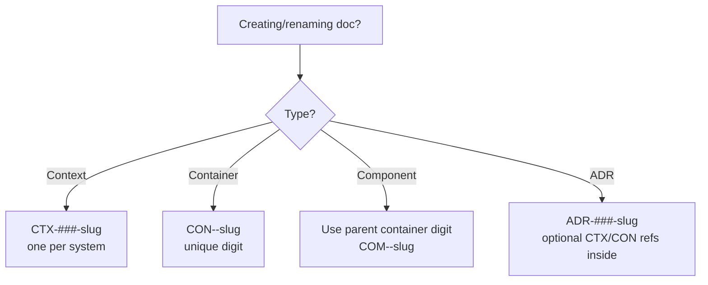

# C3 Naming Conventions

## Overview
Short, container-aware numeric names prevent collisions and make derivation obvious. Components encode their parent container in the first digit (CON `1` → COM `1xx`). This skill defines ID and filename patterns for Context, Container, Component, and ADR documents so readers can infer lineage without opening files.

## When to Use
- Creating or renaming C3 docs (CTX/CON/COM/ADR)
- Adding new components to an existing container
- Resolving ID collisions across containers or examples
- Aligning legacy names that lost their parent connection

## Core Principles
- Single context: one `CTX-###-slug` per system.
- Containers own a single digit (or two if >9 containers): `CON-<C>-slug`.
- Components inherit container digit and add 2-digit sequence: `COM-<C><NN>-slug` (NN zero-padded).
- File names align with IDs; paths mirror hierarchy.
- Downward-only links; names must stand alone outside folder context.

## Quick Reference
| Level | ID Pattern | File Path Pattern | Example |
|-------|------------|-------------------|---------|
| Context | `CTX-###-slug` | `.c3/CTX-###-slug.md` | `CTX-001-system-overview.md` |
| Container (Code/Infra) | `CON-<C>-slug` (`C` = container digit) | `.c3/containers/CON-<C>-slug.md` | `CON-1-backend.md` |
| Component | `COM-<C><NN>-slug` (`NN` = 01-99 inside container `C`) | `.c3/components/<container-slug>/COM-<C><NN>-slug.md` | `COM-101-api-client.md` under `components/frontend/` |
| ADR | `ADR-###-slug` | `.c3/adr/ADR-###-slug.md` | `ADR-002-postgresql.md` |

## Flow (small)


## How to Name
1) Assign/confirm container digit `C` (1–9; extend to two digits only if needed). Do not reuse across containers.
2) For components, prefix with container digit and two-digit seq: `COM-<C><NN>-slug` (NN starts at `01` for each container).
   - Example: container `CON-2-frontend` → components `COM-201-api-client.md`, `COM-202-auth-guard.md`.
3) Slugs: short, lowercase, hyphenated nouns (no spaces).
4) File paths mirror IDs:
   - Container: `.c3/containers/CON-2-frontend.md`
   - Component: `.c3/components/frontend/COM-201-api-client.md`
5) Update links to use new IDs and anchors (`{#con-xxx-*}`, `{#com-xxx-*}`) after renaming.

## Excellent Example (single)
```
Container: CON-1-backend (code)
Components:
- COM-101-db-pool.md      # Resource
- COM-102-auth-middleware.md
- COM-103-task-service.md
Paths:
- .c3/containers/CON-1-backend.md
- .c3/components/backend/COM-101-db-pool.md
```

## Rationalization Table (counters)
| Excuse | Reality & Action |
|--------|------------------|
| "Folder path already shows container; ID can be short" | IDs travel without paths. Encode container digit in the component ID (e.g., `COM-201`). |
| "We only have one context, collisions unlikely" | Numeric codes collide across examples/tests. Keep the container digit in IDs. |
| "Renaming is overhead; keep legacy COM-001" | Broken links and reader confusion cost more. Rename once; update links immediately. |
| "Numbers are ugly; use names only" | Numbers enable stable references when slugs change. Keep digit + slug (`COM-203-logger`). |

## Red Flags
- Component ID lacks container digits (e.g., `COM-001-logger`).
- Two containers share the same `CON-###`.
- Slugs omit purpose or exceed 5 hyphen-separated words.
- Links use relative paths without IDs/anchors.

## Common Mistakes
- Mixing container and component digits (e.g., `COM-01-001`).
- Forgetting to move files into matching folders after renaming.
- Using spaces/underscores instead of hyphens.
- Copying examples without updating IDs and anchors.

## Checklist
- IDs follow patterns above (CTX/CON/COM/ADR).
- Components include parent container code in ID and filename.
- File path matches ID (no mismatches).
- Links updated to new IDs + anchors.
- Anchors follow `{#ctx|con|com-*}` scheme.
- One container = one `CON-###`; no reuse.
- Slugs stay short, lower-kebab, noun-first.

## Related Skills
- **REQUIRED**: Reference these from c3-adopt, c3-context-design, c3-container-design, c3-component-design when creating docs.
