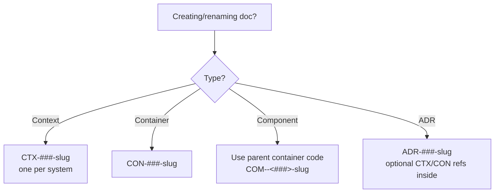

# C3 Naming Conventions

## Overview
Hierarchical, container-aware names prevent collisions and make derivation obvious. This skill defines ID and filename patterns for Context, Container, Component, and ADR documents so readers can infer lineage without opening files.

## When to Use
- Creating or renaming C3 docs (CTX/CON/COM/ADR)
- Adding new components to an existing container
- Resolving ID collisions across containers or examples
- Aligning legacy names that lost their parent connection

## Core Principles
- Single context: one `CTX-###-slug` per system.
- Containers own numbering: `CON-###-slug` is unique per repo.
- Components inherit container code: `COM-<container###>-<component###>-slug`.
- File names align with IDs; paths mirror hierarchy.
- Downward-only links; names must stand alone outside folder context.

## Quick Reference
| Level | ID Pattern | File Path Pattern | Example |
|-------|------------|-------------------|---------|
| Context | `CTX-###-slug` | `.c3/CTX-###-slug.md` | `CTX-001-system-overview.md` |
| Container (Code/Infra) | `CON-###-slug` | `.c3/containers/CON-###-slug.md` | `CON-002-frontend.md` |
| Component | `COM-<container###>-<component###>-slug` | `.c3/components/<container-slug>/COM-<container###>-<component###>-slug.md` | `COM-002-001-api-client.md` under `components/frontend/` |
| ADR | `ADR-###-slug` | `.c3/adr/ADR-###-slug.md` | `ADR-002-postgresql.md` |

## Flow (small)


## How to Name
1) Assign/confirm container code (`CON-00X`). Do not reuse across containers.
2) For components, prefix with container code: `COM-<CON###>-<component###>-slug`.
   - Example: container `CON-002-frontend` → components `COM-002-001-api-client.md`, `COM-002-002-auth-guard.md`.
3) Slugs: short, lowercase, hyphenated nouns (no spaces).
4) File paths mirror IDs:
   - Container: `.c3/containers/CON-002-frontend.md`
   - Component: `.c3/components/frontend/COM-002-001-api-client.md`
5) Update links to use new IDs and anchors (`{#con-xxx-*}`, `{#com-xxx-*}`) after renaming.

## Excellent Example (single)
```
Container: CON-001-backend (code)
Components:
- COM-001-001-db-pool.md      # Resource
- COM-001-002-auth-middleware.md
- COM-001-003-task-service.md
Paths:
- .c3/containers/CON-001-backend.md
- .c3/components/backend/COM-001-001-db-pool.md
```

## Rationalization Table (counters)
| Excuse | Reality & Action |
|--------|------------------|
| "Folder path already shows container; ID can be short" | IDs travel without paths (search, backlink tools). Include container code in the ID. |
| "We only have one context, collisions unlikely" | Containers multiply; collisions emerge in examples/tests. Anchor names must be globally unique. |
| "Renaming is overhead; keep legacy COM-001" | Broken links and reader confusion cost more. Rename once; update links immediately. |
| "Numbers are ugly; use names only" | Numbers enable stable references when slugs change. Keep both code (`###`) and slug. |

## Red Flags
- Component ID lacks container digits (e.g., `COM-001-logger`).
- Two containers share the same `CON-###`.
- Slugs omit purpose or exceed 5 hyphen-separated words.
- Links use relative paths without IDs/anchors.

## Common Mistakes
- Mixing container and component digits (e.g., `COM-01-001`).
- Forgetting to move files into matching folders after renaming.
- Using spaces/underscores instead of hyphens.
- Copying examples without updating IDs and anchors.

## Checklist
- IDs follow patterns above (CTX/CON/COM/ADR).
- Components include parent container code in ID and filename.
- File path matches ID (no mismatches).
- Links updated to new IDs + anchors.
- Anchors follow `{#ctx|con|com-*}` scheme.
- One container = one `CON-###`; no reuse.
- Slugs stay short, lower-kebab, noun-first.

## Related Skills
- **REQUIRED**: Reference these from c3-adopt, c3-context-design, c3-container-design, c3-component-design when creating docs.
