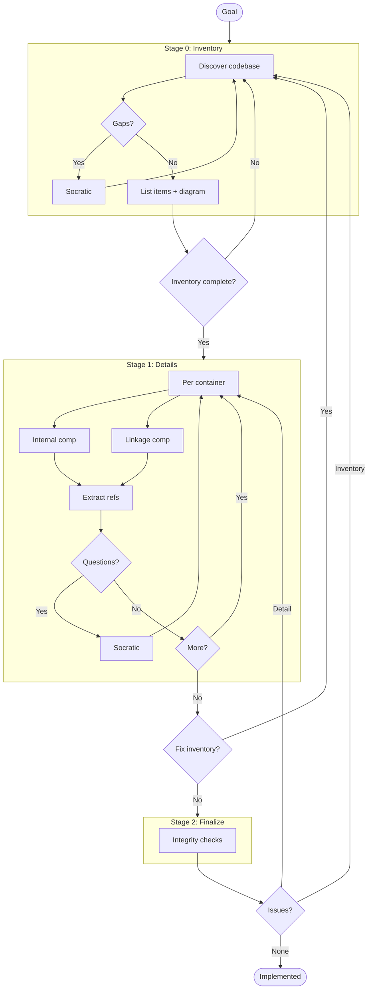

# C3 Onboarding

Initialize C3 architecture documentation using a **3-stage workflow with gates**.

## CRITICAL: Separate Files, Not Monoliths

**DO NOT create a single file for all documentation.**

Each component gets its OWN file. Each container gets its OWN directory. Create:
- Separate `.md` file per component
- Separate directory per container
- Separate refs/ directory with one file per pattern

**NEVER:** Create a single c3-model.md or components.md containing everything.

## Required C3 Structure

Every onboarding MUST create this EXACT structure:

```
.c3/
├── README.md                    # System context (NOT c3-model.md!)
├── TOC.md                       # Table of contents
├── adr/
│   └── adr-00000000-c3-adoption.md
├── refs/                        # REQUIRED: Cross-cutting patterns
│   └── ref-<pattern>.md         # At least one ref file
└── c3-1-<container-name>/       # REQUIRED: Container directory
    ├── README.md                # Container overview
    └── c3-101-<component>.md    # One file per component
```

**Non-negotiable rules:**
- Each component = separate file (c3-101-auth.md, c3-102-users.md, etc.)
- Each container = separate directory (c3-1-api/, c3-2-web/, etc.)
- refs/ = separate directory with pattern files (ref-auth.md, ref-errors.md)

---

## REQUIRED: Load References

**Load immediately** (use Glob to find, then Read):
1. `**/references/skill-harness.md` - Red flags and complexity rules
2. `**/references/layer-navigation.md` - How to traverse C3 docs

**Load for templating** (use Glob to find, then Read when needed):
- `**/templates/adr-000.md` - Adoption ADR (drives the workflow)
- `**/templates/context.md` - Context template
- `**/templates/container.md` - Container template
- `**/templates/component.md` - Component template
- `**/templates/ref.md` - Reference template

---

## Workflow Overview



**Critical:** All questioning MUST use `AskUserQuestion` tool - never plain text questions.

---

## Progress Checklist

Copy and track as you work:

```
Onboarding Progress:
- [ ] Stage 0: All items inventoried (context, containers, components, refs)
- [ ] Stage 0: ADR-000 created with discovery tables filled
- [ ] Gate 0: Inventory complete, proceed to Details
- [ ] Stage 1: All container README.md created
- [ ] Stage 1: All component docs created
- [ ] Stage 1: All refs documented
- [ ] Gate 1: No new items discovered
- [ ] Stage 2: Integrity checks pass
- [ ] Gate 2: /c3 audit passes
- [ ] ADR-000 marked implemented
```

---

## Stage 0: Inventory

**Goal:** Discover EVERYTHING before creating any docs.

### 0.1 Create ADR-000

Run init script and create ADR-000 from template:
```bash
PROJECT="<name>" C1="<container1>" C2="<container2>" "${CLAUDE_PLUGIN_ROOT}/scripts/c3-init.sh"
```

### 0.2 Context Discovery

Read codebase structure. Capture template arguments in **ADR-000 Context Discovery table**:

| Arg | Value |
|-----|-------|
| PROJECT | What is this system called? |
| GOAL | Why does this system exist? |
| SUMMARY | One-sentence description |

Use `AskUserQuestion` for gaps:
```
Q: "I see apps/api/ and apps/web/. Are these separate containers?"
Options: [Separate containers, Single monolith, Monorepo with shared code]
```

### 0.3 Container Discovery

For each potential container, capture in **ADR-000 Container Discovery table**:

| N | CONTAINER_NAME | GOAL | SUMMARY |
|---|----------------|------|---------|

Note: `N` maps to init script variable (C1=1, C2=2, etc.)

Use `AskUserQuestion`:
```
Q: "Is apps/api/ a deployable backend API?"
Options: [Yes - Backend API, No - Library/shared code, Need more context]
```

### 0.4 Component Discovery (Brief)

For each container, scan for components. Capture in **ADR-000 Component Discovery table**:

| N | NN | COMPONENT_NAME | CATEGORY | GOAL | SUMMARY |
|---|----|--------------  |----------|------|---------|

**Categorization (use lowercase in table):**
- **foundation** (01-09): Primitives others depend on (Router, AuthProvider, Database)
- **feature** (10+): Domain-specific (UserService, CheckoutFlow, Dashboard)

Use `AskUserQuestion`:
```
Q: "AuthMiddleware is imported by 15 files. Foundation or Feature?"
Options: [Foundation - others depend on it, Feature - domain logic, Need more context]
```

### 0.5 Ref Discovery

Look for patterns that repeat across components. Capture in **ADR-000 Ref Discovery table**:

| SLUG | TITLE | GOAL | Applies To |
|------|-------|------|------------|

Common ref candidates:
- Error handling patterns
- Form patterns
- Query/data fetching patterns
- Design system principles
- User flows / IA

### 0.6 Overview Diagram

Generate mermaid diagram showing:
- Actors → Containers → External Systems
- Key linkages

### Gate 0

Before proceeding, verify:
- [ ] Context args filled (PROJECT, GOAL, SUMMARY)
- [ ] All containers identified with args
- [ ] All components identified (brief) with args
- [ ] Cross-cutting refs identified
- [ ] Overview diagram generated

**If gaps:** Return to discovery with Socratic questioning.

---

## Stage 1: Details

**Goal:** Create all docs from inventory.

### 1.1 Context Doc

Create `.c3/README.md` from `context.md` template using discovered args.

Fill:
- Goal section (from PROJECT, GOAL)
- Overview diagram
- Containers table with Goal Contribution column

### 1.2 Container Docs

For EACH container in inventory:

**1.2.1 Create container README**

Create `.c3/c3-N-{slug}/README.md` from `container.md` template.

Fill:
- Goal section
- Context Connection (how it serves parent)
- Components table with Goal Contribution column

**1.2.2 Create component docs**

For each component in this container:

Create `.c3/c3-N-{slug}/c3-NNN-{component}.md` from `component.md` template.

Fill:
- Goal section
- Container Connection
- Related Refs table

**1.2.3 Extract Refs During Component Documentation**

While documenting components, proactively identify content that belongs in refs.

**The Separation Test:** (see `references/content-separation.md` for full definition)

> "Would this content change if we swapped the underlying technology?"
> - **Yes** → Integration/usage pattern → extract to ref
> - **No** → Business/domain logic → keep in component

**Signals to extract:**

| Signal | Action |
|--------|--------|
| "We use [technology] with..." | Extract to ref-[technology] |
| "Our convention is..." | Extract to existing or new ref |
| Same pattern appearing in code across components | Create ref, cite in components |
| Technology setup/config details | Extract to ref-[technology]-setup |

**Common extractions during onboarding:**

| From Component | To Ref |
|----------------|--------|
| Error response format | ref-error-handling |
| Auth token handling | ref-auth |
| Database query patterns | ref-database |
| API request/response conventions | ref-api-conventions |
| State management approach | ref-state-management |
| Validation patterns | ref-validation |

**What refs capture (the "use" questions):**
- **When** do we use this? (context, triggers)
- **Why** this over alternatives? (decision rationale)
- **Where** is the entry point? (how to invoke)
- **What** conventions apply? (constraints, patterns)

**1.2.4 Handle discoveries**

If new component found during documentation:
- Add to ADR-000 Component Discovery table
- Document conflict in Conflict Resolution table
- Continue (will verify at Gate 2)

### 1.3 Ref Docs

For each ref in inventory:

Create `.c3/refs/ref-{slug}.md` from `ref.md` template.

Fill:
- Goal section
- Content sections
- Update Cited By as you create component docs

### Gate 1

Before proceeding, verify:
- [ ] All container README.md created
- [ ] All component docs created
- [ ] All refs documented
- [ ] No new items discovered (else → update ADR-000 inventory)

**If new items discovered:** Return to Stage 0, update ADR-000 discovery tables.

---

## Stage 2: Finalize

**Goal:** Verify integrity across all docs.

### 2.1 Integrity Checks

| Check | How to Verify |
|-------|---------------|
| Context ↔ Container | Every container in ADR-000 appears in c3-0 Containers table |
| Container ↔ Component | Every component in container README has a doc |
| Component ↔ Component | Linkages documented in Container README |
| * ↔ Refs | Refs Cited By section matches component Related Refs |

### 2.2 Run Audit

```
/c3 audit
```

### Gate 2

Before marking complete, verify:
- [ ] All integrity checks pass
- [ ] `/c3 audit` passes

**If issues:**
- Inventory issues (missing container/component) → Gate 0
- Detail issues (wrong Goal, missing connection) → Gate 1
- Pass → Mark ADR-000 as `implemented`

---

## Tiered Assumption Rules

| Impact | Examples | Action |
|--------|----------|--------|
| High | New External, boundary change, component reassignment | Ask first via AskUserQuestion |
| Low | Linkage reasoning, naming fix, add to inventory | Auto-proceed, note in Conflict Resolution |

---

## End-to-End Example

```
User: "Set up C3 for my project"

=== Stage 0: Inventory ===

[0.1] Run c3-init.sh, create ADR-000

[0.2] Context Discovery
Read codebase: apps/api/, apps/web/, packages/shared/

AskUserQuestion: "What is this system called?"
User: "Acme Platform"

AskUserQuestion: "Why does this system exist?"
User: "E-commerce platform for small businesses"

Fill ADR-000 Context Discovery:
| PROJECT | Acme Platform |
| GOAL | E-commerce platform for small businesses |
| SUMMARY | Full-stack e-commerce with API and web frontend |

[0.3] Container Discovery
AskUserQuestion: "Are apps/api/ and apps/web/ separate containers?"
User: "Yes"

Fill ADR-000 Container Discovery:
| 1 | API Backend | Handle business logic and data | REST API layer |
| 2 | Web Frontend | User interface | Next.js web app |

[0.4] Component Discovery
Scan apps/api/src/...
Found: auth/, products/, orders/, middleware/

AskUserQuestion: "AuthMiddleware - Foundation or Feature?"
User: "Foundation"

Fill ADR-000 Component Discovery:
| 1 | 01 | AuthMiddleware | foundation | Auth handling | JWT validation |
| 1 | 10 | ProductService | feature | Product CRUD | Catalog management |
...

[0.5] Ref Discovery
Pattern found: error handling in 5 components

Fill ADR-000 Ref Discovery:
| error-handling | Error Handling | Consistent errors | c3-101, c3-110 |

[Gate 0] ✓ All tables filled, proceed to Stage 1

=== Stage 1: Details ===

[1.1] Create .c3/README.md from context.md template
[1.2] Create .c3/c3-1-api/README.md + component docs
[1.2] Create .c3/c3-2-web/README.md + component docs
[1.3] Create .c3/refs/ref-error-handling.md

[Gate 1] ✓ All docs created, no new items

=== Stage 2: Finalize ===

[2.1] Integrity checks - all pass
[2.2] /c3 audit - passes

[Gate 2] ✓ Mark ADR-000 as implemented

Done!
```

---

## FINAL CHECKLIST - Verify Before Completing

**Before completing, verify structure exists:**

```bash
ls .c3/README.md          # Context
ls .c3/TOC.md             # TOC
ls .c3/adr/*.md           # At least ADR-000
ls .c3/refs/ref-*.md      # At least one ref
ls .c3/c3-*/README.md     # Container(s)
ls .c3/c3-*/c3-*.md       # Component(s)
```

**If refs/ is empty:** Create at least one for common patterns (error handling, auth, API conventions).

**If any file is missing, create it before completing!**
