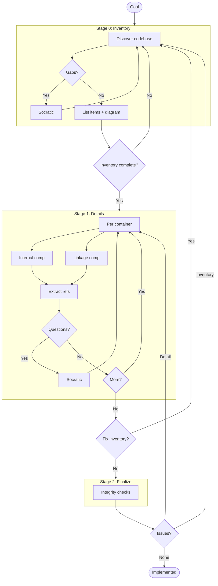

# C3 Architecture Documentation Adoption

## Goal

Adopt C3 methodology for ${PROJECT}.

<!--
EXIT CRITERIA (all must be true to mark implemented):
- All containers documented with Goal Contribution
- All components documented with Container Connection
- Refs extracted for repeated patterns
- Integrity checks pass
- /c3 audit passes
-->

## Workflow



---

## Stage 0: Inventory

<!--
DISCOVER everything first. Don't document yet.
- Auto-discover codebase structure
- Use AskUserQuestion for gaps
- Identify refs that span across items
- Exit: All items listed with arguments for templates
-->

### Context Discovery

| Arg | Value |
|-----|-------|
| PROJECT | |
| GOAL | |
| SUMMARY | |

### Container Discovery

| N | CONTAINER_NAME | GOAL | SUMMARY |
|---|----------------|------|---------|
| 1 | | | |
| 2 | | | |

### Component Discovery (Brief)

| N | NN | COMPONENT_NAME | CATEGORY | GOAL | SUMMARY |
|---|----|--------------  |----------|------|---------|
| | | | foundation | | |
| | | | feature | | |

### Ref Discovery

| SLUG | TITLE | GOAL | Applies To |
|------|-------|------|------------|
| | | | |

### Overview Diagram

```mermaid
graph TD
    %% Fill after discovery
```

### Gate 0

- [ ] Context args filled
- [ ] All containers identified with args
- [ ] All components identified (brief) with args
- [ ] Cross-cutting refs identified
- [ ] Overview diagram generated

---

## Stage 1: Details

<!--
Fill in each container with its components.
- Internal: components that are self-contained
- Linkage: components that handle connections to other containers
- Extract refs when patterns repeat
- If new item found → back to Stage 0
-->

### Container: c3-1

**Created:** [ ] `.c3/c3-1-{slug}/README.md`

| Type | Component ID | Name | Category | Doc Created |
|------|--------------|------|----------|-------------|
| Internal | | | | [ ] |
| Linkage | | | | [ ] |

### Container: c3-N

_(repeat per container from Stage 0)_

### Refs Created

| Ref ID | Pattern | Doc Created |
|--------|---------|-------------|
| | | [ ] |

### Gate 1

- [ ] All container README.md created
- [ ] All component docs created
- [ ] All refs documented
- [ ] No new items discovered (else → Gate 0)

---

## Stage 2: Finalize

<!--
Integrity checks - verify everything connects.
If issues found → back to appropriate stage.
-->

### Integrity Checks

| Check | Status |
|-------|--------|
| Context ↔ Container (all containers listed in c3-0) | [ ] |
| Container ↔ Component (all components listed in container README) | [ ] |
| Component ↔ Component (linkages documented) | [ ] |
| * ↔ Refs (refs cited correctly, Cited By updated) | [ ] |

### Gate 2

- [ ] All integrity checks pass
- [ ] `/c3 audit` passes

---

## Conflict Resolution

If later stage reveals earlier errors:

| Conflict | Found In | Affects | Resolution |
|----------|----------|---------|------------|
| | | | |

---

## Exit

When Gate 2 complete → change frontmatter status to `implemented`

## Audit Record

| Phase | Date | Notes |
|-------|------|-------|
| Adopted | ${DATE} | Initial C3 structure created |
