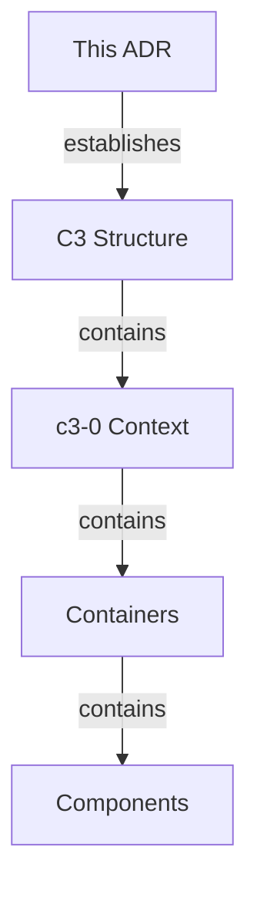

# C3 Architecture Documentation Adoption

## Overview

## Status

**Implemented** - ${DATE}

## Problem

<!-- AI: Why was C3 adopted? What problem did it solve? -->

| Situation | Impact |
|-----------|--------|
| No architecture docs | Onboarding takes weeks |
| Knowledge in heads | Bus factor risk |
| Ad-hoc decisions | Inconsistent patterns |

## Decision

Adopt C3 (Context-Container-Component) methodology for architecture documentation.

## Structure Created

| Level | ID | Name | Purpose |
|-------|-----|------|---------|
| Context | c3-0 | ${PROJECT} | System overview |
<!-- AI: List all containers created -->

## Rationale

| Consideration | C3 Approach |
|---------------|-------------|
| Layered abstraction | Context → Container → Component |
| Change isolation | Strategic vs tactical separation |
| Growth-ready | Structure exists before content |
| Decision tracking | ADRs capture evolution |

## Consequences

### Positive

- Architecture visible and navigable
- Onboarding accelerated
- Decisions documented with reasoning

### Negative

- Maintenance overhead (docs can drift)
- Initial time investment

## Verification

- [ ] `.c3/README.md` exists (c3-0)
- [ ] All containers have `README.md`
- [ ] Diagrams use consistent IDs
- [ ] Linkages have reasoning

## Audit Record

| Phase | Date | Notes |
|-------|------|-------|
| Adopted | ${DATE} | Initial C3 structure created |
