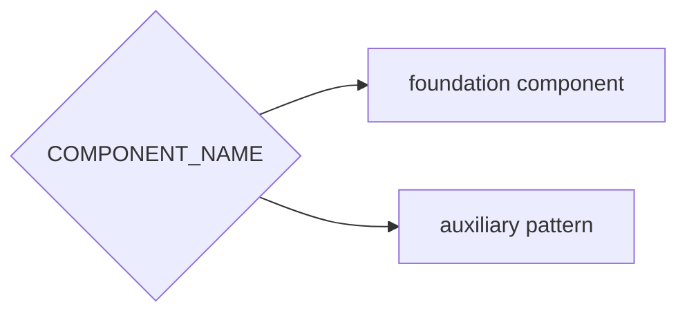
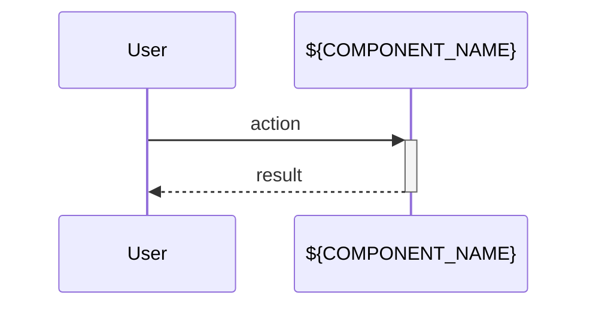

<!-- USE: Domain features (ProductCard, CheckoutFlow, UserProfile, OrderHistory) -->

# ${COMPONENT_NAME}

<!-- what this does for users -->

## Dependencies

## Behavior

## References

<!-- symbols first, then patterns, then paths -->

## Testing Strategy

<!-- user flow scope, integration points, key assertions -->
