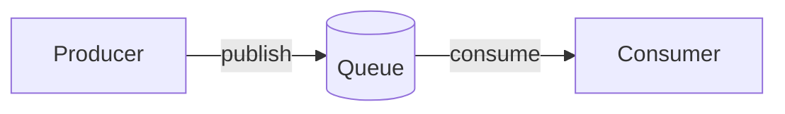

<!-- USE: Message queues, event buses, async communication -->
<!-- ADAPT: This is a starting point. Discover and document what actually exists. -->

# ${CONTAINER_NAME}

<!-- queue purpose and technology: one sentence -->

## Complexity Assessment

<!-- REQUIRED: See skill-harness.md for levels and rules -->

**Level:** <!-- trivial | simple | moderate | complex | critical -->

**Signals observed:**
<!-- Scan for: message patterns, delivery guarantees, ordering, error handling, consumers -->

## Overview



## Components

> For queues, "components" are handlers, processors, transformers

### Foundation
> Shared infrastructure (serialization, routing, error handling)

| ID | Name | Status | Responsibility |
|----|------|--------|----------------|

### Feature
> Domain-specific handlers and processors

| ID | Name | Status | Responsibility |
|----|------|--------|----------------|

## Linkages

```mermaid
graph LR
    %% Producers → Queue → Consumers
    %% Edge labels: "message type"
```

## Discovered Aspects

<!--
SKIP THIS SECTION if complexity is trivial or simple.

For moderate+, discover aspects through analysis:
- What message types flow through?
- What error handling patterns exist?
- What ordering/delivery guarantees are implemented?
- What monitoring/alerting is in place?

Document only what exists and matters. Reference specific handlers/topics.
-->

## Testing (if warranted)

<!-- SKIP IF: trivial/simple complexity, in-memory queue for tests -->
