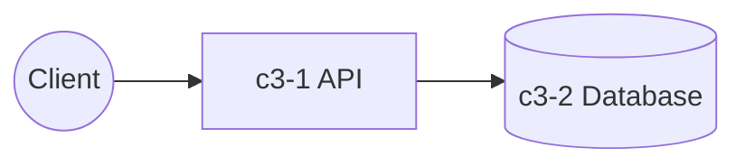

# E-Commerce Platform

## Overview

An e-commerce platform enabling users to browse products, manage carts, and place orders.

## Containers

| ID | Name | Purpose |
|----|------|---------|
| c3-1 | API Backend | REST API for all client operations |
| c3-2 | Database | PostgreSQL for orders, users, products |
| c3-3 | Search | Elasticsearch for product search |
| c3-4 | Payment Gateway | Stripe integration |

## Container Interactions

## External Actors

- Web clients
- Mobile apps
