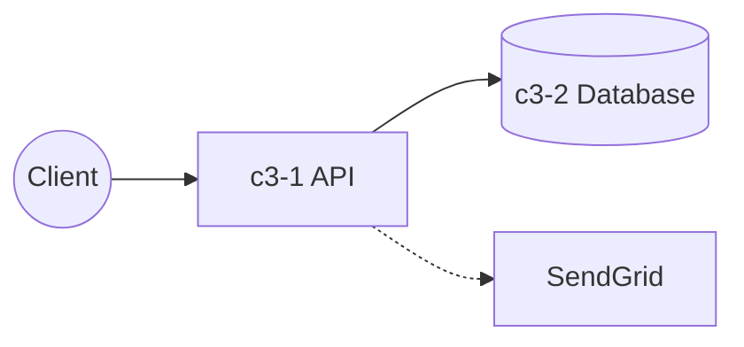

# Messaging Platform

## Overview

A real-time messaging platform for team communication.

## Containers

| ID | Name | Purpose |
|----|------|---------|
| c3-1 | API Backend | REST/WebSocket API for messaging |
| c3-2 | Database | PostgreSQL for message storage |

## Container Interactions

## External Actors

- Web/mobile clients
- SendGrid (email delivery)

## Notes

- c3-1 currently handles basic email notifications via SendGrid
- Need to evaluate: keep in c3-1 or extract to dedicated service?
- Push notifications not yet implemented
