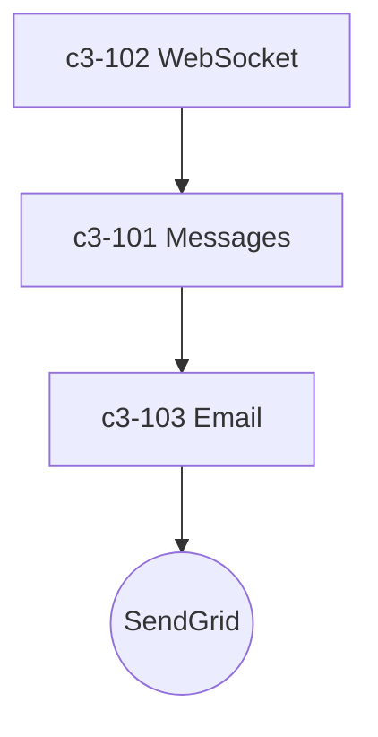

# API Backend

## Technology Stack

| Layer | Technology | Purpose |
|-------|------------|---------|
| Runtime | Node.js | JavaScript runtime |
| Framework | Express | HTTP server |
| Realtime | Socket.io | WebSocket connections |
| Email | @sendgrid/mail | Email delivery |

## Components

| ID | Name | Responsibility |
|----|------|----------------|
| c3-101 | Message Handler | Message CRUD and delivery |
| c3-102 | WebSocket Manager | Connection management |
| c3-103 | Email Notifier | Basic email notifications via SendGrid |

## Internal Structure

## Notes

- c3-103 Email Notifier is a quick implementation
- Only handles email, no SMS or push yet
- Consider extracting to dedicated notification service
