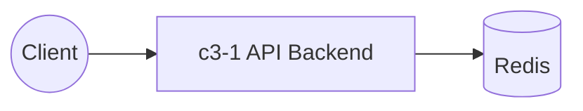

# Test API System

## Overview

A simple API backend for testing component documentation.

## Containers

| ID | Name | Purpose |
|----|------|---------|
| c3-1 | API Backend | Handles REST requests with caching |

## Container Interactions

## External Actors

- API clients (web, mobile)
