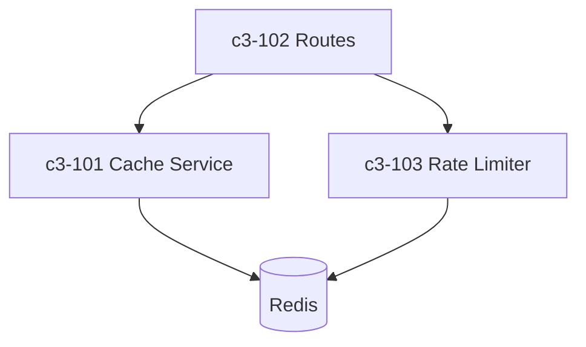

# API Backend Container

## Overview

Express-based REST API with Redis caching for performance.

## Technology Stack

| Layer | Technology | Purpose |
|-------|------------|---------|
| Runtime | Node.js 18 | JavaScript runtime |
| Framework | Express 4.x | HTTP server |
| Cache | Redis 7 | Response caching |
| Cache Client | ioredis | Redis client library |

## Components

| ID | Name | Responsibility | Status |
|----|------|----------------|--------|
| c3-101 | Cache Service | Manages Redis cache operations, TTL, invalidation | **STUB** |
| c3-102 | Routes | HTTP endpoint handlers | **NOT DOCUMENTED** |
| c3-103 | Rate Limiter | API rate limiting using Redis | **NOT DOCUMENTED** |

## Internal Structure

## Component Dependencies

- c3-102 depends on c3-101 for caching responses
- c3-103 depends on Redis directly (not via c3-101)
- c3-101 and c3-103 share Redis connection pool

## Notes

- Cache invalidation strategy not yet finalized
- Rate limiter may need to use cache service instead of direct Redis
