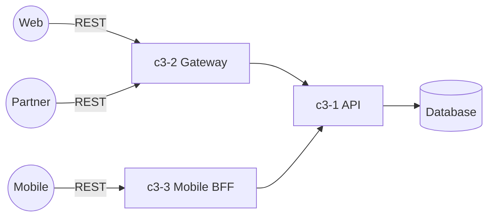

# API Platform

## Overview

A REST API platform serving multiple client types (web, mobile, partner APIs).

## Containers

| ID | Name | Purpose |
|----|------|---------|
| c3-1 | API Backend | REST API server (Express) |
| c3-2 | Gateway | API gateway for routing and auth |
| c3-3 | Mobile BFF | Backend-for-Frontend for mobile apps |

## Container Interactions

## External Actors

- Web clients (browser)
- Mobile apps (iOS, Android)
- Partner integrations (B2B)

## Notes

- Mobile team has requested more flexible queries (currently REST is limiting)
- Partner APIs require stable contracts, versioning
- Web team wants faster iteration on data shapes
