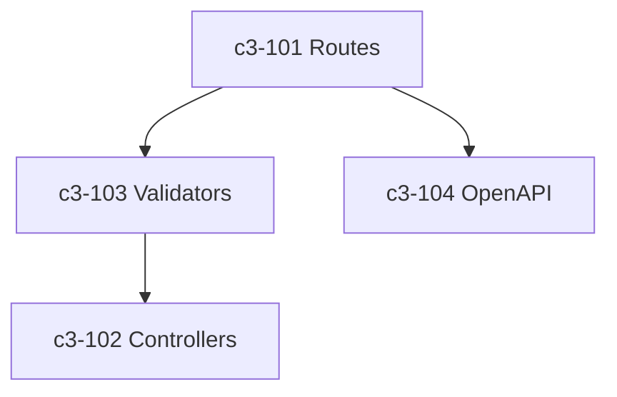

# API Backend

## Technology Stack

| Layer | Technology | Purpose |
|-------|------------|---------|
| Runtime | Node.js 20 | JavaScript runtime |
| Framework | Express 4.x | HTTP server |
| Protocol | REST/JSON | API protocol |
| Validation | Joi | Request validation |
| Docs | OpenAPI 3.0 | API documentation |

## Components

| ID | Name | Responsibility |
|----|------|----------------|
| c3-101 | Routes | REST endpoint handlers |
| c3-102 | Controllers | Business logic orchestration |
| c3-103 | Validators | Request/response validation |
| c3-104 | OpenAPI Spec | API documentation |

## Internal Structure

## API Design

- RESTful resource-based endpoints
- JSON request/response format
- OpenAPI spec at `/api-docs`
- 40+ endpoints across 8 resource types
